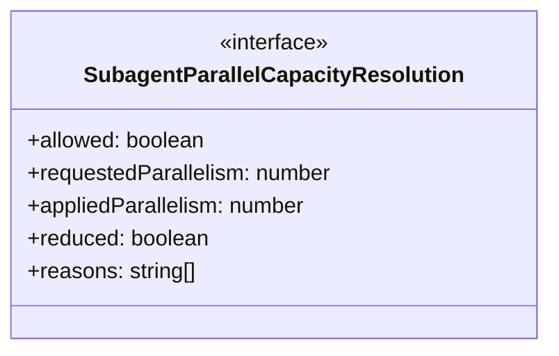
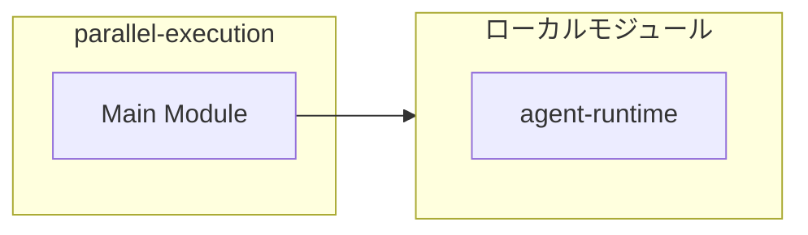
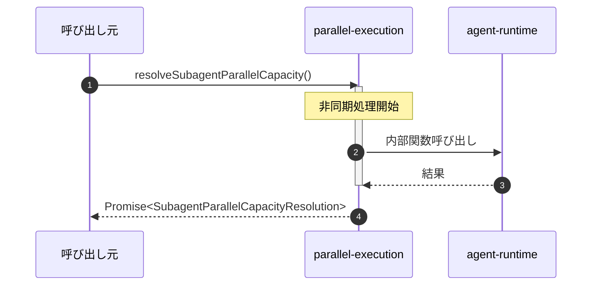

# parallel-execution

## 概要

`parallel-execution` モジュールのAPIリファレンス。

## インポート

```typescript
import { reserveRuntimeCapacity, tryReserveRuntimeCapacity, RuntimeCapacityReservationLease } from '../agent-runtime';
```

## エクスポート一覧

| 種別 | 名前 | 説明 |
|------|------|------|
| 関数 | `resolveSubagentParallelCapacity` | - |
| インターフェース | `SubagentParallelCapacityResolution` | - |

## 図解

### クラス図



### 依存関係図



### シーケンス図



## 関数

### resolveSubagentParallelCapacity

```typescript
async resolveSubagentParallelCapacity(input: {
  requestedParallelism: number;
  additionalRequests: number;
  maxWaitMs: number;
  pollIntervalMs: number;
  signal?: AbortSignal;
}): Promise<SubagentParallelCapacityResolution>
```

**パラメータ**

| 名前 | 型 | 必須 |
|------|-----|------|
| input | `{
  requestedParallelism: number;
  additionalRequests: number;
  maxWaitMs: number;
  pollIntervalMs: number;
  signal?: AbortSignal;
}` | はい |

**戻り値**: `Promise<SubagentParallelCapacityResolution>`

## インターフェース

### SubagentParallelCapacityResolution

```typescript
interface SubagentParallelCapacityResolution {
  allowed: boolean;
  requestedParallelism: number;
  appliedParallelism: number;
  reduced: boolean;
  reasons: string[];
  waitedMs: number;
  timedOut: boolean;
  aborted: boolean;
  attempts: number;
  projectedRequests: number;
  projectedLlm: number;
  reservation?: RuntimeCapacityReservationLease;
}
```

---
*自動生成: 2026-02-17T22:16:16.580Z*
