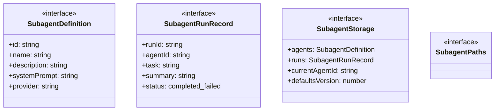
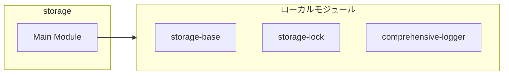
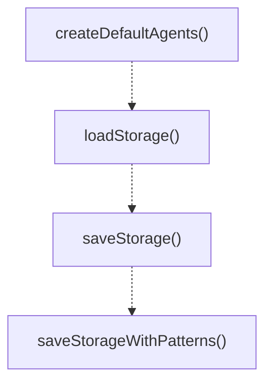
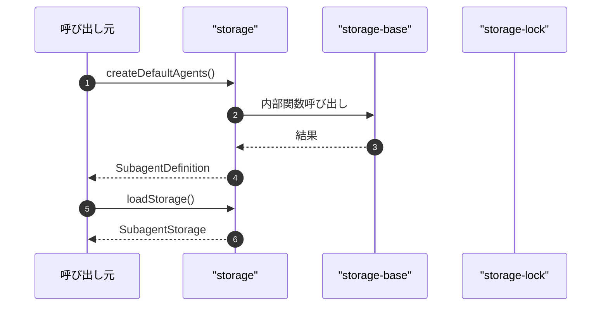

# storage

## 概要

`storage` モジュールのAPIリファレンス。

## インポート

```typescript
import { existsSync, readFileSync } from 'node:fs';
import { join } from 'node:path';
import { createPathsFactory, createEnsurePaths, pruneRunArtifacts... } from '../../lib/storage-base.js';
import { atomicWriteTextFile, withFileLock } from '../../lib/storage-lock.js';
import { getLogger } from '../../lib/comprehensive-logger.js';
```

## エクスポート一覧

| 種別 | 名前 | 説明 |
|------|------|------|
| 関数 | `createDefaultAgents` | デフォルトのサブエージェント定義を作成する |
| 関数 | `loadStorage` | ディスクからサブエージェントのストレージを読み込む |
| 関数 | `saveStorage` | サブエージェントのストレージをディスクに保存する |
| 関数 | `saveStorageWithPatterns` | ストレージを保存し、実行パターンを抽出する |
| インターフェース | `SubagentDefinition` | サブエージェントの定義情報を表すインターフェース |
| インターフェース | `SubagentRunRecord` | サブエージェントの実行記録を表す |
| インターフェース | `SubagentStorage` | サブエージェントのストレージ構造 |
| インターフェース | `SubagentPaths` | サブエージェントのストレージパスを表すインターフェース |
| 型 | `AgentEnabledState` | エージェントの有効/無効状態を表す |

## 図解

### クラス図



### 依存関係図



### 関数フロー



### シーケンス図



## 関数

### createDefaultAgents

```typescript
createDefaultAgents(nowIso: string): SubagentDefinition[]
```

デフォルトのサブエージェント定義を作成する

**パラメータ**

| 名前 | 型 | 必須 |
|------|-----|------|
| nowIso | `string` | はい |

**戻り値**: `SubagentDefinition[]`

### mergeDefaultSubagent

```typescript
mergeDefaultSubagent(existing: SubagentDefinition, fallback: SubagentDefinition): SubagentDefinition
```

Merge existing subagent with default values.
Note: Kept locally because this is subagent-specific merge logic.

**パラメータ**

| 名前 | 型 | 必須 |
|------|-----|------|
| existing | `SubagentDefinition` | はい |
| fallback | `SubagentDefinition` | はい |

**戻り値**: `SubagentDefinition`

### ensureDefaults

```typescript
ensureDefaults(storage: SubagentStorage, nowIso: string): SubagentStorage
```

Ensure storage has default agents.
Note: Kept locally because default agent logic is subagent-specific.

**パラメータ**

| 名前 | 型 | 必須 |
|------|-----|------|
| storage | `SubagentStorage` | はい |
| nowIso | `string` | はい |

**戻り値**: `SubagentStorage`

### mergeSubagentStorageWithDisk

```typescript
mergeSubagentStorageWithDisk(storageFile: string, next: SubagentStorage): SubagentStorage
```

Merge storage with disk state (for concurrent access).
Uses common utility from lib/storage-base.ts.

**パラメータ**

| 名前 | 型 | 必須 |
|------|-----|------|
| storageFile | `string` | はい |
| next | `SubagentStorage` | はい |

**戻り値**: `SubagentStorage`

### loadStorage

```typescript
loadStorage(cwd: string): SubagentStorage
```

ディスクからサブエージェントのストレージを読み込む

**パラメータ**

| 名前 | 型 | 必須 |
|------|-----|------|
| cwd | `string` | はい |

**戻り値**: `SubagentStorage`

### saveStorage

```typescript
saveStorage(cwd: string, storage: SubagentStorage): void
```

サブエージェントのストレージをディスクに保存する

**パラメータ**

| 名前 | 型 | 必須 |
|------|-----|------|
| cwd | `string` | はい |
| storage | `SubagentStorage` | はい |

**戻り値**: `void`

### saveStorageWithPatterns

```typescript
async saveStorageWithPatterns(cwd: string, storage: SubagentStorage): Promise<void>
```

ストレージを保存し、実行パターンを抽出する

**パラメータ**

| 名前 | 型 | 必須 |
|------|-----|------|
| cwd | `string` | はい |
| storage | `SubagentStorage` | はい |

**戻り値**: `Promise<void>`

## インターフェース

### SubagentDefinition

```typescript
interface SubagentDefinition {
  id: string;
  name: string;
  description: string;
  systemPrompt: string;
  provider?: string;
  model?: string;
  enabled: AgentEnabledState;
  skills?: string[];
  createdAt: string;
  updatedAt: string;
}
```

サブエージェントの定義情報を表すインターフェース

### SubagentRunRecord

```typescript
interface SubagentRunRecord {
  runId: string;
  agentId: string;
  task: string;
  summary: string;
  status: "completed" | "failed";
  startedAt: string;
  finishedAt: string;
  latencyMs: number;
  outputFile: string;
  error?: string;
  correlationId?: string;
  parentEventId?: string;
}
```

サブエージェントの実行記録を表す

### SubagentStorage

```typescript
interface SubagentStorage {
  agents: SubagentDefinition[];
  runs: SubagentRunRecord[];
  currentAgentId?: string;
  defaultsVersion?: number;
}
```

サブエージェントのストレージ構造

### SubagentPaths

```typescript
interface SubagentPaths {
}
```

サブエージェントのストレージパスを表すインターフェース

## 型定義

### AgentEnabledState

```typescript
type AgentEnabledState = "enabled" | "disabled"
```

エージェントの有効/無効状態を表す

---
*自動生成: 2026-02-18T06:37:19.749Z*
