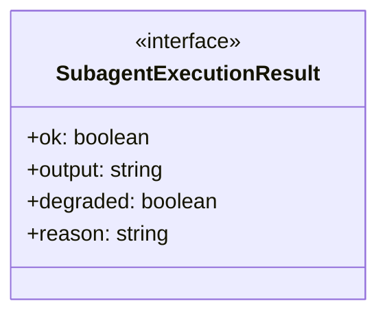
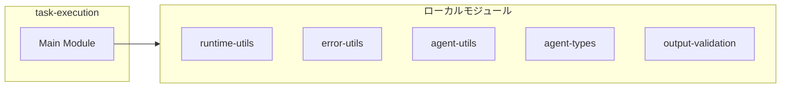
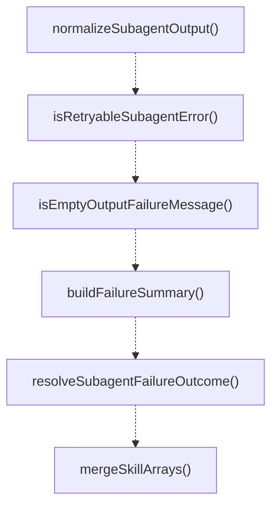
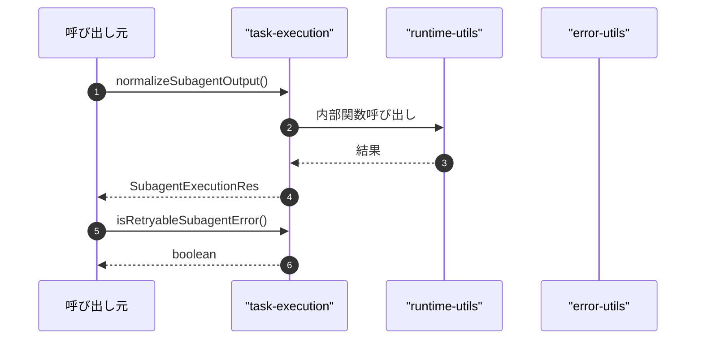

# task-execution

## 概要

`task-execution` モジュールのAPIリファレンス。

## インポート

```typescript
import { writeFileSync } from 'node:fs';
import { join } from 'node:path';
import { trimForError, buildRateLimitKey } from '../../lib/runtime-utils.js';
import { toErrorMessage, extractStatusCodeFromMessage, classifyPressureError... } from '../../lib/error-utils.js';
import { createRunId } from '../../lib/agent-utils.js';
// ... and 10 more imports
```

## エクスポート一覧

| 種別 | 名前 | 説明 |
|------|------|------|
| 関数 | `normalizeSubagentOutput` | Normalize subagent output to required format. |
| 関数 | `isRetryableSubagentError` | - |
| 関数 | `isEmptyOutputFailureMessage` | - |
| 関数 | `buildFailureSummary` | - |
| 関数 | `resolveSubagentFailureOutcome` | - |
| 関数 | `mergeSkillArrays` | Merge skill arrays following inheritance rules. |
| 関数 | `resolveEffectiveSkills` | Resolve effective skills for a subagent. |
| 関数 | `formatSkillsSection` | Format skill list for prompt inclusion. |
| 関数 | `buildSubagentPrompt` | - |
| 関数 | `runSubagentTask` | - |
| 関数 | `extractSummary` | - |
| インターフェース | `SubagentExecutionResult` | - |

## 図解

### クラス図



### 依存関係図



### 関数フロー



### シーケンス図



## 関数

### pickSubagentSummaryCandidate

```typescript
pickSubagentSummaryCandidate(text: string): string
```

Pick a candidate text for SUMMARY field from unstructured output.
Note: Kept locally because the summary format is subagent-specific.

**パラメータ**

| 名前 | 型 | 必須 |
|------|-----|------|
| text | `string` | はい |

**戻り値**: `string`

### normalizeSubagentOutput

```typescript
normalizeSubagentOutput(output: string): SubagentExecutionResult
```

Normalize subagent output to required format.
Note: Kept locally (not in lib) because:
- Uses subagent-specific SUMMARY/RESULT/NEXT_STEP format
- Has subagent-specific fallback messages (Japanese)
- Uses pickSubagentSummaryCandidate which is subagent-specific
Team member output has different requirements (CLAIM/EVIDENCE/CONFIDENCE).

**パラメータ**

| 名前 | 型 | 必須 |
|------|-----|------|
| output | `string` | はい |

**戻り値**: `SubagentExecutionResult`

### isRetryableSubagentError

```typescript
isRetryableSubagentError(error: unknown, statusCode?: number): boolean
```

**パラメータ**

| 名前 | 型 | 必須 |
|------|-----|------|
| error | `unknown` | はい |
| statusCode | `number` | いいえ |

**戻り値**: `boolean`

### isEmptyOutputFailureMessage

```typescript
isEmptyOutputFailureMessage(message: string): boolean
```

**パラメータ**

| 名前 | 型 | 必須 |
|------|-----|------|
| message | `string` | はい |

**戻り値**: `boolean`

### buildFailureSummary

```typescript
buildFailureSummary(message: string): string
```

**パラメータ**

| 名前 | 型 | 必須 |
|------|-----|------|
| message | `string` | はい |

**戻り値**: `string`

### resolveSubagentFailureOutcome

```typescript
resolveSubagentFailureOutcome(error: unknown): RunOutcomeSignal
```

**パラメータ**

| 名前 | 型 | 必須 |
|------|-----|------|
| error | `unknown` | はい |

**戻り値**: `RunOutcomeSignal`

### mergeSkillArrays

```typescript
mergeSkillArrays(base: string[] | undefined, override: string[] | undefined): string[] | undefined
```

Merge skill arrays following inheritance rules.
- Empty array [] is treated as unspecified (ignored)
- Non-empty arrays are merged with deduplication

**パラメータ**

| 名前 | 型 | 必須 |
|------|-----|------|
| base | `string[] | undefined` | はい |
| override | `string[] | undefined` | はい |

**戻り値**: `string[] | undefined`

### resolveEffectiveSkills

```typescript
resolveEffectiveSkills(agent: SubagentDefinition, parentSkills?: string[]): string[] | undefined
```

Resolve effective skills for a subagent.
Inheritance: parentSkills (if any) -> agent.skills

**パラメータ**

| 名前 | 型 | 必須 |
|------|-----|------|
| agent | `SubagentDefinition` | はい |
| parentSkills | `string[]` | いいえ |

**戻り値**: `string[] | undefined`

### formatSkillsSection

```typescript
formatSkillsSection(skills: string[] | undefined): string | null
```

Format skill list for prompt inclusion.

**パラメータ**

| 名前 | 型 | 必須 |
|------|-----|------|
| skills | `string[] | undefined` | はい |

**戻り値**: `string | null`

### buildSubagentPrompt

```typescript
buildSubagentPrompt(input: {
  agent: SubagentDefinition;
  task: string;
  extraContext?: string;
  enforcePlanMode?: boolean;
  parentSkills?: string[];
}): string
```

**パラメータ**

| 名前 | 型 | 必須 |
|------|-----|------|
| input | `{
  agent: SubagentDefinition;
  task: string;
  extraContext?: string;
  enforcePlanMode?: boolean;
  parentSkills?: string[];
}` | はい |

**戻り値**: `string`

### runPiPrintMode

```typescript
async runPiPrintMode(input: {
  provider?: string;
  model?: string;
  prompt: string;
  timeoutMs: number;
  signal?: AbortSignal;
  onTextDelta?: (delta: string) => void;
  onStderrChunk?: (chunk: string) => void;
}): Promise<PrintCommandResult>
```

**パラメータ**

| 名前 | 型 | 必須 |
|------|-----|------|
| input | `{
  provider?: string;
  model?: string;
  prompt: string;
  timeoutMs: number;
  signal?: AbortSignal;
  onTextDelta?: (delta: string) => void;
  onStderrChunk?: (chunk: string) => void;
}` | はい |

**戻り値**: `Promise<PrintCommandResult>`

### runSubagentTask

```typescript
async runSubagentTask(input: {
  agent: SubagentDefinition;
  task: string;
  extraContext?: string;
  timeoutMs: number;
  cwd: string;
  retryOverrides?: RetryWithBackoffOverrides;
  modelProvider?: string;
  modelId?: string;
  parentSkills?: string[];
  signal?: AbortSignal;
  onStart?: () => void;
  onEnd?: () => void;
  onTextDelta?: (delta: string) => void;
  onStderrChunk?: (chunk: string) => void;
}): Promise<{ runRecord: SubagentRunRecord; output: string; prompt: string }>
```

**パラメータ**

| 名前 | 型 | 必須 |
|------|-----|------|
| input | `{
  agent: SubagentDefinition;
  task: string;
  extraContext?: string;
  timeoutMs: number;
  cwd: string;
  retryOverrides?: RetryWithBackoffOverrides;
  modelProvider?: string;
  modelId?: string;
  parentSkills?: string[];
  signal?: AbortSignal;
  onStart?: () => void;
  onEnd?: () => void;
  onTextDelta?: (delta: string) => void;
  onStderrChunk?: (chunk: string) => void;
}` | はい |

**戻り値**: `Promise<{ runRecord: SubagentRunRecord; output: string; prompt: string }>`

### emitStderrChunk

```typescript
emitStderrChunk(chunk: string): void
```

**パラメータ**

| 名前 | 型 | 必須 |
|------|-----|------|
| chunk | `string` | はい |

**戻り値**: `void`

### extractSummary

```typescript
extractSummary(output: string): string
```

**パラメータ**

| 名前 | 型 | 必須 |
|------|-----|------|
| output | `string` | はい |

**戻り値**: `string`

## インターフェース

### SubagentExecutionResult

```typescript
interface SubagentExecutionResult {
  ok: boolean;
  output: string;
  degraded: boolean;
  reason?: string;
}
```

---
*自動生成: 2026-02-18T00:15:35.620Z*
