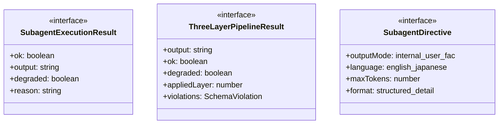
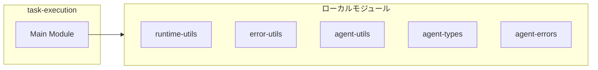
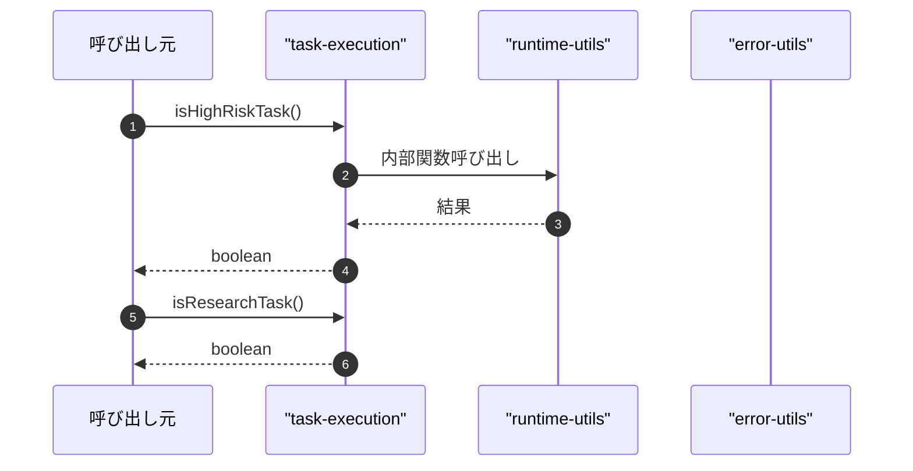

# task-execution

## 概要

`task-execution` モジュールのAPIリファレンス。

## インポート

```typescript
// from 'node:fs': writeFileSync
// from 'node:path': join
// from '../../lib/runtime-utils.js': trimForError, buildRateLimitKey
// from '../../lib/error-utils.js': toErrorMessage, extractStatusCodeFromMessage, classifyPressureError, ...
// from '../../lib/agent-utils.js': createRunId
// ... and 16 more imports
```

## エクスポート一覧

| 種別 | 名前 | 説明 |
|------|------|------|
| 関数 | `isHighRiskTask` | 高リスクタスク判定 |
| 関数 | `isResearchTask` | 調査タスク判定 |
| 関数 | `normalizeSubagentOutput` | 出力を正規化する |
| 関数 | `processOutputWithThreeLayerPipeline` | 出力をThree-Layer Hybrid Strategyで処理する |
| 関数 | `ensureOutputStructure` | 出力が最小構造を満たしているかを確認し、必要に応じてLayer 3を適用する |
| 関数 | `isRetryableSubagentError` | リトライ可能か判定する |
| 関数 | `isEmptyOutputFailureMessage` | 空出力エラーか判定する |
| 関数 | `buildFailureSummary` | エラー概要を作成する |
| 関数 | `resolveSubagentFailureOutcome` | エラー種別を判定する |
| 関数 | `buildResearchTaskGuidelines` | search-toolsスキル準拠の検索指示を生成 |
| 関数 | `mergeSkillArrays` | - |
| 関数 | `resolveEffectiveSkills` | サブエージェントの実効スキルを解決する |
| 関数 | `formatSkillsSection` | スキル一覧を整形 |
| 関数 | `buildSubagentPrompt` | - |
| 関数 | `runSubagentTask` | サブエージェントタスク実行 |
| 関数 | `extractSummary` | 要約を抽出 |
| インターフェース | `SubagentExecutionResult` | サブエージェントの実行結果 |
| インターフェース | `ThreeLayerPipelineResult` | Three-Layer Pipeline の処理結果 |

## 図解

### クラス図



### 依存関係図



### 関数フロー

```mermaid
flowchart TD
  applyLayerThreeTemplate["applyLayerThreeTemplate()"]
  buildFailureSummary["buildFailureSummary()"]
  buildResearchTaskGuidelines["buildResearchTaskGuidelines()"]
  buildSubagentPrompt["buildSubagentPrompt()"]
  emitStderrChunk["emitStderrChunk()"]
  ensureOutputStructure["ensureOutputStructure()"]
  extractSummary["extractSummary()"]
  formatSkillsSection["formatSkillsSection()"]
  isEmptyOutputFailureMessage["isEmptyOutputFailureMessage()"]
  isHighRiskTask["isHighRiskTask()"]
  isResearchTask["isResearchTask()"]
  isRetryableSubagentError["isRetryableSubagentError()"]
  mergeSkillArrays["mergeSkillArrays()"]
  normalizeSubagentOutput["normalizeSubagentOutput()"]
  parseSubagentDirectives["parseSubagentDirectives()"]
  pickSubagentSummaryCandidate["pickSubagentSummaryCandidate()"]
  processOutputWithThreeLayerPipeline["processOutputWithThreeLayerPipeline()"]
  resolveEffectiveSkills["resolveEffectiveSkills()"]
  resolveSubagentFailureOutcome["resolveSubagentFailureOutcome()"]
  runPiPrintMode["runPiPrintMode()"]
  runSubagentTask["runSubagentTask()"]
  buildSubagentPrompt --> formatSkillsSection
  buildSubagentPrompt --> isHighRiskTask
  buildSubagentPrompt --> parseSubagentDirectives
  buildSubagentPrompt --> resolveEffectiveSkills
  ensureOutputStructure --> processOutputWithThreeLayerPipeline
  normalizeSubagentOutput --> pickSubagentSummaryCandidate
  parseSubagentDirectives --> isResearchTask
  processOutputWithThreeLayerPipeline --> applyLayerThreeTemplate
  resolveEffectiveSkills --> mergeSkillArrays
  resolveSubagentFailureOutcome --> isRetryableSubagentError
  runPiPrintMode --> runPiPrintMode
  runSubagentTask --> buildFailureSummary
  runSubagentTask --> buildSubagentPrompt
  runSubagentTask --> emitStderrChunk
  runSubagentTask --> extractSummary
  runSubagentTask --> isHighRiskTask
  runSubagentTask --> isRetryableSubagentError
  runSubagentTask --> normalizeSubagentOutput
  runSubagentTask --> processOutputWithThreeLayerPipeline
  runSubagentTask --> runPiPrintMode
```



### シーケンス図



## 関数

### isHighRiskTask

```typescript
isHighRiskTask(task: string): boolean
```

高リスクタスク判定

**パラメータ**

| 名前 | 型 | 必須 |
|------|-----|------|
| task | `string` | はい |

**戻り値**: `boolean`

### isResearchTask

```typescript
isResearchTask(task: string): boolean
```

調査タスク判定

**パラメータ**

| 名前 | 型 | 必須 |
|------|-----|------|
| task | `string` | はい |

**戻り値**: `boolean`

### pickSubagentSummaryCandidate

```typescript
pickSubagentSummaryCandidate(text: string): string
```

Pick a candidate text for SUMMARY field from unstructured output.
Note: Kept locally because the summary format is subagent-specific.

**パラメータ**

| 名前 | 型 | 必須 |
|------|-----|------|
| text | `string` | はい |

**戻り値**: `string`

### normalizeSubagentOutput

```typescript
normalizeSubagentOutput(output: string): SubagentExecutionResult
```

出力を正規化する

**パラメータ**

| 名前 | 型 | 必須 |
|------|-----|------|
| output | `string` | はい |

**戻り値**: `SubagentExecutionResult`

### applyLayerThreeTemplate

```typescript
applyLayerThreeTemplate(rawOutput: string, violations: SchemaViolation[]): ThreeLayerPipelineResult
```

Layer 3（機械的テンプレート適用）を適用する

**パラメータ**

| 名前 | 型 | 必須 |
|------|-----|------|
| rawOutput | `string` | はい |
| violations | `SchemaViolation[]` | はい |

**戻り値**: `ThreeLayerPipelineResult`

### processOutputWithThreeLayerPipeline

```typescript
processOutputWithThreeLayerPipeline(rawOutput: string): ThreeLayerPipelineResult
```

出力をThree-Layer Hybrid Strategyで処理する

**パラメータ**

| 名前 | 型 | 必須 |
|------|-----|------|
| rawOutput | `string` | はい |

**戻り値**: `ThreeLayerPipelineResult`

### ensureOutputStructure

```typescript
ensureOutputStructure(output: string): ThreeLayerPipelineResult
```

出力が最小構造を満たしているかを確認し、必要に応じてLayer 3を適用する

**パラメータ**

| 名前 | 型 | 必須 |
|------|-----|------|
| output | `string` | はい |

**戻り値**: `ThreeLayerPipelineResult`

### isRetryableSubagentError

```typescript
isRetryableSubagentError(error: unknown, statusCode?: number): boolean
```

リトライ可能か判定する

**パラメータ**

| 名前 | 型 | 必須 |
|------|-----|------|
| error | `unknown` | はい |
| statusCode | `number` | いいえ |

**戻り値**: `boolean`

### isEmptyOutputFailureMessage

```typescript
isEmptyOutputFailureMessage(message: string): boolean
```

空出力エラーか判定する

**パラメータ**

| 名前 | 型 | 必須 |
|------|-----|------|
| message | `string` | はい |

**戻り値**: `boolean`

### buildFailureSummary

```typescript
buildFailureSummary(message: string): string
```

エラー概要を作成する

**パラメータ**

| 名前 | 型 | 必須 |
|------|-----|------|
| message | `string` | はい |

**戻り値**: `string`

### resolveSubagentFailureOutcome

```typescript
resolveSubagentFailureOutcome(error: unknown): RunOutcomeSignal
```

エラー種別を判定する

**パラメータ**

| 名前 | 型 | 必須 |
|------|-----|------|
| error | `unknown` | はい |

**戻り値**: `RunOutcomeSignal`

### buildResearchTaskGuidelines

```typescript
buildResearchTaskGuidelines(): string
```

search-toolsスキル準拠の検索指示を生成

**戻り値**: `string`

### mergeSkillArrays

```typescript
mergeSkillArrays(base: string[] | undefined, override: string[] | undefined): string[] | undefined
```

**パラメータ**

| 名前 | 型 | 必須 |
|------|-----|------|
| base | `string[] | undefined` | はい |
| override | `string[] | undefined` | はい |

**戻り値**: `string[] | undefined`

### resolveEffectiveSkills

```typescript
resolveEffectiveSkills(agent: SubagentDefinition, parentSkills?: string[]): string[] | undefined
```

サブエージェントの実効スキルを解決する

**パラメータ**

| 名前 | 型 | 必須 |
|------|-----|------|
| agent | `SubagentDefinition` | はい |
| parentSkills | `string[]` | いいえ |

**戻り値**: `string[] | undefined`

### formatSkillsSection

```typescript
formatSkillsSection(skills: string[] | undefined): string | null
```

スキル一覧を整形

**パラメータ**

| 名前 | 型 | 必須 |
|------|-----|------|
| skills | `string[] | undefined` | はい |

**戻り値**: `string | null`

### parseSubagentDirectives

```typescript
parseSubagentDirectives(extraContext?: string, task?: string): SubagentDirective
```

extraContextからディレクティブを解析

**パラメータ**

| 名前 | 型 | 必須 |
|------|-----|------|
| extraContext | `string` | いいえ |
| task | `string` | いいえ |

**戻り値**: `SubagentDirective`

### buildSubagentPrompt

```typescript
buildSubagentPrompt(input: {
  agent: SubagentDefinition;
  task: string;
  extraContext?: string;
  enforcePlanMode?: boolean;
  parentSkills?: string[];
  profileId?: string;
  relevantPatterns?: ExtractedPattern[];
}): string
```

**パラメータ**

| 名前 | 型 | 必須 |
|------|-----|------|
| input | `object` | はい |
| &nbsp;&nbsp;↳ agent | `SubagentDefinition` | はい |
| &nbsp;&nbsp;↳ task | `string` | はい |
| &nbsp;&nbsp;↳ extraContext | `string` | いいえ |
| &nbsp;&nbsp;↳ enforcePlanMode | `boolean` | いいえ |
| &nbsp;&nbsp;↳ parentSkills | `string[]` | いいえ |
| &nbsp;&nbsp;↳ profileId | `string` | いいえ |
| &nbsp;&nbsp;↳ relevantPatterns | `ExtractedPattern[]` | いいえ |

**戻り値**: `string`

### runPiPrintMode

```typescript
async runPiPrintMode(input: {
  provider?: string;
  model?: string;
  prompt: string;
  timeoutMs: number;
  signal?: AbortSignal;
  onTextDelta?: (delta: string) => void;
  onStderrChunk?: (chunk: string) => void;
}): Promise<PrintCommandResult>
```

**パラメータ**

| 名前 | 型 | 必須 |
|------|-----|------|
| input | `object` | はい |
| &nbsp;&nbsp;↳ provider | `string` | いいえ |
| &nbsp;&nbsp;↳ model | `string` | いいえ |
| &nbsp;&nbsp;↳ prompt | `string` | はい |
| &nbsp;&nbsp;↳ timeoutMs | `number` | はい |
| &nbsp;&nbsp;↳ signal | `AbortSignal` | いいえ |
| &nbsp;&nbsp;↳ onTextDelta | `(delta: string) => void;  onStderrChunk?: (chunk: string) => void;` | いいえ |

**戻り値**: `Promise<PrintCommandResult>`

### runSubagentTask

```typescript
async runSubagentTask(input: {
  agent: SubagentDefinition;
  task: string;
  extraContext?: string;
  timeoutMs: number;
  cwd: string;
  retryOverrides?: RetryWithBackoffOverrides;
  modelProvider?: string;
  modelId?: string;
  parentSkills?: string[];
  signal?: AbortSignal;
  onStart?: () => void;
  onEnd?: () => void;
  onTextDelta?: (delta: string) => void;
  onStderrChunk?: (chunk: string) => void;
}): Promise<{ runRecord: SubagentRunRecord; output: string; prompt: string }>
```

サブエージェントタスク実行

**パラメータ**

| 名前 | 型 | 必須 |
|------|-----|------|
| input | `object` | はい |
| &nbsp;&nbsp;↳ agent | `SubagentDefinition` | はい |
| &nbsp;&nbsp;↳ task | `string` | はい |
| &nbsp;&nbsp;↳ extraContext | `string` | いいえ |
| &nbsp;&nbsp;↳ timeoutMs | `number` | はい |
| &nbsp;&nbsp;↳ cwd | `string` | はい |
| &nbsp;&nbsp;↳ retryOverrides | `RetryWithBackoffOverrides` | いいえ |
| &nbsp;&nbsp;↳ modelProvider | `string` | いいえ |
| &nbsp;&nbsp;↳ modelId | `string` | いいえ |
| &nbsp;&nbsp;↳ parentSkills | `string[]` | いいえ |
| &nbsp;&nbsp;↳ signal | `AbortSignal` | いいえ |
| &nbsp;&nbsp;↳ onStart | `() => void;  onEnd?: () => void;  onTextDelta?: (delta: string) => void;  onStderrChunk?: (chunk: string) => void;` | いいえ |

**戻り値**: `Promise<{ runRecord: SubagentRunRecord; output: string; prompt: string }>`

### emitStderrChunk

```typescript
emitStderrChunk(chunk: string): void
```

**パラメータ**

| 名前 | 型 | 必須 |
|------|-----|------|
| chunk | `string` | はい |

**戻り値**: `void`

### extractSummary

```typescript
extractSummary(output: string): string
```

要約を抽出

**パラメータ**

| 名前 | 型 | 必須 |
|------|-----|------|
| output | `string` | はい |

**戻り値**: `string`

## インターフェース

### SubagentExecutionResult

```typescript
interface SubagentExecutionResult {
  ok: boolean;
  output: string;
  degraded: boolean;
  reason?: string;
}
```

サブエージェントの実行結果

### ThreeLayerPipelineResult

```typescript
interface ThreeLayerPipelineResult {
  output: string;
  ok: boolean;
  degraded: boolean;
  appliedLayer: number;
  violations: SchemaViolation[];
  reason?: string;
}
```

Three-Layer Pipeline の処理結果

### SubagentDirective

```typescript
interface SubagentDirective {
  outputMode: "internal" | "user-facing";
  language: "english" | "japanese";
  maxTokens: number;
  format: "structured" | "detailed";
}
```

サブエージェント用ディレクティブ

---
*自動生成: 2026-02-24T17:08:02.498Z*
