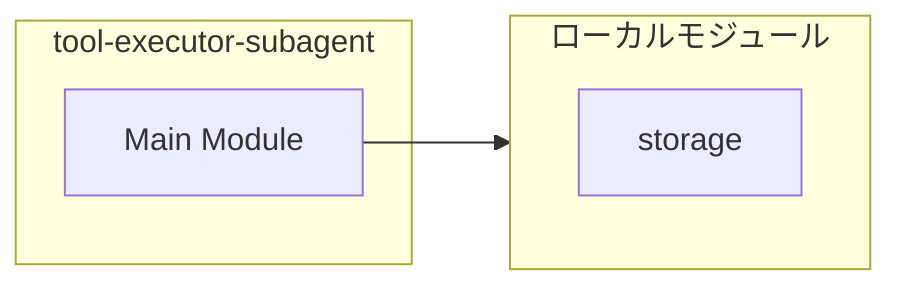

# tool-executor-subagent

## 概要

`tool-executor-subagent` モジュールのAPIリファレンス。

## インポート

```typescript
// from './storage.js': SubagentDefinition
```

## エクスポート一覧

| 種別 | 名前 | 説明 |
|------|------|------|
| 関数 | `ensureToolExecutorSubagent` | Register tool-executor subagent if not exists |

## 図解

### 依存関係図



## 関数

### ensureToolExecutorSubagent

```typescript
ensureToolExecutorSubagent(storage: { agents: SubagentDefinition[] }): void
```

Register tool-executor subagent if not exists

**パラメータ**

| 名前 | 型 | 必須 |
|------|-----|------|
| storage | `object` | はい |
| &nbsp;&nbsp;↳ agents | `SubagentDefinition[]` | はい |

**戻り値**: `void`

---
*自動生成: 2026-02-28T13:55:22.869Z*
