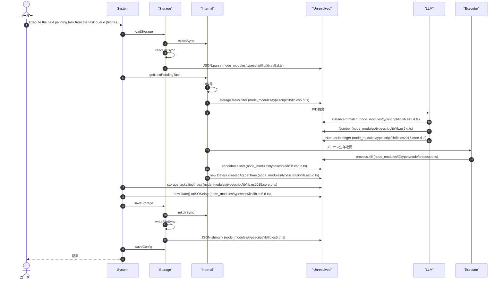
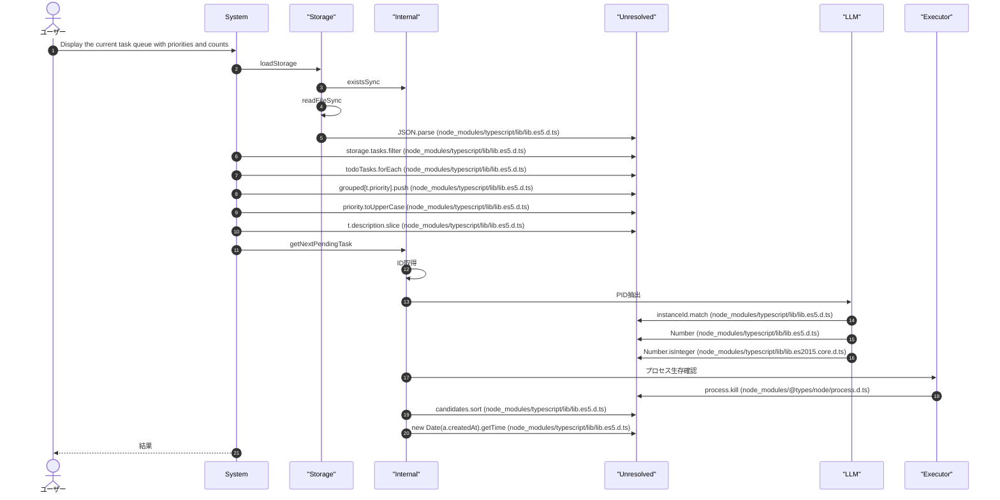
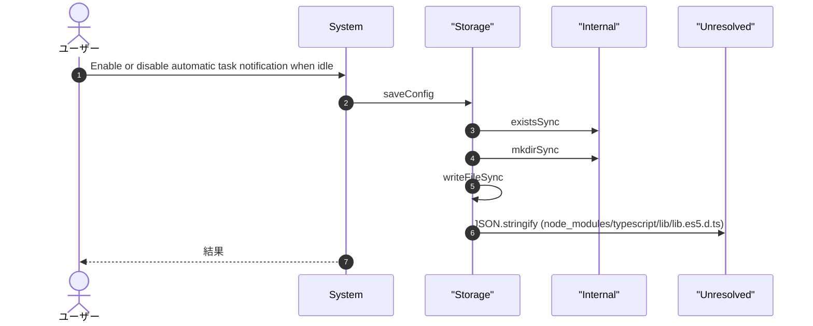
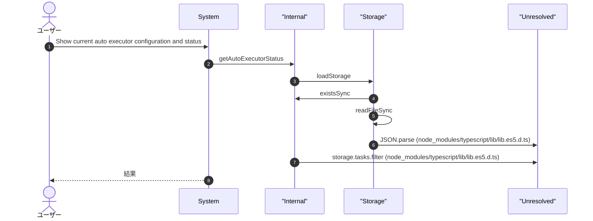
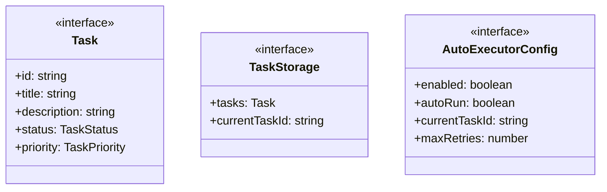
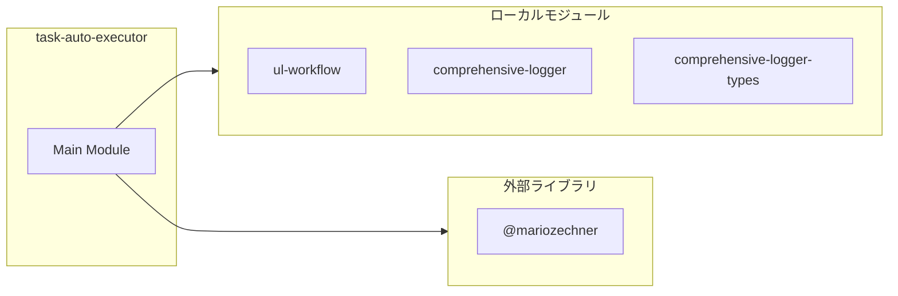
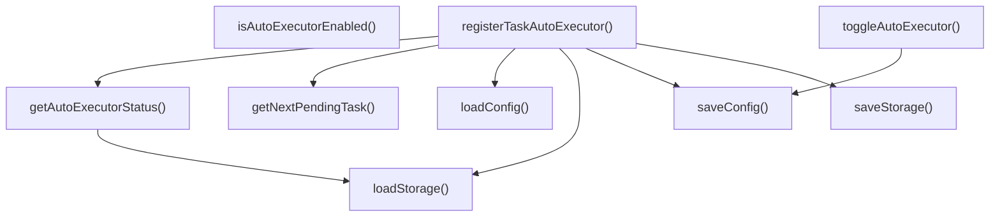
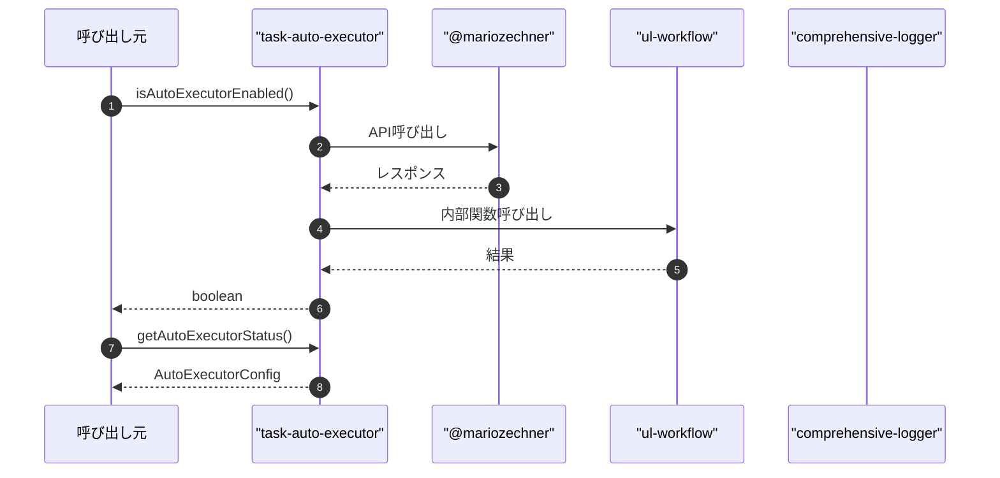

# task-auto-executor

## 概要

`task-auto-executor` モジュールのAPIリファレンス。

## インポート

```typescript
// from 'node:fs': existsSync, readFileSync, writeFileSync, ...
// from 'node:path': join
// from '@mariozechner/pi-ai': Type
// from '@mariozechner/pi-coding-agent': ExtensionAPI
// from './ul-workflow.js': getInstanceId, isProcessAlive, extractPidFromInstanceId
// ... and 2 more imports
```

## エクスポート一覧

| 種別 | 名前 | 説明 |
|------|------|------|
| 関数 | `isAutoExecutorEnabled` | - |
| 関数 | `getAutoExecutorStatus` | - |
| 関数 | `toggleAutoExecutor` | - |
| 関数 | `registerTaskAutoExecutor` | - |

## ユーザーフロー

このモジュールが提供するツールと、その実行フローを示します。

### task_run_next

Execute the next pending task from the task queue (highest priority first)



### task_queue_show

Display the current task queue with priorities and counts



### task_auto_executor_toggle

Enable or disable automatic task notification when idle



### task_auto_executor_status

Show current auto executor configuration and status



## 図解

### クラス図



### 依存関係図



### 関数フロー



### シーケンス図



## 関数

### loadStorage

```typescript
loadStorage(): TaskStorage
```

**戻り値**: `TaskStorage`

### saveStorage

```typescript
saveStorage(storage: TaskStorage): void
```

**パラメータ**

| 名前 | 型 | 必須 |
|------|-----|------|
| storage | `TaskStorage` | はい |

**戻り値**: `void`

### loadConfig

```typescript
loadConfig(): void
```

**戻り値**: `void`

### saveConfig

```typescript
saveConfig(): void
```

**戻り値**: `void`

### getNextPendingTask

```typescript
getNextPendingTask(storage: TaskStorage): Task | null
```

**パラメータ**

| 名前 | 型 | 必須 |
|------|-----|------|
| storage | `TaskStorage` | はい |

**戻り値**: `Task | null`

### isAutoExecutorEnabled

```typescript
isAutoExecutorEnabled(): boolean
```

**戻り値**: `boolean`

### getAutoExecutorStatus

```typescript
getAutoExecutorStatus(): AutoExecutorConfig & { pendingCount: number }
```

**戻り値**: `AutoExecutorConfig & { pendingCount: number }`

### toggleAutoExecutor

```typescript
toggleAutoExecutor(enabled?: boolean): void
```

**パラメータ**

| 名前 | 型 | 必須 |
|------|-----|------|
| enabled | `boolean` | いいえ |

**戻り値**: `void`

### registerTaskAutoExecutor

```typescript
registerTaskAutoExecutor(pi: ExtensionAPI): void
```

**パラメータ**

| 名前 | 型 | 必須 |
|------|-----|------|
| pi | `ExtensionAPI` | はい |

**戻り値**: `void`

## インターフェース

### Task

```typescript
interface Task {
  id: string;
  title: string;
  description?: string;
  status: TaskStatus;
  priority: TaskPriority;
  tags: string[];
  dueDate?: string;
  assignee?: string;
  createdAt: string;
  updatedAt: string;
  completedAt?: string;
  parentTaskId?: string;
  ownerInstanceId?: string;
  claimedAt?: string;
}
```

### TaskStorage

```typescript
interface TaskStorage {
  tasks: Task[];
  currentTaskId?: string;
}
```

### AutoExecutorConfig

```typescript
interface AutoExecutorConfig {
  enabled: boolean;
  autoRun: boolean;
  currentTaskId?: string;
  maxRetries: number;
}
```

## 型定義

### TaskPriority

```typescript
type TaskPriority = "low" | "medium" | "high" | "urgent"
```

### TaskStatus

```typescript
type TaskStatus = "todo" | "in_progress" | "completed" | "cancelled" | "failed"
```

---
*自動生成: 2026-02-28T13:55:22.947Z*
