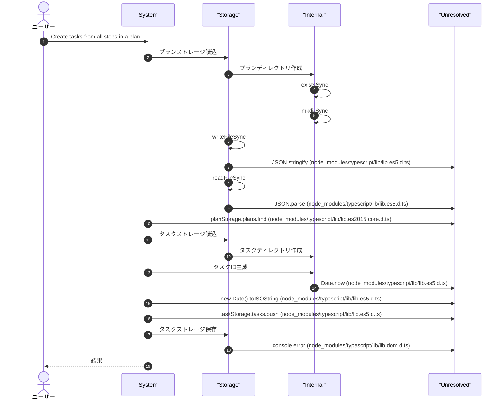
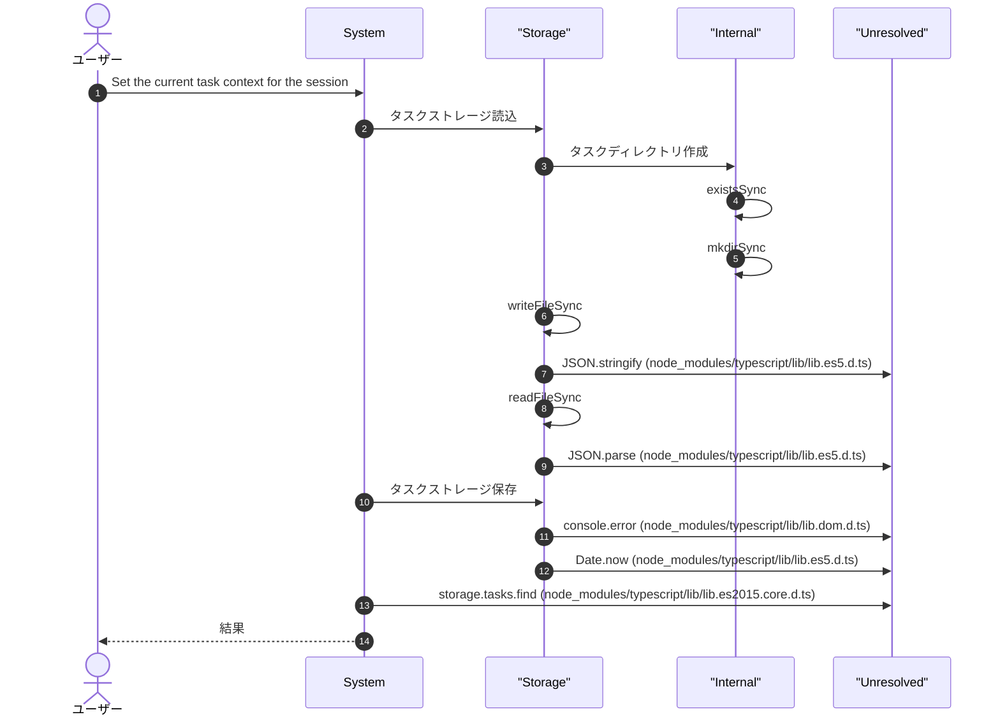
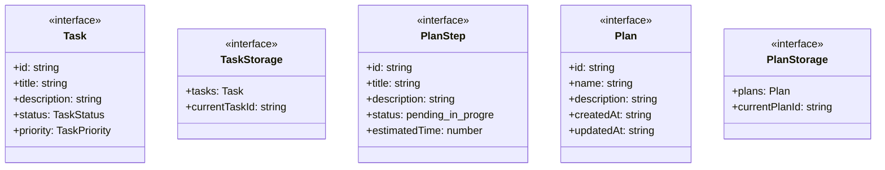
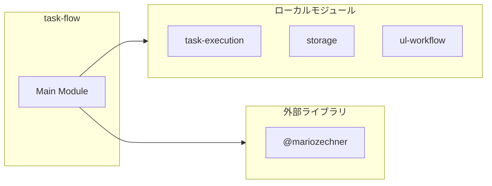

# task-flow

## 概要

`task-flow` モジュールのAPIリファレンス。

## インポート

```typescript
// from 'node:fs': existsSync, readFileSync, writeFileSync, ...
// from 'node:path': join
// from '@mariozechner/pi-ai': Type
// from '@mariozechner/pi-coding-agent': ExtensionAPI
// from './subagents/task-execution': runSubagentTask
// ... and 3 more imports
```

## エクスポート一覧

| 種別 | 名前 | 説明 |
|------|------|------|

## ユーザーフロー

このモジュールが提供するツールと、その実行フローを示します。

### task_delegate

Delegate a task to a subagent and automatically complete it on success

```mermaid
sequenceDiagram
  autonumber
  actor User as ユーザー
  participant System as System
  participant Storage as "Storage"
  participant Internal as "Internal"
  participant Unresolved as "Unresolved"
  participant Team as "Team"
  participant Executor as "Executor"
  participant Runtime as "Runtime"
  participant Judge as "Judge"
  participant LLM as "LLM"

  User->>System: Delegate a task to a subagent and automatically complete ...
  System->>Storage: タスクストレージ読込
  Storage->>Internal: タスクディレクトリ作成
  Internal->>Internal: existsSync
  Internal->>Internal: mkdirSync
  Storage->>Storage: writeFileSync
  Storage->>Unresolved: JSON.stringify (node_modules/typescript/lib/lib.es5.d.ts)
  Storage->>Storage: readFileSync
  Storage->>Unresolved: JSON.parse (node_modules/typescript/lib/lib.es5.d.ts)
  System->>Unresolved: storage.tasks.find (node_modules/typescript/lib/lib.es2015.core.d.ts)
  System->>Internal: ID取得
  System->>Unresolved: new Date().toISOString (node_modules/typescript/lib/lib.es5.d.ts)
  System->>Storage: タスクストレージ保存
  Storage->>Unresolved: console.error (node_modules/typescript/lib/lib.dom.d.ts)
  Storage->>Unresolved: Date.now (node_modules/typescript/lib/lib.es5.d.ts)
  System->>Storage: ストレージ読込
  Storage->>Internal: createDefaultAgents
  Storage->>Internal: saveStorage
  Storage->>Unresolved: Array.isArray (node_modules/typescript/lib/lib.es5.d.ts)
  Storage->>Unresolved: Number.isFinite (node_modules/typescript/lib/lib.es2015.core.d.ts)
  Storage->>Unresolved: Math.trunc (node_modules/typescript/lib/lib.es2015.core.d.ts)
  Storage->>Internal: ensureDefaults
  Storage->>Internal: 破損バックアップ作成
  Internal->>Unresolved: require (node_modules/@types/node/module.d.ts)
  Internal->>Unresolved: new Date().toISOString().replace (node_modules/typescript/lib/lib.es5.d.ts)
  Internal->>Internal: statSync
  Internal->>Unresolved: console.warn (node_modules/typescript/lib/lib.dom.d.ts)
  Internal->>Unresolved: String (node_modules/typescript/lib/lib.es5.d.ts)
  System->>Team: サブエージェントタスク実行
  Team->>Executor: 一意な実行IDを生成します。
  Executor->>Unresolved: [     String(now.getFullYear()),     String(now.getMonth() + 1).padStart(2, '0'),     String(now.getDate()).padStart(2, '0'),     String(now.getHours()).padStart(2, '0'),     String(now.getMinutes()).padStart(2, '0'),     String(now.getSeconds()).padStart(2, '0'),   ].join (node_modules/typescript/lib/lib.es5.d.ts)
  Executor->>Unresolved: now.getFullYear (node_modules/typescript/lib/lib.es5.d.ts)
  Executor->>Unresolved: String(now.getMonth() + 1).padStart (node_modules/typescript/lib/lib.es2017.string.d.ts)
  Executor->>Unresolved: now.getMonth (node_modules/typescript/lib/lib.es5.d.ts)
  Executor->>Unresolved: now.getDate (node_modules/typescript/lib/lib.es5.d.ts)
  Executor->>Unresolved: now.getHours (node_modules/typescript/lib/lib.es5.d.ts)
  Executor->>Unresolved: now.getMinutes (node_modules/typescript/lib/lib.es5.d.ts)
  Executor->>Unresolved: now.getSeconds (node_modules/typescript/lib/lib.es5.d.ts)
  Executor->>Unresolved: randomBytes(3).toString (node_modules/@types/node/buffer.d.ts)
  Executor->>Internal: randomBytes
  Team->>Unresolved: ensurePaths (.pi/extensions/subagents/storage.ts)
  Team->>Internal: プランモード判定
  Internal->>Unresolved: process.cwd (node_modules/@types/node/process.d.ts)
  Internal->>Internal: validatePlanModeState
  Team->>Internal: 関連パターンを検索
  Internal->>Internal: loadPatternStorage
  Internal->>Internal: キーワード抽出
  Internal->>Unresolved: text.match (node_modules/typescript/lib/lib.es5.d.ts)
  Internal->>Unresolved: word.toLowerCase (node_modules/typescript/lib/lib.es5.d.ts)
  Internal->>Unresolved: stopWords.has (node_modules/typescript/lib/lib.es2015.collection.d.ts)
  Internal->>Unresolved: keywords.add (node_modules/typescript/lib/lib.es2015.collection.d.ts)
  Internal->>Unresolved: Array.from (node_modules/typescript/lib/lib.es2015.core.d.ts)
  Internal->>Internal: タスク分類
  Internal->>Unresolved: Object.entries (node_modules/typescript/lib/lib.es2017.object.d.ts)
  Internal->>Unresolved: keywords.reduce (node_modules/typescript/lib/lib.es5.d.ts)
  Internal->>Unresolved: text.includes (node_modules/typescript/lib/lib.es2015.core.d.ts)
  Internal->>Unresolved: storage.patterns.map (node_modules/typescript/lib/lib.es5.d.ts)
  Internal->>Unresolved: taskKeywords.filter (node_modules/typescript/lib/lib.es5.d.ts)
  Internal->>Unresolved: scored     .filter((s) => s.score > 0)     .sort((a, b) => b.score - a.score)     .slice (node_modules/typescript/lib/lib.es5.d.ts)
  Internal->>Unresolved: scored     .filter((s) => s.score > 0)     .sort (node_modules/typescript/lib/lib.es5.d.ts)
  Team->>Internal: buildSubagentPrompt
  Team->>Runtime: レート制限キー生成
  Team->>Unresolved: /429|rate\s*limit|too many requests/i.test (node_modules/typescript/lib/lib.es5.d.ts)
  Team->>Internal: isHighRiskTask
  Team->>Internal: バックオフ再試行実行
  Internal->>Internal: resolveRetryWithBackoffConfig
  Internal->>Internal: toOptionalNonNegativeInt
  Internal->>Internal: toOptionalPositiveInt
  Internal->>Unresolved: options.rateLimitKey.trim (node_modules/typescript/lib/lib.es5.d.ts)
  Internal->>Internal: normalizeRateLimitKey
  Internal->>Internal: createRateLimitKeyScope
  Internal->>Internal: createAbortError
  Internal->>Judge: サーキットブレーカーをチェック
  Judge->>Internal: normalizeConfig
  Judge->>Unresolved: breakers.get (node_modules/typescript/lib/lib.es2015.collection.d.ts)
  Judge->>Unresolved: breakers.set (node_modules/typescript/lib/lib.es2015.collection.d.ts)
  Judge->>Internal: transitionTo
  Internal->>Runtime: 観測データを記録
  Runtime->>Internal: isAdaptiveEnabled
  Runtime->>Internal: withStateWriteLock
  Runtime->>Internal: nowMs
  Runtime->>Internal: updateBaseConstraints
  Runtime->>Internal: getDefaultBaseLimit
  Runtime->>Unresolved: state.samples.push (node_modules/typescript/lib/lib.es5.d.ts)
  Runtime->>Internal: toSafeObservation
  Runtime->>Internal: trimWindow
  Runtime->>Internal: maybeRunDecision
  Internal->>Unresolved: Promise.all (node_modules/typescript/lib/lib.es2015.iterable.d.ts)
  Internal->>Internal: getRateLimitGateSnapshot
  Internal->>Internal: selectLongestRateLimitGate
  Internal->>Internal: createRateLimitFastFailError
  Internal->>Internal: sleepWithAbort
  Internal->>Unresolved: Math.max (node_modules/typescript/lib/lib.es5.d.ts)
  Internal->>Internal: registerRateLimitGateSuccess
  Internal->>Internal: 成功を記録
  Internal->>Internal: extractRetryStatusCode
  Internal->>Internal: isNetworkErrorRetryable
  Internal->>Internal: 失敗を記録
  Internal->>Internal: computeBackoffDelayMs
  Internal->>Internal: registerRateLimitGateHit
  Team->>Internal: スキーマ強制生成
  Internal->>Internal: parseStructuredOutput
  Internal->>Internal: validateAgainstSchema
  Internal->>Internal: sleep
  Team->>LLM: 印刷を実行する
  LLM->>Internal: waitForPrintThrottleSlot
  LLM->>Internal: spawn
  LLM->>Internal: cleanup
  LLM->>Unresolved: child.kill (node_modules/@types/node/child_process.d.ts)
  LLM->>Internal: clearTimeout
  LLM->>Internal: setTimeout
  LLM->>Internal: killSafely
  LLM->>Internal: finish
  LLM->>Internal: resetIdleTimeout
  LLM->>Internal: removeEventListener
  LLM->>Internal: addEventListener
  LLM->>Unresolved: child.stdout.on (node_modules/@types/node/stream.d.ts)
  LLM->>Unresolved: lineBuffer.split (node_modules/typescript/lib/lib.es5.d.ts)
  LLM->>Unresolved: lines.pop (node_modules/typescript/lib/lib.es5.d.ts)
  LLM->>Internal: parseJsonStreamLine
  LLM->>Internal: extractFinalText
  LLM->>Internal: appendWithCap
  LLM->>Internal: recordPrintRateLimitCooldown
  LLM->>Internal: isUnhandledAbortStopReasonMessage
  LLM->>Internal: combineTextAndThinking
  LLM->>Internal: trimForError
  Team->>Internal: emitStderrChunk
  Team->>Internal: processOutputWithThreeLayerPipeline
  Team->>Internal: normalizeSubagentOutput
  Team->>Internal: isRetryableSubagentError
  Team->>Internal: エラーメッセージを抽出
  Team->>Internal: extractSummary
  Team->>Unresolved: console.log (node_modules/typescript/lib/lib.dom.d.ts)
  Team->>Team: Agent Run 失敗再評価
  Team->>Internal: parseToolFailureCount
  Team->>Internal: buildFailureSummary
  Team->>Unresolved: ((failed / total) * 100).toFixed (node_modules/typescript/lib/lib.es5.d.ts)
  System-->>User: 結果

```



### task_from_plan

Create tasks from all steps in a plan



### task_context_set

Set the current task context for the session



## 図解

### クラス図



### 依存関係図



## 関数

### ensureTaskDir

```typescript
ensureTaskDir(): void
```

タスクディレクトリを確保

**戻り値**: `void`

### ensurePlanDir

```typescript
ensurePlanDir(): void
```

プランディレクトリを確保

**戻り値**: `void`

### loadTaskStorage

```typescript
loadTaskStorage(): TaskStorage
```

タスクストレージを読み込み

**戻り値**: `TaskStorage`

### saveTaskStorage

```typescript
saveTaskStorage(storage: TaskStorage): void
```

タスクストレージを保存

**パラメータ**

| 名前 | 型 | 必須 |
|------|-----|------|
| storage | `TaskStorage` | はい |

**戻り値**: `void`

### loadPlanStorage

```typescript
loadPlanStorage(): PlanStorage
```

プランストレージを読み込み

**戻り値**: `PlanStorage`

### generateTaskId

```typescript
generateTaskId(): string
```

一意なタスクIDを生成

**戻り値**: `string`

## インターフェース

### Task

```typescript
interface Task {
  id: string;
  title: string;
  description?: string;
  status: TaskStatus;
  priority: TaskPriority;
  tags: string[];
  dueDate?: string;
  assignee?: string;
  createdAt: string;
  updatedAt: string;
  completedAt?: string;
  parentTaskId?: string;
  ownerInstanceId?: string;
  claimedAt?: string;
}
```

タスクのデータモデル
Note: Duplicated from task.ts because it's not exported

### TaskStorage

```typescript
interface TaskStorage {
  tasks: Task[];
  currentTaskId?: string;
}
```

タスクストレージのデータモデル
Note: Duplicated from task.ts because it's not exported

### PlanStep

```typescript
interface PlanStep {
  id: string;
  title: string;
  description?: string;
  status: "pending" | "in_progress" | "completed" | "blocked";
  estimatedTime?: number;
  dependencies?: string[];
}
```

プランステップのデータモデル
Note: Duplicated from plan.ts because it's not exported

### Plan

```typescript
interface Plan {
  id: string;
  name: string;
  description?: string;
  createdAt: string;
  updatedAt: string;
  status: "draft" | "active" | "completed" | "cancelled";
  steps: PlanStep[];
}
```

プランのデータモデル
Note: Duplicated from plan.ts because it's not exported

### PlanStorage

```typescript
interface PlanStorage {
  plans: Plan[];
  currentPlanId?: string;
}
```

プランストレージのデータモデル
Note: Duplicated from plan.ts because it's not exported

## 型定義

### TaskPriority

```typescript
type TaskPriority = "low" | "medium" | "high" | "urgent"
```

タスクの優先度

### TaskStatus

```typescript
type TaskStatus = "todo" | "in_progress" | "completed" | "cancelled" | "failed"
```

タスクのステータス

---
*自動生成: 2026-02-28T13:55:22.956Z*
