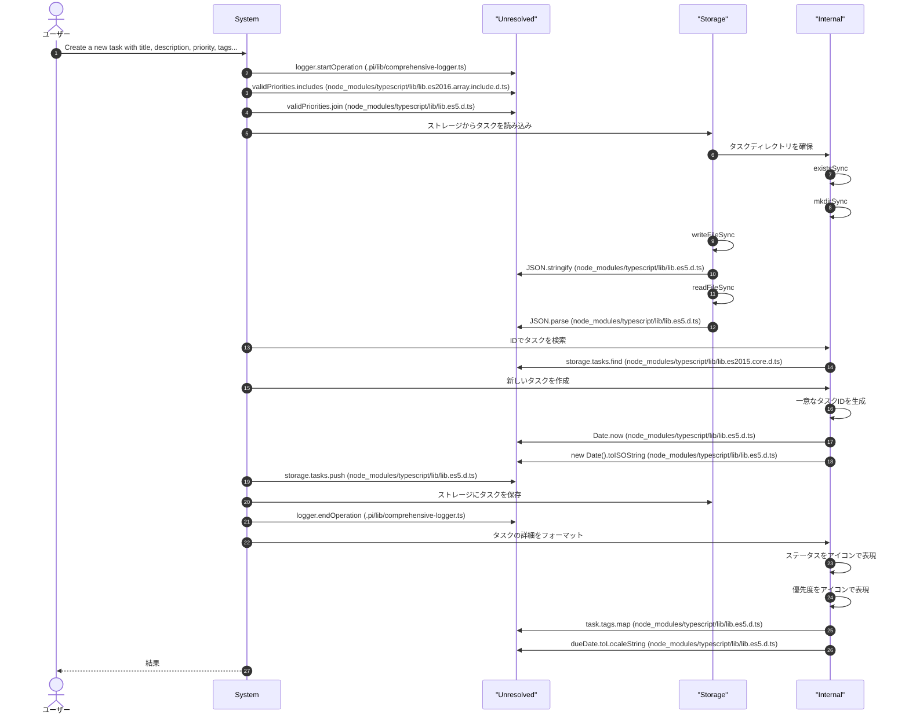
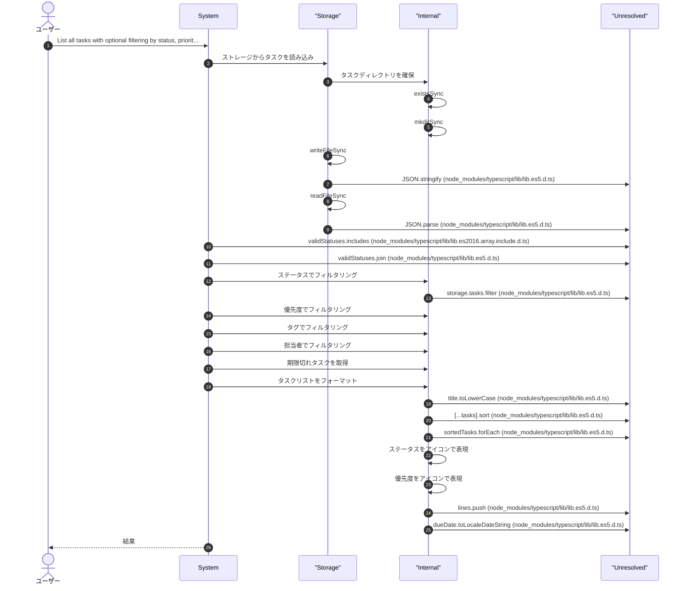
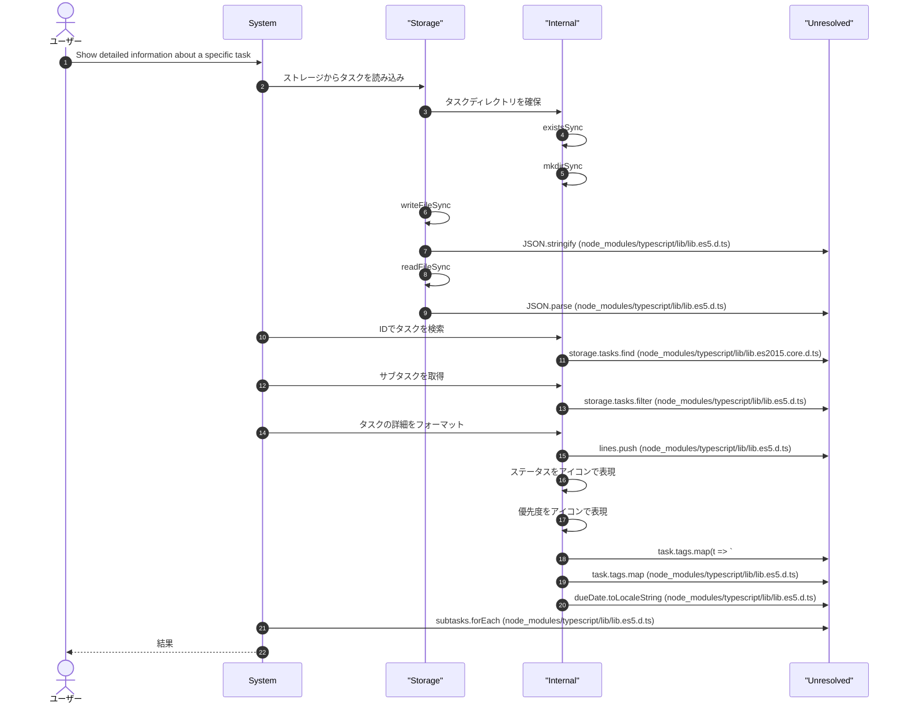
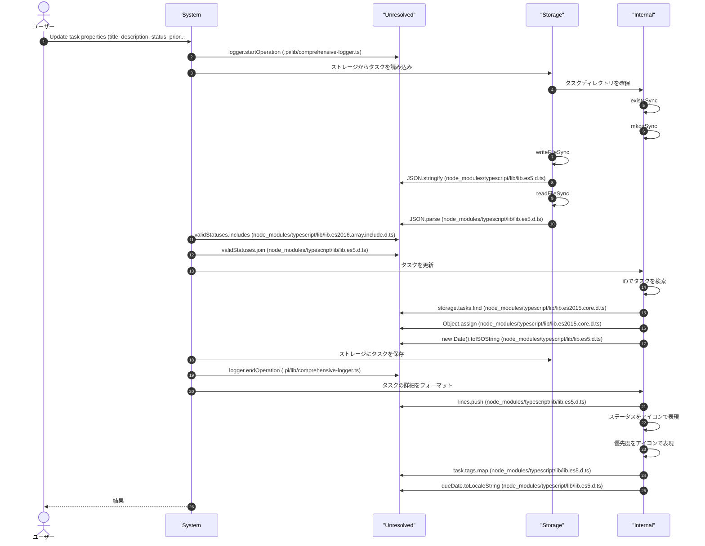
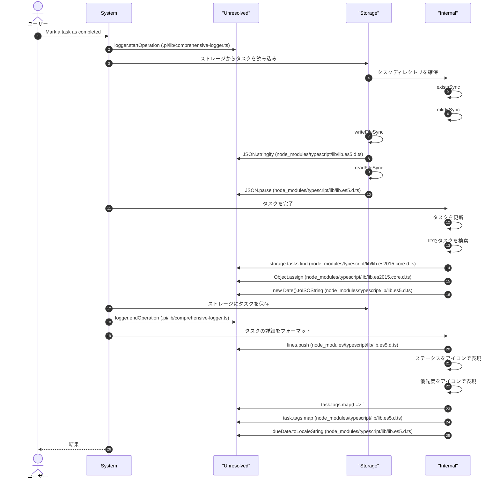
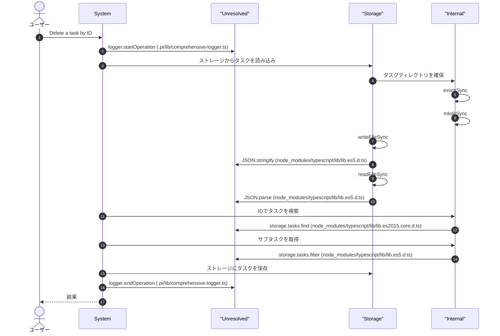
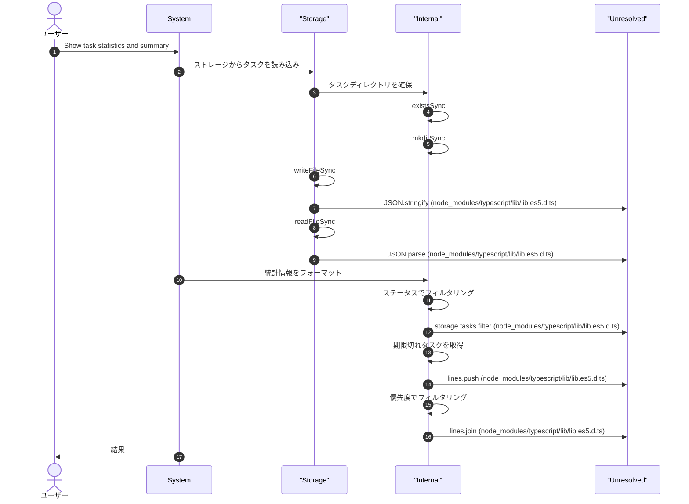
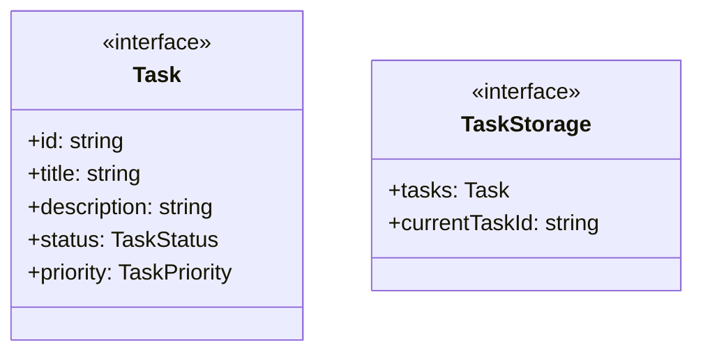
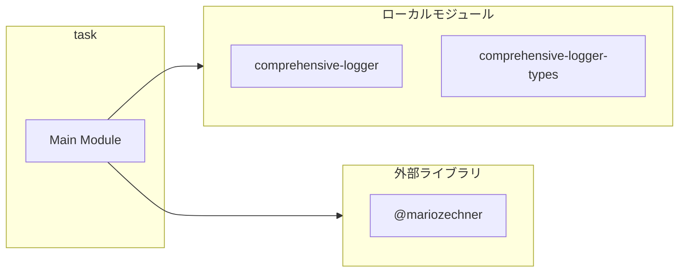

# task

## 概要

`task` モジュールのAPIリファレンス。

## インポート

```typescript
// from 'node:fs': existsSync, readFileSync, writeFileSync, ...
// from 'node:path': join
// from '@mariozechner/pi-ai': Type
// from '@mariozechner/pi-coding-agent': ExtensionAPI
// from '../lib/comprehensive-logger': getLogger
// ... and 1 more imports
```

## エクスポート一覧

| 種別 | 名前 | 説明 |
|------|------|------|

## ユーザーフロー

このモジュールが提供するツールと、その実行フローを示します。

### task_create

Create a new task with title, description, priority, tags, due date, and assignee



### task_list

List all tasks with optional filtering by status, priority, tag, or assignee



### task_show

Show detailed information about a specific task



### task_update

Update task properties (title, description, status, priority, tags, due date, assignee)



### task_complete

Mark a task as completed



### task_delete

Delete a task by ID



### task_stats

Show task statistics and summary



## 図解

### クラス図



### 依存関係図



## 関数

### ensureTaskDir

```typescript
ensureTaskDir(): void
```

タスクディレクトリを確保

**戻り値**: `void`

### loadStorage

```typescript
loadStorage(): TaskStorage
```

ストレージからタスクを読み込み

**戻り値**: `TaskStorage`

### saveStorage

```typescript
saveStorage(storage: TaskStorage): void
```

ストレージにタスクを保存

**パラメータ**

| 名前 | 型 | 必須 |
|------|-----|------|
| storage | `TaskStorage` | はい |

**戻り値**: `void`

### generateId

```typescript
generateId(): string
```

一意なタスクIDを生成

**戻り値**: `string`

### createTask

```typescript
createTask(title: string, description?: string, priority: TaskPriority, tags: string[], dueDate?: string, assignee?: string, parentTaskId?: string): Task
```

新しいタスクを作成

**パラメータ**

| 名前 | 型 | 必須 |
|------|-----|------|
| title | `string` | はい |
| description | `string` | いいえ |
| priority | `TaskPriority` | はい |
| tags | `string[]` | はい |
| dueDate | `string` | いいえ |
| assignee | `string` | いいえ |
| parentTaskId | `string` | いいえ |

**戻り値**: `Task`

### findTaskById

```typescript
findTaskById(storage: TaskStorage, taskId: string): Task | undefined
```

IDでタスクを検索

**パラメータ**

| 名前 | 型 | 必須 |
|------|-----|------|
| storage | `TaskStorage` | はい |
| taskId | `string` | はい |

**戻り値**: `Task | undefined`

### updateTask

```typescript
updateTask(storage: TaskStorage, taskId: string, updates: Partial<Omit<Task, "id" | "createdAt">>): Task | null
```

タスクを更新

**パラメータ**

| 名前 | 型 | 必須 |
|------|-----|------|
| storage | `TaskStorage` | はい |
| taskId | `string` | はい |
| updates | `Partial<Omit<Task, "id" | "createdAt">>` | はい |

**戻り値**: `Task | null`

### deleteTask

```typescript
deleteTask(storage: TaskStorage, taskId: string): boolean
```

タスクを削除

**パラメータ**

| 名前 | 型 | 必須 |
|------|-----|------|
| storage | `TaskStorage` | はい |
| taskId | `string` | はい |

**戻り値**: `boolean`

### completeTask

```typescript
completeTask(storage: TaskStorage, taskId: string): Task | null
```

タスクを完了

**パラメータ**

| 名前 | 型 | 必須 |
|------|-----|------|
| storage | `TaskStorage` | はい |
| taskId | `string` | はい |

**戻り値**: `Task | null`

### filterByStatus

```typescript
filterByStatus(storage: TaskStorage, status: TaskStatus): Task[]
```

ステータスでフィルタリング

**パラメータ**

| 名前 | 型 | 必須 |
|------|-----|------|
| storage | `TaskStorage` | はい |
| status | `TaskStatus` | はい |

**戻り値**: `Task[]`

### filterByPriority

```typescript
filterByPriority(storage: TaskStorage, priority: TaskPriority): Task[]
```

優先度でフィルタリング

**パラメータ**

| 名前 | 型 | 必須 |
|------|-----|------|
| storage | `TaskStorage` | はい |
| priority | `TaskPriority` | はい |

**戻り値**: `Task[]`

### filterByTag

```typescript
filterByTag(storage: TaskStorage, tag: string): Task[]
```

タグでフィルタリング

**パラメータ**

| 名前 | 型 | 必須 |
|------|-----|------|
| storage | `TaskStorage` | はい |
| tag | `string` | はい |

**戻り値**: `Task[]`

### filterByAssignee

```typescript
filterByAssignee(storage: TaskStorage, assignee: string): Task[]
```

担当者でフィルタリング

**パラメータ**

| 名前 | 型 | 必須 |
|------|-----|------|
| storage | `TaskStorage` | はい |
| assignee | `string` | はい |

**戻り値**: `Task[]`

### getSubtasks

```typescript
getSubtasks(storage: TaskStorage, parentTaskId: string): Task[]
```

サブタスクを取得

**パラメータ**

| 名前 | 型 | 必須 |
|------|-----|------|
| storage | `TaskStorage` | はい |
| parentTaskId | `string` | はい |

**戻り値**: `Task[]`

### getOverdueTasks

```typescript
getOverdueTasks(storage: TaskStorage): Task[]
```

期限切れタスクを取得

**パラメータ**

| 名前 | 型 | 必須 |
|------|-----|------|
| storage | `TaskStorage` | はい |

**戻り値**: `Task[]`

### getPriorityIcon

```typescript
getPriorityIcon(priority: TaskPriority): string
```

優先度をアイコンで表現

**パラメータ**

| 名前 | 型 | 必須 |
|------|-----|------|
| priority | `TaskPriority` | はい |

**戻り値**: `string`

### getStatusIcon

```typescript
getStatusIcon(status: TaskStatus): string
```

ステータスをアイコンで表現

**パラメータ**

| 名前 | 型 | 必須 |
|------|-----|------|
| status | `TaskStatus` | はい |

**戻り値**: `string`

### formatTaskDetails

```typescript
formatTaskDetails(task: Task): string
```

タスクの詳細をフォーマット

**パラメータ**

| 名前 | 型 | 必須 |
|------|-----|------|
| task | `Task` | はい |

**戻り値**: `string`

### formatTaskList

```typescript
formatTaskList(tasks: Task[], title: string): string
```

タスクリストをフォーマット

**パラメータ**

| 名前 | 型 | 必須 |
|------|-----|------|
| tasks | `Task[]` | はい |
| title | `string` | はい |

**戻り値**: `string`

### formatTaskStats

```typescript
formatTaskStats(storage: TaskStorage): string
```

統計情報をフォーマット

**パラメータ**

| 名前 | 型 | 必須 |
|------|-----|------|
| storage | `TaskStorage` | はい |

**戻り値**: `string`

## インターフェース

### Task

```typescript
interface Task {
  id: string;
  title: string;
  description?: string;
  status: TaskStatus;
  priority: TaskPriority;
  tags: string[];
  dueDate?: string;
  assignee?: string;
  createdAt: string;
  updatedAt: string;
  completedAt?: string;
  parentTaskId?: string;
  ownerInstanceId?: string;
  claimedAt?: string;
}
```

タスクのデータモデル

### TaskStorage

```typescript
interface TaskStorage {
  tasks: Task[];
  currentTaskId?: string;
}
```

タスクストレージのデータモデル

## 型定義

### TaskPriority

```typescript
type TaskPriority = "low" | "medium" | "high" | "urgent"
```

タスクの優先度

### TaskStatus

```typescript
type TaskStatus = "todo" | "in_progress" | "completed" | "cancelled" | "failed"
```

タスクのステータス

---
*自動生成: 2026-02-28T13:55:22.962Z*
