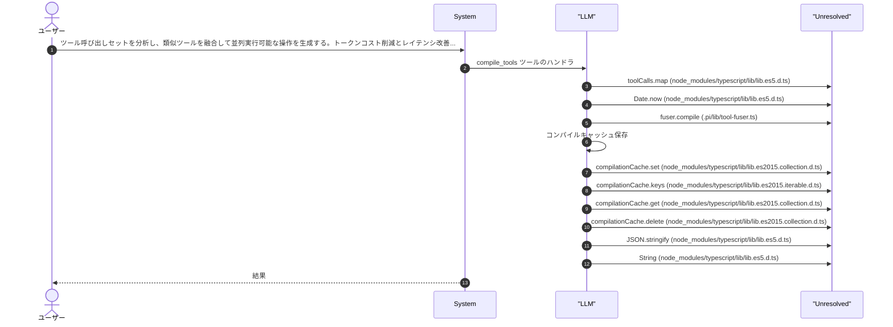
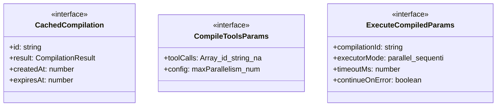
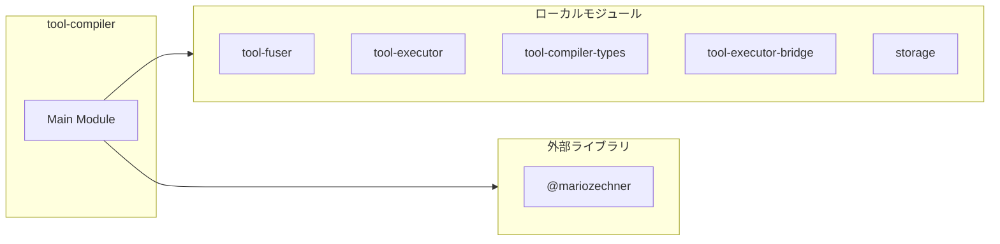
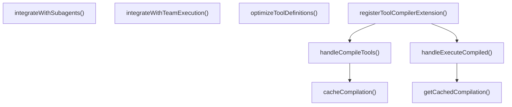
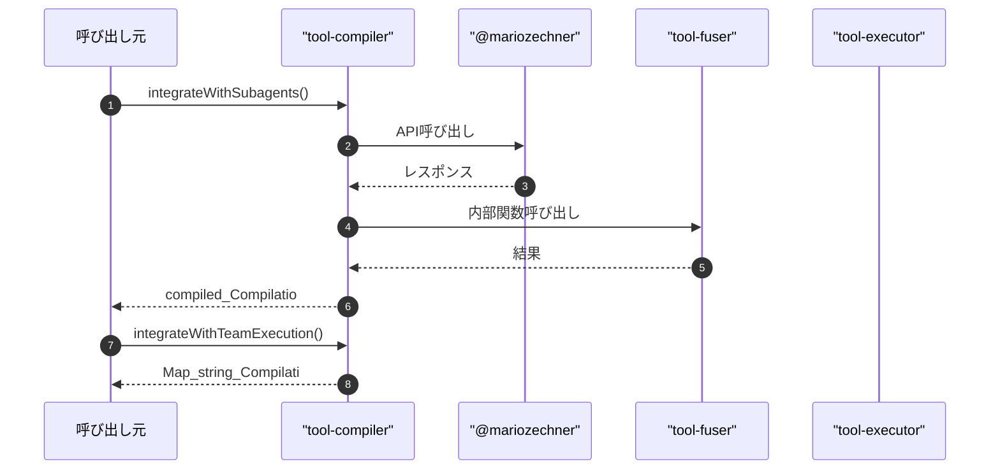

# tool-compiler

## 概要

`tool-compiler` モジュールのAPIリファレンス。

## インポート

```typescript
// from '@mariozechner/pi-coding-agent': ExtensionAPI
// from '@mariozechner/pi-ai': Type, StringEnum
// from '../lib/tool-fuser.js': ToolFuser
// from '../lib/tool-executor.js': ToolExecutor
// from '../lib/tool-compiler-types.js': ToolCall, CompilationResult, FusionConfig, ...
// ... and 4 more imports
```

## エクスポート一覧

| 種別 | 名前 | 説明 |
|------|------|------|
| 関数 | `integrateWithSubagents` | subagent_run/parallelへの統合フック |
| 関数 | `integrateWithTeamExecution` | agent_team_runへの統合フック |
| 関数 | `optimizeToolDefinitions` | 複数のツール定義を融合して、LLMに提示するツールセットを最適化 |
| 関数 | `registerToolCompilerExtension` | Tool Compiler拡張機能の登録関数 |

## ユーザーフロー

このモジュールが提供するツールと、その実行フローを示します。

### compile_tools

ツール呼び出しセットを分析し、類似ツールを融合して並列実行可能な操作を生成する。トークンコスト削減とレイテンシ改善を実現。依存関係を解析し、独立した操作をグループ化する。



### execute_compiled

compile_toolsで生成された融合操作を実行する。元のツールに分解し、依存関係に基づいて並列/順次実行する。実行結果を元のツールIDに対応付けて返す。

```mermaid
sequenceDiagram
  autonumber
  actor User as ユーザー
  participant System as System
  participant LLM as "LLM"
  participant Unresolved as "Unresolved"
  participant Storage as "Storage"
  participant Internal as "Internal"
  participant Team as "Team"
  participant Executor as "Executor"
  participant Runtime as "Runtime"
  participant Judge as "Judge"

  User->>System: compile_toolsで生成された融合操作を実行する。元のツールに分解し、依存関係に基づいて並列/順次実行する...
  System->>LLM: execute_compiled ツールのハンドラ
  LLM->>LLM: コンパイルキャッシュ取得
  LLM->>Unresolved: compilationCache.get (node_modules/typescript/lib/lib.es2015.collection.d.ts)
  LLM->>Unresolved: Date.now (node_modules/typescript/lib/lib.es5.d.ts)
  LLM->>Unresolved: compilationCache.delete (node_modules/typescript/lib/lib.es2015.collection.d.ts)
  LLM->>Unresolved: JSON.stringify (node_modules/typescript/lib/lib.es5.d.ts)
  LLM->>Storage: ストレージ読込
  Storage->>Unresolved: new Date().toISOString (node_modules/typescript/lib/lib.es5.d.ts)
  Storage->>Internal: createDefaultAgents
  Storage->>Internal: existsSync
  Storage->>Internal: saveStorage
  Storage->>Storage: readFileSync
  Storage->>Unresolved: JSON.parse (node_modules/typescript/lib/lib.es5.d.ts)
  Storage->>Unresolved: Array.isArray (node_modules/typescript/lib/lib.es5.d.ts)
  Storage->>Unresolved: Number.isFinite (node_modules/typescript/lib/lib.es2015.core.d.ts)
  Storage->>Unresolved: Math.trunc (node_modules/typescript/lib/lib.es2015.core.d.ts)
  Storage->>Internal: ensureDefaults
  Storage->>Internal: 破損バックアップ作成
  Internal->>Unresolved: require (node_modules/@types/node/module.d.ts)
  Internal->>Unresolved: new Date().toISOString().replace (node_modules/typescript/lib/lib.es5.d.ts)
  Internal->>Internal: statSync
  Internal->>Unresolved: console.warn (node_modules/typescript/lib/lib.dom.d.ts)
  Internal->>Unresolved: console.error (node_modules/typescript/lib/lib.dom.d.ts)
  Internal->>Unresolved: String (node_modules/typescript/lib/lib.es5.d.ts)
  LLM->>Team: サブエージェント存在確認・登録
  Team->>Unresolved: storage.agents.some (node_modules/typescript/lib/lib.es5.d.ts)
  Team->>Unresolved: storage.agents.push (node_modules/typescript/lib/lib.es5.d.ts)
  LLM->>Unresolved: storage.agents.find (node_modules/typescript/lib/lib.es2015.core.d.ts)
  LLM->>LLM: Compilationシリアライズ
  LLM->>Unresolved: compilation.fusedOperations.map (node_modules/typescript/lib/lib.es5.d.ts)
  LLM->>Internal: タスク記述ビルダー
  Internal->>Unresolved: op.dependsOnFusedIds.join (node_modules/typescript/lib/lib.es5.d.ts)
  Internal->>Unresolved: Object.keys (node_modules/typescript/lib/lib.es5.d.ts)
  Internal->>Unresolved: payload.fusedOperations.flatMap (node_modules/typescript/lib/lib.es2019.array.d.ts)
  LLM->>Team: サブエージェントタスク実行
  Team->>Executor: 一意な実行IDを生成します。
  Executor->>Unresolved: now.getFullYear (node_modules/typescript/lib/lib.es5.d.ts)
  Executor->>Unresolved: String(now.getMonth() + 1).padStart (node_modules/typescript/lib/lib.es2017.string.d.ts)
  Executor->>Unresolved: now.getMonth (node_modules/typescript/lib/lib.es5.d.ts)
  Executor->>Unresolved: now.getDate (node_modules/typescript/lib/lib.es5.d.ts)
  Executor->>Unresolved: now.getHours (node_modules/typescript/lib/lib.es5.d.ts)
  Executor->>Unresolved: now.getMinutes (node_modules/typescript/lib/lib.es5.d.ts)
  Executor->>Unresolved: now.getSeconds (node_modules/typescript/lib/lib.es5.d.ts)
  Executor->>Unresolved: randomBytes(3).toString (node_modules/@types/node/buffer.d.ts)
  Executor->>Internal: randomBytes
  Team->>Unresolved: ensurePaths (.pi/extensions/subagents/storage.ts)
  Team->>Internal: プランモード判定
  Internal->>Unresolved: process.cwd (node_modules/@types/node/process.d.ts)
  Internal->>Internal: validatePlanModeState
  Team->>Internal: 関連パターンを検索
  Internal->>Internal: loadPatternStorage
  Internal->>Internal: キーワード抽出
  Internal->>Internal: タスク分類
  Internal->>Unresolved: taskKeywords.filter (node_modules/typescript/lib/lib.es5.d.ts)
  Internal->>Unresolved: patternKeywords.has (node_modules/typescript/lib/lib.es2015.collection.d.ts)
  Internal->>Unresolved: scored     .filter((s) => s.score > 0)     .sort((a, b) => b.score - a.score)     .slice (node_modules/typescript/lib/lib.es5.d.ts)
  Internal->>Unresolved: scored     .filter((s) => s.score > 0)     .sort (node_modules/typescript/lib/lib.es5.d.ts)
  Team->>Internal: buildSubagentPrompt
  Team->>Runtime: レート制限キー生成
  Runtime->>Unresolved: provider.toLowerCase (node_modules/typescript/lib/lib.es5.d.ts)
  Team->>Unresolved: /429|rate\s*limit|too many requests/i.test (node_modules/typescript/lib/lib.es5.d.ts)
  Team->>Internal: isHighRiskTask
  Team->>Internal: バックオフ再試行実行
  Internal->>Internal: resolveRetryWithBackoffConfig
  Internal->>Internal: toOptionalNonNegativeInt
  Internal->>Internal: toOptionalPositiveInt
  Internal->>Unresolved: options.rateLimitKey.trim (node_modules/typescript/lib/lib.es5.d.ts)
  Internal->>Internal: normalizeRateLimitKey
  Internal->>Internal: createRateLimitKeyScope
  Internal->>Internal: createAbortError
  Internal->>Judge: サーキットブレーカーをチェック
  Internal->>Runtime: 観測データを記録
  Internal->>Unresolved: Promise.all (node_modules/typescript/lib/lib.es2015.iterable.d.ts)
  Internal->>Internal: getRateLimitGateSnapshot
  Internal->>Internal: selectLongestRateLimitGate
  Internal->>Internal: createRateLimitFastFailError
  Internal->>Internal: sleepWithAbort
  Internal->>Unresolved: Math.max (node_modules/typescript/lib/lib.es5.d.ts)
  Internal->>Internal: registerRateLimitGateSuccess
  Internal->>Internal: 成功を記録
  Internal->>Internal: extractRetryStatusCode
  Internal->>Internal: isNetworkErrorRetryable
  Internal->>Internal: 失敗を記録
  Internal->>Internal: computeBackoffDelayMs
  Internal->>Internal: registerRateLimitGateHit
  Team->>Internal: スキーマ強制生成
  Internal->>Internal: parseStructuredOutput
  Internal->>Internal: validateAgainstSchema
  Internal->>Internal: sleep
  Team->>LLM: 印刷を実行する
  LLM->>Internal: waitForPrintThrottleSlot
  LLM->>Internal: spawn
  LLM->>Internal: cleanup
  LLM->>Unresolved: child.kill (node_modules/@types/node/child_process.d.ts)
  LLM->>Internal: clearTimeout
  LLM->>Internal: setTimeout
  LLM->>Internal: killSafely
  LLM->>Internal: finish
  LLM->>Internal: resetIdleTimeout
  LLM->>Internal: removeEventListener
  LLM->>Internal: addEventListener
  LLM->>Unresolved: child.stdout.on (node_modules/@types/node/stream.d.ts)
  LLM->>Unresolved: lineBuffer.split (node_modules/typescript/lib/lib.es5.d.ts)
  LLM->>Unresolved: lines.pop (node_modules/typescript/lib/lib.es5.d.ts)
  LLM->>Internal: parseJsonStreamLine
  LLM->>Internal: extractFinalText
  LLM->>Internal: appendWithCap
  LLM->>Internal: recordPrintRateLimitCooldown
  LLM->>Internal: isUnhandledAbortStopReasonMessage
  LLM->>Internal: combineTextAndThinking
  LLM->>Internal: trimForError
  Team->>Internal: emitStderrChunk
  Team->>Internal: processOutputWithThreeLayerPipeline
  Team->>Internal: normalizeSubagentOutput
  Team->>Internal: isRetryableSubagentError
  Team->>Internal: エラーメッセージを抽出
  Team->>Internal: extractSummary
  Team->>Unresolved: console.log (node_modules/typescript/lib/lib.dom.d.ts)
  Team->>Storage: writeFileSync
  Team->>Team: Agent Run 失敗再評価
  Team->>Internal: parseToolFailureCount
  Team->>Internal: buildFailureSummary
  Team->>Unresolved: ((failed / total) * 100).toFixed (node_modules/typescript/lib/lib.es5.d.ts)
  LLM->>Internal: 結果パーサー
  Internal->>Unresolved: output.match (node_modules/typescript/lib/lib.es5.d.ts)
  System-->>User: 結果

```



## 図解

### クラス図



### 依存関係図



### 関数フロー



### シーケンス図



## 関数

### cacheCompilation

```typescript
cacheCompilation(result: CompilationResult): void
```

コンパイル結果をキャッシュに保存

**パラメータ**

| 名前 | 型 | 必須 |
|------|-----|------|
| result | `CompilationResult` | はい |

**戻り値**: `void`

### getCachedCompilation

```typescript
getCachedCompilation(id: string): CompilationResult | null
```

キャッシュからコンパイル結果を取得

**パラメータ**

| 名前 | 型 | 必須 |
|------|-----|------|
| id | `string` | はい |

**戻り値**: `CompilationResult | null`

### integrateWithSubagents

```typescript
integrateWithSubagents(tools: ToolCall[], fuserConfig?: Partial<FusionConfig>): { compiled: CompilationResult; shouldUseFusion: boolean }
```

subagent_run/parallelへの統合フック
Subagent実行前のツール融合を行う

**パラメータ**

| 名前 | 型 | 必須 |
|------|-----|------|
| tools | `ToolCall[]` | はい |
| fuserConfig | `Partial<FusionConfig>` | いいえ |

**戻り値**: `{ compiled: CompilationResult; shouldUseFusion: boolean }`

### integrateWithTeamExecution

```typescript
integrateWithTeamExecution(memberTools: Map<string, ToolCall[]>, fuserConfig?: Partial<FusionConfig>): Map<string, CompilationResult>
```

agent_team_runへの統合フック
チーム実行でのツール融合を行う

**パラメータ**

| 名前 | 型 | 必須 |
|------|-----|------|
| memberTools | `Map<string, ToolCall[]>` | はい |
| fuserConfig | `Partial<FusionConfig>` | いいえ |

**戻り値**: `Map<string, CompilationResult>`

### optimizeToolDefinitions

```typescript
optimizeToolDefinitions(toolDefinitions: Array<{ name: string; description: string; parameters: Record<string, unknown> }>, config?: Partial<FusionConfig>): {
  optimizedTools: Array<{ name: string; description: string; parameters: Record<string, unknown> }>;
  fusionMapping: Map<string, string[]>; // fusedName -> originalNames
  estimatedSavings: { tokenReduction: number; parallelismGain: number };
}
```

複数のツール定義を融合して、LLMに提示するツールセットを最適化

**パラメータ**

| 名前 | 型 | 必須 |
|------|-----|------|
| toolDefinitions | `Array<{ name: string; description: string; para...` | はい |
| config | `Partial<FusionConfig>` | いいえ |

**戻り値**: `{
  optimizedTools: Array<{ name: string; description: string; parameters: Record<string, unknown> }>;
  fusionMapping: Map<string, string[]>; // fusedName -> originalNames
  estimatedSavings: { tokenReduction: number; parallelismGain: number };
}`

### handleCompileTools

```typescript
async handleCompileTools(params: CompileToolsParams): Promise<string>
```

compile_tools ツールのハンドラ

**パラメータ**

| 名前 | 型 | 必須 |
|------|-----|------|
| params | `CompileToolsParams` | はい |

**戻り値**: `Promise<string>`

### handleExecuteCompiled

```typescript
async handleExecuteCompiled(params: ExecuteCompiledParams, ctx: { cwd: string; model?: { provider?: string; id?: string } }): Promise<string>
```

execute_compiled ツールのハンドラ
Uses subagent delegation for actual tool execution

**パラメータ**

| 名前 | 型 | 必須 |
|------|-----|------|
| params | `ExecuteCompiledParams` | はい |
| ctx | `object` | はい |
| &nbsp;&nbsp;↳ cwd | `string` | はい |
| &nbsp;&nbsp;↳ model | `{ provider?: string; id?: string }` | いいえ |

**戻り値**: `Promise<string>`

### registerToolCompilerExtension

```typescript
registerToolCompilerExtension(pi: ExtensionAPI): void
```

Tool Compiler拡張機能の登録関数
pi SDKのExtensionAPIを使用してツールを登録する

**パラメータ**

| 名前 | 型 | 必須 |
|------|-----|------|
| pi | `ExtensionAPI` | はい |

**戻り値**: `void`

## インターフェース

### CachedCompilation

```typescript
interface CachedCompilation {
  id: string;
  result: CompilationResult;
  createdAt: number;
  expiresAt: number;
}
```

### CompileToolsParams

```typescript
interface CompileToolsParams {
  toolCalls: Array<{
    id?: string;
    name: string;
    arguments: Record<string, unknown>;
    estimatedTokens?: number;
  }>;
  config?: {
    maxParallelism?: number;
    minToolsForFusion?: number;
    minTokenSavingsThreshold?: number;
    enableDependencyAnalysis?: boolean;
    enableAutoGrouping?: boolean;
    debugMode?: boolean;
  };
}
```

### ExecuteCompiledParams

```typescript
interface ExecuteCompiledParams {
  compilationId: string;
  executorMode?: "parallel" | "sequential" | "auto";
  timeoutMs?: number;
  continueOnError?: boolean;
}
```

---
*自動生成: 2026-02-28T13:55:22.977Z*
