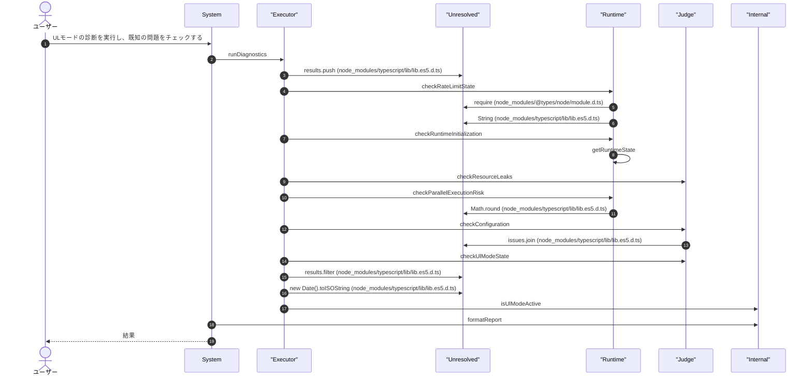
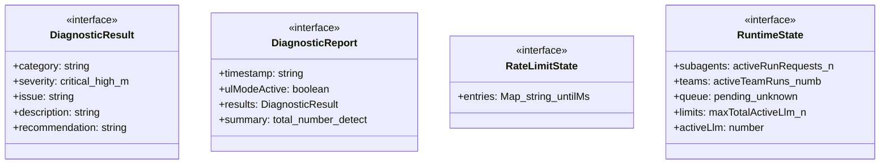
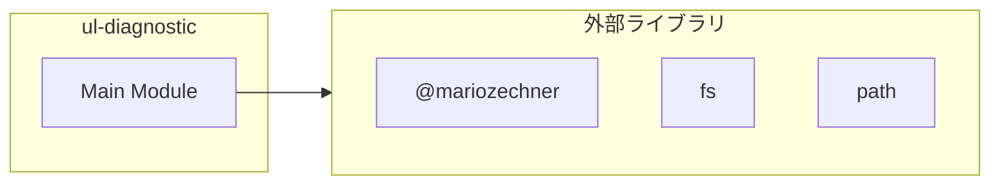
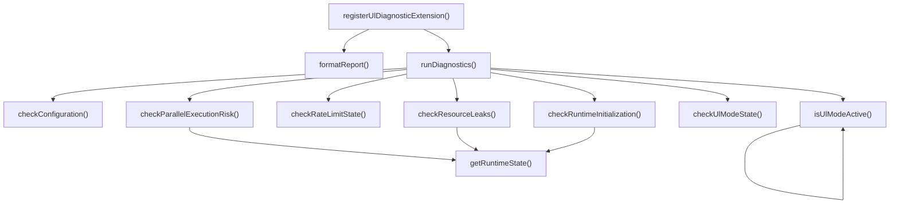

# ul-diagnostic

## 概要

`ul-diagnostic` モジュールのAPIリファレンス。

## インポート

```typescript
// from '@mariozechner/pi-ai': Type
// from '@mariozechner/pi-coding-agent': ExtensionAPI
// from 'fs': fs
// from 'path': path
```

## エクスポート一覧

| 種別 | 名前 | 説明 |
|------|------|------|
| 関数 | `registerUlDiagnosticExtension` | UI診断機能の拡張を登録 |

## ユーザーフロー

このモジュールが提供するツールと、その実行フローを示します。

### ul_diagnostic

ULモードの診断を実行し、既知の問題をチェックする



## 図解

### クラス図



### 依存関係図



### 関数フロー



## 関数

### getRateLimitState

```typescript
getRateLimitState(): RateLimitState | null
```

**戻り値**: `RateLimitState | null`

### getRuntimeState

```typescript
getRuntimeState(): RuntimeState | null
```

**戻り値**: `RuntimeState | null`

### isUlModeActive

```typescript
isUlModeActive(): boolean
```

**戻り値**: `boolean`

### checkRateLimitState

```typescript
checkRateLimitState(): DiagnosticResult
```

**戻り値**: `DiagnosticResult`

### checkRuntimeInitialization

```typescript
checkRuntimeInitialization(): DiagnosticResult
```

**戻り値**: `DiagnosticResult`

### checkResourceLeaks

```typescript
checkResourceLeaks(): DiagnosticResult
```

**戻り値**: `DiagnosticResult`

### checkParallelExecutionRisk

```typescript
checkParallelExecutionRisk(): DiagnosticResult
```

**戻り値**: `DiagnosticResult`

### checkConfiguration

```typescript
checkConfiguration(): DiagnosticResult
```

**戻り値**: `DiagnosticResult`

### checkUlModeState

```typescript
checkUlModeState(): DiagnosticResult
```

**戻り値**: `DiagnosticResult`

### runDiagnostics

```typescript
runDiagnostics(): DiagnosticReport
```

**戻り値**: `DiagnosticReport`

### formatReport

```typescript
formatReport(report: DiagnosticReport): string
```

**パラメータ**

| 名前 | 型 | 必須 |
|------|-----|------|
| report | `DiagnosticReport` | はい |

**戻り値**: `string`

### registerUlDiagnosticExtension

```typescript
registerUlDiagnosticExtension(pi: ExtensionAPI): void
```

UI診断機能の拡張を登録

**パラメータ**

| 名前 | 型 | 必須 |
|------|-----|------|
| pi | `ExtensionAPI` | はい |

**戻り値**: `void`

## インターフェース

### DiagnosticResult

```typescript
interface DiagnosticResult {
  category: string;
  severity: "critical" | "high" | "medium" | "low";
  issue: string;
  description: string;
  recommendation: string;
  detected: boolean;
  details?: string;
}
```

### DiagnosticReport

```typescript
interface DiagnosticReport {
  timestamp: string;
  ulModeActive: boolean;
  results: DiagnosticResult[];
  summary: {
    total: number;
    detected: number;
    bySeverity: Record<string, number>;
  };
}
```

### RateLimitState

```typescript
interface RateLimitState {
  entries: Map<string, { untilMs: number; hits: number; updatedAtMs: number }>;
}
```

### RuntimeState

```typescript
interface RuntimeState {
  subagents?: { activeRunRequests: number; activeAgents: number };
  teams?: { activeTeamRuns: number; activeTeammates: number };
  queue?: { pending: unknown[] };
  limits?: { maxTotalActiveLlm: number };
  activeLlm?: number;
  pendingQueue?: unknown[];
}
```

---
*自動生成: 2026-02-28T13:55:22.983Z*
