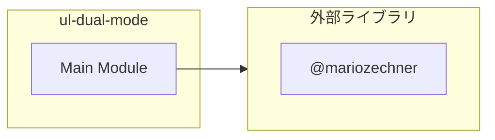

# ul-dual-mode

## 概要

`ul-dual-mode` モジュールのAPIリファレンス。

## インポート

```typescript
import { ExtensionAPI } from '@mariozechner/pi-coding-agent';
```

## エクスポート一覧

| 種別 | 名前 | 説明 |
|------|------|------|
| 関数 | `registerUlDualModeExtension` | - |

## 図解

### 依存関係図



## 関数

### persistState

```typescript
persistState(pi: ExtensionAPI): void
```

**パラメータ**

| 名前 | 型 | 必須 |
|------|-----|------|
| pi | `ExtensionAPI` | はい |

**戻り値**: `void`

### resetState

```typescript
resetState(): void
```

**戻り値**: `void`

### refreshStatus

```typescript
refreshStatus(ctx: any): void
```

**パラメータ**

| 名前 | 型 | 必須 |
|------|-----|------|
| ctx | `any` | はい |

**戻り値**: `void`

### refreshStatusThrottled

```typescript
refreshStatusThrottled(ctx: any): void
```

スロットリング付きのrefreshStatus。
短時間での連続呼び出しを防ぎ、UI更新のオーバーヘッドを削減する。

**パラメータ**

| 名前 | 型 | 必須 |
|------|-----|------|
| ctx | `any` | はい |

**戻り値**: `void`

### extractTextWithoutUlPrefix

```typescript
extractTextWithoutUlPrefix(text: string): string
```

**パラメータ**

| 名前 | 型 | 必須 |
|------|-----|------|
| text | `string` | はい |

**戻り値**: `string`

### looksLikeClearGoalTask

```typescript
looksLikeClearGoalTask(text: string): boolean
```

**パラメータ**

| 名前 | 型 | 必須 |
|------|-----|------|
| text | `string` | はい |

**戻り値**: `boolean`

### isTrivialTask

```typescript
isTrivialTask(task: string): boolean
```

小規模タスク（trivial task）かどうかを判定する。
小規模タスクではreviewerをスキップ可能にする。

**パラメータ**

| 名前 | 型 | 必須 |
|------|-----|------|
| task | `string` | はい |

**戻り値**: `boolean`

### shouldRequireReviewer

```typescript
shouldRequireReviewer(task: string): boolean
```

reviewerが必要かどうかを判定する。
環境変数PI_UL_SKIP_REVIEWER_FOR_TRIVIAL=1の場合、小規模タスクではスキップ。

**パラメータ**

| 名前 | 型 | 必須 |
|------|-----|------|
| task | `string` | はい |

**戻り値**: `boolean`

### getMissingRequirements

```typescript
getMissingRequirements(): string[]
```

**戻り値**: `string[]`

### toObjectLike

```typescript
toObjectLike(value: unknown): Record<string, unknown> | undefined
```

**パラメータ**

| 名前 | 型 | 必須 |
|------|-----|------|
| value | `unknown` | はい |

**戻り値**: `Record<string, unknown> | undefined`

### normalizeId

```typescript
normalizeId(value: unknown): string
```

**パラメータ**

| 名前 | 型 | 必須 |
|------|-----|------|
| value | `unknown` | はい |

**戻り値**: `string`

### parseToolInput

```typescript
parseToolInput(event: any): Record<string, unknown> | undefined
```

**パラメータ**

| 名前 | 型 | 必須 |
|------|-----|------|
| event | `any` | はい |

**戻り値**: `Record<string, unknown> | undefined`

### extractIdList

```typescript
extractIdList(value: unknown): string[]
```

**パラメータ**

| 名前 | 型 | 必須 |
|------|-----|------|
| value | `unknown` | はい |

**戻り値**: `string[]`

### isRecommendedSubagentParallelCall

```typescript
isRecommendedSubagentParallelCall(event: any): boolean
```

**パラメータ**

| 名前 | 型 | 必須 |
|------|-----|------|
| event | `any` | はい |

**戻り値**: `boolean`

### isRecommendedCoreTeamCall

```typescript
isRecommendedCoreTeamCall(event: any): boolean
```

**パラメータ**

| 名前 | 型 | 必須 |
|------|-----|------|
| event | `any` | はい |

**戻り値**: `boolean`

### isRecommendedReviewerCall

```typescript
isRecommendedReviewerCall(event: any): boolean
```

**パラメータ**

| 名前 | 型 | 必須 |
|------|-----|------|
| event | `any` | はい |

**戻り値**: `boolean`

### buildUlTransformedInput

```typescript
buildUlTransformedInput(task: string, goalLoopMode: boolean): string
```

**パラメータ**

| 名前 | 型 | 必須 |
|------|-----|------|
| task | `string` | はい |
| goalLoopMode | `boolean` | はい |

**戻り値**: `string`

### getUlPolicy

```typescript
getUlPolicy(sessionWide: boolean, goalLoopMode: boolean): string
```

**パラメータ**

| 名前 | 型 | 必須 |
|------|-----|------|
| sessionWide | `boolean` | はい |
| goalLoopMode | `boolean` | はい |

**戻り値**: `string`

### buildUlPolicyString

```typescript
buildUlPolicyString(sessionWide: boolean, goalLoopMode: boolean): string
```

**パラメータ**

| 名前 | 型 | 必須 |
|------|-----|------|
| sessionWide | `boolean` | はい |
| goalLoopMode | `boolean` | はい |

**戻り値**: `string`

### registerUlDualModeExtension

```typescript
registerUlDualModeExtension(pi: ExtensionAPI): void
```

**パラメータ**

| 名前 | 型 | 必須 |
|------|-----|------|
| pi | `ExtensionAPI` | はい |

**戻り値**: `void`

---
*自動生成: 2026-02-18T00:15:35.630Z*
