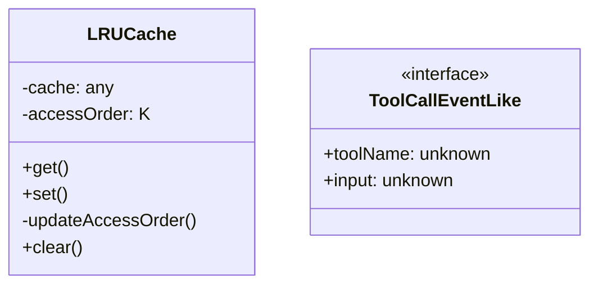
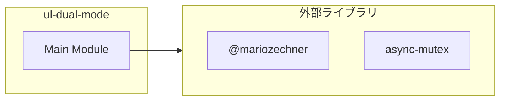
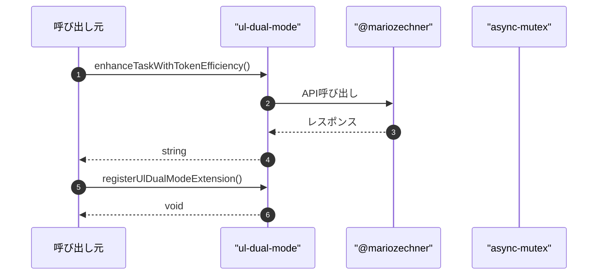

# ul-dual-mode

## 概要

`ul-dual-mode` モジュールのAPIリファレンス。

## インポート

```typescript
// from '@mariozechner/pi-coding-agent': ExtensionAPI
// from 'async-mutex': Mutex
```

## エクスポート一覧

| 種別 | 名前 | 説明 |
|------|------|------|
| 関数 | `enhanceTaskWithTokenEfficiency` | タスクにトークン効率化コンテキストを追加する |
| 関数 | `registerUlDualModeExtension` | - |

## 図解

### クラス図



### 依存関係図



### 関数フロー

```mermaid
flowchart TD
  buildUlPolicyString["buildUlPolicyString()"]
  buildUlTransformedInput["buildUlTransformedInput()"]
  enhanceTaskWithTokenEfficiency["enhanceTaskWithTokenEfficiency()"]
  extractTextWithoutUlPrefix["extractTextWithoutUlPrefix()"]
  getAdaptiveThrottleMs["getAdaptiveThrottleMs()"]
  getCachedRuntimeSnapshot["getCachedRuntimeSnapshot()"]
  getMissingRequirements["getMissingRequirements()"]
  getUlPolicy["getUlPolicy()"]
  isRecommendedReviewerCall["isRecommendedReviewerCall()"]
  isTrivialTask["isTrivialTask()"]
  looksLikeClearGoalTask["looksLikeClearGoalTask()"]
  normalizeId["normalizeId()"]
  parseToolInput["parseToolInput()"]
  persistState["persistState()"]
  refreshStatus["refreshStatus()"]
  refreshStatusThrottled["refreshStatusThrottled()"]
  registerUlDualModeExtension["registerUlDualModeExtension()"]
  resetState["resetState()"]
  safeCacheSet["safeCacheSet()"]
  shouldRequireReviewer["shouldRequireReviewer()"]
  toObjectLike["toObjectLike()"]
  getAdaptiveThrottleMs --> getCachedRuntimeSnapshot
  getMissingRequirements --> shouldRequireReviewer
  getUlPolicy --> buildUlPolicyString
  getUlPolicy --> safeCacheSet
  isRecommendedReviewerCall --> normalizeId
  isRecommendedReviewerCall --> parseToolInput
  parseToolInput --> toObjectLike
  refreshStatusThrottled --> getAdaptiveThrottleMs
  refreshStatusThrottled --> refreshStatus
  registerUlDualModeExtension --> buildUlTransformedInput
  registerUlDualModeExtension --> extractTextWithoutUlPrefix
  registerUlDualModeExtension --> getMissingRequirements
  registerUlDualModeExtension --> getUlPolicy
  registerUlDualModeExtension --> isRecommendedReviewerCall
  registerUlDualModeExtension --> looksLikeClearGoalTask
  registerUlDualModeExtension --> persistState
  registerUlDualModeExtension --> refreshStatus
  registerUlDualModeExtension --> refreshStatusThrottled
  registerUlDualModeExtension --> resetState
  registerUlDualModeExtension --> shouldRequireReviewer
  shouldRequireReviewer --> isTrivialTask
```



### シーケンス図



## 関数

### updateState

```typescript
async updateState(updates: Partial<typeof state>): Promise<void>
```

状態を安全に更新する（ミューテックスで保護）

**パラメータ**

| 名前 | 型 | 必須 |
|------|-----|------|
| updates | `Partial<typeof state>` | はい |

**戻り値**: `Promise<void>`

### withStateLock

```typescript
async withStateLock(mutator: (s: typeof state) => T | Promise<T>): Promise<T>
```

状態を安全に読み取って更新する（ミューテックスで保護）

**パラメータ**

| 名前 | 型 | 必須 |
|------|-----|------|
| mutator | `(s: typeof state) => T | Promise<T>` | はい |

**戻り値**: `Promise<T>`

### persistState

```typescript
persistState(pi: ExtensionAPI): void
```

**パラメータ**

| 名前 | 型 | 必須 |
|------|-----|------|
| pi | `ExtensionAPI` | はい |

**戻り値**: `void`

### resetState

```typescript
resetState(): void
```

状態をリセットする（同期的 - イベントループ内で安全）

**戻り値**: `void`

### resetStateAsync

```typescript
async resetStateAsync(): Promise<void>
```

状態を非同期にリセットする（ミューテックスで保護）

**戻り値**: `Promise<void>`

### refreshStatus

```typescript
refreshStatus(ctx: ExtensionAPI["context"]): void
```

BUG-TS-004修正: 型安全なコンテキストパラメータ

**パラメータ**

| 名前 | 型 | 必須 |
|------|-----|------|
| ctx | `ExtensionAPI["context"]` | はい |

**戻り値**: `void`

### getCachedRuntimeSnapshot

```typescript
getCachedRuntimeSnapshot(): { totalActiveLlm: number; limits: { maxTotalActiveLlm: number } }
```

ランタイムスナップショットを取得（キャッシュ付き）
getRuntimeSnapshot() の呼び出しコストを削減するため、短期間はキャッシュを返す

**戻り値**: `{ totalActiveLlm: number; limits: { maxTotalActiveLlm: number } }`

### getAdaptiveThrottleMs

```typescript
getAdaptiveThrottleMs(): number
```

負荷に応じた適応的スロットリング間隔を計算する
低負荷時は最小間隔、高負荷時は最大間隔、中間は線形補間

**戻り値**: `number`

### refreshStatusThrottled

```typescript
refreshStatusThrottled(ctx: ExtensionAPI["context"]): void
```

適応的スロットリング付きのrefreshStatus。
負荷に応じてスロットリング間隔を動的に調整し、UI更新のオーバーヘッドを削減する。
BUG-TS-004修正: 型安全なコンテキストパラメータ

**パラメータ**

| 名前 | 型 | 必須 |
|------|-----|------|
| ctx | `ExtensionAPI["context"]` | はい |

**戻り値**: `void`

### extractTextWithoutUlPrefix

```typescript
extractTextWithoutUlPrefix(text: string): string
```

**パラメータ**

| 名前 | 型 | 必須 |
|------|-----|------|
| text | `string` | はい |

**戻り値**: `string`

### looksLikeClearGoalTask

```typescript
looksLikeClearGoalTask(text: string): boolean
```

**パラメータ**

| 名前 | 型 | 必須 |
|------|-----|------|
| text | `string` | はい |

**戻り値**: `boolean`

### isTrivialTask

```typescript
isTrivialTask(task: string): boolean
```

小規模タスク（trivial task）かどうかを判定する。
小規模タスクではreviewerをスキップ可能にする。

**パラメータ**

| 名前 | 型 | 必須 |
|------|-----|------|
| task | `string` | はい |

**戻り値**: `boolean`

### shouldRequireReviewer

```typescript
shouldRequireReviewer(task: string): boolean
```

reviewerが必要かどうかを判定する。
環境変数PI_UL_SKIP_REVIEWER_FOR_TRIVIAL=1の場合、小規模タスクではスキップ。

**パラメータ**

| 名前 | 型 | 必須 |
|------|-----|------|
| task | `string` | はい |

**戻り値**: `boolean`

### getMissingRequirements

```typescript
getMissingRequirements(): string[]
```

**戻り値**: `string[]`

### toObjectLike

```typescript
toObjectLike(value: unknown): Record<string, unknown> | undefined
```

**パラメータ**

| 名前 | 型 | 必須 |
|------|-----|------|
| value | `unknown` | はい |

**戻り値**: `Record<string, unknown> | undefined`

### normalizeId

```typescript
normalizeId(value: unknown): string
```

**パラメータ**

| 名前 | 型 | 必須 |
|------|-----|------|
| value | `unknown` | はい |

**戻り値**: `string`

### parseToolInput

```typescript
parseToolInput(event: ToolCallEventLike): Record<string, unknown> | undefined
```

BUG-TS-004修正: 型安全なイベントパラメータ

**パラメータ**

| 名前 | 型 | 必須 |
|------|-----|------|
| event | `ToolCallEventLike` | はい |

**戻り値**: `Record<string, unknown> | undefined`

### extractIdList

```typescript
extractIdList(value: unknown): string[]
```

**パラメータ**

| 名前 | 型 | 必須 |
|------|-----|------|
| value | `unknown` | はい |

**戻り値**: `string[]`

### isRecommendedSubagentParallelCall

```typescript
isRecommendedSubagentParallelCall(event: ToolCallEventLike): boolean
```

BUG-TS-004修正: 型安全なイベントパラメータ

**パラメータ**

| 名前 | 型 | 必須 |
|------|-----|------|
| event | `ToolCallEventLike` | はい |

**戻り値**: `boolean`

### isRecommendedCoreTeamCall

```typescript
isRecommendedCoreTeamCall(event: ToolCallEventLike): boolean
```

BUG-TS-004修正: 型安全なイベントパラメータ

**パラメータ**

| 名前 | 型 | 必須 |
|------|-----|------|
| event | `ToolCallEventLike` | はい |

**戻り値**: `boolean`

### isRecommendedReviewerCall

```typescript
isRecommendedReviewerCall(event: ToolCallEventLike): boolean
```

BUG-TS-004修正: 型安全なイベントパラメータ

**パラメータ**

| 名前 | 型 | 必須 |
|------|-----|------|
| event | `ToolCallEventLike` | はい |

**戻り値**: `boolean`

### buildUlTransformedInput

```typescript
buildUlTransformedInput(task: string, goalLoopMode: boolean): string
```

UL委任モードの指示を生成

**パラメータ**

| 名前 | 型 | 必須 |
|------|-----|------|
| task | `string` | はい |
| goalLoopMode | `boolean` | はい |

**戻り値**: `string`

### safeCacheSet

```typescript
safeCacheSet(key: string, value: string): void
```

**パラメータ**

| 名前 | 型 | 必須 |
|------|-----|------|
| key | `string` | はい |
| value | `string` | はい |

**戻り値**: `void`

### getUlPolicy

```typescript
getUlPolicy(sessionWide: boolean, goalLoopMode: boolean): string
```

**パラメータ**

| 名前 | 型 | 必須 |
|------|-----|------|
| sessionWide | `boolean` | はい |
| goalLoopMode | `boolean` | はい |

**戻り値**: `string`

### buildUlPolicyString

```typescript
buildUlPolicyString(sessionWide: boolean, goalLoopMode: boolean): string
```

**パラメータ**

| 名前 | 型 | 必須 |
|------|-----|------|
| sessionWide | `boolean` | はい |
| goalLoopMode | `boolean` | はい |

**戻り値**: `string`

### enhanceTaskWithTokenEfficiency

```typescript
enhanceTaskWithTokenEfficiency(task: string, isInternal: boolean): string
```

タスクにトークン効率化コンテキストを追加する

**パラメータ**

| 名前 | 型 | 必須 |
|------|-----|------|
| task | `string` | はい |
| isInternal | `boolean` | はい |

**戻り値**: `string`

### registerUlDualModeExtension

```typescript
registerUlDualModeExtension(pi: ExtensionAPI): void
```

**パラメータ**

| 名前 | 型 | 必須 |
|------|-----|------|
| pi | `ExtensionAPI` | はい |

**戻り値**: `void`

## クラス

### LRUCache

LRUキャッシュの実装
アクセス順序を管理し、上限超過時に最も古いエントリを削除

**プロパティ**

| 名前 | 型 | 可視性 |
|------|-----|--------|
| cache | `any` | private |
| accessOrder | `K[]` | private |

**メソッド**

| 名前 | シグネチャ |
|------|------------|
| get | `get(key): V | undefined` |
| set | `set(key, value): void` |
| updateAccessOrder | `updateAccessOrder(key): void` |
| clear | `clear(): void` |

## インターフェース

### ToolCallEventLike

```typescript
interface ToolCallEventLike {
  toolName?: unknown;
  input?: unknown;
}
```

BUG-TS-004修正: ツール呼び出しイベントの型定義
any型を排除し、コンパイル時の型チェックを有効化

---
*自動生成: 2026-02-28T13:55:22.990Z*
