# ul-workflow

## 概要

`ul-workflow` モジュールのAPIリファレンス。

## インポート

```typescript
// from '@mariozechner/pi-ai': Type
// from '@mariozechner/pi-coding-agent': ExtensionAPI
// from '@mariozechner/pi-agent-core': AgentToolResult
// from 'fs': fs
// from 'path': path
// ... and 5 more imports
```

## エクスポート一覧

| 種別 | 名前 | 説明 |
|------|------|------|
| 関数 | `determineWorkflowPhases` | タスク規模に基づいてフェーズ構成を決定する |
| 関数 | `registerUlWorkflowExtension` | 拡張機能を登録 |

## ユーザーフロー

このモジュールが提供するツールと、その実行フローを示します。

### ul_workflow_start

UL Workflow Modeを開始（Research-Plan-Annotate-Implement）

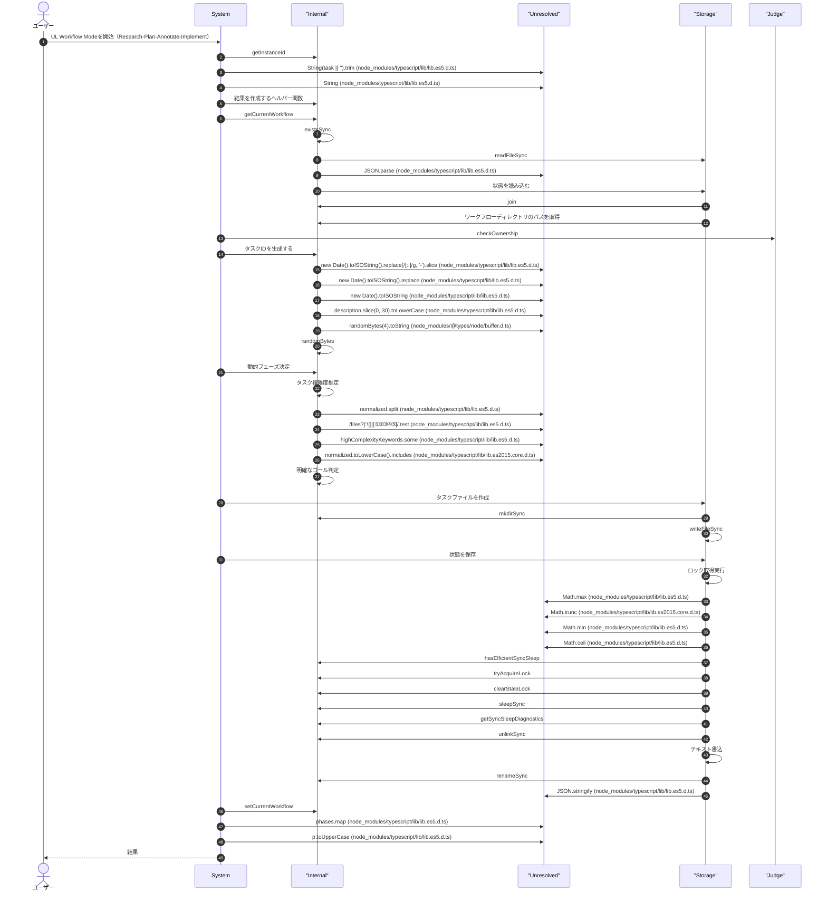
```mermaid
sequenceDiagram
  autonumber
  actor User as ユーザー
  participant System as System
  participant Internal as "Internal"
  participant Unresolved as "Unresolved"
  participant Storage as "Storage"
  participant Judge as "Judge"

  User->>System: UL Workflow Modeを開始（Research-Plan-Annotate-Implement）
  System->>Internal: getInstanceId
  System->>Unresolved: String(task || '').trim (node_modules/typescript/lib/lib.es5.d.ts)
  System->>Unresolved: String (node_modules/typescript/lib/lib.es5.d.ts)
  System->>Internal: 結果を作成するヘルパー関数
  System->>Internal: getCurrentWorkflow
  Internal->>Internal: existsSync
  Internal->>Storage: readFileSync
  Internal->>Unresolved: JSON.parse (node_modules/typescript/lib/lib.es5.d.ts)
  Internal->>Storage: 状態を読み込む
  Storage->>Internal: join
  Storage->>Internal: ワークフローディレクトリのパスを取得
  System->>Judge: checkOwnership
  System->>Internal: タスクIDを生成する
  Internal->>Unresolved: new Date().toISOString().replace(/[:.]/g, '-').slice (node_modules/typescript/lib/lib.es5.d.ts)
  Internal->>Unresolved: new Date().toISOString().replace (node_modules/typescript/lib/lib.es5.d.ts)
  Internal->>Unresolved: new Date().toISOString (node_modules/typescript/lib/lib.es5.d.ts)
  Internal->>Unresolved: description.slice(0, 30).toLowerCase (node_modules/typescript/lib/lib.es5.d.ts)
  Internal->>Unresolved: randomBytes(4).toString (node_modules/@types/node/buffer.d.ts)
  Internal->>Internal: randomBytes
  System->>Internal: 動的フェーズ決定
  Internal->>Internal: タスク複雑度推定
  Internal->>Unresolved: normalized.split (node_modules/typescript/lib/lib.es5.d.ts)
  Internal->>Unresolved: /files?[:\[]|[①②③④⑤]/.test (node_modules/typescript/lib/lib.es5.d.ts)
  Internal->>Unresolved: highComplexityKeywords.some (node_modules/typescript/lib/lib.es5.d.ts)
  Internal->>Unresolved: normalized.toLowerCase().includes (node_modules/typescript/lib/lib.es2015.core.d.ts)
  Internal->>Internal: 明確なゴール判定
  System->>Storage: タスクファイルを作成
  Storage->>Internal: mkdirSync
  Storage->>Storage: writeFileSync
  System->>Storage: 状態を保存
  Storage->>Storage: ロック取得実行
  Storage->>Unresolved: Math.max (node_modules/typescript/lib/lib.es5.d.ts)
  Storage->>Unresolved: Math.trunc (node_modules/typescript/lib/lib.es2015.core.d.ts)
  Storage->>Unresolved: Math.min (node_modules/typescript/lib/lib.es5.d.ts)
  Storage->>Unresolved: Math.ceil (node_modules/typescript/lib/lib.es5.d.ts)
  Storage->>Internal: hasEfficientSyncSleep
  Storage->>Internal: tryAcquireLock
  Storage->>Internal: clearStaleLock
  Storage->>Internal: sleepSync
  Storage->>Internal: getSyncSleepDiagnostics
  Storage->>Internal: unlinkSync
  Storage->>Storage: テキスト書込
  Storage->>Internal: renameSync
  Storage->>Unresolved: JSON.stringify (node_modules/typescript/lib/lib.es5.d.ts)
  System->>Internal: setCurrentWorkflow
  System->>Unresolved: phases.map (node_modules/typescript/lib/lib.es5.d.ts)
  System->>Unresolved: p.toUpperCase (node_modules/typescript/lib/lib.es5.d.ts)
  System-->>User: 結果

```

### ul_workflow_run

Research-Plan-Implementを自動実行。plan確認のみインタラクティブ

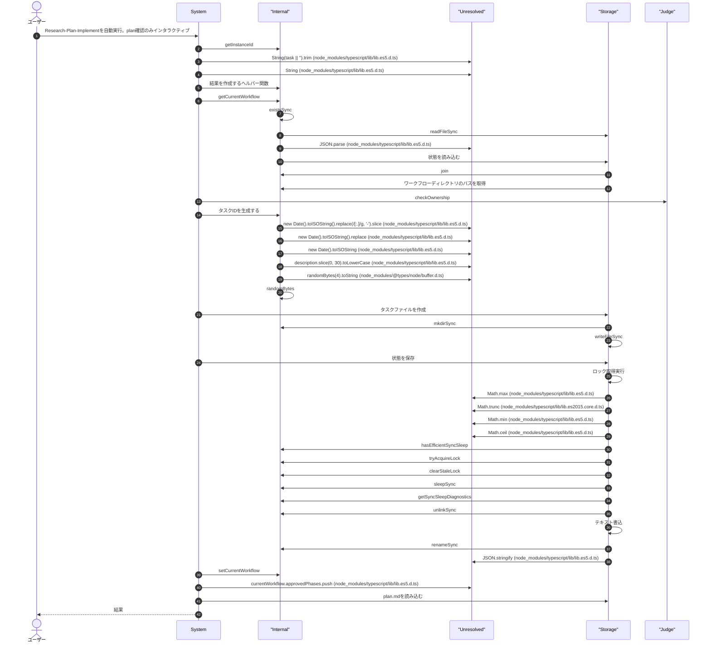
```mermaid
sequenceDiagram
  autonumber
  actor User as ユーザー
  participant System as System
  participant Internal as "Internal"
  participant Unresolved as "Unresolved"
  participant Storage as "Storage"
  participant Judge as "Judge"

  User->>System: Research-Plan-Implementを自動実行。plan確認のみインタラクティブ
  System->>Internal: getInstanceId
  System->>Unresolved: String(task || '').trim (node_modules/typescript/lib/lib.es5.d.ts)
  System->>Unresolved: String (node_modules/typescript/lib/lib.es5.d.ts)
  System->>Internal: 結果を作成するヘルパー関数
  System->>Internal: getCurrentWorkflow
  Internal->>Internal: existsSync
  Internal->>Storage: readFileSync
  Internal->>Unresolved: JSON.parse (node_modules/typescript/lib/lib.es5.d.ts)
  Internal->>Storage: 状態を読み込む
  Storage->>Internal: join
  Storage->>Internal: ワークフローディレクトリのパスを取得
  System->>Judge: checkOwnership
  System->>Internal: タスクIDを生成する
  Internal->>Unresolved: new Date().toISOString().replace(/[:.]/g, '-').slice (node_modules/typescript/lib/lib.es5.d.ts)
  Internal->>Unresolved: new Date().toISOString().replace (node_modules/typescript/lib/lib.es5.d.ts)
  Internal->>Unresolved: new Date().toISOString (node_modules/typescript/lib/lib.es5.d.ts)
  Internal->>Unresolved: description.slice(0, 30).toLowerCase (node_modules/typescript/lib/lib.es5.d.ts)
  Internal->>Unresolved: randomBytes(4).toString (node_modules/@types/node/buffer.d.ts)
  Internal->>Internal: randomBytes
  System->>Storage: タスクファイルを作成
  Storage->>Internal: mkdirSync
  Storage->>Storage: writeFileSync
  System->>Storage: 状態を保存
  Storage->>Storage: ロック取得実行
  Storage->>Unresolved: Math.max (node_modules/typescript/lib/lib.es5.d.ts)
  Storage->>Unresolved: Math.trunc (node_modules/typescript/lib/lib.es2015.core.d.ts)
  Storage->>Unresolved: Math.min (node_modules/typescript/lib/lib.es5.d.ts)
  Storage->>Unresolved: Math.ceil (node_modules/typescript/lib/lib.es5.d.ts)
  Storage->>Internal: hasEfficientSyncSleep
  Storage->>Internal: tryAcquireLock
  Storage->>Internal: clearStaleLock
  Storage->>Internal: sleepSync
  Storage->>Internal: getSyncSleepDiagnostics
  Storage->>Internal: unlinkSync
  Storage->>Storage: テキスト書込
  Storage->>Internal: renameSync
  Storage->>Unresolved: JSON.stringify (node_modules/typescript/lib/lib.es5.d.ts)
  System->>Internal: setCurrentWorkflow
  System->>Unresolved: currentWorkflow.approvedPhases.push (node_modules/typescript/lib/lib.es5.d.ts)
  System->>Storage: plan.mdを読み込む
  System-->>User: 結果

```

### ul_workflow_status

現在のワークフローステータスを表示

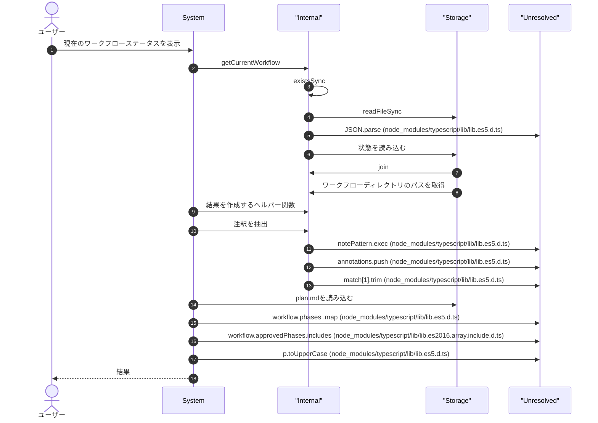
```mermaid
sequenceDiagram
  autonumber
  actor User as ユーザー
  participant System as System
  participant Internal as "Internal"
  participant Storage as "Storage"
  participant Unresolved as "Unresolved"

  User->>System: 現在のワークフローステータスを表示
  System->>Internal: getCurrentWorkflow
  Internal->>Internal: existsSync
  Internal->>Storage: readFileSync
  Internal->>Unresolved: JSON.parse (node_modules/typescript/lib/lib.es5.d.ts)
  Internal->>Storage: 状態を読み込む
  Storage->>Internal: join
  Storage->>Internal: ワークフローディレクトリのパスを取得
  System->>Internal: 結果を作成するヘルパー関数
  System->>Internal: 注釈を抽出
  Internal->>Unresolved: notePattern.exec (node_modules/typescript/lib/lib.es5.d.ts)
  Internal->>Unresolved: annotations.push (node_modules/typescript/lib/lib.es5.d.ts)
  Internal->>Unresolved: match[1].trim (node_modules/typescript/lib/lib.es5.d.ts)
  System->>Storage: plan.mdを読み込む
  System->>Unresolved: workflow.phases         .map (node_modules/typescript/lib/lib.es5.d.ts)
  System->>Unresolved: workflow.approvedPhases.includes (node_modules/typescript/lib/lib.es2016.array.include.d.ts)
  System->>Unresolved: p.toUpperCase (node_modules/typescript/lib/lib.es5.d.ts)
  System-->>User: 結果

```

### ul_workflow_approve

現在のフェーズを承認して次へ進む

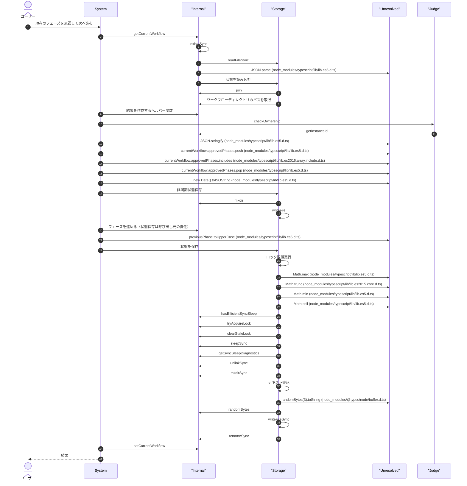
```mermaid
sequenceDiagram
  autonumber
  actor User as ユーザー
  participant System as System
  participant Internal as "Internal"
  participant Storage as "Storage"
  participant Unresolved as "Unresolved"
  participant Judge as "Judge"

  User->>System: 現在のフェーズを承認して次へ進む
  System->>Internal: getCurrentWorkflow
  Internal->>Internal: existsSync
  Internal->>Storage: readFileSync
  Internal->>Unresolved: JSON.parse (node_modules/typescript/lib/lib.es5.d.ts)
  Internal->>Storage: 状態を読み込む
  Storage->>Internal: join
  Storage->>Internal: ワークフローディレクトリのパスを取得
  System->>Internal: 結果を作成するヘルパー関数
  System->>Judge: checkOwnership
  Judge->>Internal: getInstanceId
  System->>Unresolved: JSON.stringify (node_modules/typescript/lib/lib.es5.d.ts)
  System->>Unresolved: currentWorkflow.approvedPhases.push (node_modules/typescript/lib/lib.es5.d.ts)
  System->>Unresolved: currentWorkflow.approvedPhases.includes (node_modules/typescript/lib/lib.es2016.array.include.d.ts)
  System->>Unresolved: currentWorkflow.approvedPhases.pop (node_modules/typescript/lib/lib.es5.d.ts)
  System->>Unresolved: new Date().toISOString (node_modules/typescript/lib/lib.es5.d.ts)
  System->>Storage: 非同期状態保存
  Storage->>Internal: mkdir
  Storage->>Storage: writeFile
  System->>Internal: フェーズを進める（状態保存は呼び出し元の責任）
  System->>Unresolved: previousPhase.toUpperCase (node_modules/typescript/lib/lib.es5.d.ts)
  System->>Storage: 状態を保存
  Storage->>Storage: ロック取得実行
  Storage->>Unresolved: Math.max (node_modules/typescript/lib/lib.es5.d.ts)
  Storage->>Unresolved: Math.trunc (node_modules/typescript/lib/lib.es2015.core.d.ts)
  Storage->>Unresolved: Math.min (node_modules/typescript/lib/lib.es5.d.ts)
  Storage->>Unresolved: Math.ceil (node_modules/typescript/lib/lib.es5.d.ts)
  Storage->>Internal: hasEfficientSyncSleep
  Storage->>Internal: tryAcquireLock
  Storage->>Internal: clearStaleLock
  Storage->>Internal: sleepSync
  Storage->>Internal: getSyncSleepDiagnostics
  Storage->>Internal: unlinkSync
  Storage->>Internal: mkdirSync
  Storage->>Storage: テキスト書込
  Storage->>Unresolved: randomBytes(3).toString (node_modules/@types/node/buffer.d.ts)
  Storage->>Internal: randomBytes
  Storage->>Storage: writeFileSync
  Storage->>Internal: renameSync
  System->>Internal: setCurrentWorkflow
  System-->>User: 結果

```

### ul_workflow_annotate

plan.mdの注釈を検出・適用

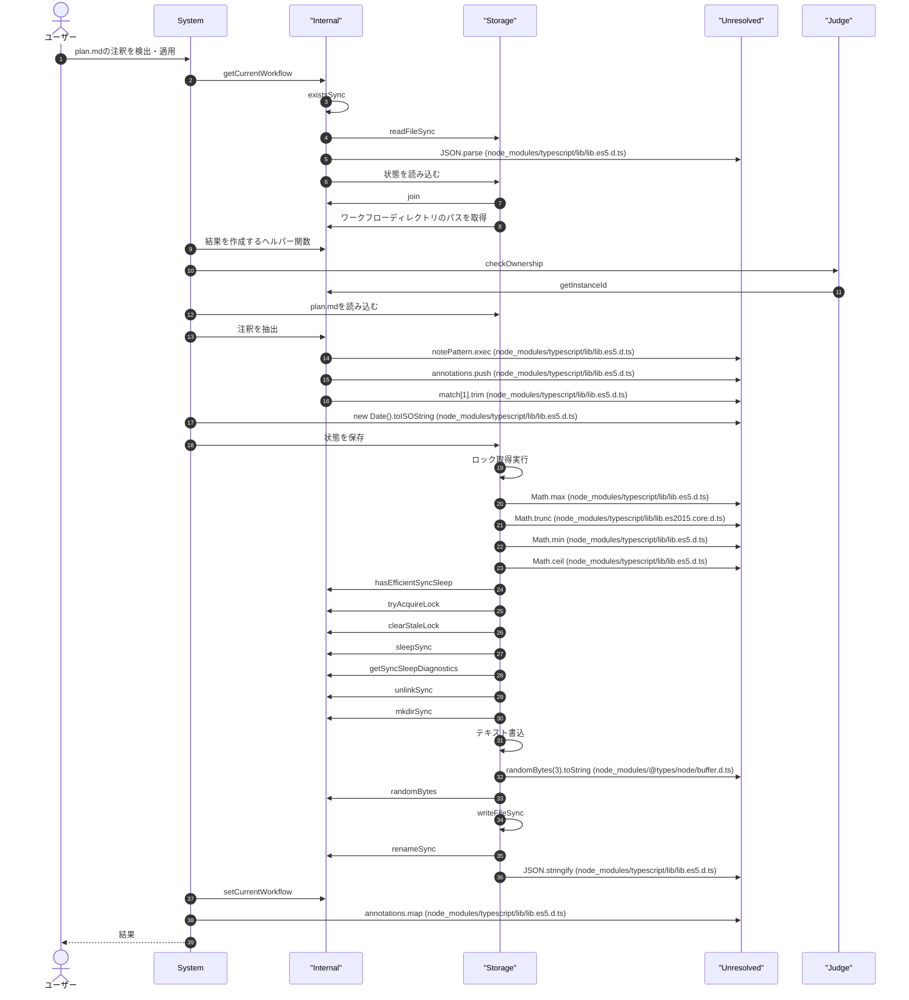
```mermaid
sequenceDiagram
  autonumber
  actor User as ユーザー
  participant System as System
  participant Internal as "Internal"
  participant Storage as "Storage"
  participant Unresolved as "Unresolved"
  participant Judge as "Judge"

  User->>System: plan.mdの注釈を検出・適用
  System->>Internal: getCurrentWorkflow
  Internal->>Internal: existsSync
  Internal->>Storage: readFileSync
  Internal->>Unresolved: JSON.parse (node_modules/typescript/lib/lib.es5.d.ts)
  Internal->>Storage: 状態を読み込む
  Storage->>Internal: join
  Storage->>Internal: ワークフローディレクトリのパスを取得
  System->>Internal: 結果を作成するヘルパー関数
  System->>Judge: checkOwnership
  Judge->>Internal: getInstanceId
  System->>Storage: plan.mdを読み込む
  System->>Internal: 注釈を抽出
  Internal->>Unresolved: notePattern.exec (node_modules/typescript/lib/lib.es5.d.ts)
  Internal->>Unresolved: annotations.push (node_modules/typescript/lib/lib.es5.d.ts)
  Internal->>Unresolved: match[1].trim (node_modules/typescript/lib/lib.es5.d.ts)
  System->>Unresolved: new Date().toISOString (node_modules/typescript/lib/lib.es5.d.ts)
  System->>Storage: 状態を保存
  Storage->>Storage: ロック取得実行
  Storage->>Unresolved: Math.max (node_modules/typescript/lib/lib.es5.d.ts)
  Storage->>Unresolved: Math.trunc (node_modules/typescript/lib/lib.es2015.core.d.ts)
  Storage->>Unresolved: Math.min (node_modules/typescript/lib/lib.es5.d.ts)
  Storage->>Unresolved: Math.ceil (node_modules/typescript/lib/lib.es5.d.ts)
  Storage->>Internal: hasEfficientSyncSleep
  Storage->>Internal: tryAcquireLock
  Storage->>Internal: clearStaleLock
  Storage->>Internal: sleepSync
  Storage->>Internal: getSyncSleepDiagnostics
  Storage->>Internal: unlinkSync
  Storage->>Internal: mkdirSync
  Storage->>Storage: テキスト書込
  Storage->>Unresolved: randomBytes(3).toString (node_modules/@types/node/buffer.d.ts)
  Storage->>Internal: randomBytes
  Storage->>Storage: writeFileSync
  Storage->>Internal: renameSync
  Storage->>Unresolved: JSON.stringify (node_modules/typescript/lib/lib.es5.d.ts)
  System->>Internal: setCurrentWorkflow
  System->>Unresolved: annotations.map (node_modules/typescript/lib/lib.es5.d.ts)
  System-->>User: 結果

```

### ul_workflow_confirm_plan

plan.mdを表示して実行の確認を求める

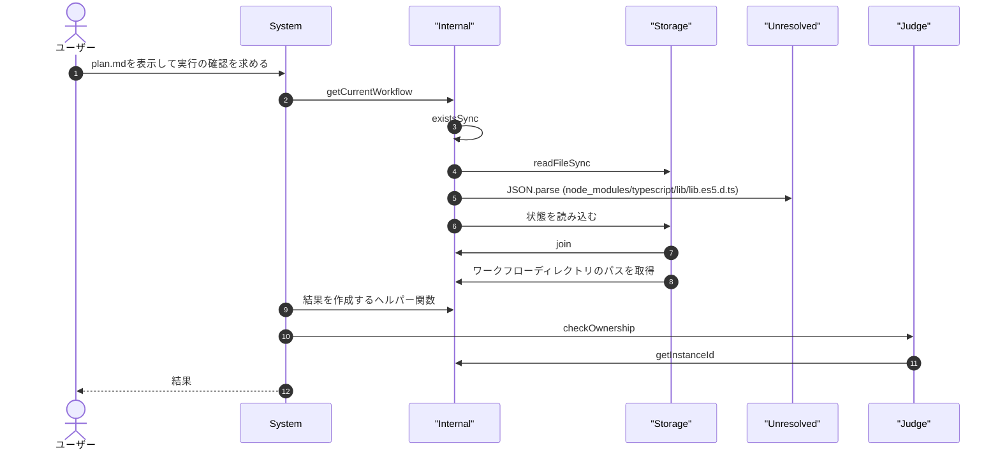
```mermaid
sequenceDiagram
  autonumber
  actor User as ユーザー
  participant System as System
  participant Internal as "Internal"
  participant Storage as "Storage"
  participant Unresolved as "Unresolved"
  participant Judge as "Judge"

  User->>System: plan.mdを表示して実行の確認を求める
  System->>Internal: getCurrentWorkflow
  Internal->>Internal: existsSync
  Internal->>Storage: readFileSync
  Internal->>Unresolved: JSON.parse (node_modules/typescript/lib/lib.es5.d.ts)
  Internal->>Storage: 状態を読み込む
  Storage->>Internal: join
  Storage->>Internal: ワークフローディレクトリのパスを取得
  System->>Internal: 結果を作成するヘルパー関数
  System->>Judge: checkOwnership
  Judge->>Internal: getInstanceId
  System-->>User: 結果

```

### ul_workflow_execute_plan

plan.mdに基づいて実装フェーズを実行

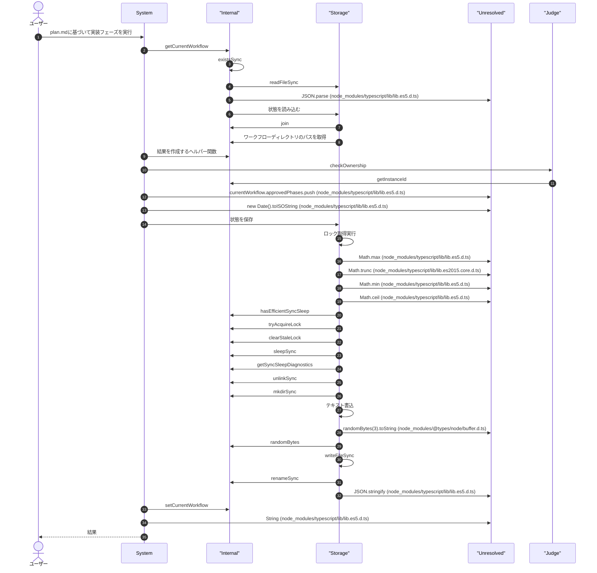
```mermaid
sequenceDiagram
  autonumber
  actor User as ユーザー
  participant System as System
  participant Internal as "Internal"
  participant Storage as "Storage"
  participant Unresolved as "Unresolved"
  participant Judge as "Judge"

  User->>System: plan.mdに基づいて実装フェーズを実行
  System->>Internal: getCurrentWorkflow
  Internal->>Internal: existsSync
  Internal->>Storage: readFileSync
  Internal->>Unresolved: JSON.parse (node_modules/typescript/lib/lib.es5.d.ts)
  Internal->>Storage: 状態を読み込む
  Storage->>Internal: join
  Storage->>Internal: ワークフローディレクトリのパスを取得
  System->>Internal: 結果を作成するヘルパー関数
  System->>Judge: checkOwnership
  Judge->>Internal: getInstanceId
  System->>Unresolved: currentWorkflow.approvedPhases.push (node_modules/typescript/lib/lib.es5.d.ts)
  System->>Unresolved: new Date().toISOString (node_modules/typescript/lib/lib.es5.d.ts)
  System->>Storage: 状態を保存
  Storage->>Storage: ロック取得実行
  Storage->>Unresolved: Math.max (node_modules/typescript/lib/lib.es5.d.ts)
  Storage->>Unresolved: Math.trunc (node_modules/typescript/lib/lib.es2015.core.d.ts)
  Storage->>Unresolved: Math.min (node_modules/typescript/lib/lib.es5.d.ts)
  Storage->>Unresolved: Math.ceil (node_modules/typescript/lib/lib.es5.d.ts)
  Storage->>Internal: hasEfficientSyncSleep
  Storage->>Internal: tryAcquireLock
  Storage->>Internal: clearStaleLock
  Storage->>Internal: sleepSync
  Storage->>Internal: getSyncSleepDiagnostics
  Storage->>Internal: unlinkSync
  Storage->>Internal: mkdirSync
  Storage->>Storage: テキスト書込
  Storage->>Unresolved: randomBytes(3).toString (node_modules/@types/node/buffer.d.ts)
  Storage->>Internal: randomBytes
  Storage->>Storage: writeFileSync
  Storage->>Internal: renameSync
  Storage->>Unresolved: JSON.stringify (node_modules/typescript/lib/lib.es5.d.ts)
  System->>Internal: setCurrentWorkflow
  System->>Unresolved: String (node_modules/typescript/lib/lib.es5.d.ts)
  System-->>User: 結果

```

### ul_workflow_modify_plan

plan.mdを修正する

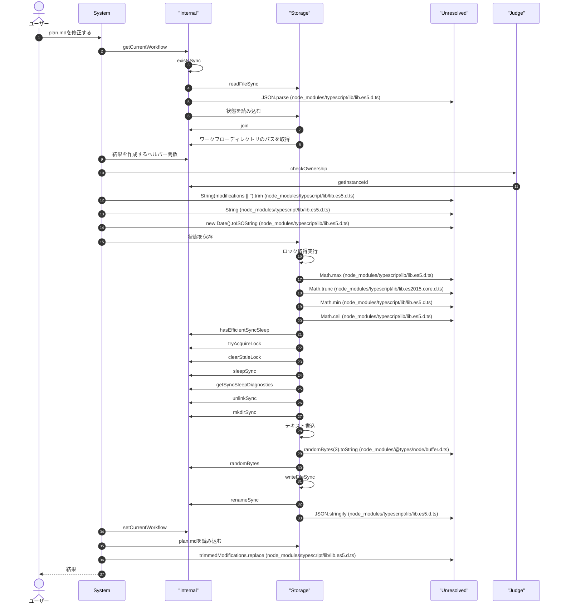
```mermaid
sequenceDiagram
  autonumber
  actor User as ユーザー
  participant System as System
  participant Internal as "Internal"
  participant Storage as "Storage"
  participant Unresolved as "Unresolved"
  participant Judge as "Judge"

  User->>System: plan.mdを修正する
  System->>Internal: getCurrentWorkflow
  Internal->>Internal: existsSync
  Internal->>Storage: readFileSync
  Internal->>Unresolved: JSON.parse (node_modules/typescript/lib/lib.es5.d.ts)
  Internal->>Storage: 状態を読み込む
  Storage->>Internal: join
  Storage->>Internal: ワークフローディレクトリのパスを取得
  System->>Internal: 結果を作成するヘルパー関数
  System->>Judge: checkOwnership
  Judge->>Internal: getInstanceId
  System->>Unresolved: String(modifications || '').trim (node_modules/typescript/lib/lib.es5.d.ts)
  System->>Unresolved: String (node_modules/typescript/lib/lib.es5.d.ts)
  System->>Unresolved: new Date().toISOString (node_modules/typescript/lib/lib.es5.d.ts)
  System->>Storage: 状態を保存
  Storage->>Storage: ロック取得実行
  Storage->>Unresolved: Math.max (node_modules/typescript/lib/lib.es5.d.ts)
  Storage->>Unresolved: Math.trunc (node_modules/typescript/lib/lib.es2015.core.d.ts)
  Storage->>Unresolved: Math.min (node_modules/typescript/lib/lib.es5.d.ts)
  Storage->>Unresolved: Math.ceil (node_modules/typescript/lib/lib.es5.d.ts)
  Storage->>Internal: hasEfficientSyncSleep
  Storage->>Internal: tryAcquireLock
  Storage->>Internal: clearStaleLock
  Storage->>Internal: sleepSync
  Storage->>Internal: getSyncSleepDiagnostics
  Storage->>Internal: unlinkSync
  Storage->>Internal: mkdirSync
  Storage->>Storage: テキスト書込
  Storage->>Unresolved: randomBytes(3).toString (node_modules/@types/node/buffer.d.ts)
  Storage->>Internal: randomBytes
  Storage->>Storage: writeFileSync
  Storage->>Internal: renameSync
  Storage->>Unresolved: JSON.stringify (node_modules/typescript/lib/lib.es5.d.ts)
  System->>Internal: setCurrentWorkflow
  System->>Storage: plan.mdを読み込む
  System->>Unresolved: trimmedModifications.replace (node_modules/typescript/lib/lib.es5.d.ts)
  System-->>User: 結果

```

### ul_workflow_abort

ワークフローを中止

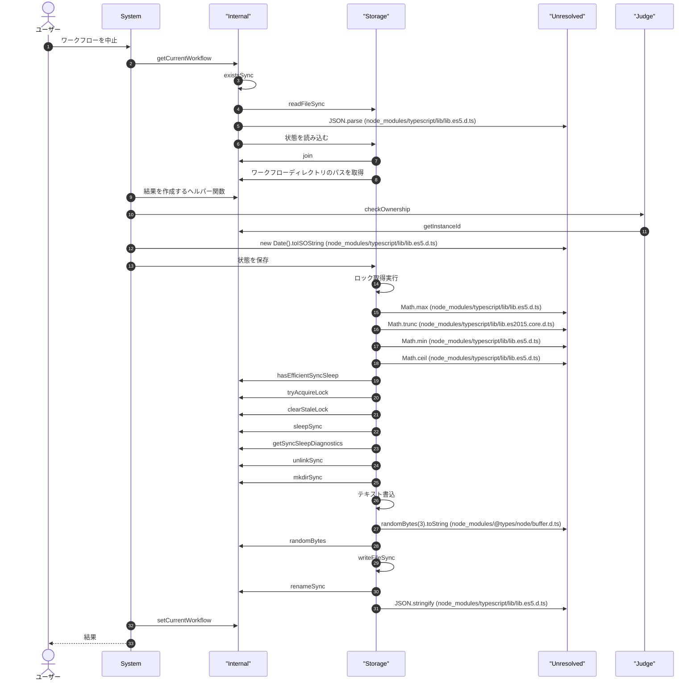
```mermaid
sequenceDiagram
  autonumber
  actor User as ユーザー
  participant System as System
  participant Internal as "Internal"
  participant Storage as "Storage"
  participant Unresolved as "Unresolved"
  participant Judge as "Judge"

  User->>System: ワークフローを中止
  System->>Internal: getCurrentWorkflow
  Internal->>Internal: existsSync
  Internal->>Storage: readFileSync
  Internal->>Unresolved: JSON.parse (node_modules/typescript/lib/lib.es5.d.ts)
  Internal->>Storage: 状態を読み込む
  Storage->>Internal: join
  Storage->>Internal: ワークフローディレクトリのパスを取得
  System->>Internal: 結果を作成するヘルパー関数
  System->>Judge: checkOwnership
  Judge->>Internal: getInstanceId
  System->>Unresolved: new Date().toISOString (node_modules/typescript/lib/lib.es5.d.ts)
  System->>Storage: 状態を保存
  Storage->>Storage: ロック取得実行
  Storage->>Unresolved: Math.max (node_modules/typescript/lib/lib.es5.d.ts)
  Storage->>Unresolved: Math.trunc (node_modules/typescript/lib/lib.es2015.core.d.ts)
  Storage->>Unresolved: Math.min (node_modules/typescript/lib/lib.es5.d.ts)
  Storage->>Unresolved: Math.ceil (node_modules/typescript/lib/lib.es5.d.ts)
  Storage->>Internal: hasEfficientSyncSleep
  Storage->>Internal: tryAcquireLock
  Storage->>Internal: clearStaleLock
  Storage->>Internal: sleepSync
  Storage->>Internal: getSyncSleepDiagnostics
  Storage->>Internal: unlinkSync
  Storage->>Internal: mkdirSync
  Storage->>Storage: テキスト書込
  Storage->>Unresolved: randomBytes(3).toString (node_modules/@types/node/buffer.d.ts)
  Storage->>Internal: randomBytes
  Storage->>Storage: writeFileSync
  Storage->>Internal: renameSync
  Storage->>Unresolved: JSON.stringify (node_modules/typescript/lib/lib.es5.d.ts)
  System->>Internal: setCurrentWorkflow
  System-->>User: 結果

```

### ul_workflow_resume

中止したワークフローを再開

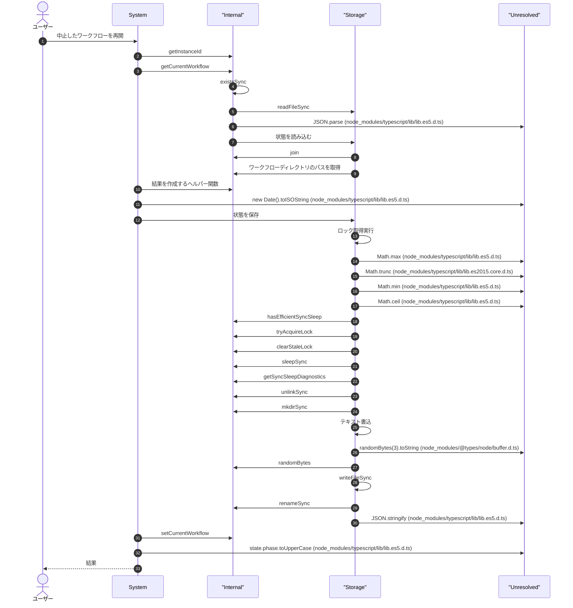
```mermaid
sequenceDiagram
  autonumber
  actor User as ユーザー
  participant System as System
  participant Internal as "Internal"
  participant Storage as "Storage"
  participant Unresolved as "Unresolved"

  User->>System: 中止したワークフローを再開
  System->>Internal: getInstanceId
  System->>Internal: getCurrentWorkflow
  Internal->>Internal: existsSync
  Internal->>Storage: readFileSync
  Internal->>Unresolved: JSON.parse (node_modules/typescript/lib/lib.es5.d.ts)
  Internal->>Storage: 状態を読み込む
  Storage->>Internal: join
  Storage->>Internal: ワークフローディレクトリのパスを取得
  System->>Internal: 結果を作成するヘルパー関数
  System->>Unresolved: new Date().toISOString (node_modules/typescript/lib/lib.es5.d.ts)
  System->>Storage: 状態を保存
  Storage->>Storage: ロック取得実行
  Storage->>Unresolved: Math.max (node_modules/typescript/lib/lib.es5.d.ts)
  Storage->>Unresolved: Math.trunc (node_modules/typescript/lib/lib.es2015.core.d.ts)
  Storage->>Unresolved: Math.min (node_modules/typescript/lib/lib.es5.d.ts)
  Storage->>Unresolved: Math.ceil (node_modules/typescript/lib/lib.es5.d.ts)
  Storage->>Internal: hasEfficientSyncSleep
  Storage->>Internal: tryAcquireLock
  Storage->>Internal: clearStaleLock
  Storage->>Internal: sleepSync
  Storage->>Internal: getSyncSleepDiagnostics
  Storage->>Internal: unlinkSync
  Storage->>Internal: mkdirSync
  Storage->>Storage: テキスト書込
  Storage->>Unresolved: randomBytes(3).toString (node_modules/@types/node/buffer.d.ts)
  Storage->>Internal: randomBytes
  Storage->>Storage: writeFileSync
  Storage->>Internal: renameSync
  Storage->>Unresolved: JSON.stringify (node_modules/typescript/lib/lib.es5.d.ts)
  System->>Internal: setCurrentWorkflow
  System->>Unresolved: state.phase.toUpperCase (node_modules/typescript/lib/lib.es5.d.ts)
  System-->>User: 結果

```

### ul_workflow_research

研究フェーズを実行（researcherへの委任指示を生成）

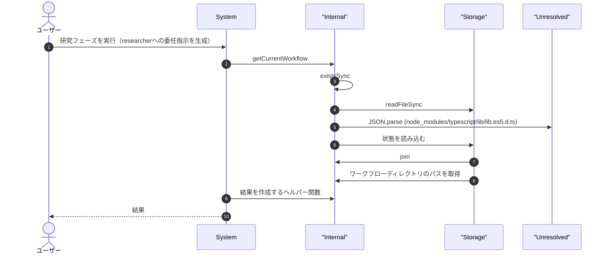
```mermaid
sequenceDiagram
  autonumber
  actor User as ユーザー
  participant System as System
  participant Internal as "Internal"
  participant Storage as "Storage"
  participant Unresolved as "Unresolved"

  User->>System: 研究フェーズを実行（researcherへの委任指示を生成）
  System->>Internal: getCurrentWorkflow
  Internal->>Internal: existsSync
  Internal->>Storage: readFileSync
  Internal->>Unresolved: JSON.parse (node_modules/typescript/lib/lib.es5.d.ts)
  Internal->>Storage: 状態を読み込む
  Storage->>Internal: join
  Storage->>Internal: ワークフローディレクトリのパスを取得
  System->>Internal: 結果を作成するヘルパー関数
  System-->>User: 結果

```

### ul_workflow_plan

計画フェーズを実行（architectへの委任指示を生成）

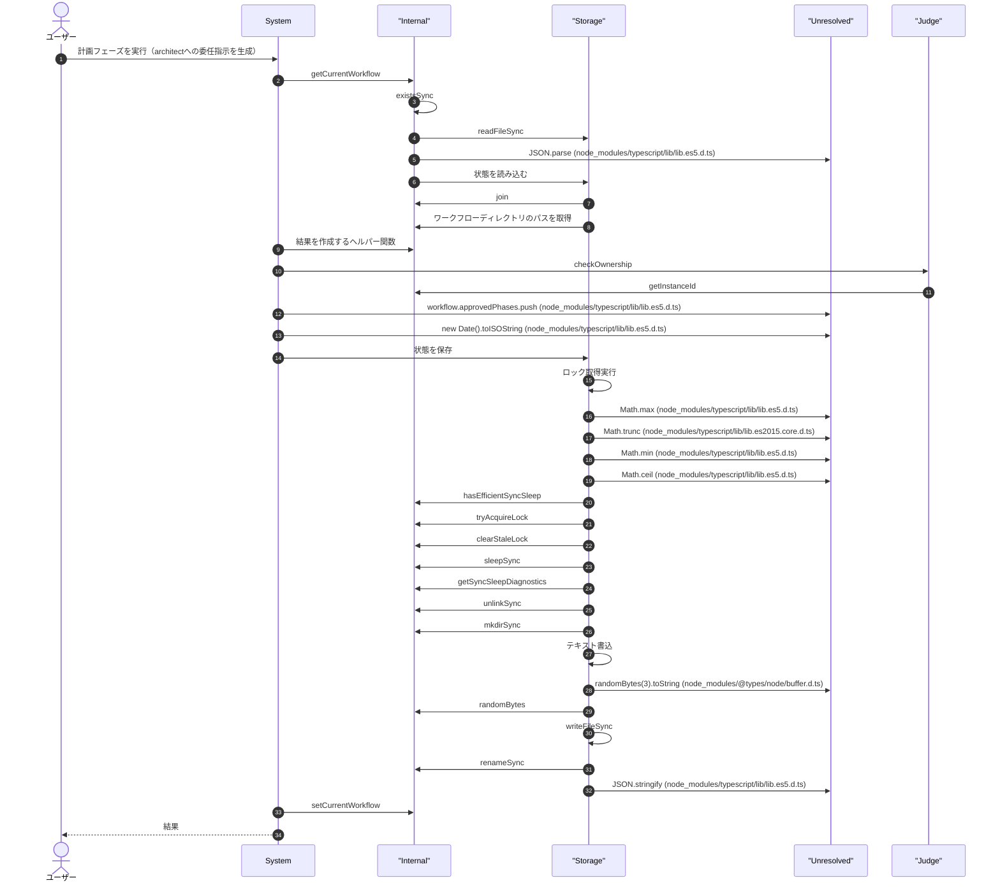
```mermaid
sequenceDiagram
  autonumber
  actor User as ユーザー
  participant System as System
  participant Internal as "Internal"
  participant Storage as "Storage"
  participant Unresolved as "Unresolved"
  participant Judge as "Judge"

  User->>System: 計画フェーズを実行（architectへの委任指示を生成）
  System->>Internal: getCurrentWorkflow
  Internal->>Internal: existsSync
  Internal->>Storage: readFileSync
  Internal->>Unresolved: JSON.parse (node_modules/typescript/lib/lib.es5.d.ts)
  Internal->>Storage: 状態を読み込む
  Storage->>Internal: join
  Storage->>Internal: ワークフローディレクトリのパスを取得
  System->>Internal: 結果を作成するヘルパー関数
  System->>Judge: checkOwnership
  Judge->>Internal: getInstanceId
  System->>Unresolved: workflow.approvedPhases.push (node_modules/typescript/lib/lib.es5.d.ts)
  System->>Unresolved: new Date().toISOString (node_modules/typescript/lib/lib.es5.d.ts)
  System->>Storage: 状態を保存
  Storage->>Storage: ロック取得実行
  Storage->>Unresolved: Math.max (node_modules/typescript/lib/lib.es5.d.ts)
  Storage->>Unresolved: Math.trunc (node_modules/typescript/lib/lib.es2015.core.d.ts)
  Storage->>Unresolved: Math.min (node_modules/typescript/lib/lib.es5.d.ts)
  Storage->>Unresolved: Math.ceil (node_modules/typescript/lib/lib.es5.d.ts)
  Storage->>Internal: hasEfficientSyncSleep
  Storage->>Internal: tryAcquireLock
  Storage->>Internal: clearStaleLock
  Storage->>Internal: sleepSync
  Storage->>Internal: getSyncSleepDiagnostics
  Storage->>Internal: unlinkSync
  Storage->>Internal: mkdirSync
  Storage->>Storage: テキスト書込
  Storage->>Unresolved: randomBytes(3).toString (node_modules/@types/node/buffer.d.ts)
  Storage->>Internal: randomBytes
  Storage->>Storage: writeFileSync
  Storage->>Internal: renameSync
  Storage->>Unresolved: JSON.stringify (node_modules/typescript/lib/lib.es5.d.ts)
  System->>Internal: setCurrentWorkflow
  System-->>User: 結果

```

### ul_workflow_implement

実装フェーズを実行（implementerへの委任指示を生成）

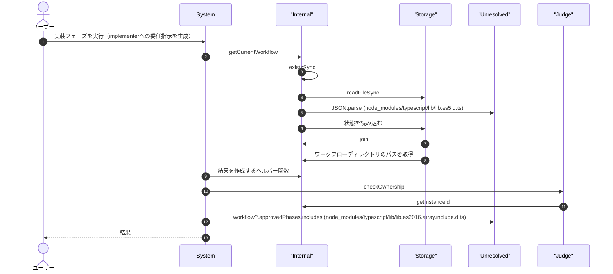
```mermaid
sequenceDiagram
  autonumber
  actor User as ユーザー
  participant System as System
  participant Internal as "Internal"
  participant Storage as "Storage"
  participant Unresolved as "Unresolved"
  participant Judge as "Judge"

  User->>System: 実装フェーズを実行（implementerへの委任指示を生成）
  System->>Internal: getCurrentWorkflow
  Internal->>Internal: existsSync
  Internal->>Storage: readFileSync
  Internal->>Unresolved: JSON.parse (node_modules/typescript/lib/lib.es5.d.ts)
  Internal->>Storage: 状態を読み込む
  Storage->>Internal: join
  Storage->>Internal: ワークフローディレクトリのパスを取得
  System->>Internal: 結果を作成するヘルパー関数
  System->>Judge: checkOwnership
  Judge->>Internal: getInstanceId
  System->>Unresolved: workflow?.approvedPhases.includes (node_modules/typescript/lib/lib.es2016.array.include.d.ts)
  System-->>User: 結果

```

## 図解

### クラス図

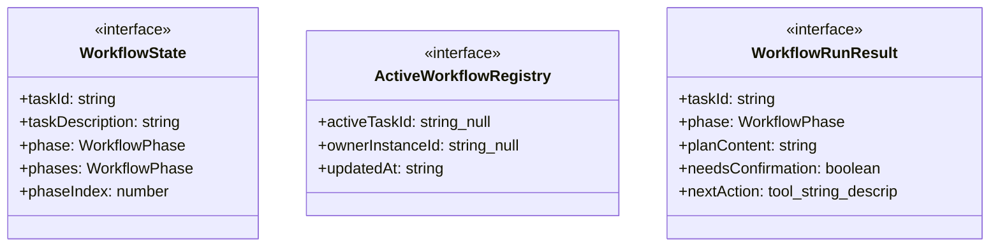
```mermaid
classDiagram
  class WorkflowState {
    <<interface>>
    +taskId: string
    +taskDescription: string
    +phase: WorkflowPhase
    +phases: WorkflowPhase
    +phaseIndex: number
  }
  class ActiveWorkflowRegistry {
    <<interface>>
    +activeTaskId: string_null
    +ownerInstanceId: string_null
    +updatedAt: string
  }
  class WorkflowRunResult {
    <<interface>>
    +taskId: string
    +phase: WorkflowPhase
    +planContent: string
    +needsConfirmation: boolean
    +nextAction: tool_string_descrip
  }
```

### 依存関係図

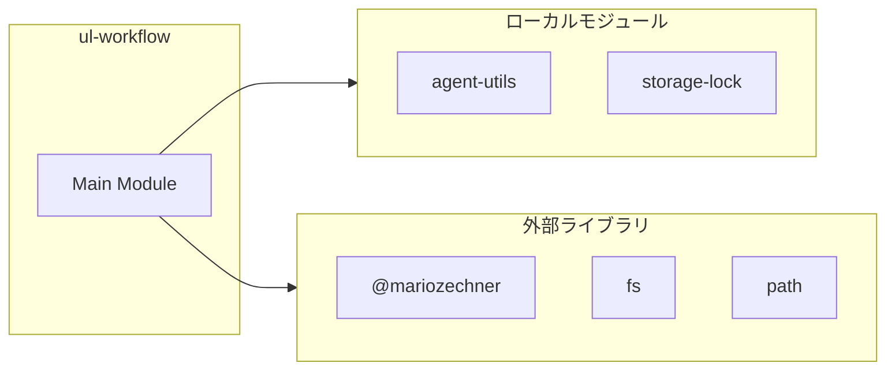
```mermaid
flowchart LR
  subgraph this[ul-workflow]
    main[Main Module]
  end
  subgraph local[ローカルモジュール]
    agent_utils["agent-utils"]
    storage_lock["storage-lock"]
  end
  main --> local
  subgraph external[外部ライブラリ]
    _mariozechner["@mariozechner"]
    _mariozechner["@mariozechner"]
    _mariozechner["@mariozechner"]
    fs["fs"]
    path["path"]
  end
  main --> external
```

### 関数フロー


```mermaid
flowchart TD
  advancePhase["advancePhase()"]
  checkOwnership["checkOwnership()"]
  createTaskFile["createTaskFile()"]
  determineWorkflowPhases["determineWorkflowPhases()"]
  extractAnnotations["extractAnnotations()"]
  generateTaskId["generateTaskId()"]
  getCurrentWorkflow["getCurrentWorkflow()"]
  getInstanceId["getInstanceId()"]
  getTaskDir["getTaskDir()"]
  loadState["loadState()"]
  looksLikeClearGoalTask["looksLikeClearGoalTask()"]
  makeResult["makeResult()"]
  readPlanFile["readPlanFile()"]
  registerUlWorkflowExtension["registerUlWorkflowExtension()"]
  saveState["saveState()"]
  saveStateAsync["saveStateAsync()"]
  setCurrentWorkflow["setCurrentWorkflow()"]
  checkOwnership --> getInstanceId
  createTaskFile --> getTaskDir
  determineWorkflowPhases --> looksLikeClearGoalTask
  getCurrentWorkflow --> loadState
  loadState --> getTaskDir
  readPlanFile --> getTaskDir
  registerUlWorkflowExtension --> advancePhase
  registerUlWorkflowExtension --> checkOwnership
  registerUlWorkflowExtension --> createTaskFile
  registerUlWorkflowExtension --> determineWorkflowPhases
  registerUlWorkflowExtension --> extractAnnotations
  registerUlWorkflowExtension --> generateTaskId
  registerUlWorkflowExtension --> getCurrentWorkflow
  registerUlWorkflowExtension --> getInstanceId
  registerUlWorkflowExtension --> getTaskDir
  registerUlWorkflowExtension --> loadState
  registerUlWorkflowExtension --> makeResult
  registerUlWorkflowExtension --> readPlanFile
  registerUlWorkflowExtension --> saveState
  registerUlWorkflowExtension --> saveStateAsync
  registerUlWorkflowExtension --> setCurrentWorkflow
  saveState --> getTaskDir
  saveStateAsync --> getTaskDir
```

### シーケンス図

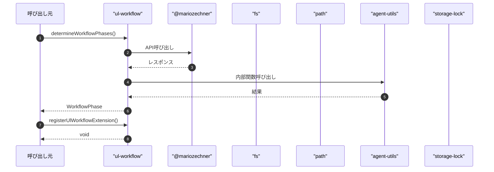
```mermaid
sequenceDiagram
  autonumber
  participant Caller as 呼び出し元
  participant ul_workflow as "ul-workflow"
  participant mariozechner as "@mariozechner"
  participant fs as "fs"
  participant path as "path"
  participant agent_utils as "agent-utils"
  participant storage_lock as "storage-lock"

  Caller->>ul_workflow: determineWorkflowPhases()
  ul_workflow->>mariozechner: API呼び出し
  mariozechner-->>ul_workflow: レスポンス
  ul_workflow->>agent_utils: 内部関数呼び出し
  agent_utils-->>ul_workflow: 結果
  ul_workflow-->>Caller: WorkflowPhase

  Caller->>ul_workflow: registerUlWorkflowExtension()
  ul_workflow-->>Caller: void
```

## 関数

### getInstanceId

```typescript
getInstanceId(): string
```

**戻り値**: `string`

### getCurrentWorkflow

```typescript
getCurrentWorkflow(): WorkflowState | null
```

**戻り値**: `WorkflowState | null`

### setCurrentWorkflow

```typescript
setCurrentWorkflow(state: WorkflowState | null): void
```

**パラメータ**

| 名前 | 型 | 必須 |
|------|-----|------|
| state | `WorkflowState | null` | はい |

**戻り値**: `void`

### checkOwnership

```typescript
checkOwnership(state: WorkflowState | null): { owned: boolean; error?: string }
```

**パラメータ**

| 名前 | 型 | 必須 |
|------|-----|------|
| state | `WorkflowState | null` | はい |

**戻り値**: `{ owned: boolean; error?: string }`

### looksLikeClearGoalTask

```typescript
looksLikeClearGoalTask(task: string): boolean
```

タスクが明確なゴールを持つかどうかを判定する
明確なゴールがある場合は、planフェーズを省略できる可能性がある

**パラメータ**

| 名前 | 型 | 必須 |
|------|-----|------|
| task | `string` | はい |

**戻り値**: `boolean`

### determineWorkflowPhases

```typescript
determineWorkflowPhases(task: string): WorkflowPhase[]
```

タスク規模に基づいてフェーズ構成を決定する
小規模タスクはフェーズを削減し、大規模タスクは全フェーズを実行

**パラメータ**

| 名前 | 型 | 必須 |
|------|-----|------|
| task | `string` | はい |

**戻り値**: `WorkflowPhase[]`

### generateSubagentInstructionSimple

```typescript
generateSubagentInstructionSimple(subagentId: string, task: string, outputPath: string): string
```

サブエージェント委任指示を生成するヘルパー（簡潔版）

**パラメータ**

| 名前 | 型 | 必須 |
|------|-----|------|
| subagentId | `string` | はい |
| task | `string` | はい |
| outputPath | `string` | はい |

**戻り値**: `string`

### generateTaskId

```typescript
generateTaskId(description: string): string
```

タスクIDを生成する
BUG-003 FIX: ランダムサフィックス追加で衝突回避

**パラメータ**

| 名前 | 型 | 必須 |
|------|-----|------|
| description | `string` | はい |

**戻り値**: `string`

### getTaskDir

```typescript
getTaskDir(taskId: string): string
```

ワークフローディレクトリのパスを取得

**パラメータ**

| 名前 | 型 | 必須 |
|------|-----|------|
| taskId | `string` | はい |

**戻り値**: `string`

### saveState

```typescript
saveState(state: WorkflowState): void
```

状態を保存

**パラメータ**

| 名前 | 型 | 必須 |
|------|-----|------|
| state | `WorkflowState` | はい |

**戻り値**: `void`

### saveStateAsync

```typescript
async saveStateAsync(state: WorkflowState): Promise<void>
```

状態を非同期で保存する
大量のタスクがある場合のI/Oボトルネック削減とメインスレッドのブロック回避

**パラメータ**

| 名前 | 型 | 必須 |
|------|-----|------|
| state | `WorkflowState` | はい |

**戻り値**: `Promise<void>`

### loadState

```typescript
loadState(taskId: string): WorkflowState | null
```

状態を読み込む

**パラメータ**

| 名前 | 型 | 必須 |
|------|-----|------|
| taskId | `string` | はい |

**戻り値**: `WorkflowState | null`

### loadStateAsync

```typescript
async loadStateAsync(taskId: string): Promise<WorkflowState | null>
```

状態を非同期で読み込む

**パラメータ**

| 名前 | 型 | 必須 |
|------|-----|------|
| taskId | `string` | はい |

**戻り値**: `Promise<WorkflowState | null>`

### createTaskFile

```typescript
createTaskFile(taskId: string, description: string): void
```

タスクファイルを作成

**パラメータ**

| 名前 | 型 | 必須 |
|------|-----|------|
| taskId | `string` | はい |
| description | `string` | はい |

**戻り値**: `void`

### extractAnnotations

```typescript
extractAnnotations(content: string): string[]
```

注釈を抽出

**パラメータ**

| 名前 | 型 | 必須 |
|------|-----|------|
| content | `string` | はい |

**戻り値**: `string[]`

### readPlanFile

```typescript
readPlanFile(taskId: string): string
```

plan.mdを読み込む

**パラメータ**

| 名前 | 型 | 必須 |
|------|-----|------|
| taskId | `string` | はい |

**戻り値**: `string`

### advancePhase

```typescript
advancePhase(state: WorkflowState): WorkflowPhase
```

フェーズを進める（状態保存は呼び出し元の責任）
BUG-002 FIX: saveState() 呼び出しを削除

**パラメータ**

| 名前 | 型 | 必須 |
|------|-----|------|
| state | `WorkflowState` | はい |

**戻り値**: `WorkflowPhase`

### makeResult

```typescript
makeResult(text: string, details: Record<string, unknown>): AgentToolResult<unknown>
```

結果を作成するヘルパー関数

**パラメータ**

| 名前 | 型 | 必須 |
|------|-----|------|
| text | `string` | はい |
| details | `Record<string, unknown>` | はい |

**戻り値**: `AgentToolResult<unknown>`

### makeResultWithQuestion

```typescript
makeResultWithQuestion(text: string, questionData: {
    question: string;
    header: string;
    options: Array<{ label: string; description: string }>;
  }, details: Record<string, unknown>): AgentToolResult<unknown>
```

ユーザー確認が必要な結果を作成するヘルパー関数

**パラメータ**

| 名前 | 型 | 必須 |
|------|-----|------|
| text | `string` | はい |
| questionData | `object` | はい |
| &nbsp;&nbsp;↳ question | `string` | はい |
| &nbsp;&nbsp;↳ header | `string` | はい |
| &nbsp;&nbsp;↳ options | `Array<{ label: string; description: string }>` | はい |
| details | `Record<string, unknown>` | はい |

**戻り値**: `AgentToolResult<unknown>`

### registerUlWorkflowExtension

```typescript
registerUlWorkflowExtension(pi: ExtensionAPI): void
```

拡張機能を登録

**パラメータ**

| 名前 | 型 | 必須 |
|------|-----|------|
| pi | `ExtensionAPI` | はい |

**戻り値**: `void`

## インターフェース

### WorkflowState

```typescript
interface WorkflowState {
  taskId: string;
  taskDescription: string;
  phase: WorkflowPhase;
  phases: WorkflowPhase[];
  phaseIndex: number;
  createdAt: string;
  updatedAt: string;
  approvedPhases: string[];
  annotationCount: number;
  ownerInstanceId: string;
}
```

### ActiveWorkflowRegistry

```typescript
interface ActiveWorkflowRegistry {
  activeTaskId: string | null;
  ownerInstanceId: string | null;
  updatedAt: string;
}
```

### WorkflowRunResult

```typescript
interface WorkflowRunResult {
  taskId: string;
  phase: WorkflowPhase;
  planContent?: string;
  needsConfirmation: boolean;
  nextAction?: {
    tool: string;
    description: string;
  };
}
```

WorkflowRunResult - ul_workflow_runの実行結果

## 型定義

### WorkflowPhase

```typescript
type WorkflowPhase = "idle" | "research" | "plan" | "annotate" | "implement" | "completed" | "aborted"
```

---
*自動生成: 2026-02-24T17:08:02.580Z*
