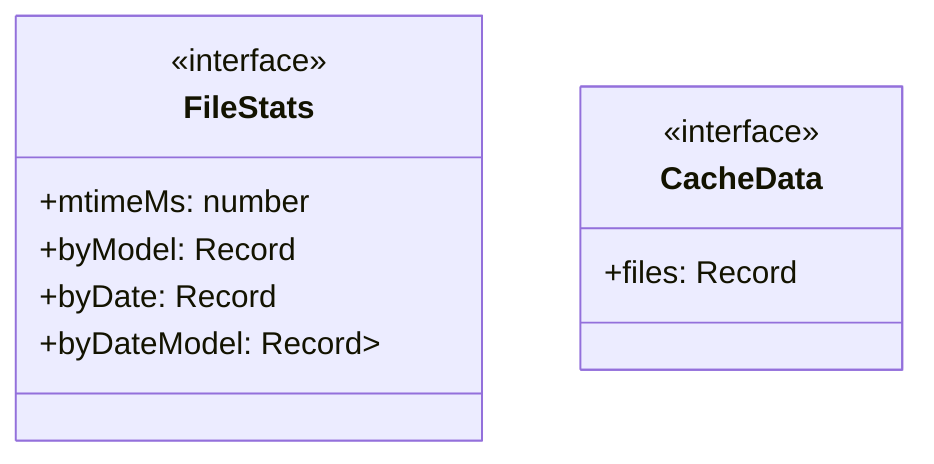

# usage-tracker

## 概要

`usage-tracker` モジュールのAPIリファレンス。

## インポート

```typescript
import { existsSync, mkdirSync, readdirSync... } from 'node:fs';
import { homedir } from 'node:os';
import { join, dirname } from 'node:path';
import { ExtensionAPI } from '@mariozechner/pi-coding-agent';
import { getLogger } from '../lib/comprehensive-logger';
// ... and 1 more imports
```

## エクスポート一覧

| 種別 | 名前 | 説明 |
|------|------|------|

## 図解

### クラス図



### 依存関係図

```mermaid
flowchart LR
  subgraph this[usage-tracker]
    main[Main Module]
  end
  subgraph local[ローカルモジュール]
    comprehensive_logger[comprehensive-logger]
    comprehensive_logger_types[comprehensive-logger-types]
  end
  main --> local
  subgraph external[外部ライブラリ]
    _mariozechner[@mariozechner]
  end
  main --> external
```

## 関数

### ensureCacheDir

```typescript
ensureCacheDir(): void
```

**戻り値**: `void`

### loadCache

```typescript
loadCache(): CacheData | null
```

**戻り値**: `CacheData | null`

### saveCache

```typescript
saveCache(data: CacheData): void
```

**パラメータ**

| 名前 | 型 | 必須 |
|------|-----|------|
| data | `CacheData` | はい |

**戻り値**: `void`

### mergeRecordToMap

```typescript
mergeRecordToMap(target: Map<string, number>, source: Record<string, number>): void
```

**パラメータ**

| 名前 | 型 | 必須 |
|------|-----|------|
| target | `Map<string, number>` | はい |
| source | `Record<string, number>` | はい |

**戻り値**: `void`

### parseUsageFile

```typescript
parseUsageFile(filePath: string): {
	byModel: Record<string, number>;
	byDate: Record<string, number>;
	byDateModel: Record<string, Record<string, number>>;
}
```

**パラメータ**

| 名前 | 型 | 必須 |
|------|-----|------|
| filePath | `string` | はい |

**戻り値**: `{
	byModel: Record<string, number>;
	byDate: Record<string, number>;
	byDateModel: Record<string, Record<string, number>>;
}`

### collectData

```typescript
collectData(): {
	byModel: Map<string, number>;
	byDate: Map<string, number>;
	byDateModel: Map<string, Map<string, number>>;
}
```

**戻り値**: `{
	byModel: Map<string, number>;
	byDate: Map<string, number>;
	byDateModel: Map<string, Map<string, number>>;
}`

### getRangeKeys

```typescript
getRangeKeys(byDate: Map<string, number>, weeksCount: number): string[]
```

**パラメータ**

| 名前 | 型 | 必須 |
|------|-----|------|
| byDate | `Map<string, number>` | はい |
| weeksCount | `number` | はい |

**戻り値**: `string[]`

### summarizeRange

```typescript
summarizeRange(byDate: Map<string, number>, byDateModel: Map<string, Map<string, number>>, weeksCount: number): { total: number; byModel: Map<string, number> }
```

**パラメータ**

| 名前 | 型 | 必須 |
|------|-----|------|
| byDate | `Map<string, number>` | はい |
| byDateModel | `Map<string, Map<string, number>>` | はい |
| weeksCount | `number` | はい |

**戻り値**: `{ total: number; byModel: Map<string, number> }`

### formatCost

```typescript
formatCost(n: number): string
```

**パラメータ**

| 名前 | 型 | 必須 |
|------|-----|------|
| n | `number` | はい |

**戻り値**: `string`

### drawHeatmap

```typescript
drawHeatmap(byDate: Map<string, number>, weeksCount: number, theme: any): { lines: string[]; rangeLine: string; legendLine: string }
```

**パラメータ**

| 名前 | 型 | 必須 |
|------|-----|------|
| byDate | `Map<string, number>` | はい |
| weeksCount | `number` | はい |
| theme | `any` | はい |

**戻り値**: `{ lines: string[]; rangeLine: string; legendLine: string }`

### add

```typescript
add(s: string): void
```

**パラメータ**

| 名前 | 型 | 必須 |
|------|-----|------|
| s | `string` | はい |

**戻り値**: `void`

## インターフェース

### FileStats

```typescript
interface FileStats {
  mtimeMs: number;
  byModel: Record<string, number>;
  byDate: Record<string, number>;
  byDateModel: Record<string, Record<string, number>>;
}
```

### CacheData

```typescript
interface CacheData {
  files: Record<string, FileStats>;
}
```

---
*自動生成: 2026-02-17T22:16:16.596Z*
