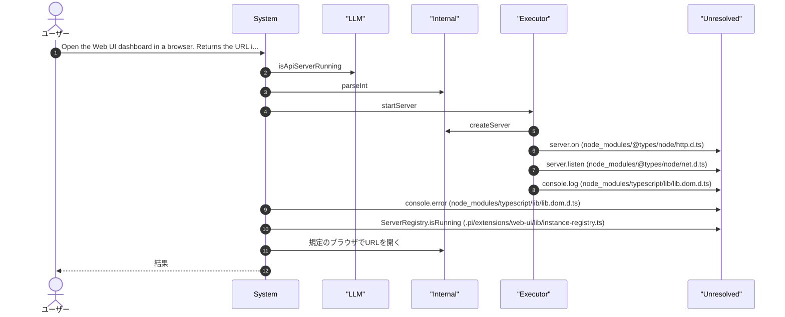
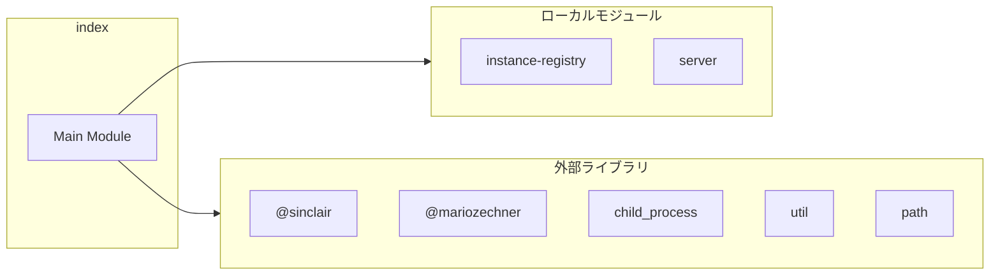
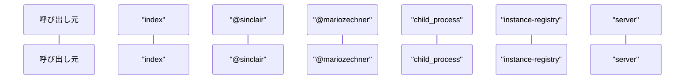

# index

## 概要

`index` モジュールのAPIリファレンス。

## インポート

```typescript
// from '@sinclair/typebox': Type
// from '@mariozechner/pi-coding-agent': ExtensionAPI
// from 'child_process': exec, spawn, ChildProcess
// from 'util': promisify
// from 'path': join
// ... and 2 more imports
```

## エクスポート一覧

| 種別 | 名前 | 説明 |
|------|------|------|

## ユーザーフロー

このモジュールが提供するツールと、その実行フローを示します。

### open_web_ui

Open the Web UI dashboard in a browser. Returns the URL if server is running.



## 図解

### 依存関係図



### シーケンス図



## 関数

### startStandaloneServerProcess

```typescript
startStandaloneServerProcess(port: number): ChildProcess | null
```

スタンドアロンサーバーをdetached子プロセスとして起動

**パラメータ**

| 名前 | 型 | 必須 |
|------|-----|------|
| port | `number` | はい |

**戻り値**: `ChildProcess | null`

### stopStandaloneServerProcess

```typescript
stopStandaloneServerProcess(): void
```

スタンドアロンサーバーを停止（SIGTERMを送信）

**戻り値**: `void`

### openBrowser

```typescript
async openBrowser(url: string): Promise<boolean>
```

規定のブラウザでURLを開く

**パラメータ**

| 名前 | 型 | 必須 |
|------|-----|------|
| url | `string` | はい |

**戻り値**: `Promise<boolean>`

### getServerUrl

```typescript
getServerUrl(): string
```

サーバーのURLを取得する

**戻り値**: `string`

### ensureRegistered

```typescript
ensureRegistered(modelId?: string): void
```

**パラメータ**

| 名前 | 型 | 必須 |
|------|-----|------|
| modelId | `string` | いいえ |

**戻り値**: `void`

### ensureUnregistered

```typescript
ensureUnregistered(): void
```

**戻り値**: `void`

---
*自動生成: 2026-02-28T13:55:23.044Z*
