# instance-registry

## 概要

`instance-registry` モジュールのAPIリファレンス。

## インポート

```typescript
// from 'os': homedir
// from 'path': join
// from 'fs': mkdirSync, existsSync, readFileSync, ...
// from 'child_process': spawn
```

## エクスポート一覧

| 種別 | 名前 | 説明 |
|------|------|------|
| 関数 | `createChildProcessStorage` | - |
| クラス | `InstanceRegistry` | Instance Registry - manages pi instance registrati |
| クラス | `ServerRegistry` | Server Registry - manages web server state |
| クラス | `ThemeStorage` | Theme Storage - manages global theme settings |
| クラス | `ContextHistoryStorage` | - |
| インターフェース | `InstanceInfo` | Instance information stored in registry |
| インターフェース | `ServerInfo` | Web server information |
| インターフェース | `ThemeSettings` | Global theme settings |
| インターフェース | `ContextHistoryEntry` | - |
| インターフェース | `InstanceContextHistory` | - |
| インターフェース | `ContextHistoryStorageOptions` | - |
| 型 | `ContextEntry` | - |

## 図解

### クラス図

```mermaid
classDiagram
  class FileLock {
    -locked: any
    +acquire()
    +release()
    +withLock()
  }
  class InstanceRegistry {
    -pid: number
    -cwd: string
    -model: string
    -heartbeatInterval: ReturnType_typeofset
    +setModel()
    +register()
    -updateHeartbeat()
    +unregister()
    +getAll()
  }
  class ServerRegistry {
    +isRunning()
    +register()
    +unregister()
  }
  class ThemeStorage {
    +get()
    +set()
  }
  class ContextHistoryStorage {
    -buffer: ContextHistoryEntry
    -pid: number
    -maxBufferSize: number
    -flushIntervalMs: number
    -isChildProcess: boolean
    -startFlushTimer()
    +add()
    +getPid()
    +flush()
    +dispose()
  }
  class InstanceInfo {
    <<interface>>
    +pid: number
    +startedAt: number
    +cwd: string
    +model: string
    +lastHeartbeat: number
  }
  class ServerInfo {
    <<interface>>
    +pid: number
    +port: number
    +startedAt: number
  }
  class ThemeSettings {
    <<interface>>
    +themeId: string
    +mode: light_dark
  }
  class ContextHistoryEntry {
    <<interface>>
    +timestamp: string
    +input: number
    +output: number
    +pid: number
  }
  class InstanceContextHistory {
    <<interface>>
    +pid: number
    +cwd: string
    +model: string
    +history: ContextHistoryEntry
  }
  class ContextHistoryStorageOptions {
    <<interface>>
    +maxBufferSize: number
    +flushIntervalMs: number
    +isChildProcess: boolean
  }
```



### 依存関係図


## 関数

### ensureSharedDir

```typescript
ensureSharedDir(): void
```

Ensure shared directory exists

**戻り値**: `void`

### readJsonFile

```typescript
readJsonFile(path: string, defaultValue: T): T
```

Read JSON file safely

**パラメータ**

| 名前 | 型 | 必須 |
|------|-----|------|
| path | `string` | はい |
| defaultValue | `T` | はい |

**戻り値**: `T`

### writeJsonFile

```typescript
writeJsonFile(path: string, data: T): void
```

Write JSON file atomically

**パラメータ**

| 名前 | 型 | 必須 |
|------|-----|------|
| path | `string` | はい |
| data | `T` | はい |

**戻り値**: `void`

### createChildProcessStorage

```typescript
createChildProcessStorage(parentPid: number, options: Omit<ContextHistoryStorageOptions, "isChildProcess">): ContextHistoryStorage
```

**パラメータ**

| 名前 | 型 | 必須 |
|------|-----|------|
| parentPid | `number` | はい |
| options | `Omit<ContextHistoryStorageOptions, "isChildProc...` | はい |

**戻り値**: `ContextHistoryStorage`

## クラス

### FileLock

Simple file lock for atomic operations

**プロパティ**

| 名前 | 型 | 可視性 |
|------|-----|--------|
| locked | `any` | private |

**メソッド**

| 名前 | シグネチャ |
|------|------------|
| acquire | `acquire(): boolean` |
| release | `release(): void` |
| withLock | `withLock(fn): T` |

### InstanceRegistry

Instance Registry - manages pi instance registration

**プロパティ**

| 名前 | 型 | 可視性 |
|------|-----|--------|
| pid | `number` | private |
| cwd | `string` | private |
| model | `string` | private |
| heartbeatInterval | `ReturnType<typeof setInterval> | null` | private |

**メソッド**

| 名前 | シグネチャ |
|------|------------|
| setModel | `setModel(model): void` |
| register | `register(): void` |
| updateHeartbeat | `updateHeartbeat(): void` |
| unregister | `unregister(): void` |
| getAll | `getAll(): InstanceInfo[]` |
| getCount | `getCount(): number` |

### ServerRegistry

Server Registry - manages web server state

**メソッド**

| 名前 | シグネチャ |
|------|------------|
| isRunning | `isRunning(): ServerInfo | null` |
| register | `register(pid, port): void` |
| unregister | `unregister(): void` |

### ThemeStorage

Theme Storage - manages global theme settings

**メソッド**

| 名前 | シグネチャ |
|------|------------|
| get | `get(): ThemeSettings` |
| set | `set(settings): void` |

### ContextHistoryStorage

**プロパティ**

| 名前 | 型 | 可視性 |
|------|-----|--------|
| buffer | `ContextHistoryEntry[]` | private |
| pid | `number` | private |
| maxBufferSize | `number` | private |
| flushIntervalMs | `number` | private |
| isChildProcess | `boolean` | private |
| historyFile | `string` | private |
| flushHandler | `() => void` | private |
| flushTimer | `ReturnType<typeof setInterval> | null` | private |
| isDisposed | `any` | private |

**メソッド**

| 名前 | シグネチャ |
|------|------------|
| startFlushTimer | `startFlushTimer(): void` |
| add | `add(entry): void` |
| getPid | `getPid(): number` |
| flush | `flush(): void` |
| dispose | `dispose(): void` |
| flushInternal | `flushInternal(): void` |
| getBufferSize | `getBufferSize(): number` |
| getChildProcessMode | `getChildProcessMode(): boolean` |
| getAllInstances | `getAllInstances(): Map<number, ContextHistoryEntry[]>` |
| getActiveInstancesHistory | `getActiveInstancesHistory(): InstanceContextHistory[]` |
| cleanup | `cleanup(): void` |

## インターフェース

### InstanceInfo

```typescript
interface InstanceInfo {
  pid: number;
  startedAt: number;
  cwd: string;
  model: string;
  lastHeartbeat: number;
}
```

Instance information stored in registry

### ServerInfo

```typescript
interface ServerInfo {
  pid: number;
  port: number;
  startedAt: number;
}
```

Web server information

### ThemeSettings

```typescript
interface ThemeSettings {
  themeId: string;
  mode: "light" | "dark";
}
```

Global theme settings

### ContextHistoryEntry

```typescript
interface ContextHistoryEntry {
  timestamp: string;
  input: number;
  output: number;
  pid: number;
}
```

### InstanceContextHistory

```typescript
interface InstanceContextHistory {
  pid: number;
  cwd: string;
  model: string;
  history: ContextHistoryEntry[];
}
```

### ContextHistoryStorageOptions

```typescript
interface ContextHistoryStorageOptions {
  maxBufferSize?: number;
  flushIntervalMs?: number;
  isChildProcess?: boolean;
}
```

## 型定義

### ContextEntry

```typescript
type ContextEntry = ContextHistoryEntry
```

---
*自動生成: 2026-02-28T13:55:23.047Z*
