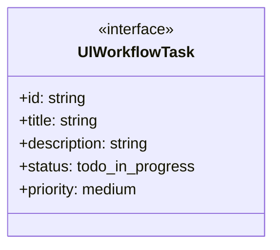
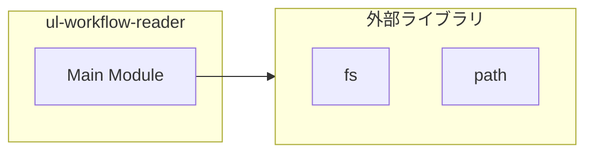
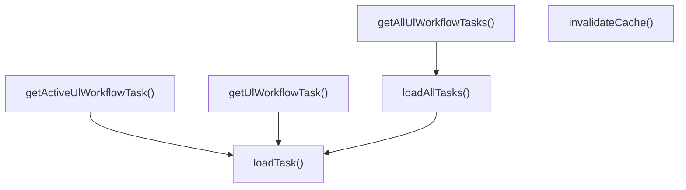
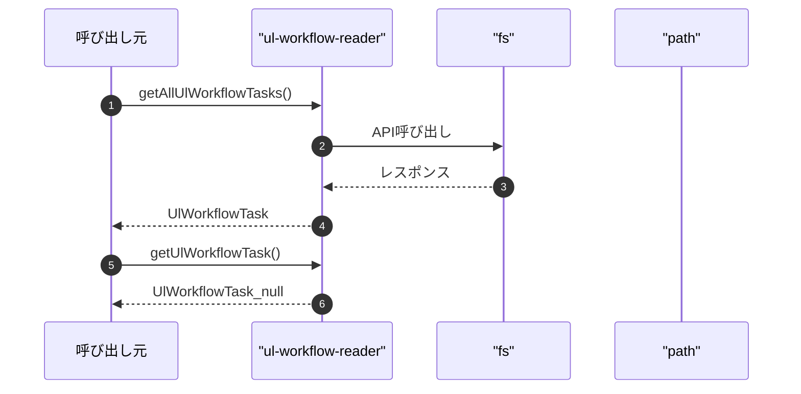

# ul-workflow-reader

## 概要

`ul-workflow-reader` モジュールのAPIリファレンス。

## インポート

```typescript
// from 'fs': fs
// from 'path': path
```

## エクスポート一覧

| 種別 | 名前 | 説明 |
|------|------|------|
| 関数 | `getAllUlWorkflowTasks` | - |
| 関数 | `getUlWorkflowTask` | - |
| 関数 | `getActiveUlWorkflowTask` | - |
| 関数 | `invalidateCache` | - |
| インターフェース | `UlWorkflowTask` | - |

## 図解

### クラス図



### 依存関係図



### 関数フロー



### シーケンス図



## 関数

### getAllUlWorkflowTasks

```typescript
getAllUlWorkflowTasks(): UlWorkflowTask[]
```

**戻り値**: `UlWorkflowTask[]`

### getUlWorkflowTask

```typescript
getUlWorkflowTask(taskId: string): UlWorkflowTask | null
```

**パラメータ**

| 名前 | 型 | 必須 |
|------|-----|------|
| taskId | `string` | はい |

**戻り値**: `UlWorkflowTask | null`

### getActiveUlWorkflowTask

```typescript
getActiveUlWorkflowTask(): UlWorkflowTask | null
```

**戻り値**: `UlWorkflowTask | null`

### invalidateCache

```typescript
invalidateCache(): void
```

**戻り値**: `void`

### loadAllTasks

```typescript
loadAllTasks(): UlWorkflowTask[]
```

**戻り値**: `UlWorkflowTask[]`

### loadTask

```typescript
loadTask(taskId: string): UlWorkflowTask | null
```

**パラメータ**

| 名前 | 型 | 必須 |
|------|-----|------|
| taskId | `string` | はい |

**戻り値**: `UlWorkflowTask | null`

## インターフェース

### UlWorkflowTask

```typescript
interface UlWorkflowTask {
  id: string;
  title: string;
  description?: string;
  status: "todo" | "in_progress" | "completed" | "cancelled";
  priority: "medium";
  tags: string[];
  createdAt: string;
  updatedAt: string;
  phase: string;
  ownerInstanceId?: string;
  isUlWorkflow: true;
}
```

## 型定義

### TaskStatus

```typescript
type TaskStatus = "todo" | "in_progress" | "completed" | "cancelled"
```

---
*自動生成: 2026-02-28T13:55:23.051Z*
