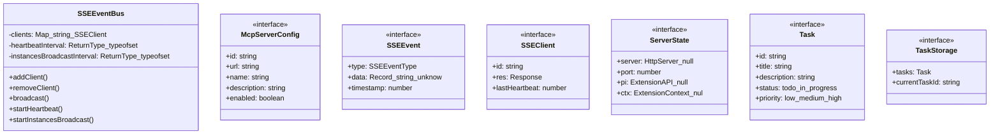
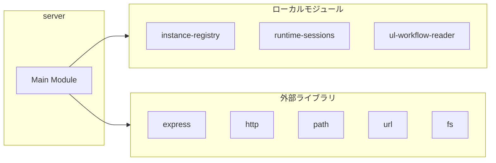
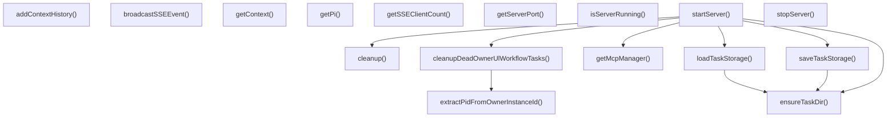
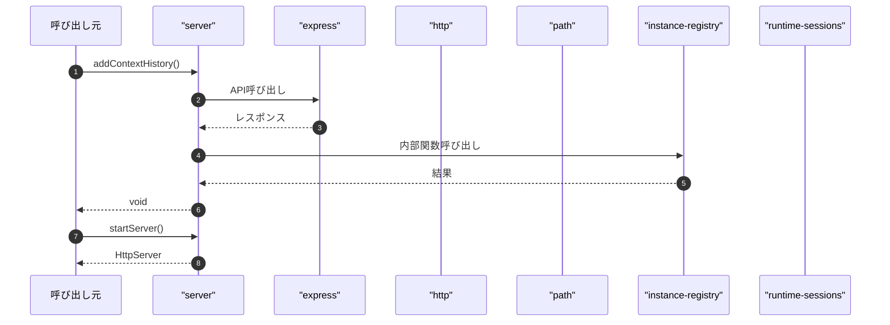

# server

## 概要

`server` モジュールのAPIリファレンス。

## インポート

```typescript
// from 'express': express, Express, Request, ...
// from 'http': createServer, HttpServer
// from 'path': path
// from 'url': fileURLToPath
// from 'fs': fs
// ... and 4 more imports
```

## エクスポート一覧

| 種別 | 名前 | 説明 |
|------|------|------|
| 関数 | `addContextHistory` | - |
| 関数 | `startServer` | - |
| 関数 | `stopServer` | - |
| 関数 | `isServerRunning` | - |
| 関数 | `getServerPort` | - |
| 関数 | `getContext` | - |
| 関数 | `getPi` | - |
| 関数 | `broadcastSSEEvent` | - |
| 関数 | `getSSEClientCount` | - |
| インターフェース | `SSEEvent` | - |
| 型 | `SSEEventType` | - |

## 図解

### クラス図



### 依存関係図



### 関数フロー



### シーケンス図



## 関数

### getMcpManager

```typescript
async getMcpManager(): void
```

**戻り値**: `void`

### extractPidFromOwnerInstanceId

```typescript
extractPidFromOwnerInstanceId(ownerInstanceId: string | undefined): number | null
```

**パラメータ**

| 名前 | 型 | 必須 |
|------|-----|------|
| ownerInstanceId | `string | undefined` | はい |

**戻り値**: `number | null`

### cleanupDeadOwnerUlWorkflowTasks

```typescript
cleanupDeadOwnerUlWorkflowTasks(): number
```

**戻り値**: `number`

### loadAndConnectMcpServers

```typescript
async loadAndConnectMcpServers(): Promise<void>
```

**戻り値**: `Promise<void>`

### addContextHistory

```typescript
addContextHistory(entry: Omit<ContextHistoryEntry, "pid"> & { pid?: number }): void
```

**パラメータ**

| 名前 | 型 | 必須 |
|------|-----|------|
| entry | `Omit<ContextHistoryEntry, "pid"> & { pid?: numb...` | はい |

**戻り値**: `void`

### startServer

```typescript
startServer(port: number, pi: ExtensionAPI, ctx: ExtensionContext): HttpServer
```

**パラメータ**

| 名前 | 型 | 必須 |
|------|-----|------|
| port | `number` | はい |
| pi | `ExtensionAPI` | はい |
| ctx | `ExtensionContext` | はい |

**戻り値**: `HttpServer`

### ensureTaskDir

```typescript
ensureTaskDir(): void
```

**戻り値**: `void`

### loadTaskStorage

```typescript
loadTaskStorage(): TaskStorage
```

**戻り値**: `TaskStorage`

### saveTaskStorage

```typescript
saveTaskStorage(storage: TaskStorage): void
```

**パラメータ**

| 名前 | 型 | 必須 |
|------|-----|------|
| storage | `TaskStorage` | はい |

**戻り値**: `void`

### cleanup

```typescript
cleanup(): void
```

**戻り値**: `void`

### stopServer

```typescript
stopServer(): void
```

**戻り値**: `void`

### isServerRunning

```typescript
isServerRunning(): boolean
```

**戻り値**: `boolean`

### getServerPort

```typescript
getServerPort(): number
```

**戻り値**: `number`

### getContext

```typescript
getContext(): ExtensionContext | null
```

**戻り値**: `ExtensionContext | null`

### getPi

```typescript
getPi(): ExtensionAPI | null
```

**戻り値**: `ExtensionAPI | null`

### broadcastSSEEvent

```typescript
broadcastSSEEvent(event: SSEEvent): void
```

**パラメータ**

| 名前 | 型 | 必須 |
|------|-----|------|
| event | `SSEEvent` | はい |

**戻り値**: `void`

### getSSEClientCount

```typescript
getSSEClientCount(): number
```

**戻り値**: `number`

## クラス

### SSEEventBus

**プロパティ**

| 名前 | 型 | 可視性 |
|------|-----|--------|
| clients | `Map<string, SSEClient>` | private |
| heartbeatInterval | `ReturnType<typeof setInterval> | null` | private |
| instancesBroadcastInterval | `ReturnType<typeof setInterval> | null` | private |

**メソッド**

| 名前 | シグネチャ |
|------|------------|
| addClient | `addClient(id, res): void` |
| removeClient | `removeClient(id): void` |
| broadcast | `broadcast(event): void` |
| startHeartbeat | `startHeartbeat(): void` |
| startInstancesBroadcast | `startInstancesBroadcast(): void` |
| stopHeartbeat | `stopHeartbeat(): void` |
| getClientCount | `getClientCount(): number` |

## インターフェース

### McpServerConfig

```typescript
interface McpServerConfig {
  id: string;
  url: string;
  name?: string;
  description?: string;
  enabled?: boolean;
  transportType?: 'auto' | 'streamable-http' | 'sse' | 'stdio' | 'websocket';
  auth?: {
    type: 'bearer' | 'basic' | 'api-key';
    token?: string;
    username?: string;
    password?: string;
    apiKey?: string;
    headerName?: string;
  };
  headers?: Record<string, string>;
}
```

### SSEEvent

```typescript
interface SSEEvent {
  type: SSEEventType;
  data: Record<string, unknown>;
  timestamp: number;
}
```

### SSEClient

```typescript
interface SSEClient {
  id: string;
  res: Response;
  lastHeartbeat: number;
}
```

### ServerState

```typescript
interface ServerState {
  server: HttpServer | null;
  port: number;
  pi: ExtensionAPI | null;
  ctx: ExtensionContext | null;
}
```

### Task

```typescript
interface Task {
  id: string;
  title: string;
  description?: string;
  status: "todo" | "in_progress" | "completed" | "cancelled";
  priority: "low" | "medium" | "high" | "urgent";
  tags: string[];
  dueDate?: string;
  assignee?: string;
  createdAt: string;
  updatedAt: string;
  completedAt?: string;
  parentTaskId?: string;
}
```

### TaskStorage

```typescript
interface TaskStorage {
  tasks: Task[];
  currentTaskId?: string;
}
```

## 型定義

### SSEEventType

```typescript
type SSEEventType = "status" | "tool-call" | "response" | "heartbeat" | "context-update"
```

---
*自動生成: 2026-02-28T13:55:23.082Z*
