# standalone-server

## 概要

`standalone-server` モジュールのAPIリファレンス。

## インポート

```typescript
// from 'express': express, Express, Request, ...
// from 'http': createServer, HttpServer
// from 'path': path
// from 'fs': fs
// from 'os': homedir
// ... and 2 more imports
```

## エクスポート一覧

| 種別 | 名前 | 説明 |
|------|------|------|

## 図解

### クラス図

```mermaid
classDiagram
  class InstanceRegistry {
    +getAll()
    +getCount()
  }
  class ServerRegistry {
    +register()
    +unregister()
    +isRunning()
  }
  class ThemeStorage {
    +get()
    +set()
  }
  class ContextHistoryStorage {
    +getAllInstances()
    +getActiveInstancesHistory()
    +cleanup()
  }
  class SSEEventBus {
    -clients: Map_string_SSEClient
    -heartbeatInterval: ReturnType_typeofset
    -instancesBroadcastInterval: ReturnType_typeofset
    +addClient()
    +removeClient()
    +broadcast()
    +startHeartbeat()
    +startInstancesBroadcast()
  }
  class InstanceInfo {
    <<interface>>
    +pid: number
    +startedAt: number
    +cwd: string
    +model: string
    +lastHeartbeat: number
  }
  class ServerInfo {
    <<interface>>
    +pid: number
    +port: number
    +startedAt: number
  }
  class ThemeSettings {
    <<interface>>
    +themeId: string
    +mode: light_dark
  }
  class ContextHistoryEntry {
    <<interface>>
    +timestamp: string
    +input: number
    +output: number
    +pid: number
  }
  class InstanceContextHistory {
    <<interface>>
    +pid: number
    +cwd: string
    +model: string
    +history: ContextHistoryEntry
  }
  class SSEEvent {
    <<interface>>
    +type: string
    +data: Record_string_unknow
    +timestamp: number
  }
  class SSEClient {
    <<interface>>
    +id: string
    +res: Response
    +lastHeartbeat: number
  }
  class ServerState {
    <<interface>>
    +server: HttpServer_null
    +port: number
  }
  class Task {
    <<interface>>
    +id: string
    +title: string
    +description: string
    +status: todo_in_progress
    +priority: low_medium_high
  }
  class TaskStorage {
    <<interface>>
    +tasks: Task
    +currentTaskId: string
  }
```



### 依存関係図


## 関数

### ensureSharedDir

```typescript
ensureSharedDir(): void
```

**戻り値**: `void`

### readJsonFile

```typescript
readJsonFile(filePath: string, defaultValue: T): T
```

**パラメータ**

| 名前 | 型 | 必須 |
|------|-----|------|
| filePath | `string` | はい |
| defaultValue | `T` | はい |

**戻り値**: `T`

### writeJsonFile

```typescript
writeJsonFile(filePath: string, data: T): void
```

**パラメータ**

| 名前 | 型 | 必須 |
|------|-----|------|
| filePath | `string` | はい |
| data | `T` | はい |

**戻り値**: `void`

### createApp

```typescript
createApp(): Express
```

**戻り値**: `Express`

### ensureTaskDir

```typescript
ensureTaskDir(): void
```

**戻り値**: `void`

### loadTaskStorage

```typescript
loadTaskStorage(): TaskStorage
```

**戻り値**: `TaskStorage`

### saveTaskStorage

```typescript
saveTaskStorage(storage: TaskStorage): void
```

**パラメータ**

| 名前 | 型 | 必須 |
|------|-----|------|
| storage | `TaskStorage` | はい |

**戻り値**: `void`

### startStandaloneServer

```typescript
startStandaloneServer(port: number): HttpServer
```

**パラメータ**

| 名前 | 型 | 必須 |
|------|-----|------|
| port | `number` | はい |

**戻り値**: `HttpServer`

### stopStandaloneServer

```typescript
stopStandaloneServer(): void
```

**戻り値**: `void`

## クラス

### InstanceRegistry

**メソッド**

| 名前 | シグネチャ |
|------|------------|
| getAll | `getAll(): InstanceInfo[]` |
| getCount | `getCount(): number` |

### ServerRegistry

**メソッド**

| 名前 | シグネチャ |
|------|------------|
| register | `register(pid, port): void` |
| unregister | `unregister(): void` |
| isRunning | `isRunning(): ServerInfo | null` |

### ThemeStorage

**メソッド**

| 名前 | シグネチャ |
|------|------------|
| get | `get(): ThemeSettings` |
| set | `set(settings): void` |

### ContextHistoryStorage

**メソッド**

| 名前 | シグネチャ |
|------|------------|
| getAllInstances | `getAllInstances(): Map<number, ContextHistoryEntry[]>` |
| getActiveInstancesHistory | `getActiveInstancesHistory(): InstanceContextHistory[]` |
| cleanup | `cleanup(): void` |

### SSEEventBus

**プロパティ**

| 名前 | 型 | 可視性 |
|------|-----|--------|
| clients | `Map<string, SSEClient>` | private |
| heartbeatInterval | `ReturnType<typeof setInterval> | null` | private |
| instancesBroadcastInterval | `ReturnType<typeof setInterval> | null` | private |

**メソッド**

| 名前 | シグネチャ |
|------|------------|
| addClient | `addClient(id, res): void` |
| removeClient | `removeClient(id): void` |
| broadcast | `broadcast(event): void` |
| startHeartbeat | `startHeartbeat(): void` |
| startInstancesBroadcast | `startInstancesBroadcast(): void` |
| stopHeartbeat | `stopHeartbeat(): void` |
| getClientCount | `getClientCount(): number` |

## インターフェース

### InstanceInfo

```typescript
interface InstanceInfo {
  pid: number;
  startedAt: number;
  cwd: string;
  model: string;
  lastHeartbeat: number;
}
```

### ServerInfo

```typescript
interface ServerInfo {
  pid: number;
  port: number;
  startedAt: number;
}
```

### ThemeSettings

```typescript
interface ThemeSettings {
  themeId: string;
  mode: "light" | "dark";
}
```

### ContextHistoryEntry

```typescript
interface ContextHistoryEntry {
  timestamp: string;
  input: number;
  output: number;
  pid: number;
}
```

### InstanceContextHistory

```typescript
interface InstanceContextHistory {
  pid: number;
  cwd: string;
  model: string;
  history: ContextHistoryEntry[];
}
```

### SSEEvent

```typescript
interface SSEEvent {
  type: string;
  data: Record<string, unknown>;
  timestamp: number;
}
```

### SSEClient

```typescript
interface SSEClient {
  id: string;
  res: Response;
  lastHeartbeat: number;
}
```

### ServerState

```typescript
interface ServerState {
  server: HttpServer | null;
  port: number;
}
```

### Task

```typescript
interface Task {
  id: string;
  title: string;
  description?: string;
  status: "todo" | "in_progress" | "completed" | "cancelled";
  priority: "low" | "medium" | "high" | "urgent";
  tags: string[];
  dueDate?: string;
  assignee?: string;
  createdAt: string;
  updatedAt: string;
  completedAt?: string;
  parentTaskId?: string;
}
```

### TaskStorage

```typescript
interface TaskStorage {
  tasks: Task[];
  currentTaskId?: string;
}
```

---
*自動生成: 2026-02-28T13:55:23.089Z*
