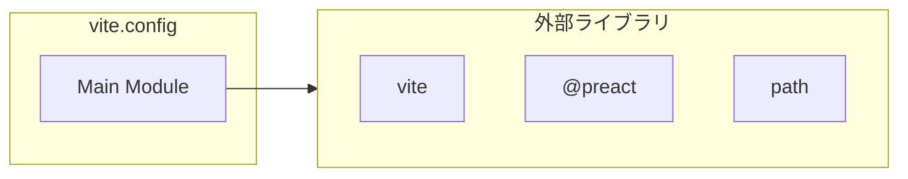

# vite.config

## 概要

`vite.config` モジュールのAPIリファレンス。

## インポート

```typescript
// from 'vite': defineConfig
// from '@preact/preset-vite': preact
// from 'path': path
```

## エクスポート一覧

| 種別 | 名前 | 説明 |
|------|------|------|

## 図解

### 依存関係図



---
*自動生成: 2026-02-28T13:55:23.090Z*
