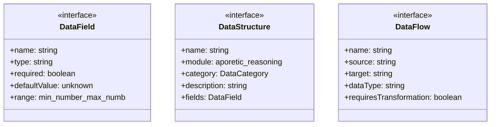

# data-dictionary

## 概要

`data-dictionary` モジュールのAPIリファレンス。

## エクスポート一覧

| 種別 | 名前 | 説明 |
|------|------|------|
| 関数 | `validateDataIntegrity` | - |
| 関数 | `validateAllModules` | - |
| 関数 | `generateDataDictionaryMarkdown` | - |
| インターフェース | `DataField` | データフィールド定義 |
| インターフェース | `DataStructure` | データ構造定義 |
| インターフェース | `DataFlow` | モジュール間のデータフロー |
| 型 | `DataCategory` | データ型カテゴリ |

## 図解

### クラス図



## 関数

### validateDataIntegrity

```typescript
validateDataIntegrity(data: Record<string, unknown>, structureName: string): {
  isValid: boolean;
  errors: string[];
  warnings: string[];
}
```

**パラメータ**

| 名前 | 型 | 必須 |
|------|-----|------|
| data | `Record<string, unknown>` | はい |
| structureName | `string` | はい |

**戻り値**: `{
  isValid: boolean;
  errors: string[];
  warnings: string[];
}`

### validateAllModules

```typescript
validateAllModules(): {
  module: string;
  structuresChecked: number;
  errors: number;
  warnings: number;
}[]
```

**戻り値**: `{
  module: string;
  structuresChecked: number;
  errors: number;
  warnings: number;
}[]`

### generateDataDictionaryMarkdown

```typescript
generateDataDictionaryMarkdown(): string
```

**戻り値**: `string`

## インターフェース

### DataField

```typescript
interface DataField {
  name: string;
  type: string;
  required: boolean;
  defaultValue?: unknown;
  range?: { min: number; max: number };
  allowedValues?: string[];
  description: string;
  invariants?: string[];
}
```

データフィールド定義

### DataStructure

```typescript
interface DataStructure {
  name: string;
  module: 'aporetic-reasoning' | 'creative-destruction' | 'hyper-metacognition' | 'nonlinear-thought';
  category: DataCategory;
  description: string;
  fields: DataField[];
  invariants: string[];
  relatedStructures: string[];
}
```

データ構造定義

### DataFlow

```typescript
interface DataFlow {
  name: string;
  source: string;
  target: string;
  dataType: string;
  requiresTransformation: boolean;
  transformationFunction?: string;
}
```

モジュール間のデータフロー

## 型定義

### DataCategory

```typescript
type DataCategory = | 'state'        // 状態データ（エンジン内部状態）
  | 'config'       // 設定データ（エンジン設定）
  | 'input'        // 入力データ（推論・思考への入力）
  | 'output'       // 出力データ（推論・思考の結果）
  | 'intermediate' // 中間データ（チェーン、履歴）
  | 'metadata'
```

データ型カテゴリ

---
*自動生成: 2026-02-22T19:27:00.539Z*
