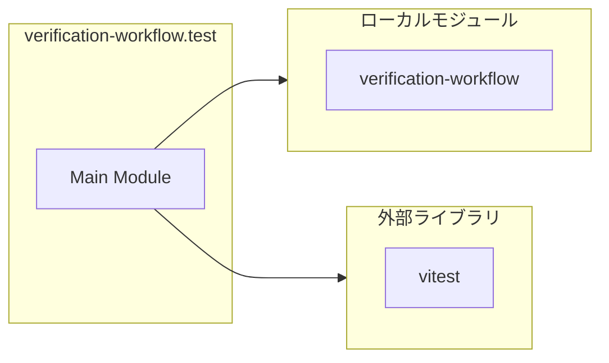

# verification-workflow.test

## 概要

`verification-workflow.test` モジュールのAPIリファレンス。

## インポート

```typescript
// from 'vitest': describe, it, expect
// from '../verification-workflow.js': runIntegratedDetection, extractCandidates, applyContextFilter, ...
```

## エクスポート一覧

| 種別 | 名前 | 説明 |
|------|------|------|

## 図解

### 依存関係図



---
*自動生成: 2026-02-22T18:55:28.800Z*
