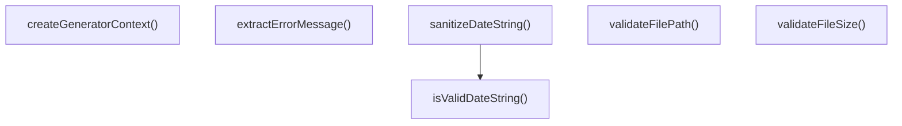
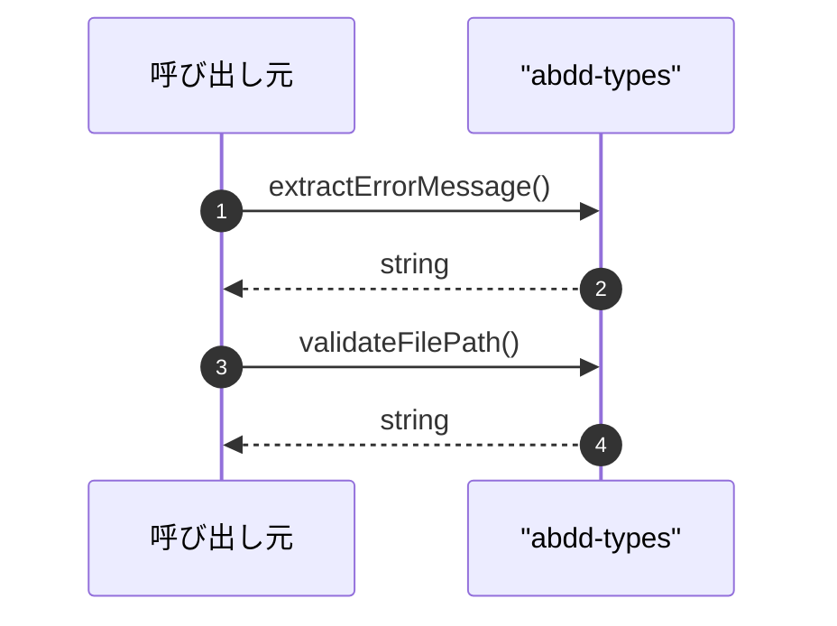

# abdd-types

## 概要

`abdd-types` モジュールのAPIリファレンス。

## インポート

```typescript
// from 'node:fs': statSync
// from 'node:path': resolvePath, pathSep
```

## エクスポート一覧

| 種別 | 名前 | 説明 |
|------|------|------|
| 関数 | `extractErrorMessage` | エラーオブジェクトからメッセージを抽出 |
| 関数 | `validateFilePath` | パストラバーサル攻撃を防ぐためのパス検証 |
| 関数 | `validateFileSize` | ファイルサイズが上限内かチェック |
| 関数 | `isValidDateString` | 日付文字列（YYYY-MM-DD）のバリデーション |
| 関数 | `sanitizeDateString` | 日付文字列を安全にサニタイズ |
| 関数 | `createGeneratorContext` | ジェネレータコンテキストを作成 |
| クラス | `AbddError` | ABDDカスタムエラークラス |
| インターフェース | `AbddOptions` | ABDDツール共通オプション |
| インターフェース | `CacheEntry` | キャッシュエントリ |
| インターフェース | `SourceReference` | ソース参照 |
| インターフェース | `Divergence` | 乖離情報 |
| インターフェース | `DivergenceSummary` | 乖離分析サマリー |
| インターフェース | `DivergenceAnalysisResult` | 乖離分析結果 |
| インターフェース | `SpawnResult` | spawn実行結果 |
| インターフェース | `FunctionInfo` | 関数情報 |
| インターフェース | `ClassInfo` | クラス情報 |
| インターフェース | `InterfaceInfo` | インターフェース情報 |
| インターフェース | `TypeInfo` | 型情報 |
| インターフェース | `ImportBinding` | インポートバインディング |
| インターフェース | `ImportInfo` | インポート情報 |
| インターフェース | `CallNode` | 呼び出しノード |
| インターフェース | `ToolInfo` | ツール情報 |
| インターフェース | `FileInfo` | ファイル情報（generate-abdd用） |
| インターフェース | `CrossFileCache` | クロスファイルキャッシュ |
| インターフェース | `TypeCheckerContext` | TypeCheckerコンテキスト |
| インターフェース | `GeneratorOptions` | ジェネレータオプション |
| インターフェース | `GeneratorContext` | ジェネレータコンテキスト |
| 型 | `AbddErrorCode` | エラーコード型定義 |
| 型 | `DivergenceType` | 乖離タイプ |
| 型 | `Severity` | 乖離重要度 |

## 図解

### クラス図

```mermaid
classDiagram
  class AbddError {
    +toJSON()
    +toUserMessage()
  }
  Error <|-- AbddError
  class AbddOptions {
    <<interface>>
    +dryRun: boolean
    +verbose: boolean
    +file: string
    +limit: number
    +regenerate: boolean
  }
  class CacheEntry {
    <<interface>>
    +key: string
    +content: string
    +fileHash: string
    +createdAt: number
    +modelId: string
  }
  class SourceReference {
    <<interface>>
    +source: string
    +text: string
  }
  class Divergence {
    <<interface>>
    +type: DivergenceType
    +severity: Severity
    +intention: SourceReference
    +reality: SourceReference
    +reason: string
  }
  class DivergenceSummary {
    <<interface>>
    +total: number
    +high: number
    +medium: number
    +low: number
  }
  class DivergenceAnalysisResult {
    <<interface>>
    +success: boolean
    +divergences: Divergence
    +summary: DivergenceSummary
    +warnings: string
  }
  class SpawnResult {
    <<interface>>
    +success: boolean
    +stdout: string
    +stderr: string
    +timedOut: boolean
    +exitCode: number
  }
  class FunctionInfo {
    <<interface>>
    +name: string
    +signature: string
    +line: number
    +jsDoc: string
    +summary: string
  }
  class ClassInfo {
    <<interface>>
    +name: string
    +line: number
    +jsDoc: string
    +methods: name_string_signatu
    +properties: name_string_type_st
  }
  class InterfaceInfo {
    <<interface>>
    +name: string
    +line: number
    +jsDoc: string
    +properties: name_string_type_st
    +methods: name_string_signatu
  }
  class TypeInfo {
    <<interface>>
    +name: string
    +line: number
    +jsDoc: string
    +definition: string
    +isExported: boolean
  }
  class ImportBinding {
    <<interface>>
    +source: string
    +localName: string
    +importedName: string
    +kind: named_default_n
  }
  class ImportInfo {
    <<interface>>
    +source: string
    +bindings: ImportBinding
  }
  class CallNode {
    <<interface>>
    +name: string
    +line: number
    +signature: string
    +targetFile: string
    +targetFunction: string
  }
  class ToolInfo {
    <<interface>>
    +name: string
    +label: string
    +description: string
    +line: number
    +parameters: string
  }
  class FileInfo {
    <<interface>>
    +path: string
    +relativePath: string
    +functions: FunctionInfo
    +classes: ClassInfo
    +interfaces: InterfaceInfo
  }
  class CrossFileCache {
    <<interface>>
    +fileInfos: Map_string_FileInfo
    +exportMap: Map_string_file_str
  }
  class TypeCheckerContext {
    <<interface>>
    +program: unknown
    +checker: unknown
    +sourceFiles: Map_string_unknown
  }
  class GeneratorOptions {
    <<interface>>
    +dryRun: boolean
    +verbose: boolean
    +file: string
    +skipMermaidValidation: boolean
  }
  class GeneratorContext {
    <<interface>>
    +options: GeneratorOptions
    +crossFileCache: CrossFileCache
    +typeChecker: TypeCheckerContext_n
  }
```



### 関数フロー



### シーケンス図



## 関数

### extractErrorMessage

```typescript
extractErrorMessage(error: unknown): string
```

エラーオブジェクトからメッセージを抽出

**パラメータ**

| 名前 | 型 | 必須 |
|------|-----|------|
| error | `unknown` | はい |

**戻り値**: `string`

### validateFilePath

```typescript
validateFilePath(inputPath: string, baseDir: string): string
```

パストラバーサル攻撃を防ぐためのパス検証

**パラメータ**

| 名前 | 型 | 必須 |
|------|-----|------|
| inputPath | `string` | はい |
| baseDir | `string` | はい |

**戻り値**: `string`

### validateFileSize

```typescript
validateFileSize(filePath: string, maxSizeBytes: number): void
```

ファイルサイズが上限内かチェック

**パラメータ**

| 名前 | 型 | 必須 |
|------|-----|------|
| filePath | `string` | はい |
| maxSizeBytes | `number` | はい |

**戻り値**: `void`

### isValidDateString

```typescript
isValidDateString(dateStr: string): boolean
```

日付文字列（YYYY-MM-DD）のバリデーション

**パラメータ**

| 名前 | 型 | 必須 |
|------|-----|------|
| dateStr | `string` | はい |

**戻り値**: `boolean`

### sanitizeDateString

```typescript
sanitizeDateString(input: string): string
```

日付文字列を安全にサニタイズ

**パラメータ**

| 名前 | 型 | 必須 |
|------|-----|------|
| input | `string` | はい |

**戻り値**: `string`

### createGeneratorContext

```typescript
createGeneratorContext(options: GeneratorOptions): GeneratorContext
```

ジェネレータコンテキストを作成

**パラメータ**

| 名前 | 型 | 必須 |
|------|-----|------|
| options | `GeneratorOptions` | はい |

**戻り値**: `GeneratorContext`

## クラス

### AbddError

ABDDカスタムエラークラス
エラーハンドリングを統一し、エラー分類を明確化する

**継承**: `Error`

**メソッド**

| 名前 | シグネチャ |
|------|------------|
| toJSON | `toJSON(): Record<string, unknown>` |
| toUserMessage | `toUserMessage(): string` |

## インターフェース

### AbddOptions

```typescript
interface AbddOptions {
  dryRun?: boolean;
  verbose?: boolean;
  file?: string;
  limit?: number;
  regenerate?: boolean;
  force?: boolean;
  noCache?: boolean;
}
```

ABDDツール共通オプション

### CacheEntry

```typescript
interface CacheEntry {
  key: string;
  content: string;
  fileHash: string;
  createdAt: number;
  modelId: string;
}
```

キャッシュエントリ

### SourceReference

```typescript
interface SourceReference {
  source: string;
  text: string;
}
```

ソース参照

### Divergence

```typescript
interface Divergence {
  type: DivergenceType;
  severity: Severity;
  intention: SourceReference;
  reality: SourceReference;
  reason: string;
}
```

乖離情報

### DivergenceSummary

```typescript
interface DivergenceSummary {
  total: number;
  high: number;
  medium: number;
  low: number;
}
```

乖離分析サマリー

### DivergenceAnalysisResult

```typescript
interface DivergenceAnalysisResult {
  success: boolean;
  divergences: Divergence[];
  summary: DivergenceSummary;
  warnings: string[];
}
```

乖離分析結果

### SpawnResult

```typescript
interface SpawnResult {
  success: boolean;
  stdout: string;
  stderr: string;
  timedOut?: boolean;
  exitCode?: number;
}
```

spawn実行結果

### FunctionInfo

```typescript
interface FunctionInfo {
  name: string;
  signature: string;
  line: number;
  jsDoc?: string;
  summary?: string;
  parameters: { name: string; type: string; optional: boolean }[];
  returnType: string;
  isAsync: boolean;
  isExported: boolean;
}
```

関数情報

### ClassInfo

```typescript
interface ClassInfo {
  name: string;
  line: number;
  jsDoc?: string;
  methods: { name: string; signature: string; visibility: string }[];
  properties: { name: string; type: string; visibility: string }[];
  extends?: string;
  implements: string[];
  isExported: boolean;
}
```

クラス情報

### InterfaceInfo

```typescript
interface InterfaceInfo {
  name: string;
  line: number;
  jsDoc?: string;
  properties: { name: string; type: string; optional: boolean }[];
  methods: { name: string; signature: string }[];
  extends: string[];
  isExported: boolean;
}
```

インターフェース情報

### TypeInfo

```typescript
interface TypeInfo {
  name: string;
  line: number;
  jsDoc?: string;
  definition: string;
  isExported: boolean;
}
```

型情報

### ImportBinding

```typescript
interface ImportBinding {
  source: string;
  localName: string;
  importedName: string;
  kind: "named" | "default" | "namespace";
}
```

インポートバインディング

### ImportInfo

```typescript
interface ImportInfo {
  source: string;
  bindings: ImportBinding[];
}
```

インポート情報

### CallNode

```typescript
interface CallNode {
  name: string;
  line: number;
  signature?: string;
  targetFile?: string;
  targetFunction?: string;
}
```

呼び出しノード

### ToolInfo

```typescript
interface ToolInfo {
  name: string;
  label: string;
  description: string;
  line: number;
  parameters?: string;
  returnType?: string;
}
```

ツール情報

### FileInfo

```typescript
interface FileInfo {
  path: string;
  relativePath: string;
  functions: FunctionInfo[];
  classes: ClassInfo[];
  interfaces: InterfaceInfo[];
  types: TypeInfo[];
  imports: ImportInfo[];
  exports: string[];
  tools: ToolInfo[];
  calls: CallNode[];
}
```

ファイル情報（generate-abdd用）

### CrossFileCache

```typescript
interface CrossFileCache {
  fileInfos: Map<string, FileInfo>;
  exportMap: Map<string, { file: string; type: "function" | "class" | "interface" | "type" }>;
}
```

クロスファイルキャッシュ

### TypeCheckerContext

```typescript
interface TypeCheckerContext {
  program: unknown;
  checker: unknown;
  sourceFiles: Map<string, unknown>;
}
```

TypeCheckerコンテキスト

### GeneratorOptions

```typescript
interface GeneratorOptions {
  dryRun: boolean;
  verbose: boolean;
  file?: string;
  skipMermaidValidation?: boolean;
}
```

ジェネレータオプション

### GeneratorContext

```typescript
interface GeneratorContext {
  options: GeneratorOptions;
  crossFileCache: CrossFileCache;
  typeChecker: TypeCheckerContext | null;
}
```

ジェネレータコンテキスト

## 型定義

### AbddErrorCode

```typescript
type AbddErrorCode = typeof AbddErrorCodes[keyof typeof AbddErrorCodes]
```

エラーコード型定義

### DivergenceType

```typescript
type DivergenceType = | "value_mismatch"
	| "invariant_violation"
	| "contract_breach"
	| "missing_jsdoc"
```

乖離タイプ

### Severity

```typescript
type Severity = "low" | "medium" | "high"
```

乖離重要度

---
*自動生成: 2026-02-24T17:08:02.589Z*
