# abdd-types

## 概要

`abdd-types` モジュールのAPIリファレンス。

## エクスポート一覧

| 種別 | 名前 | 説明 |
|------|------|------|
| 関数 | `createGeneratorContext` | ジェネレーターコンテキストを作成 |
| クラス | `AbddError` | ABDDカスタムエラー |
| インターフェース | `AbddOptions` | ABDDツール共通オプション |
| インターフェース | `JSDocOptions` | JSDoc生成オプション |
| インターフェース | `WorkflowOptions` | ワークフロー実行オプション |
| インターフェース | `CacheEntry` | JSDocキャッシュエントリ |
| インターフェース | `CacheData` | キャッシュデータ構造 |
| インターフェース | `SourceReference` | ソース参照 |
| インターフェース | `RealityReference` | 実態参照（ファイル情報付き） |
| インターフェース | `Divergence` | 乖離候補 |
| インターフェース | `DivergenceAnalysisResult` | 乖離分析結果 |
| インターフェース | `ScriptResult` | スクリプト実行結果 |
| インターフェース | `StepResult` | ステップ実行結果 |
| インターフェース | `FunctionInfo` | 関数情報 |
| インターフェース | `ClassInfo` | クラス情報 |
| インターフェース | `InterfaceInfo` | インターフェース情報 |
| インターフェース | `TypeInfo` | 型情報 |
| インターフェース | `ImportBinding` | インポートバインディング |
| インターフェース | `ImportInfo` | インポート情報 |
| インターフェース | `CallNode` | 呼び出しノード |
| インターフェース | `ToolInfo` | ツール情報（ユーザーフロー生成用） |
| インターフェース | `FileInfo` | ファイル情報 |
| インターフェース | `CrossFileCache` | クロスファイル追跡用キャッシュ |
| インターフェース | `TypeCheckerContext` | 型チェッカーコンテキスト |
| インターフェース | `GeneratorContext` | ジェネレーターコンテキスト（グローバル状態を置き換える） |
| インターフェース | `GeneratorOptions` | ジェネレーターオプション |
| 型 | `WorkflowMode` | ABDDワークフローモード |
| 型 | `DivergenceType` | 乖離タイプ |
| 型 | `Severity` | 乖離重要度 |
| 型 | `AbddErrorCode` | - |

## 図解

### クラス図

```mermaid
classDiagram
  class AbddError {
  }
  Error <|-- AbddError
  class AbddOptions {
    <<interface>>
    +dryRun: boolean
    +verbose: boolean
    +file: string
    +limit: number
    +regenerate: boolean
  }
  class JSDocOptions {
    <<interface>>
    +check: boolean
    +batchSize: number
    +metrics: boolean
  }
  class WorkflowOptions {
    <<interface>>
    +mode: WorkflowMode
    +dryRun: boolean
    +verbose: boolean
    +timeoutMs: number
    +continueOnError: boolean
  }
  class CacheEntry {
    <<interface>>
    +key: string
    +content: string
    +fileHash: string
    +createdAt: number
    +modelId: string
  }
  class CacheData {
    <<interface>>
    +version: number
    +entries: CacheEntry
  }
  class SourceReference {
    <<interface>>
    +source: string
    +text: string
  }
  class RealityReference {
    <<interface>>
    +file: string
    +text: string
  }
  class Divergence {
    <<interface>>
    +type: DivergenceType
    +severity: Severity
    +intention: SourceReference
    +reality: RealityReference
    +reason: string
  }
  class DivergenceAnalysisResult {
    <<interface>>
    +divergences: Divergence
    +summary: total_number_high_n
    +warnings: string
  }
  class ScriptResult {
    <<interface>>
    +success: boolean
    +output: string
    +error: string
    +outputDir: string
    +recordPath: string
  }
  class StepResult {
    <<interface>>
    +step: string
    +success: boolean
    +output: string
    +timedOut: boolean
  }
  class FunctionInfo {
    <<interface>>
    +name: string
    +signature: string
    +line: number
    +jsDoc: string
    +summary: string
  }
  class ClassInfo {
    <<interface>>
    +name: string
    +line: number
    +jsDoc: string
    +methods: name_string_signatu
    +properties: name_string_type_st
  }
  class InterfaceInfo {
    <<interface>>
    +name: string
    +line: number
    +jsDoc: string
    +properties: name_string_type_st
    +methods: name_string_signatu
  }
  class TypeInfo {
    <<interface>>
    +name: string
    +line: number
    +jsDoc: string
    +definition: string
    +isExported: boolean
  }
  class ImportBinding {
    <<interface>>
    +source: string
    +localName: string
    +importedName: string
    +kind: named_default_n
  }
  class ImportInfo {
    <<interface>>
    +source: string
    +bindings: ImportBinding
  }
  class CallNode {
    <<interface>>
    +callee: string
    +displayName: string
    +isAsync: boolean
    +line: number
    +importedFrom: string
  }
  class ToolInfo {
    <<interface>>
    +name: string
    +description: string
    +executeFunction: string
    +line: number
    +executeCalls: CallNode
  }
  class FileInfo {
    <<interface>>
    +path: string
    +relativePath: string
    +functions: FunctionInfo
    +classes: ClassInfo
    +interfaces: InterfaceInfo
  }
  class CrossFileCache {
    <<interface>>
    +fileInfos: Map_string_FileInfo
    +functionLocations: Map_string_filePath
  }
  class TypeCheckerContext {
    <<interface>>
    +program: Program
    +checker: TypeChecker
    +sourceFiles: Map_string_SourceFil
    +compilerOptions: CompilerOptions
  }
  class GeneratorContext {
    <<interface>>
    +options: GeneratorOptions
    +crossFileCache: CrossFileCache
    +typeChecker: TypeCheckerContext_n
  }
  class GeneratorOptions {
    <<interface>>
    +dryRun: boolean
    +verbose: boolean
  }
```



## 関数

### createGeneratorContext

```typescript
createGeneratorContext(options: Partial<GeneratorOptions>): GeneratorContext
```

ジェネレーターコンテキストを作成
グローバル可変状態の代わりに使用

**パラメータ**

| 名前 | 型 | 必須 |
|------|-----|------|
| options | `Partial<GeneratorOptions>` | はい |

**戻り値**: `GeneratorContext`

## クラス

### AbddError

ABDDカスタムエラー

**継承**: `Error`

## インターフェース

### AbddOptions

```typescript
interface AbddOptions {
  dryRun?: boolean;
  verbose?: boolean;
  file?: string;
  limit?: number;
  regenerate?: boolean;
  force?: boolean;
  noCache?: boolean;
}
```

ABDDツール共通オプション

### JSDocOptions

```typescript
interface JSDocOptions {
  check?: boolean;
  batchSize?: number;
  metrics?: boolean;
}
```

JSDoc生成オプション

### WorkflowOptions

```typescript
interface WorkflowOptions {
  mode?: WorkflowMode;
  dryRun?: boolean;
  verbose?: boolean;
  timeoutMs?: number;
  continueOnError?: boolean;
}
```

ワークフロー実行オプション

### CacheEntry

```typescript
interface CacheEntry {
  key: string;
  content: string;
  fileHash: string;
  createdAt: number;
  modelId: string;
}
```

JSDocキャッシュエントリ

### CacheData

```typescript
interface CacheData {
  version: number;
  entries: CacheEntry[];
}
```

キャッシュデータ構造

### SourceReference

```typescript
interface SourceReference {
  source: string;
  text: string;
}
```

ソース参照

### RealityReference

```typescript
interface RealityReference {
  file: string;
  text: string;
}
```

実態参照（ファイル情報付き）

### Divergence

```typescript
interface Divergence {
  type: DivergenceType;
  severity: Severity;
  intention: SourceReference;
  reality: RealityReference;
  reason: string;
}
```

乖離候補

### DivergenceAnalysisResult

```typescript
interface DivergenceAnalysisResult {
  divergences: Divergence[];
  summary: {
		total: number;
		high: number;
		medium: number;
		low: number;
	};
  warnings: string[];
}
```

乖離分析結果

### ScriptResult

```typescript
interface ScriptResult {
  success: boolean;
  output: string;
  error?: string;
  outputDir?: string;
  recordPath?: string;
  checklist?: string;
  divergences?: Divergence[];
  summary?: DivergenceAnalysisResult["summary"];
  warnings?: string[];
  timedOut?: boolean;
  mode?: WorkflowMode;
  results?: StepResult[];
  timeoutMs?: number;
}
```

スクリプト実行結果

### StepResult

```typescript
interface StepResult {
  step: string;
  success: boolean;
  output: string;
  timedOut?: boolean;
}
```

ステップ実行結果

### FunctionInfo

```typescript
interface FunctionInfo {
  name: string;
  signature: string;
  line: number;
  jsDoc?: string;
  summary?: string;
  parameters: { name: string; type: string; optional: boolean }[];
  returnType: string;
  isAsync: boolean;
  isExported: boolean;
}
```

関数情報

### ClassInfo

```typescript
interface ClassInfo {
  name: string;
  line: number;
  jsDoc?: string;
  methods: { name: string; signature: string; visibility: string }[];
  properties: { name: string; type: string; visibility: string }[];
  extends?: string;
  implements: string[];
  isExported: boolean;
}
```

クラス情報

### InterfaceInfo

```typescript
interface InterfaceInfo {
  name: string;
  line: number;
  jsDoc?: string;
  properties: { name: string; type: string; optional: boolean }[];
  methods: { name: string; signature: string }[];
  extends: string[];
  isExported: boolean;
}
```

インターフェース情報

### TypeInfo

```typescript
interface TypeInfo {
  name: string;
  line: number;
  jsDoc?: string;
  definition: string;
  isExported: boolean;
}
```

型情報

### ImportBinding

```typescript
interface ImportBinding {
  source: string;
  localName: string;
  importedName: string;
  kind: "named" | "default" | "namespace";
}
```

インポートバインディング

### ImportInfo

```typescript
interface ImportInfo {
  source: string;
  bindings: ImportBinding[];
}
```

インポート情報

### CallNode

```typescript
interface CallNode {
  callee: string;
  displayName?: string;
  isAsync: boolean;
  line: number;
  importedFrom?: string;
  importedSymbol?: string;
}
```

呼び出しノード

### ToolInfo

```typescript
interface ToolInfo {
  name: string;
  description: string;
  executeFunction: string;
  line: number;
  executeCalls?: CallNode[];
}
```

ツール情報（ユーザーフロー生成用）

### FileInfo

```typescript
interface FileInfo {
  path: string;
  relativePath: string;
  functions: FunctionInfo[];
  classes: ClassInfo[];
  interfaces: InterfaceInfo[];
  types: TypeInfo[];
  imports: ImportInfo[];
  exports: string[];
  tools: ToolInfo[];
  calls: Map<string, CallNode[]>;
}
```

ファイル情報

### CrossFileCache

```typescript
interface CrossFileCache {
  fileInfos: Map<string, FileInfo>;
  functionLocations: Map<string, { filePath: string; info: FunctionInfo }>;
}
```

クロスファイル追跡用キャッシュ

### TypeCheckerContext

```typescript
interface TypeCheckerContext {
  program: import("typescript").Program;
  checker: import("typescript").TypeChecker;
  sourceFiles: Map<string, import("typescript").SourceFile>;
  compilerOptions: import("typescript").CompilerOptions;
}
```

型チェッカーコンテキスト

### GeneratorContext

```typescript
interface GeneratorContext {
  options: GeneratorOptions;
  crossFileCache: CrossFileCache;
  typeChecker: TypeCheckerContext | null;
}
```

ジェネレーターコンテキスト（グローバル状態を置き換える）

### GeneratorOptions

```typescript
interface GeneratorOptions {
  dryRun: boolean;
  verbose: boolean;
}
```

ジェネレーターオプション

## 型定義

### WorkflowMode

```typescript
type WorkflowMode = "fast" | "strict"
```

ABDDワークフローモード

### DivergenceType

```typescript
type DivergenceType = "value_mismatch" | "invariant_violation" | "contract_breach" | "missing_jsdoc"
```

乖離タイプ

### Severity

```typescript
type Severity = "low" | "medium" | "high"
```

乖離重要度

### AbddErrorCode

```typescript
type AbddErrorCode = (typeof AbddErrorCodes)[keyof typeof AbddErrorCodes]
```

---
*自動生成: 2026-02-18T18:06:17.474Z*
