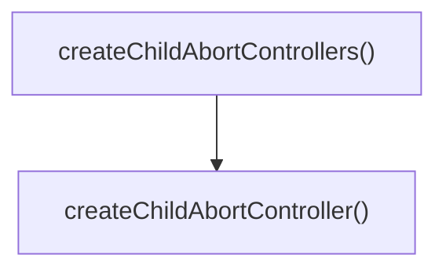

# abort-utils

## 概要

`abort-utils` モジュールのAPIリファレンス。

## エクスポート一覧

| 種別 | 名前 | 説明 |
|------|------|------|
| 関数 | `createChildAbortController` | - |
| 関数 | `createChildAbortControllers` | 親シグナルに連動する複数の子コントローラを作成 |

## 図解

### 関数フロー



## 関数

### createChildAbortController

```typescript
createChildAbortController(parentSignal?: AbortSignal): { controller: AbortController; cleanup: () => void }
```

**パラメータ**

| 名前 | 型 | 必須 |
|------|-----|------|
| parentSignal | `AbortSignal` | いいえ |

**戻り値**: `{ controller: AbortController; cleanup: () => void }`

### onParentAbort

```typescript
onParentAbort(): void
```

**戻り値**: `void`

### cleanup

```typescript
cleanup(): void
```

**戻り値**: `void`

### createChildAbortControllers

```typescript
createChildAbortControllers(count: number, parentSignal?: AbortSignal): { controllers: AbortController[]; cleanup: () => void }
```

親シグナルに連動する複数の子コントローラを作成

**パラメータ**

| 名前 | 型 | 必須 |
|------|-----|------|
| count | `number` | はい |
| parentSignal | `AbortSignal` | いいえ |

**戻り値**: `{ controllers: AbortController[]; cleanup: () => void }`

---
*自動生成: 2026-02-18T18:06:17.475Z*
