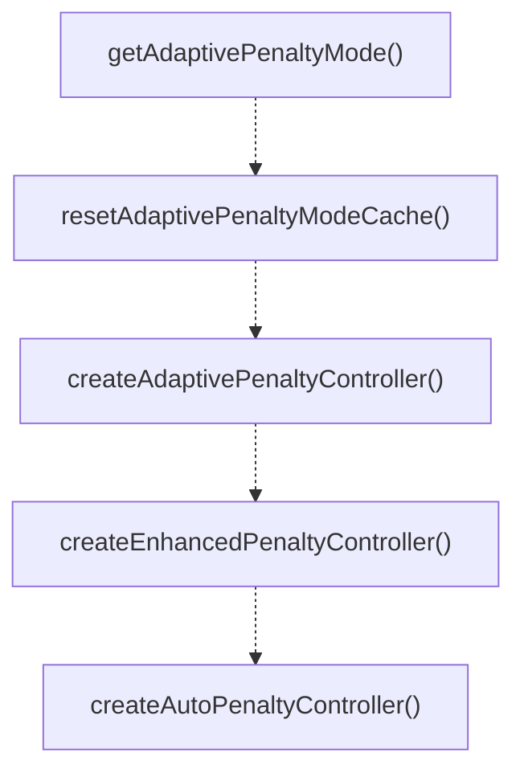

# adaptive-penalty

## 概要

`adaptive-penalty` モジュールのAPIリファレンス。

## エクスポート一覧

| 種別 | 名前 | 説明 |
|------|------|------|
| 関数 | `getAdaptivePenaltyMode` | Get the current adaptive penalty mode. |
| 関数 | `resetAdaptivePenaltyModeCache` | Reset the cached mode (primarily for testing). |
| 関数 | `createAdaptivePenaltyController` | - |
| 関数 | `createEnhancedPenaltyController` | Create an enhanced adaptive penalty controller. |
| 関数 | `createAutoPenaltyController` | Create the appropriate penalty controller based on |
| インターフェース | `AdaptivePenaltyState` | - |
| インターフェース | `AdaptivePenaltyOptions` | - |
| インターフェース | `EnhancedPenaltyOptions` | Enhanced penalty options with exponential decay an |
| インターフェース | `AdaptivePenaltyController` | - |
| インターフェース | `EnhancedPenaltyController` | Enhanced penalty controller with additional capabi |
| 型 | `PenaltyReason` | Reason types for penalty adjustment. |
| 型 | `DecayStrategy` | Decay strategy options. |

## 図解

### クラス図


### 関数フロー



## 関数

### getAdaptivePenaltyMode

```typescript
getAdaptivePenaltyMode(): "legacy" | "enhanced"
```

Get the current adaptive penalty mode.
Reads from PI_ADAPTIVE_PENALTY_MODE environment variable.

MIGRATION COMPLETE: Default is now "enhanced" (v2.0.0+)
- "legacy": Use linear decay (+1/-1 steps) (deprecated)
- "enhanced": Use exponential decay and reason-based weights (default)

**戻り値**: `"legacy" | "enhanced"`

### resetAdaptivePenaltyModeCache

```typescript
resetAdaptivePenaltyModeCache(): void
```

Reset the cached mode (primarily for testing).

**戻り値**: `void`

### createAdaptivePenaltyController

```typescript
createAdaptivePenaltyController(options: AdaptivePenaltyOptions): AdaptivePenaltyController
```

**パラメータ**

| 名前 | 型 | 必須 |
|------|-----|------|
| options | `AdaptivePenaltyOptions` | はい |

**戻り値**: `AdaptivePenaltyController`

### decay

```typescript
decay(nowMs: any): void
```

**パラメータ**

| 名前 | 型 | 必須 |
|------|-----|------|
| nowMs | `any` | はい |

**戻り値**: `void`

### raise

```typescript
raise(reason: "rate_limit" | "timeout" | "capacity"): void
```

**パラメータ**

| 名前 | 型 | 必須 |
|------|-----|------|
| reason | `"rate_limit" | "timeout" | "capacity"` | はい |

**戻り値**: `void`

### lower

```typescript
lower(): void
```

**戻り値**: `void`

### get

```typescript
get(): number
```

**戻り値**: `number`

### applyLimit

```typescript
applyLimit(baseLimit: number): number
```

**パラメータ**

| 名前 | 型 | 必須 |
|------|-----|------|
| baseLimit | `number` | はい |

**戻り値**: `number`

### createEnhancedPenaltyController

```typescript
createEnhancedPenaltyController(options: EnhancedPenaltyOptions): EnhancedPenaltyController
```

Create an enhanced adaptive penalty controller.
Supports exponential decay and reason-based weights.

**パラメータ**

| 名前 | 型 | 必須 |
|------|-----|------|
| options | `EnhancedPenaltyOptions` | はい |

**戻り値**: `EnhancedPenaltyController`

### decay

```typescript
decay(nowMs: any): void
```

**パラメータ**

| 名前 | 型 | 必須 |
|------|-----|------|
| nowMs | `any` | はい |

**戻り値**: `void`

### recordReason

```typescript
recordReason(reason: PenaltyReason): void
```

**パラメータ**

| 名前 | 型 | 必須 |
|------|-----|------|
| reason | `PenaltyReason` | はい |

**戻り値**: `void`

### raiseWithReason

```typescript
raiseWithReason(reason: PenaltyReason): void
```

**パラメータ**

| 名前 | 型 | 必須 |
|------|-----|------|
| reason | `PenaltyReason` | はい |

**戻り値**: `void`

### raise

```typescript
raise(reason: "rate_limit" | "timeout" | "capacity"): void
```

**パラメータ**

| 名前 | 型 | 必須 |
|------|-----|------|
| reason | `"rate_limit" | "timeout" | "capacity"` | はい |

**戻り値**: `void`

### lower

```typescript
lower(): void
```

**戻り値**: `void`

### get

```typescript
get(): number
```

**戻り値**: `number`

### applyLimit

```typescript
applyLimit(baseLimit: number): number
```

**パラメータ**

| 名前 | 型 | 必須 |
|------|-----|------|
| baseLimit | `number` | はい |

**戻り値**: `number`

### getReasonStats

```typescript
getReasonStats(): Record<PenaltyReason, number>
```

**戻り値**: `Record<PenaltyReason, number>`

### getDecayStrategy

```typescript
getDecayStrategy(): DecayStrategy
```

**戻り値**: `DecayStrategy`

### createAutoPenaltyController

```typescript
createAutoPenaltyController(options: AdaptivePenaltyOptions | EnhancedPenaltyOptions): AdaptivePenaltyController | EnhancedPenaltyController
```

Create the appropriate penalty controller based on feature flag.
This is the recommended factory function for production use.

**パラメータ**

| 名前 | 型 | 必須 |
|------|-----|------|
| options | `AdaptivePenaltyOptions | EnhancedPenaltyOptions` | はい |

**戻り値**: `AdaptivePenaltyController | EnhancedPenaltyController`

## インターフェース

### AdaptivePenaltyState

```typescript
interface AdaptivePenaltyState {
  penalty: number;
  updatedAtMs: number;
  lastReason?: PenaltyReason;
  reasonHistory: Array<{ reason: PenaltyReason; timestamp: number }>;
}
```

### AdaptivePenaltyOptions

```typescript
interface AdaptivePenaltyOptions {
  isStable: boolean;
  maxPenalty: number;
  decayMs: number;
}
```

### EnhancedPenaltyOptions

```typescript
interface EnhancedPenaltyOptions {
  decayStrategy?: DecayStrategy;
  exponentialBase?: number;
  reasonWeights?: Partial<Record<PenaltyReason, number>>;
  historySize?: number;
}
```

Enhanced penalty options with exponential decay and reason weights.

### AdaptivePenaltyController

```typescript
interface AdaptivePenaltyController {
  state: AdaptivePenaltyState;
  decay: (nowMs?: number) => void;
  raise: (reason: "rate_limit" | "timeout" | "capacity") => void;
  lower: () => void;
  get: () => number;
  applyLimit: (baseLimit: number) => number;
}
```

### EnhancedPenaltyController

```typescript
interface EnhancedPenaltyController {
  raiseWithReason: (reason: PenaltyReason) => void;
  getReasonStats: () => Record<PenaltyReason, number>;
  getDecayStrategy: () => DecayStrategy;
}
```

Enhanced penalty controller with additional capabilities.

## 型定義

### PenaltyReason

```typescript
type PenaltyReason = "rate_limit" | "timeout" | "capacity" | "schema_violation"
```

Reason types for penalty adjustment.

### DecayStrategy

```typescript
type DecayStrategy = "linear" | "exponential" | "hybrid"
```

Decay strategy options.

---
*自動生成: 2026-02-18T00:15:35.637Z*
