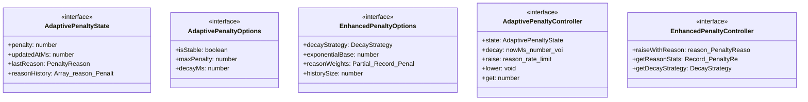

# adaptive-penalty

## 概要

`adaptive-penalty` モジュールのAPIリファレンス。

## エクスポート一覧

| 種別 | 名前 | 説明 |
|------|------|------|
| 関数 | `getAdaptivePenaltyMode` | 現在のアダプティブペナルティモードを取得 |
| 関数 | `resetAdaptivePenaltyModeCache` | キャッシュモードをリセットする |
| 関数 | `createAdaptivePenaltyController` | アダプティブペナルティコントローラを作成する |
| 関数 | `createEnhancedPenaltyController` | 拡張アダプティブペナルティコントローラーを作成 |
| 関数 | `createAutoPenaltyController` | フラグに基づいて適切なペナルティコントローラを作成する |
| インターフェース | `AdaptivePenaltyState` | 適応的ペナルティの状態を表すインターフェース |
| インターフェース | `AdaptivePenaltyOptions` | 適応的ペナルティの設定オプション |
| インターフェース | `EnhancedPenaltyOptions` | 拡張ペナルティオプション。 |
| インターフェース | `AdaptivePenaltyController` | - |
| インターフェース | `EnhancedPenaltyController` | 拡張ペナルティコントローラ |
| 型 | `PenaltyReason` | ペナルティ調整の理由種別 |
| 型 | `DecayStrategy` | 減衰戦略の種類 ("linear" | "exponential" | "hybrid") |

## 図解

### クラス図



### 関数フロー


## 関数

### getAdaptivePenaltyMode

```typescript
getAdaptivePenaltyMode(): "legacy" | "enhanced"
```

現在のアダプティブペナルティモードを取得

**戻り値**: `"legacy" | "enhanced"`

### resetAdaptivePenaltyModeCache

```typescript
resetAdaptivePenaltyModeCache(): void
```

キャッシュモードをリセットする

**戻り値**: `void`

### createAdaptivePenaltyController

```typescript
createAdaptivePenaltyController(options: AdaptivePenaltyOptions): AdaptivePenaltyController
```

アダプティブペナルティコントローラを作成する

**パラメータ**

| 名前 | 型 | 必須 |
|------|-----|------|
| options | `AdaptivePenaltyOptions` | はい |

**戻り値**: `AdaptivePenaltyController`

### decay

```typescript
decay(nowMs: any): void
```

**パラメータ**

| 名前 | 型 | 必須 |
|------|-----|------|
| nowMs | `any` | はい |

**戻り値**: `void`

### raise

```typescript
raise(reason: "rate_limit" | "timeout" | "capacity"): void
```

**パラメータ**

| 名前 | 型 | 必須 |
|------|-----|------|
| reason | `"rate_limit" | "timeout" | "capacity"` | はい |

**戻り値**: `void`

### lower

```typescript
lower(): void
```

**戻り値**: `void`

### get

```typescript
get(): number
```

**戻り値**: `number`

### applyLimit

```typescript
applyLimit(baseLimit: number): number
```

**パラメータ**

| 名前 | 型 | 必須 |
|------|-----|------|
| baseLimit | `number` | はい |

**戻り値**: `number`

### createEnhancedPenaltyController

```typescript
createEnhancedPenaltyController(options: EnhancedPenaltyOptions): EnhancedPenaltyController
```

拡張アダプティブペナルティコントローラーを作成

**パラメータ**

| 名前 | 型 | 必須 |
|------|-----|------|
| options | `EnhancedPenaltyOptions` | はい |

**戻り値**: `EnhancedPenaltyController`

### decay

```typescript
decay(nowMs: any): void
```

**パラメータ**

| 名前 | 型 | 必須 |
|------|-----|------|
| nowMs | `any` | はい |

**戻り値**: `void`

### recordReason

```typescript
recordReason(reason: PenaltyReason): void
```

**パラメータ**

| 名前 | 型 | 必須 |
|------|-----|------|
| reason | `PenaltyReason` | はい |

**戻り値**: `void`

### raiseWithReason

```typescript
raiseWithReason(reason: PenaltyReason): void
```

**パラメータ**

| 名前 | 型 | 必須 |
|------|-----|------|
| reason | `PenaltyReason` | はい |

**戻り値**: `void`

### raise

```typescript
raise(reason: "rate_limit" | "timeout" | "capacity"): void
```

**パラメータ**

| 名前 | 型 | 必須 |
|------|-----|------|
| reason | `"rate_limit" | "timeout" | "capacity"` | はい |

**戻り値**: `void`

### lower

```typescript
lower(): void
```

**戻り値**: `void`

### get

```typescript
get(): number
```

**戻り値**: `number`

### applyLimit

```typescript
applyLimit(baseLimit: number): number
```

**パラメータ**

| 名前 | 型 | 必須 |
|------|-----|------|
| baseLimit | `number` | はい |

**戻り値**: `number`

### getReasonStats

```typescript
getReasonStats(): Record<PenaltyReason, number>
```

**戻り値**: `Record<PenaltyReason, number>`

### getDecayStrategy

```typescript
getDecayStrategy(): DecayStrategy
```

**戻り値**: `DecayStrategy`

### createAutoPenaltyController

```typescript
createAutoPenaltyController(options: AdaptivePenaltyOptions | EnhancedPenaltyOptions): AdaptivePenaltyController | EnhancedPenaltyController
```

フラグに基づいて適切なペナルティコントローラを作成する

**パラメータ**

| 名前 | 型 | 必須 |
|------|-----|------|
| options | `AdaptivePenaltyOptions | EnhancedPenaltyOptions` | はい |

**戻り値**: `AdaptivePenaltyController | EnhancedPenaltyController`

## インターフェース

### AdaptivePenaltyState

```typescript
interface AdaptivePenaltyState {
  penalty: number;
  updatedAtMs: number;
  lastReason?: PenaltyReason;
  reasonHistory: Array<{ reason: PenaltyReason; timestamp: number }>;
}
```

適応的ペナルティの状態を表すインターフェース

### AdaptivePenaltyOptions

```typescript
interface AdaptivePenaltyOptions {
  isStable: boolean;
  maxPenalty: number;
  decayMs: number;
}
```

適応的ペナルティの設定オプション

### EnhancedPenaltyOptions

```typescript
interface EnhancedPenaltyOptions {
  decayStrategy?: DecayStrategy;
  exponentialBase?: number;
  reasonWeights?: Partial<Record<PenaltyReason, number>>;
  historySize?: number;
}
```

拡張ペナルティオプション。

### AdaptivePenaltyController

```typescript
interface AdaptivePenaltyController {
  state: AdaptivePenaltyState;
  decay: (nowMs?: number) => void;
  raise: (reason: "rate_limit" | "timeout" | "capacity") => void;
  lower: () => void;
  get: () => number;
  applyLimit: (baseLimit: number) => number;
}
```

### EnhancedPenaltyController

```typescript
interface EnhancedPenaltyController {
  raiseWithReason: (reason: PenaltyReason) => void;
  getReasonStats: () => Record<PenaltyReason, number>;
  getDecayStrategy: () => DecayStrategy;
}
```

拡張ペナルティコントローラ

## 型定義

### PenaltyReason

```typescript
type PenaltyReason = "rate_limit" | "timeout" | "capacity" | "schema_violation"
```

ペナルティ調整の理由種別

### DecayStrategy

```typescript
type DecayStrategy = "linear" | "exponential" | "hybrid"
```

減衰戦略の種類 ("linear" | "exponential" | "hybrid")

---
*自動生成: 2026-02-18T14:31:30.946Z*
