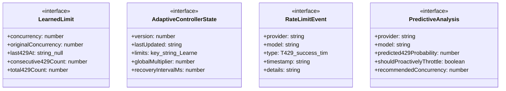
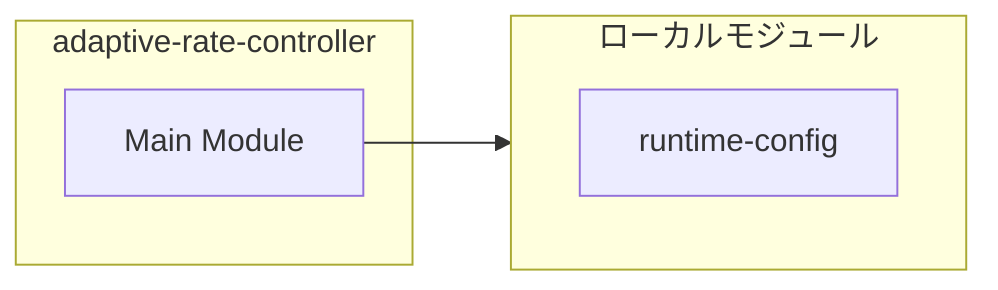
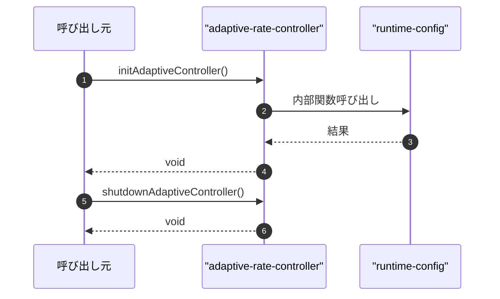

# adaptive-rate-controller

## 概要

`adaptive-rate-controller` モジュールのAPIリファレンス。

## インポート

```typescript
// from 'node:fs': readFileSync, existsSync, writeFileSync, ...
// from 'node:os': homedir
// from 'node:path': join
// from './runtime-config.js': getRuntimeConfig, RuntimeConfig
```

## エクスポート一覧

| 種別 | 名前 | 説明 |
|------|------|------|
| 関数 | `initAdaptiveController` | アダプティブコントローラーを初期化する。 |
| 関数 | `shutdownAdaptiveController` | コントローラーをシャットダウン |
| 関数 | `getEffectiveLimit` | プロバイダーとモデルの有効な同時実行制限を取得 |
| 関数 | `recordEvent` | レート制限イベントを記録 |
| 関数 | `record429` | 429エラーを記録 |
| 関数 | `recordSuccess` | 成功を記録 |
| 関数 | `getAdaptiveState` | 適応制御の状態を取得する |
| 関数 | `getLearnedLimit` | 学習した制限を取得する |
| 関数 | `resetLearnedLimit` | 学習した制限をリセットする |
| 関数 | `resetAllLearnedLimits` | 全ての学習制限をリセットする |
| 関数 | `setGlobalMultiplier` | グローバル乗数を設定する |
| 関数 | `configureRecovery` | 復元パラメータを設定 |
| 関数 | `isRateLimitError` | レート制限エラー判定 |
| 関数 | `formatAdaptiveSummary` | 適応サマリーを整形 |
| 関数 | `analyze429Probability` | 429確率を分析 |
| 関数 | `getPredictiveAnalysis` | 予測分析を取得 |
| 関数 | `shouldProactivelyThrottle` | スロットル要否判定 |
| 関数 | `getPredictiveConcurrency` | 予測並列数を取得 |
| 関数 | `setPredictiveEnabled` | 予測機能の有効化 |
| 関数 | `setPredictiveThreshold` | 予測閾値を設定 |
| 関数 | `getSchedulerAwareLimit` | スケジューラ対応制限取得 |
| 関数 | `notifyScheduler429` | スケジューラに429エラーを通知する |
| 関数 | `notifySchedulerTimeout` | スケジューラにタイムアウトを通知する |
| 関数 | `notifySchedulerSuccess` | スケジューラに成功を通知する |
| 関数 | `getCombinedRateControlSummary` | レート制限の統合サマリを取得する |
| インターフェース | `LearnedLimit` | 学習された同時実行制限と状態を保持 |
| インターフェース | `AdaptiveControllerState` | - |
| インターフェース | `RateLimitEvent` | レート制限イベント |
| インターフェース | `PredictiveAnalysis` | 予測分析結果を保持 |

## 図解

### クラス図



### 依存関係図



### 関数フロー

```mermaid
flowchart TD
  analyze429Probability["analyze429Probability()"]
  buildKey["buildKey()"]
  clampConcurrency["clampConcurrency()"]
  configureRecovery["configureRecovery()"]
  ensureState["ensureState()"]
  formatAdaptiveSummary["formatAdaptiveSummary()"]
  getAdaptiveState["getAdaptiveState()"]
  getEffectiveLimit["getEffectiveLimit()"]
  getLearnedLimit["getLearnedLimit()"]
  getPredictiveAnalysis["getPredictiveAnalysis()"]
  initAdaptiveController["initAdaptiveController()"]
  isRateLimitError["isRateLimitError()"]
  loadState["loadState()"]
  processRecovery["processRecovery()"]
  record429["record429()"]
  recordEvent["recordEvent()"]
  recordSuccess["recordSuccess()"]
  resetAllLearnedLimits["resetAllLearnedLimits()"]
  resetLearnedLimit["resetLearnedLimit()"]
  saveState["saveState()"]
  scheduleRecovery["scheduleRecovery()"]
  setGlobalMultiplier["setGlobalMultiplier()"]
  shutdownAdaptiveController["shutdownAdaptiveController()"]
  updateHistorical429s["updateHistorical429s()"]
  analyze429Probability --> buildKey
  analyze429Probability --> ensureState
  configureRecovery --> ensureState
  configureRecovery --> saveState
  formatAdaptiveSummary --> ensureState
  getAdaptiveState --> ensureState
  getEffectiveLimit --> buildKey
  getEffectiveLimit --> clampConcurrency
  getEffectiveLimit --> ensureState
  getEffectiveLimit --> saveState
  getLearnedLimit --> buildKey
  getLearnedLimit --> ensureState
  getPredictiveAnalysis --> ensureState
  initAdaptiveController --> loadState
  initAdaptiveController --> processRecovery
  record429 --> recordEvent
  recordEvent --> buildKey
  recordEvent --> clampConcurrency
  recordEvent --> ensureState
  recordEvent --> saveState
  recordEvent --> scheduleRecovery
  recordEvent --> updateHistorical429s
  recordSuccess --> recordEvent
  resetAllLearnedLimits --> ensureState
  resetAllLearnedLimits --> saveState
  resetLearnedLimit --> buildKey
  resetLearnedLimit --> ensureState
  resetLearnedLimit --> saveState
  setGlobalMultiplier --> ensureState
  setGlobalMultiplier --> saveState
```



### シーケンス図



## 関数

### getDefaultState

```typescript
getDefaultState(): AdaptiveControllerState
```

Get default state from centralized RuntimeConfig.

**戻り値**: `AdaptiveControllerState`

### buildKey

```typescript
buildKey(provider: string, model: string): string
```

**パラメータ**

| 名前 | 型 | 必須 |
|------|-----|------|
| provider | `string` | はい |
| model | `string` | はい |

**戻り値**: `string`

### loadState

```typescript
loadState(): AdaptiveControllerState
```

**戻り値**: `AdaptiveControllerState`

### saveState

```typescript
saveState(): void
```

**戻り値**: `void`

### ensureState

```typescript
ensureState(): AdaptiveControllerState
```

**戻り値**: `AdaptiveControllerState`

### clampConcurrency

```typescript
clampConcurrency(value: number): number
```

**パラメータ**

| 名前 | 型 | 必須 |
|------|-----|------|
| value | `number` | はい |

**戻り値**: `number`

### scheduleRecovery

```typescript
scheduleRecovery(provider: string, model: string): void
```

**パラメータ**

| 名前 | 型 | 必須 |
|------|-----|------|
| provider | `string` | はい |
| model | `string` | はい |

**戻り値**: `void`

### processRecovery

```typescript
processRecovery(): void
```

**戻り値**: `void`

### initAdaptiveController

```typescript
initAdaptiveController(): void
```

アダプティブコントローラーを初期化する。

**戻り値**: `void`

### shutdownAdaptiveController

```typescript
shutdownAdaptiveController(): void
```

コントローラーをシャットダウン

**戻り値**: `void`

### getEffectiveLimit

```typescript
getEffectiveLimit(provider: string, model: string, presetLimit: number): number
```

プロバイダーとモデルの有効な同時実行制限を取得

**パラメータ**

| 名前 | 型 | 必須 |
|------|-----|------|
| provider | `string` | はい |
| model | `string` | はい |
| presetLimit | `number` | はい |

**戻り値**: `number`

### recordEvent

```typescript
recordEvent(event: RateLimitEvent): void
```

レート制限イベントを記録

**パラメータ**

| 名前 | 型 | 必須 |
|------|-----|------|
| event | `RateLimitEvent` | はい |

**戻り値**: `void`

### record429

```typescript
record429(provider: string, model: string, details?: string): void
```

429エラーを記録

**パラメータ**

| 名前 | 型 | 必須 |
|------|-----|------|
| provider | `string` | はい |
| model | `string` | はい |
| details | `string` | いいえ |

**戻り値**: `void`

### recordSuccess

```typescript
recordSuccess(provider: string, model: string): void
```

成功を記録

**パラメータ**

| 名前 | 型 | 必須 |
|------|-----|------|
| provider | `string` | はい |
| model | `string` | はい |

**戻り値**: `void`

### getAdaptiveState

```typescript
getAdaptiveState(): AdaptiveControllerState
```

適応制御の状態を取得する

**戻り値**: `AdaptiveControllerState`

### getLearnedLimit

```typescript
getLearnedLimit(provider: string, model: string): LearnedLimit | undefined
```

学習した制限を取得する

**パラメータ**

| 名前 | 型 | 必須 |
|------|-----|------|
| provider | `string` | はい |
| model | `string` | はい |

**戻り値**: `LearnedLimit | undefined`

### resetLearnedLimit

```typescript
resetLearnedLimit(provider: string, model: string, newLimit?: number): void
```

学習した制限をリセットする

**パラメータ**

| 名前 | 型 | 必須 |
|------|-----|------|
| provider | `string` | はい |
| model | `string` | はい |
| newLimit | `number` | いいえ |

**戻り値**: `void`

### resetAllLearnedLimits

```typescript
resetAllLearnedLimits(): void
```

全ての学習制限をリセットする

**戻り値**: `void`

### setGlobalMultiplier

```typescript
setGlobalMultiplier(multiplier: number): void
```

グローバル乗数を設定する

**パラメータ**

| 名前 | 型 | 必須 |
|------|-----|------|
| multiplier | `number` | はい |

**戻り値**: `void`

### configureRecovery

```typescript
configureRecovery(options: {
  recoveryIntervalMs?: number;
  reductionFactor?: number;
  recoveryFactor?: number;
}): void
```

復元パラメータを設定

**パラメータ**

| 名前 | 型 | 必須 |
|------|-----|------|
| options | `object` | はい |
| &nbsp;&nbsp;↳ recoveryIntervalMs | `number` | いいえ |
| &nbsp;&nbsp;↳ reductionFactor | `number` | いいえ |
| &nbsp;&nbsp;↳ recoveryFactor | `number` | いいえ |

**戻り値**: `void`

### isRateLimitError

```typescript
isRateLimitError(error: unknown): boolean
```

レート制限エラー判定

**パラメータ**

| 名前 | 型 | 必須 |
|------|-----|------|
| error | `unknown` | はい |

**戻り値**: `boolean`

### formatAdaptiveSummary

```typescript
formatAdaptiveSummary(): string
```

適応サマリーを整形

**戻り値**: `string`

### analyze429Probability

```typescript
analyze429Probability(provider: string, model: string): number
```

429確率を分析

**パラメータ**

| 名前 | 型 | 必須 |
|------|-----|------|
| provider | `string` | はい |
| model | `string` | はい |

**戻り値**: `number`

### getPredictiveAnalysis

```typescript
getPredictiveAnalysis(provider: string, model: string): PredictiveAnalysis
```

予測分析を取得

**パラメータ**

| 名前 | 型 | 必須 |
|------|-----|------|
| provider | `string` | はい |
| model | `string` | はい |

**戻り値**: `PredictiveAnalysis`

### shouldProactivelyThrottle

```typescript
shouldProactivelyThrottle(provider: string, model: string): boolean
```

スロットル要否判定

**パラメータ**

| 名前 | 型 | 必須 |
|------|-----|------|
| provider | `string` | はい |
| model | `string` | はい |

**戻り値**: `boolean`

### getPredictiveConcurrency

```typescript
getPredictiveConcurrency(provider: string, model: string, currentConcurrency: number): number
```

予測並列数を取得

**パラメータ**

| 名前 | 型 | 必須 |
|------|-----|------|
| provider | `string` | はい |
| model | `string` | はい |
| currentConcurrency | `number` | はい |

**戻り値**: `number`

### updateHistorical429s

```typescript
updateHistorical429s(limit: LearnedLimit): void
```

Update historical 429 data (called on 429 events).

**パラメータ**

| 名前 | 型 | 必須 |
|------|-----|------|
| limit | `LearnedLimit` | はい |

**戻り値**: `void`

### setPredictiveEnabled

```typescript
setPredictiveEnabled(enabled: boolean): void
```

予測機能の有効化

**パラメータ**

| 名前 | 型 | 必須 |
|------|-----|------|
| enabled | `boolean` | はい |

**戻り値**: `void`

### setPredictiveThreshold

```typescript
setPredictiveThreshold(threshold: number): void
```

予測閾値を設定

**パラメータ**

| 名前 | 型 | 必須 |
|------|-----|------|
| threshold | `number` | はい |

**戻り値**: `void`

### getSchedulerAwareLimit

```typescript
getSchedulerAwareLimit(provider: string, model: string, baseLimit?: number): number
```

スケジューラ対応制限取得

**パラメータ**

| 名前 | 型 | 必須 |
|------|-----|------|
| provider | `string` | はい |
| model | `string` | はい |
| baseLimit | `number` | いいえ |

**戻り値**: `number`

### notifyScheduler429

```typescript
notifyScheduler429(provider: string, model: string, details?: string): void
```

スケジューラに429エラーを通知する

**パラメータ**

| 名前 | 型 | 必須 |
|------|-----|------|
| provider | `string` | はい |
| model | `string` | はい |
| details | `string` | いいえ |

**戻り値**: `void`

### notifySchedulerTimeout

```typescript
notifySchedulerTimeout(provider: string, model: string): void
```

スケジューラにタイムアウトを通知する

**パラメータ**

| 名前 | 型 | 必須 |
|------|-----|------|
| provider | `string` | はい |
| model | `string` | はい |

**戻り値**: `void`

### notifySchedulerSuccess

```typescript
notifySchedulerSuccess(provider: string, model: string, responseMs?: number): void
```

スケジューラに成功を通知する

**パラメータ**

| 名前 | 型 | 必須 |
|------|-----|------|
| provider | `string` | はい |
| model | `string` | はい |
| responseMs | `number` | いいえ |

**戻り値**: `void`

### getCombinedRateControlSummary

```typescript
getCombinedRateControlSummary(provider: string, model: string): {
  adaptiveLimit: number;
  originalLimit: number;
  predictiveLimit: number;
  predicted429Probability: number;
  shouldThrottle: boolean;
  recent429Count: number;
}
```

レート制限の統合サマリを取得する

**パラメータ**

| 名前 | 型 | 必須 |
|------|-----|------|
| provider | `string` | はい |
| model | `string` | はい |

**戻り値**: `{
  adaptiveLimit: number;
  originalLimit: number;
  predictiveLimit: number;
  predicted429Probability: number;
  shouldThrottle: boolean;
  recent429Count: number;
}`

## インターフェース

### LearnedLimit

```typescript
interface LearnedLimit {
  concurrency: number;
  originalConcurrency: number;
  last429At: string | null;
  consecutive429Count: number;
  total429Count: number;
  lastSuccessAt: string | null;
  recoveryScheduled: boolean;
  notes?: string;
  historical429s?: string[];
  predicted429Probability?: number;
  rampUpSchedule?: number[];
}
```

学習された同時実行制限と状態を保持

### AdaptiveControllerState

```typescript
interface AdaptiveControllerState {
  version: number;
  lastUpdated: string;
  limits: {
    [key: string]: LearnedLimit; // "provider:model"
  };
  globalMultiplier: number;
  recoveryIntervalMs: number;
  reductionFactor: number;
  recoveryFactor: number;
  predictiveEnabled: boolean;
  predictiveThreshold: number;
}
```

### RateLimitEvent

```typescript
interface RateLimitEvent {
  provider: string;
  model: string;
  type: "429" | "success" | "timeout" | "error";
  timestamp: string;
  details?: string;
}
```

レート制限イベント

### PredictiveAnalysis

```typescript
interface PredictiveAnalysis {
  provider: string;
  model: string;
  predicted429Probability: number;
  shouldProactivelyThrottle: boolean;
  recommendedConcurrency: number;
  nextRiskWindow?: { start: Date; end: Date };
  confidence: number;
}
```

予測分析結果を保持

---
*自動生成: 2026-02-18T15:54:41.430Z*
