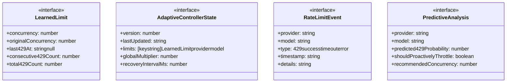
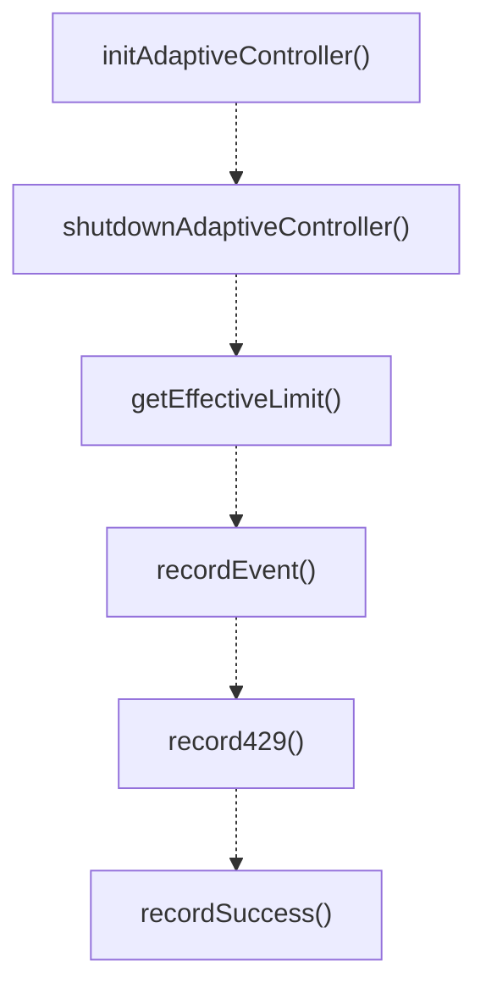
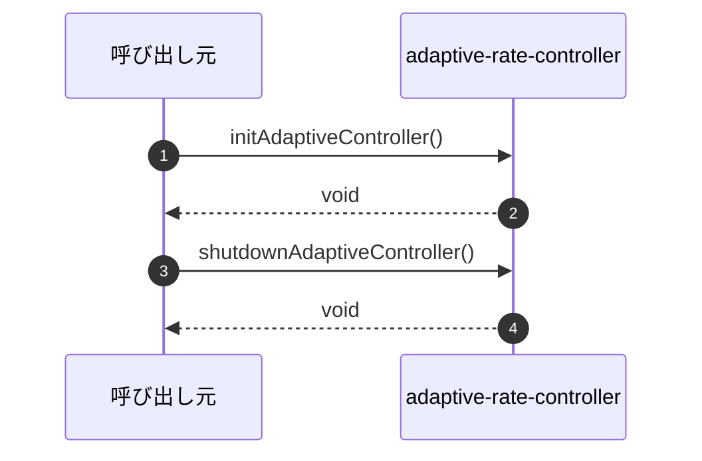

# adaptive-rate-controller

## 概要

`adaptive-rate-controller` モジュールのAPIリファレンス。

## インポート

```typescript
import { readFileSync, existsSync, writeFileSync... } from 'node:fs';
import { homedir } from 'node:os';
import { join } from 'node:path';
```

## エクスポート一覧

| 種別 | 名前 | 説明 |
|------|------|------|
| 関数 | `initAdaptiveController` | Initialize the adaptive controller. |
| 関数 | `shutdownAdaptiveController` | Shutdown the adaptive controller. |
| 関数 | `getEffectiveLimit` | Get the effective concurrency limit for a provider |
| 関数 | `recordEvent` | Record a rate limit event. |
| 関数 | `record429` | Record a 429 error. |
| 関数 | `recordSuccess` | Record a successful request. |
| 関数 | `getAdaptiveState` | Get current state (for debugging). |
| 関数 | `getLearnedLimit` | Get learned limit for a specific provider/model. |
| 関数 | `resetLearnedLimit` | Reset learned limits for a provider/model. |
| 関数 | `resetAllLearnedLimits` | Reset all learned limits. |
| 関数 | `setGlobalMultiplier` | Set global multiplier (affects all limits). |
| 関数 | `configureRecovery` | Configure recovery parameters. |
| 関数 | `isRateLimitError` | Check if error message indicates a rate limit. |
| 関数 | `formatAdaptiveSummary` | Build a summary of the adaptive controller state. |
| 関数 | `analyze429Probability` | Analyze historical 429 patterns and predict probab |
| 関数 | `getPredictiveAnalysis` | Get predictive analysis for a provider/model. |
| 関数 | `shouldProactivelyThrottle` | Check if we should proactively throttle based on p |
| 関数 | `getPredictiveConcurrency` | Get recommended concurrency considering prediction |
| 関数 | `setPredictiveEnabled` | Enable or disable predictive scheduling. |
| 関数 | `setPredictiveThreshold` | Set predictive threshold (0-1). |
| 関数 | `getSchedulerAwareLimit` | Get scheduler-aware limit for a provider/model. |
| 関数 | `notifyScheduler429` | Notify the scheduler of a 429 error. |
| 関数 | `notifySchedulerTimeout` | Notify the scheduler of a timeout error. |
| 関数 | `notifySchedulerSuccess` | Notify the scheduler of a successful request. |
| 関数 | `getCombinedRateControlSummary` | Get combined rate control summary for a provider/m |
| インターフェース | `LearnedLimit` | - |
| インターフェース | `AdaptiveControllerState` | - |
| インターフェース | `RateLimitEvent` | - |
| インターフェース | `PredictiveAnalysis` | - |

## 図解

### クラス図



### 関数フロー



### シーケンス図



## 関数

### buildKey

```typescript
buildKey(provider: string, model: string): string
```

**パラメータ**

| 名前 | 型 | 必須 |
|------|-----|------|
| provider | `string` | はい |
| model | `string` | はい |

**戻り値**: `string`

### loadState

```typescript
loadState(): AdaptiveControllerState
```

**戻り値**: `AdaptiveControllerState`

### saveState

```typescript
saveState(): void
```

**戻り値**: `void`

### ensureState

```typescript
ensureState(): AdaptiveControllerState
```

**戻り値**: `AdaptiveControllerState`

### clampConcurrency

```typescript
clampConcurrency(value: number): number
```

**パラメータ**

| 名前 | 型 | 必須 |
|------|-----|------|
| value | `number` | はい |

**戻り値**: `number`

### scheduleRecovery

```typescript
scheduleRecovery(provider: string, model: string): void
```

**パラメータ**

| 名前 | 型 | 必須 |
|------|-----|------|
| provider | `string` | はい |
| model | `string` | はい |

**戻り値**: `void`

### processRecovery

```typescript
processRecovery(): void
```

**戻り値**: `void`

### initAdaptiveController

```typescript
initAdaptiveController(): void
```

Initialize the adaptive controller.
Should be called once at startup.

**戻り値**: `void`

### shutdownAdaptiveController

```typescript
shutdownAdaptiveController(): void
```

Shutdown the adaptive controller.

**戻り値**: `void`

### getEffectiveLimit

```typescript
getEffectiveLimit(provider: string, model: string, presetLimit: number): number
```

Get the effective concurrency limit for a provider/model.
Combines preset limit with learned adjustments.

**パラメータ**

| 名前 | 型 | 必須 |
|------|-----|------|
| provider | `string` | はい |
| model | `string` | はい |
| presetLimit | `number` | はい |

**戻り値**: `number`

### recordEvent

```typescript
recordEvent(event: RateLimitEvent): void
```

Record a rate limit event.

**パラメータ**

| 名前 | 型 | 必須 |
|------|-----|------|
| event | `RateLimitEvent` | はい |

**戻り値**: `void`

### record429

```typescript
record429(provider: string, model: string, details?: string): void
```

Record a 429 error.

**パラメータ**

| 名前 | 型 | 必須 |
|------|-----|------|
| provider | `string` | はい |
| model | `string` | はい |
| details | `string` | いいえ |

**戻り値**: `void`

### recordSuccess

```typescript
recordSuccess(provider: string, model: string): void
```

Record a successful request.

**パラメータ**

| 名前 | 型 | 必須 |
|------|-----|------|
| provider | `string` | はい |
| model | `string` | はい |

**戻り値**: `void`

### getAdaptiveState

```typescript
getAdaptiveState(): AdaptiveControllerState
```

Get current state (for debugging).

**戻り値**: `AdaptiveControllerState`

### getLearnedLimit

```typescript
getLearnedLimit(provider: string, model: string): LearnedLimit | undefined
```

Get learned limit for a specific provider/model.

**パラメータ**

| 名前 | 型 | 必須 |
|------|-----|------|
| provider | `string` | はい |
| model | `string` | はい |

**戻り値**: `LearnedLimit | undefined`

### resetLearnedLimit

```typescript
resetLearnedLimit(provider: string, model: string, newLimit?: number): void
```

Reset learned limits for a provider/model.

**パラメータ**

| 名前 | 型 | 必須 |
|------|-----|------|
| provider | `string` | はい |
| model | `string` | はい |
| newLimit | `number` | いいえ |

**戻り値**: `void`

### resetAllLearnedLimits

```typescript
resetAllLearnedLimits(): void
```

Reset all learned limits.

**戻り値**: `void`

### setGlobalMultiplier

```typescript
setGlobalMultiplier(multiplier: number): void
```

Set global multiplier (affects all limits).

**パラメータ**

| 名前 | 型 | 必須 |
|------|-----|------|
| multiplier | `number` | はい |

**戻り値**: `void`

### configureRecovery

```typescript
configureRecovery(options: {
  recoveryIntervalMs?: number;
  reductionFactor?: number;
  recoveryFactor?: number;
}): void
```

Configure recovery parameters.

**パラメータ**

| 名前 | 型 | 必須 |
|------|-----|------|
| options | `{
  recoveryIntervalMs?: number;
  reductionFactor?: number;
  recoveryFactor?: number;
}` | はい |

**戻り値**: `void`

### isRateLimitError

```typescript
isRateLimitError(error: unknown): boolean
```

Check if error message indicates a rate limit.

**パラメータ**

| 名前 | 型 | 必須 |
|------|-----|------|
| error | `unknown` | はい |

**戻り値**: `boolean`

### formatAdaptiveSummary

```typescript
formatAdaptiveSummary(): string
```

Build a summary of the adaptive controller state.

**戻り値**: `string`

### analyze429Probability

```typescript
analyze429Probability(provider: string, model: string): number
```

Analyze historical 429 patterns and predict probability.
Uses a simple time-based model: recent 429s increase probability.

**パラメータ**

| 名前 | 型 | 必須 |
|------|-----|------|
| provider | `string` | はい |
| model | `string` | はい |

**戻り値**: `number`

### getPredictiveAnalysis

```typescript
getPredictiveAnalysis(provider: string, model: string): PredictiveAnalysis
```

Get predictive analysis for a provider/model.

**パラメータ**

| 名前 | 型 | 必須 |
|------|-----|------|
| provider | `string` | はい |
| model | `string` | はい |

**戻り値**: `PredictiveAnalysis`

### shouldProactivelyThrottle

```typescript
shouldProactivelyThrottle(provider: string, model: string): boolean
```

Check if we should proactively throttle based on predictions.

**パラメータ**

| 名前 | 型 | 必須 |
|------|-----|------|
| provider | `string` | はい |
| model | `string` | はい |

**戻り値**: `boolean`

### getPredictiveConcurrency

```typescript
getPredictiveConcurrency(provider: string, model: string, currentConcurrency: number): number
```

Get recommended concurrency considering predictions.

**パラメータ**

| 名前 | 型 | 必須 |
|------|-----|------|
| provider | `string` | はい |
| model | `string` | はい |
| currentConcurrency | `number` | はい |

**戻り値**: `number`

### updateHistorical429s

```typescript
updateHistorical429s(limit: LearnedLimit): void
```

Update historical 429 data (called on 429 events).

**パラメータ**

| 名前 | 型 | 必須 |
|------|-----|------|
| limit | `LearnedLimit` | はい |

**戻り値**: `void`

### setPredictiveEnabled

```typescript
setPredictiveEnabled(enabled: boolean): void
```

Enable or disable predictive scheduling.

**パラメータ**

| 名前 | 型 | 必須 |
|------|-----|------|
| enabled | `boolean` | はい |

**戻り値**: `void`

### setPredictiveThreshold

```typescript
setPredictiveThreshold(threshold: number): void
```

Set predictive threshold (0-1).

**パラメータ**

| 名前 | 型 | 必須 |
|------|-----|------|
| threshold | `number` | はい |

**戻り値**: `void`

### getSchedulerAwareLimit

```typescript
getSchedulerAwareLimit(provider: string, model: string, baseLimit?: number): number
```

Get scheduler-aware limit for a provider/model.
This combines:
1. Adaptive learned limits
2. Predictive throttling
3. Dynamic parallelism adjuster

**パラメータ**

| 名前 | 型 | 必須 |
|------|-----|------|
| provider | `string` | はい |
| model | `string` | はい |
| baseLimit | `number` | いいえ |

**戻り値**: `number`

### notifyScheduler429

```typescript
notifyScheduler429(provider: string, model: string, details?: string): void
```

Notify the scheduler of a 429 error.
This is a convenience function that wraps record429.

**パラメータ**

| 名前 | 型 | 必須 |
|------|-----|------|
| provider | `string` | はい |
| model | `string` | はい |
| details | `string` | いいえ |

**戻り値**: `void`

### notifySchedulerTimeout

```typescript
notifySchedulerTimeout(provider: string, model: string): void
```

Notify the scheduler of a timeout error.

**パラメータ**

| 名前 | 型 | 必須 |
|------|-----|------|
| provider | `string` | はい |
| model | `string` | はい |

**戻り値**: `void`

### notifySchedulerSuccess

```typescript
notifySchedulerSuccess(provider: string, model: string, responseMs?: number): void
```

Notify the scheduler of a successful request.

**パラメータ**

| 名前 | 型 | 必須 |
|------|-----|------|
| provider | `string` | はい |
| model | `string` | はい |
| responseMs | `number` | いいえ |

**戻り値**: `void`

### getCombinedRateControlSummary

```typescript
getCombinedRateControlSummary(provider: string, model: string): {
  adaptiveLimit: number;
  originalLimit: number;
  predictiveLimit: number;
  predicted429Probability: number;
  shouldThrottle: boolean;
  recent429Count: number;
}
```

Get combined rate control summary for a provider/model.

**パラメータ**

| 名前 | 型 | 必須 |
|------|-----|------|
| provider | `string` | はい |
| model | `string` | はい |

**戻り値**: `{
  adaptiveLimit: number;
  originalLimit: number;
  predictiveLimit: number;
  predicted429Probability: number;
  shouldThrottle: boolean;
  recent429Count: number;
}`

## インターフェース

### LearnedLimit

```typescript
interface LearnedLimit {
  concurrency: number;
  originalConcurrency: number;
  last429At: string | null;
  consecutive429Count: number;
  total429Count: number;
  lastSuccessAt: string | null;
  recoveryScheduled: boolean;
  notes?: string;
  historical429s?: string[];
  predicted429Probability?: number;
  rampUpSchedule?: number[];
}
```

### AdaptiveControllerState

```typescript
interface AdaptiveControllerState {
  version: number;
  lastUpdated: string;
  limits: {
    [key: string]: LearnedLimit; // "provider:model"
  };
  globalMultiplier: number;
  recoveryIntervalMs: number;
  reductionFactor: number;
  recoveryFactor: number;
  predictiveEnabled: boolean;
  predictiveThreshold: number;
}
```

### RateLimitEvent

```typescript
interface RateLimitEvent {
  provider: string;
  model: string;
  type: "429" | "success" | "timeout" | "error";
  timestamp: string;
  details?: string;
}
```

### PredictiveAnalysis

```typescript
interface PredictiveAnalysis {
  provider: string;
  model: string;
  predicted429Probability: number;
  shouldProactivelyThrottle: boolean;
  recommendedConcurrency: number;
  nextRiskWindow?: { start: Date; end: Date };
  confidence: number;
}
```

---
*自動生成: 2026-02-17T21:54:59.744Z*
