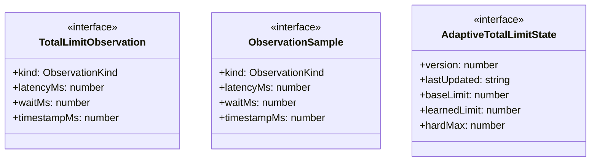
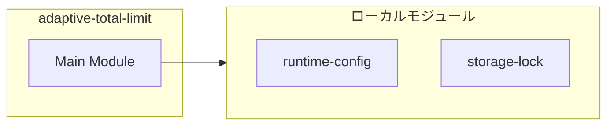
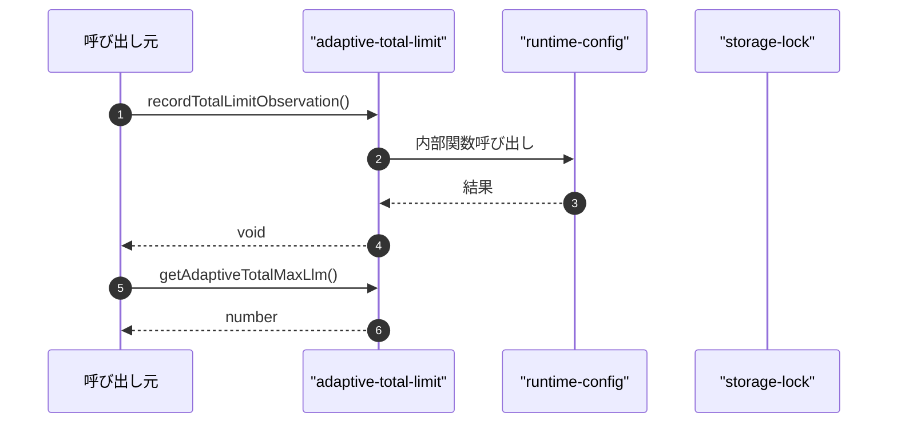

# adaptive-total-limit

## 概要

`adaptive-total-limit` モジュールのAPIリファレンス。

## インポート

```typescript
// from 'node:fs': existsSync, mkdirSync, readFileSync, ...
// from 'node:os': homedir
// from 'node:path': join
// from './runtime-config.js': getRuntimeConfig
// from './storage-lock.js': withFileLock
```

## エクスポート一覧

| 種別 | 名前 | 説明 |
|------|------|------|
| 関数 | `recordTotalLimitObservation` | 制限値の観測データを記録 |
| 関数 | `getAdaptiveTotalMaxLlm` | 適応制限の最大値を取得 |
| 関数 | `getAdaptiveTotalLimitSnapshot` | 現在の適応制限スナップショットを取得 |
| 関数 | `resetAdaptiveTotalLimitState` | Adaptive total limit state をリセットする。 |
| 関数 | `__resetAdaptiveTotalLimitStateForTests` | 適応制限状態リセット |
| 関数 | `__setAdaptiveTotalLimitNowProviderForTests` | テスト用現在時刻設定 |
| インターフェース | `TotalLimitObservation` | 制限値の観測データインターフェース |

## 図解

### クラス図



### 依存関係図



### 関数フロー

```mermaid
flowchart TD
  resetAdaptiveTotalLimitStateForTests["__resetAdaptiveTotalLimitStateForTests()"]
  setAdaptiveTotalLimitNowProviderForTests["__setAdaptiveTotalLimitNowProviderForTests()"]
  adaptiveNowProvider["adaptiveNowProvider()"]
  clamp["clamp()"]
  createDefaultState["createDefaultState()"]
  decideNextLimit["decideNextLimit()"]
  getAdaptiveTotalLimitSnapshot["getAdaptiveTotalLimitSnapshot()"]
  getAdaptiveTotalMaxLlm["getAdaptiveTotalMaxLlm()"]
  getDefaultBaseLimit["getDefaultBaseLimit()"]
  isAdaptiveEnabled["isAdaptiveEnabled()"]
  loadState["loadState()"]
  maybeRunDecision["maybeRunDecision()"]
  nowMs["nowMs()"]
  recordTotalLimitObservation["recordTotalLimitObservation()"]
  resetAdaptiveTotalLimitState["resetAdaptiveTotalLimitState()"]
  resolveHardMax["resolveHardMax()"]
  resolveMinLimit["resolveMinLimit()"]
  safeParseState["safeParseState()"]
  saveState["saveState()"]
  toFiniteInteger["toFiniteInteger()"]
  toSafeObservation["toSafeObservation()"]
  trimWindow["trimWindow()"]
  updateBaseConstraints["updateBaseConstraints()"]
  withStateWriteLock["withStateWriteLock()"]
  getAdaptiveTotalLimitSnapshot --> isAdaptiveEnabled
  getAdaptiveTotalLimitSnapshot --> loadState
  getAdaptiveTotalMaxLlm --> clamp
  getAdaptiveTotalMaxLlm --> isAdaptiveEnabled
  getAdaptiveTotalMaxLlm --> maybeRunDecision
  getAdaptiveTotalMaxLlm --> nowMs
  getAdaptiveTotalMaxLlm --> trimWindow
  getAdaptiveTotalMaxLlm --> updateBaseConstraints
  getAdaptiveTotalMaxLlm --> withStateWriteLock
  getDefaultBaseLimit --> clamp
  loadState --> safeParseState
  maybeRunDecision --> decideNextLimit
  nowMs --> adaptiveNowProvider
  recordTotalLimitObservation --> getDefaultBaseLimit
  recordTotalLimitObservation --> isAdaptiveEnabled
  recordTotalLimitObservation --> maybeRunDecision
  recordTotalLimitObservation --> nowMs
  recordTotalLimitObservation --> toSafeObservation
  recordTotalLimitObservation --> trimWindow
  recordTotalLimitObservation --> updateBaseConstraints
  recordTotalLimitObservation --> withStateWriteLock
  resetAdaptiveTotalLimitState --> createDefaultState
  resetAdaptiveTotalLimitState --> getDefaultBaseLimit
  resetAdaptiveTotalLimitState --> isAdaptiveEnabled
  resetAdaptiveTotalLimitState --> loadState
  resetAdaptiveTotalLimitState --> withStateWriteLock
  toSafeObservation --> clamp
  toSafeObservation --> toFiniteInteger
  updateBaseConstraints --> clamp
  updateBaseConstraints --> resolveHardMax
  updateBaseConstraints --> resolveMinLimit
  withStateWriteLock --> loadState
  withStateWriteLock --> saveState
```



### シーケンス図



## 関数

### adaptiveNowProvider

```typescript
adaptiveNowProvider(): void
```

**戻り値**: `void`

### nowMs

```typescript
nowMs(): number
```

**戻り値**: `number`

### toFiniteInteger

```typescript
toFiniteInteger(value: unknown): number | undefined
```

**パラメータ**

| 名前 | 型 | 必須 |
|------|-----|------|
| value | `unknown` | はい |

**戻り値**: `number | undefined`

### clamp

```typescript
clamp(value: number, min: number, max: number): number
```

**パラメータ**

| 名前 | 型 | 必須 |
|------|-----|------|
| value | `number` | はい |
| min | `number` | はい |
| max | `number` | はい |

**戻り値**: `number`

### parseEnvLimit

```typescript
parseEnvLimit(name: string, min: number, max: number): number | undefined
```

**パラメータ**

| 名前 | 型 | 必須 |
|------|-----|------|
| name | `string` | はい |
| min | `number` | はい |
| max | `number` | はい |

**戻り値**: `number | undefined`

### resolveHardMax

```typescript
resolveHardMax(baseLimit: number): number
```

**パラメータ**

| 名前 | 型 | 必須 |
|------|-----|------|
| baseLimit | `number` | はい |

**戻り値**: `number`

### resolveMinLimit

```typescript
resolveMinLimit(baseLimit: number): number
```

**パラメータ**

| 名前 | 型 | 必須 |
|------|-----|------|
| baseLimit | `number` | はい |

**戻り値**: `number`

### getDefaultBaseLimit

```typescript
getDefaultBaseLimit(): number
```

**戻り値**: `number`

### createDefaultState

```typescript
createDefaultState(baseLimit: number): AdaptiveTotalLimitState
```

**パラメータ**

| 名前 | 型 | 必須 |
|------|-----|------|
| baseLimit | `number` | はい |

**戻り値**: `AdaptiveTotalLimitState`

### isAdaptiveEnabled

```typescript
isAdaptiveEnabled(): boolean
```

**戻り値**: `boolean`

### ensureRuntimeDir

```typescript
ensureRuntimeDir(): void
```

**戻り値**: `void`

### safeParseState

```typescript
safeParseState(raw: string): AdaptiveTotalLimitState | null
```

**パラメータ**

| 名前 | 型 | 必須 |
|------|-----|------|
| raw | `string` | はい |

**戻り値**: `AdaptiveTotalLimitState | null`

### loadState

```typescript
loadState(): AdaptiveTotalLimitState
```

**戻り値**: `AdaptiveTotalLimitState`

### saveState

```typescript
saveState(state: AdaptiveTotalLimitState): void
```

**パラメータ**

| 名前 | 型 | 必須 |
|------|-----|------|
| state | `AdaptiveTotalLimitState` | はい |

**戻り値**: `void`

### withStateWriteLock

```typescript
withStateWriteLock(mutator: (draft: AdaptiveTotalLimitState) => T): T
```

**パラメータ**

| 名前 | 型 | 必須 |
|------|-----|------|
| mutator | `(draft: AdaptiveTotalLimitState) => T` | はい |

**戻り値**: `T`

### trimWindow

```typescript
trimWindow(samples: ObservationSample[], now: number): ObservationSample[]
```

**パラメータ**

| 名前 | 型 | 必須 |
|------|-----|------|
| samples | `ObservationSample[]` | はい |
| now | `number` | はい |

**戻り値**: `ObservationSample[]`

### toPercentile

```typescript
toPercentile(values: number[], percentile: number): number
```

**パラメータ**

| 名前 | 型 | 必須 |
|------|-----|------|
| values | `number[]` | はい |
| percentile | `number` | はい |

**戻り値**: `number`

### updateBaseConstraints

```typescript
updateBaseConstraints(state: AdaptiveTotalLimitState, baseLimit: number): void
```

**パラメータ**

| 名前 | 型 | 必須 |
|------|-----|------|
| state | `AdaptiveTotalLimitState` | はい |
| baseLimit | `number` | はい |

**戻り値**: `void`

### decideNextLimit

```typescript
decideNextLimit(state: AdaptiveTotalLimitState, now: number): { next: number; reason: string; cooldownMs: number }
```

**パラメータ**

| 名前 | 型 | 必須 |
|------|-----|------|
| state | `AdaptiveTotalLimitState` | はい |
| now | `number` | はい |

**戻り値**: `{ next: number; reason: string; cooldownMs: number }`

### maybeRunDecision

```typescript
maybeRunDecision(state: AdaptiveTotalLimitState, now: number): void
```

**パラメータ**

| 名前 | 型 | 必須 |
|------|-----|------|
| state | `AdaptiveTotalLimitState` | はい |
| now | `number` | はい |

**戻り値**: `void`

### toSafeObservation

```typescript
toSafeObservation(observation: TotalLimitObservation, now: number): ObservationSample
```

**パラメータ**

| 名前 | 型 | 必須 |
|------|-----|------|
| observation | `TotalLimitObservation` | はい |
| now | `number` | はい |

**戻り値**: `ObservationSample`

### recordTotalLimitObservation

```typescript
recordTotalLimitObservation(observation: TotalLimitObservation, baseLimit?: number): void
```

制限値の観測データを記録

**パラメータ**

| 名前 | 型 | 必須 |
|------|-----|------|
| observation | `TotalLimitObservation` | はい |
| baseLimit | `number` | いいえ |

**戻り値**: `void`

### getAdaptiveTotalMaxLlm

```typescript
getAdaptiveTotalMaxLlm(baseLimit: number): number
```

適応制限の最大値を取得

**パラメータ**

| 名前 | 型 | 必須 |
|------|-----|------|
| baseLimit | `number` | はい |

**戻り値**: `number`

### getAdaptiveTotalLimitSnapshot

```typescript
getAdaptiveTotalLimitSnapshot(): {
  enabled: boolean;
  baseLimit: number;
  learnedLimit: number;
  hardMax: number;
  minLimit: number;
  sampleCount: number;
  lastReason: string;
}
```

現在の適応制限スナップショットを取得

**戻り値**: `{
  enabled: boolean;
  baseLimit: number;
  learnedLimit: number;
  hardMax: number;
  minLimit: number;
  sampleCount: number;
  lastReason: string;
}`

### resetAdaptiveTotalLimitState

```typescript
resetAdaptiveTotalLimitState(): {
  enabled: boolean;
  baseLimit: number;
  learnedLimit: number;
  hardMax: number;
  minLimit: number;
  sampleCount: number;
  lastReason: string;
}
```

Adaptive total limit state をリセットする。

**戻り値**: `{
  enabled: boolean;
  baseLimit: number;
  learnedLimit: number;
  hardMax: number;
  minLimit: number;
  sampleCount: number;
  lastReason: string;
}`

### __resetAdaptiveTotalLimitStateForTests

```typescript
__resetAdaptiveTotalLimitStateForTests(): void
```

適応制限状態リセット

**戻り値**: `void`

### __setAdaptiveTotalLimitNowProviderForTests

```typescript
__setAdaptiveTotalLimitNowProviderForTests(provider?: () => number): void
```

テスト用現在時刻設定

**パラメータ**

| 名前 | 型 | 必須 |
|------|-----|------|
| provider | `() => number` | いいえ |

**戻り値**: `void`

## インターフェース

### TotalLimitObservation

```typescript
interface TotalLimitObservation {
  kind: ObservationKind;
  latencyMs?: number;
  waitMs?: number;
  timestampMs?: number;
}
```

制限値の観測データインターフェース

### ObservationSample

```typescript
interface ObservationSample {
  kind: ObservationKind;
  latencyMs: number;
  waitMs: number;
  timestampMs: number;
}
```

### AdaptiveTotalLimitState

```typescript
interface AdaptiveTotalLimitState {
  version: number;
  lastUpdated: string;
  baseLimit: number;
  learnedLimit: number;
  hardMax: number;
  minLimit: number;
  lastDecisionAtMs: number;
  cooldownUntilMs: number;
  lastReason: string;
  samples: ObservationSample[];
}
```

## 型定義

### ObservationKind

```typescript
type ObservationKind = "success" | "rate_limit" | "timeout" | "error"
```

---
*自動生成: 2026-02-24T17:08:02.595Z*
