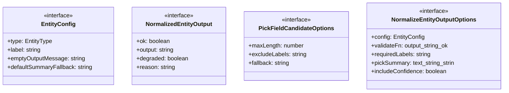
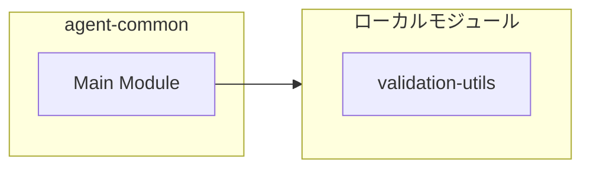
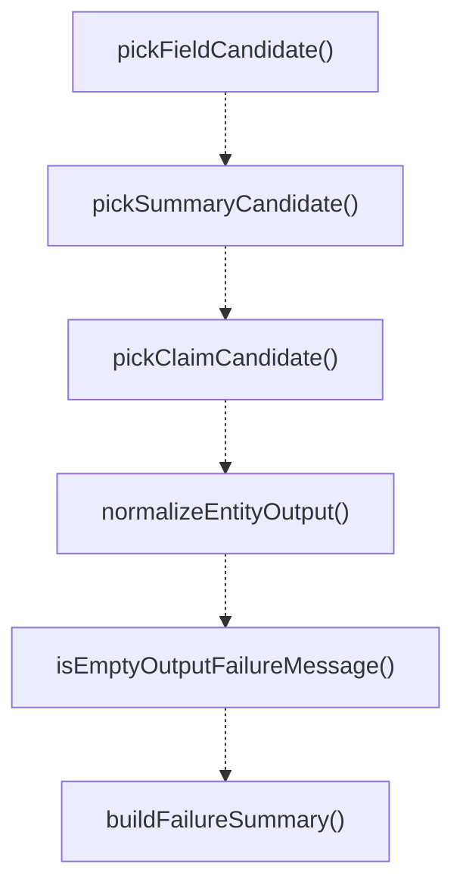
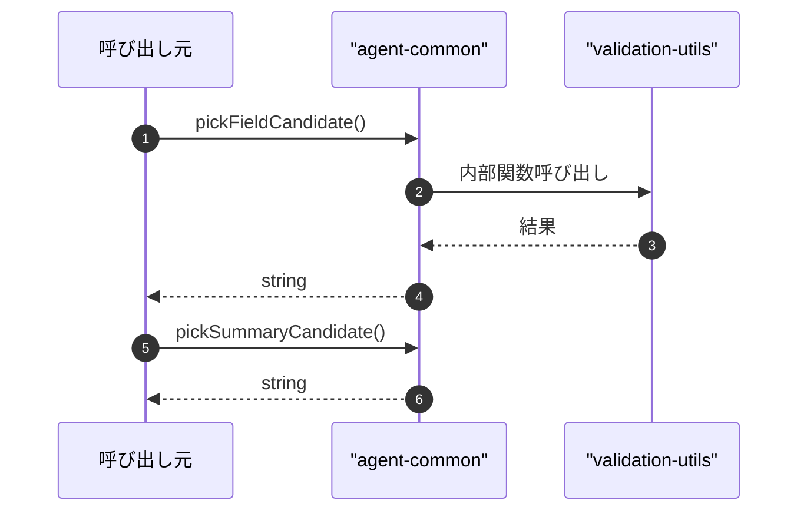

# agent-common

## 概要

`agent-common` モジュールのAPIリファレンス。

## インポート

```typescript
import { toFiniteNumberWithDefault } from './validation-utils.js';
```

## エクスポート一覧

| 種別 | 名前 | 説明 |
|------|------|------|
| 関数 | `pickFieldCandidate` | テキストから候補となるフィールドを抽出する |
| 関数 | `pickSummaryCandidate` | SUMMARYフィールドの候補テキストを選択する |
| 関数 | `pickClaimCandidate` | Pick candidate text for CLAIM field. |
| 関数 | `normalizeEntityOutput` | エンティティ出力を正規化 |
| 関数 | `isEmptyOutputFailureMessage` | 出力が空であることを示すエラーメッセージか判定する |
| 関数 | `buildFailureSummary` | エラーの要約を作成する |
| 関数 | `resolveTimeoutWithEnv` | 環境変数で上書き可能なタイムアウトを解決 |
| インターフェース | `EntityConfig` | エンティティ固有の挙動を設定します。 |
| インターフェース | `NormalizedEntityOutput` | エンティティ出力を正規化した結果 |
| インターフェース | `PickFieldCandidateOptions` | pickFieldCandidate関数のオプション |
| インターフェース | `NormalizeEntityOutputOptions` | normalizeEntityOutput関数のオプション |
| 型 | `EntityType` | Entity type identifier for shared functions. |

## 図解

### クラス図



### 依存関係図



### 関数フロー



### シーケンス図



## 関数

### pickFieldCandidate

```typescript
pickFieldCandidate(text: string, options: PickFieldCandidateOptions): string
```

テキストから候補となるフィールドを抽出する

**パラメータ**

| 名前 | 型 | 必須 |
|------|-----|------|
| text | `string` | はい |
| options | `PickFieldCandidateOptions` | はい |

**戻り値**: `string`

### pickSummaryCandidate

```typescript
pickSummaryCandidate(text: string): string
```

SUMMARYフィールドの候補テキストを選択する

**パラメータ**

| 名前 | 型 | 必須 |
|------|-----|------|
| text | `string` | はい |

**戻り値**: `string`

### pickClaimCandidate

```typescript
pickClaimCandidate(text: string): string
```

Pick candidate text for CLAIM field.
Convenience wrapper with team-member-specific defaults.

**パラメータ**

| 名前 | 型 | 必須 |
|------|-----|------|
| text | `string` | はい |

**戻り値**: `string`

### normalizeEntityOutput

```typescript
normalizeEntityOutput(output: string, options: NormalizeEntityOutputOptions): NormalizedEntityOutput
```

エンティティ出力を正規化

**パラメータ**

| 名前 | 型 | 必須 |
|------|-----|------|
| output | `string` | はい |
| options | `NormalizeEntityOutputOptions` | はい |

**戻り値**: `NormalizedEntityOutput`

### isEmptyOutputFailureMessage

```typescript
isEmptyOutputFailureMessage(message: string, config: EntityConfig): boolean
```

出力が空であることを示すエラーメッセージか判定する

**パラメータ**

| 名前 | 型 | 必須 |
|------|-----|------|
| message | `string` | はい |
| config | `EntityConfig` | はい |

**戻り値**: `boolean`

### buildFailureSummary

```typescript
buildFailureSummary(message: string): string
```

エラーの要約を作成する

**パラメータ**

| 名前 | 型 | 必須 |
|------|-----|------|
| message | `string` | はい |

**戻り値**: `string`

### resolveTimeoutWithEnv

```typescript
resolveTimeoutWithEnv(defaultMs: number, envKey: string): number
```

環境変数で上書き可能なタイムアウトを解決

**パラメータ**

| 名前 | 型 | 必須 |
|------|-----|------|
| defaultMs | `number` | はい |
| envKey | `string` | はい |

**戻り値**: `number`

## インターフェース

### EntityConfig

```typescript
interface EntityConfig {
  type: EntityType;
  label: string;
  emptyOutputMessage: string;
  defaultSummaryFallback: string;
}
```

エンティティ固有の挙動を設定します。

### NormalizedEntityOutput

```typescript
interface NormalizedEntityOutput {
  ok: boolean;
  output: string;
  degraded: boolean;
  reason?: string;
}
```

エンティティ出力を正規化した結果

### PickFieldCandidateOptions

```typescript
interface PickFieldCandidateOptions {
  maxLength: number;
  excludeLabels?: string[];
  fallback?: string;
}
```

pickFieldCandidate関数のオプション

### NormalizeEntityOutputOptions

```typescript
interface NormalizeEntityOutputOptions {
  config: EntityConfig;
  validateFn: (output: string) => { ok: boolean; reason?: string };
  requiredLabels: string[];
  pickSummary?: (text: string) => string;
  includeConfidence?: boolean;
  formatAdditionalFields?: (text: string) => string[];
}
```

normalizeEntityOutput関数のオプション

## 型定義

### EntityType

```typescript
type EntityType = "subagent" | "team-member"
```

Entity type identifier for shared functions.
Used to distinguish between subagent and team member contexts.

---
*自動生成: 2026-02-18T07:48:44.792Z*
