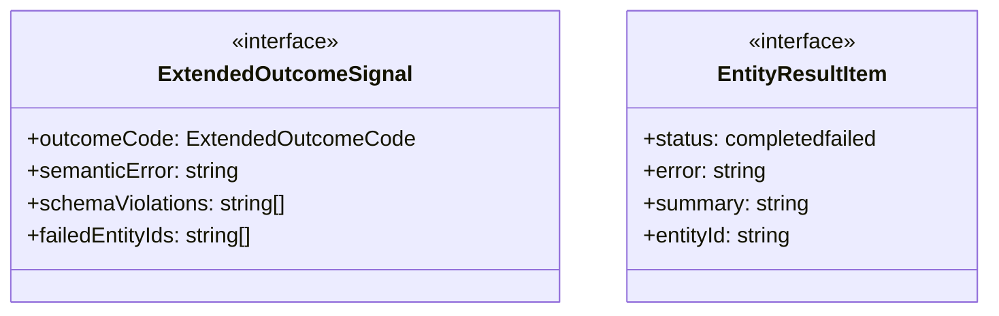
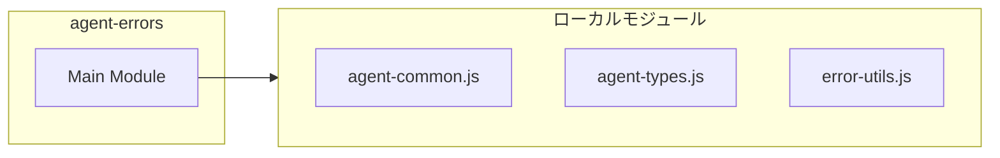
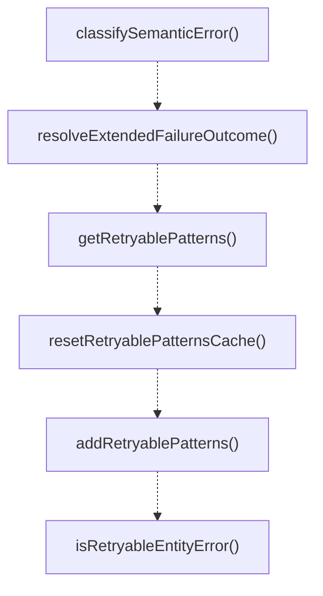
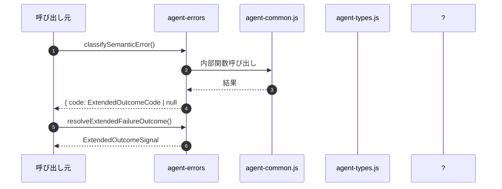

# agent-errors

## 概要

`agent-errors` モジュールのAPIリファレンス。

## インポート

```typescript
import { EntityType, EntityConfig, SUBAGENT_CONFIG... } from './agent-common.js';
import { RunOutcomeCode, RunOutcomeSignal } from './agent-types.js';
import { classifyPressureError, extractStatusCodeFromMessage, isCancelledErrorMessage... } from './error-utils.js';
```

## エクスポート一覧

| 種別 | 名前 | 説明 |
|------|------|------|
| 関数 | `classifySemanticError` | Classify semantic error from output content. |
| 関数 | `resolveExtendedFailureOutcome` | Resolve extended outcome signal with semantic erro |
| 関数 | `getRetryablePatterns` | Get the list of retryable error patterns. |
| 関数 | `resetRetryablePatternsCache` | Reset the cached retryable patterns (primarily for |
| 関数 | `addRetryablePatterns` | Add custom retryable patterns at runtime. |
| 関数 | `isRetryableEntityError` | Check if an error is retryable for entity executio |
| 関数 | `isRetryableSubagentError` | Check if error is retryable for subagent context. |
| 関数 | `isRetryableTeamMemberError` | Check if error is retryable for team member contex |
| 関数 | `resolveFailureOutcome` | Resolve the outcome signal for a failed entity exe |
| 関数 | `resolveSubagentFailureOutcome` | Resolve failure outcome for subagent context. |
| 関数 | `resolveTeamFailureOutcome` | Resolve failure outcome for team member context. |
| 関数 | `resolveAggregateOutcome` | Resolve aggregate outcome from multiple entity res |
| 関数 | `resolveSubagentParallelOutcome` | Resolve aggregate outcome for subagent parallel ex |
| 関数 | `resolveTeamMemberAggregateOutcome` | Resolve aggregate outcome for team member executio |
| 関数 | `trimErrorMessage` | Trim error message for display, ensuring it doesn' |
| 関数 | `buildDiagnosticContext` | Build diagnostic context string for error messages |
| 関数 | `classifyFailureType` | Classify a failure into a standardized category fo |
| 関数 | `shouldRetryByClassification` | Determine whether a retry should be attempted base |
| インターフェース | `ExtendedOutcomeSignal` | Extended outcome signal with semantic error classi |
| インターフェース | `EntityResultItem` | Result item interface for aggregate outcome resolu |
| 型 | `ExtendedOutcomeCode` | Extended error classification codes. |
| 型 | `FailureClassification` | Standardized failure classification types for retr |

## 図解

### クラス図



### 依存関係図



### 関数フロー



### シーケンス図



## 関数

### classifySemanticError

```typescript
classifySemanticError(output?: string, error?: unknown): { code: ExtendedOutcomeCode | null; details?: string[] }
```

Classify semantic error from output content.
Used for extended error classification beyond infrastructure errors.

**パラメータ**

| 名前 | 型 | 必須 |
|------|-----|------|
| output | `string` | いいえ |
| error | `unknown` | いいえ |

**戻り値**: `{ code: ExtendedOutcomeCode | null; details?: string[] }`

### resolveExtendedFailureOutcome

```typescript
resolveExtendedFailureOutcome(error: unknown, output?: string, config?: EntityConfig): ExtendedOutcomeSignal
```

Resolve extended outcome signal with semantic error classification.

**パラメータ**

| 名前 | 型 | 必須 |
|------|-----|------|
| error | `unknown` | はい |
| output | `string` | いいえ |
| config | `EntityConfig` | いいえ |

**戻り値**: `ExtendedOutcomeSignal`

### getRetryablePatterns

```typescript
getRetryablePatterns(): string[]
```

Get the list of retryable error patterns.
Patterns can be extended via PI_RETRYABLE_ERROR_PATTERNS environment variable
(comma-separated list of additional patterns).

**戻り値**: `string[]`

### resetRetryablePatternsCache

```typescript
resetRetryablePatternsCache(): void
```

Reset the cached retryable patterns (primarily for testing).
Forces next call to getRetryablePatterns() to re-parse environment variable.

**戻り値**: `void`

### addRetryablePatterns

```typescript
addRetryablePatterns(patterns: string[]): void
```

Add custom retryable patterns at runtime.
Useful for dynamic configuration without environment variable restart.

**パラメータ**

| 名前 | 型 | 必須 |
|------|-----|------|
| patterns | `string[]` | はい |

**戻り値**: `void`

### isRetryableEntityError

```typescript
isRetryableEntityError(error: unknown, statusCode: number | undefined, config: EntityConfig): boolean
```

Check if an error is retryable for entity execution.
Combines generic retryable error checks with entity-specific patterns.

**パラメータ**

| 名前 | 型 | 必須 |
|------|-----|------|
| error | `unknown` | はい |
| statusCode | `number | undefined` | はい |
| config | `EntityConfig` | はい |

**戻り値**: `boolean`

### isRetryableSubagentError

```typescript
isRetryableSubagentError(error: unknown, statusCode?: number): boolean
```

Check if error is retryable for subagent context.
Convenience wrapper with subagent configuration.

**パラメータ**

| 名前 | 型 | 必須 |
|------|-----|------|
| error | `unknown` | はい |
| statusCode | `number` | いいえ |

**戻り値**: `boolean`

### isRetryableTeamMemberError

```typescript
isRetryableTeamMemberError(error: unknown, statusCode?: number): boolean
```

Check if error is retryable for team member context.
Convenience wrapper with team member configuration.

**パラメータ**

| 名前 | 型 | 必須 |
|------|-----|------|
| error | `unknown` | はい |
| statusCode | `number` | いいえ |

**戻り値**: `boolean`

### resolveFailureOutcome

```typescript
resolveFailureOutcome(error: unknown, config?: EntityConfig): RunOutcomeSignal
```

Resolve the outcome signal for a failed entity execution.
Classifies the error and determines whether retry is recommended.

**パラメータ**

| 名前 | 型 | 必須 |
|------|-----|------|
| error | `unknown` | はい |
| config | `EntityConfig` | いいえ |

**戻り値**: `RunOutcomeSignal`

### resolveSubagentFailureOutcome

```typescript
resolveSubagentFailureOutcome(error: unknown): RunOutcomeSignal
```

Resolve failure outcome for subagent context.
Convenience wrapper with subagent configuration.

**パラメータ**

| 名前 | 型 | 必須 |
|------|-----|------|
| error | `unknown` | はい |

**戻り値**: `RunOutcomeSignal`

### resolveTeamFailureOutcome

```typescript
resolveTeamFailureOutcome(error: unknown): RunOutcomeSignal
```

Resolve failure outcome for team member context.
Convenience wrapper with team member configuration.

**パラメータ**

| 名前 | 型 | 必須 |
|------|-----|------|
| error | `unknown` | はい |

**戻り値**: `RunOutcomeSignal`

### resolveAggregateOutcome

```typescript
resolveAggregateOutcome(results: T[], resolveEntityFailure: (error: unknown) => RunOutcomeSignal): RunOutcomeSignal & { failedEntityIds: string[] }
```

Resolve aggregate outcome from multiple entity results.
Used for parallel execution where some entities may succeed and others fail.

**パラメータ**

| 名前 | 型 | 必須 |
|------|-----|------|
| results | `T[]` | はい |
| resolveEntityFailure | `(error: unknown) => RunOutcomeSignal` | はい |

**戻り値**: `RunOutcomeSignal & { failedEntityIds: string[] }`

### resolveSubagentParallelOutcome

```typescript
resolveSubagentParallelOutcome(results: Array<{ runRecord: { status: "completed" | "failed"; error?: string; summary?: string; agentId: string } }>): RunOutcomeSignal & { failedSubagentIds: string[] }
```

Resolve aggregate outcome for subagent parallel execution.

**パラメータ**

| 名前 | 型 | 必須 |
|------|-----|------|
| results | `Array<{ runRecord: { status: "completed" | "failed"; error?: string; summary?: string; agentId: string } }>` | はい |

**戻り値**: `RunOutcomeSignal & { failedSubagentIds: string[] }`

### resolveTeamMemberAggregateOutcome

```typescript
resolveTeamMemberAggregateOutcome(memberResults: Array<{ status: "completed" | "failed"; error?: string; summary?: string; memberId: string }>): RunOutcomeSignal & { failedMemberIds: string[] }
```

Resolve aggregate outcome for team member execution.

**パラメータ**

| 名前 | 型 | 必須 |
|------|-----|------|
| memberResults | `Array<{ status: "completed" | "failed"; error?: string; summary?: string; memberId: string }>` | はい |

**戻り値**: `RunOutcomeSignal & { failedMemberIds: string[] }`

### trimErrorMessage

```typescript
trimErrorMessage(message: string, maxLength: any): string
```

Trim error message for display, ensuring it doesn't exceed max length.

**パラメータ**

| 名前 | 型 | 必須 |
|------|-----|------|
| message | `string` | はい |
| maxLength | `any` | はい |

**戻り値**: `string`

### buildDiagnosticContext

```typescript
buildDiagnosticContext(context: {
  provider?: string;
  model?: string;
  retries?: number;
  lastStatusCode?: number;
  lastRetryMessage?: string;
  rateLimitWaitMs?: number;
  rateLimitHits?: number;
  gateWaitMs?: number;
  gateHits?: number;
}): string
```

Build diagnostic context string for error messages.
Includes retry count, status codes, and rate limit information.

**パラメータ**

| 名前 | 型 | 必須 |
|------|-----|------|
| context | `{
  provider?: string;
  model?: string;
  retries?: number;
  lastStatusCode?: number;
  lastRetryMessage?: string;
  rateLimitWaitMs?: number;
  rateLimitHits?: number;
  gateWaitMs?: number;
  gateHits?: number;
}` | はい |

**戻り値**: `string`

### classifyFailureType

```typescript
classifyFailureType(error: unknown, statusCode?: number): FailureClassification
```

Classify a failure into a standardized category for retry decision making.
Uses error message pattern matching and HTTP status code to determine classification.

**パラメータ**

| 名前 | 型 | 必須 |
|------|-----|------|
| error | `unknown` | はい |
| statusCode | `number` | いいえ |

**戻り値**: `FailureClassification`

### shouldRetryByClassification

```typescript
shouldRetryByClassification(classification: FailureClassification, currentRound: number): boolean
```

Determine whether a retry should be attempted based on failure classification.
Checks the retry policy and current round against max rounds limit.

**パラメータ**

| 名前 | 型 | 必須 |
|------|-----|------|
| classification | `FailureClassification` | はい |
| currentRound | `number` | はい |

**戻り値**: `boolean`

## インターフェース

### ExtendedOutcomeSignal

```typescript
interface ExtendedOutcomeSignal {
  outcomeCode: ExtendedOutcomeCode;
  semanticError?: string;
  schemaViolations?: string[];
  failedEntityIds?: string[];
}
```

Extended outcome signal with semantic error classification.
Uses Omit to avoid type conflict with RunOutcomeSignal.outcomeCode.

### EntityResultItem

```typescript
interface EntityResultItem {
  status: "completed" | "failed";
  error?: string;
  summary?: string;
  entityId: string;
}
```

Result item interface for aggregate outcome resolution.

## 型定義

### ExtendedOutcomeCode

```typescript
type ExtendedOutcomeCode = | RunOutcomeCode
  | "SCHEMA_VIOLATION"
  | "LOW_SUBSTANCE"
  | "EMPTY_OUTPUT"
  | "PARSE_ERROR"
```

Extended error classification codes.
Extends the base RunOutcomeCode with semantic error types.

### FailureClassification

```typescript
type FailureClassification = | "rate_limit"   // HTTP 429 - backoffで処理
  | "capacity"     // リソース枯渇 - backoffで処理
  | "timeout"      // 実行タイムアウト - リトライ可
  | "quality"      // 空出力/低品質 - リトライ可
  | "transient"    // 一時的エラー - リトライ可
  | "permanent"
```

Standardized failure classification types for retry decision making.
Each classification maps to a specific retry policy.

---
*自動生成: 2026-02-17T21:54:59.748Z*
