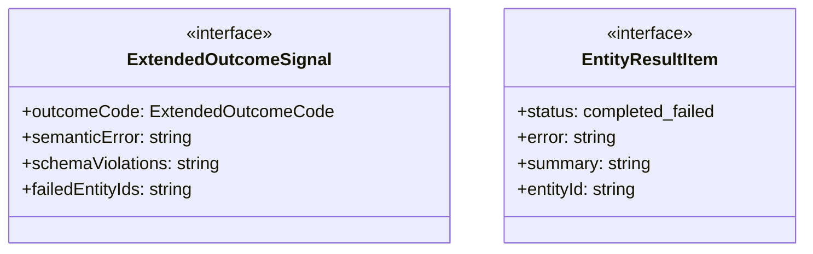
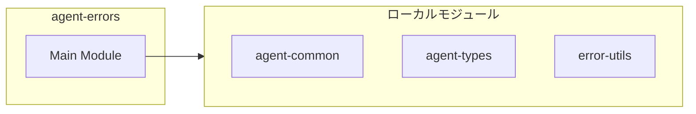
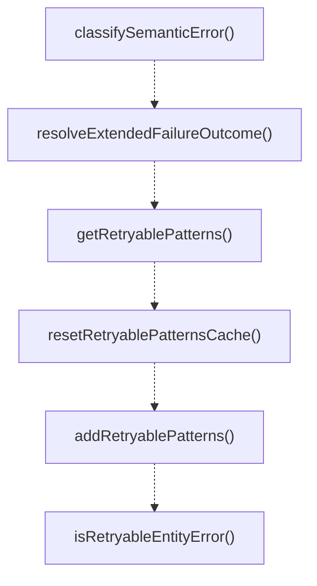
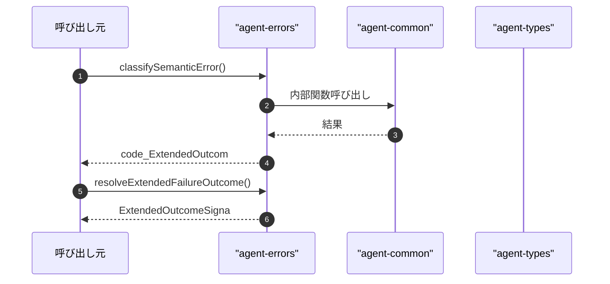

# agent-errors

## 概要

`agent-errors` モジュールのAPIリファレンス。

## インポート

```typescript
import { EntityType, EntityConfig, SUBAGENT_CONFIG... } from './agent-common.js';
import { RunOutcomeCode, RunOutcomeSignal } from './agent-types.js';
import { classifyPressureError, extractStatusCodeFromMessage, isCancelledErrorMessage... } from './error-utils.js';
```

## エクスポート一覧

| 種別 | 名前 | 説明 |
|------|------|------|
| 関数 | `classifySemanticError` | 出力内容から意味論的なエラーを分類する |
| 関数 | `resolveExtendedFailureOutcome` | 拡張失敗結果を解決して分類する |
| 関数 | `getRetryablePatterns` | リトライ可能なエラーパターンを取得 |
| 関数 | `resetRetryablePatternsCache` | キャッシュされたリトライ可能パターンをリセット |
| 関数 | `addRetryablePatterns` | 再試行パターンを実行時に追加する |
| 関数 | `isRetryableEntityError` | エンティティ実行時のエラーが再試行可能か判定 |
| 関数 | `isRetryableSubagentError` | サブエージェントのエラーが再試行可能か判定 |
| 関数 | `isRetryableTeamMemberError` | チームメンバーのエラーがリトライ可能か判定 |
| 関数 | `resolveFailureOutcome` | 失敗時の結果シグナルを解決する |
| 関数 | `resolveSubagentFailureOutcome` | サブエージェントの失敗結果を解決する |
| 関数 | `resolveTeamFailureOutcome` | チームメンバーの失敗結果を解決する |
| 関数 | `resolveAggregateOutcome` | 複数の結果から集約された実行結果を解決する |
| 関数 | `resolveSubagentParallelOutcome` | Resolve aggregate outcome for subagent parallel ex |
| 関数 | `resolveTeamMemberAggregateOutcome` | チームメンバーの実行結果を集約する |
| 関数 | `trimErrorMessage` | エラーメッセージを最大長に合わせて切り詰める |
| 関数 | `buildDiagnosticContext` | 診断コンテキスト文字列を構築します |
| 関数 | `classifyFailureType` | エラーをリトライ判定用の標準カテゴリに分類 |
| 関数 | `shouldRetryByClassification` | 失敗分類に基づきリトライ可否を判定 |
| インターフェース | `ExtendedOutcomeSignal` | 拡張された実行結果シグナル |
| インターフェース | `EntityResultItem` | 集約結果解決用の結果項目インターフェース |
| 型 | `ExtendedOutcomeCode` | 拡張エラー分類コード |
| 型 | `FailureClassification` | リトライ判定用の標準化された失敗分類 |

## 図解

### クラス図



### 依存関係図



### 関数フロー



### シーケンス図



## 関数

### classifySemanticError

```typescript
classifySemanticError(output?: string, error?: unknown): { code: ExtendedOutcomeCode | null; details?: string[] }
```

出力内容から意味論的なエラーを分類する

**パラメータ**

| 名前 | 型 | 必須 |
|------|-----|------|
| output | `string` | いいえ |
| error | `unknown` | いいえ |

**戻り値**: `{ code: ExtendedOutcomeCode | null; details?: string[] }`

### resolveExtendedFailureOutcome

```typescript
resolveExtendedFailureOutcome(error: unknown, output?: string, config?: EntityConfig): ExtendedOutcomeSignal
```

拡張失敗結果を解決して分類する

**パラメータ**

| 名前 | 型 | 必須 |
|------|-----|------|
| error | `unknown` | はい |
| output | `string` | いいえ |
| config | `EntityConfig` | いいえ |

**戻り値**: `ExtendedOutcomeSignal`

### getRetryablePatterns

```typescript
getRetryablePatterns(): string[]
```

リトライ可能なエラーパターンを取得

**戻り値**: `string[]`

### resetRetryablePatternsCache

```typescript
resetRetryablePatternsCache(): void
```

キャッシュされたリトライ可能パターンをリセット

**戻り値**: `void`

### addRetryablePatterns

```typescript
addRetryablePatterns(patterns: string[]): void
```

再試行パターンを実行時に追加する

**パラメータ**

| 名前 | 型 | 必須 |
|------|-----|------|
| patterns | `string[]` | はい |

**戻り値**: `void`

### isRetryableEntityError

```typescript
isRetryableEntityError(error: unknown, statusCode: number | undefined, config: EntityConfig): boolean
```

エンティティ実行時のエラーが再試行可能か判定

**パラメータ**

| 名前 | 型 | 必須 |
|------|-----|------|
| error | `unknown` | はい |
| statusCode | `number | undefined` | はい |
| config | `EntityConfig` | はい |

**戻り値**: `boolean`

### isRetryableSubagentError

```typescript
isRetryableSubagentError(error: unknown, statusCode?: number): boolean
```

サブエージェントのエラーが再試行可能か判定

**パラメータ**

| 名前 | 型 | 必須 |
|------|-----|------|
| error | `unknown` | はい |
| statusCode | `number` | いいえ |

**戻り値**: `boolean`

### isRetryableTeamMemberError

```typescript
isRetryableTeamMemberError(error: unknown, statusCode?: number): boolean
```

チームメンバーのエラーがリトライ可能か判定

**パラメータ**

| 名前 | 型 | 必須 |
|------|-----|------|
| error | `unknown` | はい |
| statusCode | `number` | いいえ |

**戻り値**: `boolean`

### resolveFailureOutcome

```typescript
resolveFailureOutcome(error: unknown, config?: EntityConfig): RunOutcomeSignal
```

失敗時の結果シグナルを解決する

**パラメータ**

| 名前 | 型 | 必須 |
|------|-----|------|
| error | `unknown` | はい |
| config | `EntityConfig` | いいえ |

**戻り値**: `RunOutcomeSignal`

### resolveSubagentFailureOutcome

```typescript
resolveSubagentFailureOutcome(error: unknown): RunOutcomeSignal
```

サブエージェントの失敗結果を解決する

**パラメータ**

| 名前 | 型 | 必須 |
|------|-----|------|
| error | `unknown` | はい |

**戻り値**: `RunOutcomeSignal`

### resolveTeamFailureOutcome

```typescript
resolveTeamFailureOutcome(error: unknown): RunOutcomeSignal
```

チームメンバーの失敗結果を解決する

**パラメータ**

| 名前 | 型 | 必須 |
|------|-----|------|
| error | `unknown` | はい |

**戻り値**: `RunOutcomeSignal`

### resolveAggregateOutcome

```typescript
resolveAggregateOutcome(results: T[], resolveEntityFailure: (error: unknown) => RunOutcomeSignal): RunOutcomeSignal & { failedEntityIds: string[] }
```

複数の結果から集約された実行結果を解決する

**パラメータ**

| 名前 | 型 | 必須 |
|------|-----|------|
| results | `T[]` | はい |
| resolveEntityFailure | `(error: unknown) => RunOutcomeSignal` | はい |

**戻り値**: `RunOutcomeSignal & { failedEntityIds: string[] }`

### resolveSubagentParallelOutcome

```typescript
resolveSubagentParallelOutcome(results: Array<{ runRecord: { status: "completed" | "failed"; error?: string; summary?: string; agentId: string } }>): RunOutcomeSignal & { failedSubagentIds: string[] }
```

Resolve aggregate outcome for subagent parallel execution.

**パラメータ**

| 名前 | 型 | 必須 |
|------|-----|------|
| results | `Array<{ runRecord: { status: "completed" | "fai...` | はい |

**戻り値**: `RunOutcomeSignal & { failedSubagentIds: string[] }`

### resolveTeamMemberAggregateOutcome

```typescript
resolveTeamMemberAggregateOutcome(memberResults: Array<{ status: "completed" | "failed"; error?: string; summary?: string; memberId: string }>): RunOutcomeSignal & { failedMemberIds: string[] }
```

チームメンバーの実行結果を集約する

**パラメータ**

| 名前 | 型 | 必須 |
|------|-----|------|
| memberResults | `Array<{ status: "completed" | "failed"; error?:...` | はい |

**戻り値**: `RunOutcomeSignal & { failedMemberIds: string[] }`

### trimErrorMessage

```typescript
trimErrorMessage(message: string, maxLength: any): string
```

エラーメッセージを最大長に合わせて切り詰める

**パラメータ**

| 名前 | 型 | 必須 |
|------|-----|------|
| message | `string` | はい |
| maxLength | `any` | はい |

**戻り値**: `string`

### buildDiagnosticContext

```typescript
buildDiagnosticContext(context: {
  provider?: string;
  model?: string;
  retries?: number;
  lastStatusCode?: number;
  lastRetryMessage?: string;
  rateLimitWaitMs?: number;
  rateLimitHits?: number;
  gateWaitMs?: number;
  gateHits?: number;
}): string
```

診断コンテキスト文字列を構築します

**パラメータ**

| 名前 | 型 | 必須 |
|------|-----|------|
| context | `object` | はい |
| &nbsp;&nbsp;↳ provider | `string` | いいえ |
| &nbsp;&nbsp;↳ model | `string` | いいえ |
| &nbsp;&nbsp;↳ retries | `number` | いいえ |
| &nbsp;&nbsp;↳ lastStatusCode | `number` | いいえ |
| &nbsp;&nbsp;↳ lastRetryMessage | `string` | いいえ |
| &nbsp;&nbsp;↳ rateLimitWaitMs | `number` | いいえ |
| &nbsp;&nbsp;↳ rateLimitHits | `number` | いいえ |
| &nbsp;&nbsp;↳ gateWaitMs | `number` | いいえ |
| &nbsp;&nbsp;↳ gateHits | `number` | いいえ |

**戻り値**: `string`

### classifyFailureType

```typescript
classifyFailureType(error: unknown, statusCode?: number): FailureClassification
```

エラーをリトライ判定用の標準カテゴリに分類

**パラメータ**

| 名前 | 型 | 必須 |
|------|-----|------|
| error | `unknown` | はい |
| statusCode | `number` | いいえ |

**戻り値**: `FailureClassification`

### shouldRetryByClassification

```typescript
shouldRetryByClassification(classification: FailureClassification, currentRound: number): boolean
```

失敗分類に基づきリトライ可否を判定

**パラメータ**

| 名前 | 型 | 必須 |
|------|-----|------|
| classification | `FailureClassification` | はい |
| currentRound | `number` | はい |

**戻り値**: `boolean`

## インターフェース

### ExtendedOutcomeSignal

```typescript
interface ExtendedOutcomeSignal {
  outcomeCode: ExtendedOutcomeCode;
  semanticError?: string;
  schemaViolations?: string[];
  failedEntityIds?: string[];
}
```

拡張された実行結果シグナル

### EntityResultItem

```typescript
interface EntityResultItem {
  status: "completed" | "failed";
  error?: string;
  summary?: string;
  entityId: string;
}
```

集約結果解決用の結果項目インターフェース

## 型定義

### ExtendedOutcomeCode

```typescript
type ExtendedOutcomeCode = | RunOutcomeCode
  | "SCHEMA_VIOLATION"
  | "LOW_SUBSTANCE"
  | "EMPTY_OUTPUT"
  | "PARSE_ERROR"
```

拡張エラー分類コード

### FailureClassification

```typescript
type FailureClassification = | "rate_limit"   // HTTP 429 - backoffで処理
  | "capacity"     // リソース枯渇 - backoffで処理
  | "timeout"      // 実行タイムアウト - リトライ可
  | "quality"      // 空出力/低品質 - リトライ可
  | "transient"    // 一時的エラー - リトライ可
  | "permanent"
```

リトライ判定用の標準化された失敗分類

---
*自動生成: 2026-02-18T07:48:44.813Z*
