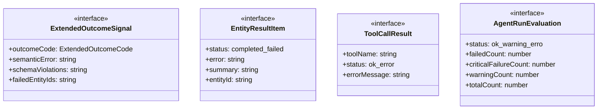

# agent-errors

## 概要

`agent-errors` モジュールのAPIリファレンス。

## インポート

```typescript
// from './agent-common.js': EntityType, EntityConfig, SUBAGENT_CONFIG, ...
// from './agent-types.js': RunOutcomeCode, RunOutcomeSignal
// from './error-utils.js': classifyPressureError, extractStatusCodeFromMessage, isCancelledErrorMessage, ...
```

## エクスポート一覧

| 種別 | 名前 | 説明 |
|------|------|------|
| 関数 | `classifySemanticError` | 意味論的エラーを分類 |
| 関数 | `resolveExtendedFailureOutcome` | 拡張失敗結果を解決 |
| 関数 | `getRetryablePatterns` | リトライ可能なエラーパターンを取得 |
| 関数 | `resetRetryablePatternsCache` | キャッシュをリセット |
| 関数 | `addRetryablePatterns` | 再試行パターンを追加 |
| 関数 | `isRetryableEntityError` | 再試行可否判定 |
| 関数 | `isRetryableSubagentError` | サブエージェントのエラーが再試行可能か判定 |
| 関数 | `isRetryableTeamMemberError` | - |
| 関数 | `resolveFailureOutcome` | チームメンバーのエラーが再試行可能か判定 |
| 関数 | `resolveSubagentFailureOutcome` | エラー設定に基づき実行結果を解決する |
| 関数 | `resolveTeamFailureOutcome` | サブエージェント失敗時の結果解決 |
| 関数 | `resolveAggregateOutcome` | 集計結果解決 |
| 関数 | `resolveSubagentParallelOutcome` | サブエージェント並列結果解決 |
| 関数 | `resolveTeamMemberAggregateOutcome` | チームメンバー集計結果解決 |
| 関数 | `trimErrorMessage` | エラーメッセージ整形 |
| 関数 | `buildDiagnosticContext` | 診断コンテキスト構築 |
| 関数 | `classifyFailureType` | エラー情報を解析して失敗分類を決定 |
| 関数 | `shouldRetryByClassification` | 分類結果に基づきリトライ可否を判定 |
| 関数 | `getToolCriticalityLevel` | ツール名から重要度を判定 |
| 関数 | `isBashErrorTolerated` | bash エラーが許容されるか判定 |
| 関数 | `evaluateAgentRunOutcome` | 複数のツール呼び出し結果を評価して Agent Run 全体の状態を判定 |
| 関数 | `parseToolFailureCount` | エラーメッセージから失敗したツール数を抽出 |
| 関数 | `reevaluateAgentRunFailure` | エラーメッセージに基づいて Agent Run の失敗を再評価 |
| インターフェース | `ExtendedOutcomeSignal` | 拡張実行結果シグナル |
| インターフェース | `EntityResultItem` | チーム失敗時の結果解決 |
| インターフェース | `ToolCallResult` | ツール呼び出し結果 |
| インターフェース | `AgentRunEvaluation` | Agent Run評価結果 |
| 型 | `ExtendedOutcomeCode` | 拡張実行結果コード |
| 型 | `FailureClassification` | リトライ判定用の標準化された失敗分類 |
| 型 | `ToolCriticalityLevel` | ツールの重要度レベル |

## 図解

### クラス図



### 依存関係図


### 関数フロー

```mermaid
flowchart TD
  addRetryablePatterns["addRetryablePatterns()"]
  buildDiagnosticContext["buildDiagnosticContext()"]
  classifyFailureType["classifyFailureType()"]
  classifySemanticError["classifySemanticError()"]
  evaluateAgentRunOutcome["evaluateAgentRunOutcome()"]
  getRetryablePatterns["getRetryablePatterns()"]
  getToolCriticalityLevel["getToolCriticalityLevel()"]
  isBashErrorTolerated["isBashErrorTolerated()"]
  isRetryableEntityError["isRetryableEntityError()"]
  isRetryableSubagentError["isRetryableSubagentError()"]
  isRetryableTeamMemberError["isRetryableTeamMemberError()"]
  parseToolFailureCount["parseToolFailureCount()"]
  reevaluateAgentRunFailure["reevaluateAgentRunFailure()"]
  resetRetryablePatternsCache["resetRetryablePatternsCache()"]
  resolveAggregateOutcome["resolveAggregateOutcome()"]
  resolveExtendedFailureOutcome["resolveExtendedFailureOutcome()"]
  resolveFailureOutcome["resolveFailureOutcome()"]
  resolveSubagentFailureOutcome["resolveSubagentFailureOutcome()"]
  resolveSubagentParallelOutcome["resolveSubagentParallelOutcome()"]
  resolveTeamFailureOutcome["resolveTeamFailureOutcome()"]
  resolveTeamMemberAggregateOutcome["resolveTeamMemberAggregateOutcome()"]
  shouldRetryByClassification["shouldRetryByClassification()"]
  trimErrorMessage["trimErrorMessage()"]
  buildDiagnosticContext --> trimErrorMessage
  evaluateAgentRunOutcome --> getToolCriticalityLevel
  evaluateAgentRunOutcome --> isBashErrorTolerated
  isRetryableEntityError --> getRetryablePatterns
  isRetryableSubagentError --> isRetryableEntityError
  isRetryableTeamMemberError --> isRetryableEntityError
  reevaluateAgentRunFailure --> parseToolFailureCount
  resolveExtendedFailureOutcome --> classifySemanticError
  resolveExtendedFailureOutcome --> resolveFailureOutcome
  resolveFailureOutcome --> isRetryableEntityError
  resolveSubagentFailureOutcome --> resolveFailureOutcome
  resolveSubagentParallelOutcome --> resolveAggregateOutcome
  resolveTeamFailureOutcome --> resolveFailureOutcome
  resolveTeamMemberAggregateOutcome --> resolveAggregateOutcome
```



### シーケンス図


## 関数

### classifySemanticError

```typescript
classifySemanticError(output?: string, error?: unknown): { code: ExtendedOutcomeCode | null; details?: string[] }
```

意味論的エラーを分類

**パラメータ**

| 名前 | 型 | 必須 |
|------|-----|------|
| output | `string` | いいえ |
| error | `unknown` | いいえ |

**戻り値**: `{ code: ExtendedOutcomeCode | null; details?: string[] }`

### resolveExtendedFailureOutcome

```typescript
resolveExtendedFailureOutcome(error: unknown, output?: string, config?: EntityConfig): ExtendedOutcomeSignal
```

拡張失敗結果を解決

**パラメータ**

| 名前 | 型 | 必須 |
|------|-----|------|
| error | `unknown` | はい |
| output | `string` | いいえ |
| config | `EntityConfig` | いいえ |

**戻り値**: `ExtendedOutcomeSignal`

### getRetryablePatterns

```typescript
getRetryablePatterns(): string[]
```

リトライ可能なエラーパターンを取得

**戻り値**: `string[]`

### resetRetryablePatternsCache

```typescript
resetRetryablePatternsCache(): void
```

キャッシュをリセット

**戻り値**: `void`

### addRetryablePatterns

```typescript
addRetryablePatterns(patterns: string[]): void
```

再試行パターンを追加

**パラメータ**

| 名前 | 型 | 必須 |
|------|-----|------|
| patterns | `string[]` | はい |

**戻り値**: `void`

### isRetryableEntityError

```typescript
isRetryableEntityError(error: unknown, statusCode: number | undefined, config: EntityConfig): boolean
```

再試行可否判定

**パラメータ**

| 名前 | 型 | 必須 |
|------|-----|------|
| error | `unknown` | はい |
| statusCode | `number | undefined` | はい |
| config | `EntityConfig` | はい |

**戻り値**: `boolean`

### isRetryableSubagentError

```typescript
isRetryableSubagentError(error: unknown, statusCode?: number): boolean
```

サブエージェントのエラーが再試行可能か判定

**パラメータ**

| 名前 | 型 | 必須 |
|------|-----|------|
| error | `unknown` | はい |
| statusCode | `number` | いいえ |

**戻り値**: `boolean`

### isRetryableTeamMemberError

```typescript
isRetryableTeamMemberError(error: unknown, statusCode?: number): boolean
```

**パラメータ**

| 名前 | 型 | 必須 |
|------|-----|------|
| error | `unknown` | はい |
| statusCode | `number` | いいえ |

**戻り値**: `boolean`

### resolveFailureOutcome

```typescript
resolveFailureOutcome(error: unknown, config?: EntityConfig): RunOutcomeSignal
```

チームメンバーのエラーが再試行可能か判定

**パラメータ**

| 名前 | 型 | 必須 |
|------|-----|------|
| error | `unknown` | はい |
| config | `EntityConfig` | いいえ |

**戻り値**: `RunOutcomeSignal`

### resolveSubagentFailureOutcome

```typescript
resolveSubagentFailureOutcome(error: unknown): RunOutcomeSignal
```

エラー設定に基づき実行結果を解決する

**パラメータ**

| 名前 | 型 | 必須 |
|------|-----|------|
| error | `unknown` | はい |

**戻り値**: `RunOutcomeSignal`

### resolveTeamFailureOutcome

```typescript
resolveTeamFailureOutcome(error: unknown): RunOutcomeSignal
```

サブエージェント失敗時の結果解決

**パラメータ**

| 名前 | 型 | 必須 |
|------|-----|------|
| error | `unknown` | はい |

**戻り値**: `RunOutcomeSignal`

### resolveAggregateOutcome

```typescript
resolveAggregateOutcome(results: T[], resolveEntityFailure: (error: unknown) => RunOutcomeSignal): RunOutcomeSignal & { failedEntityIds: string[] }
```

集計結果解決

**パラメータ**

| 名前 | 型 | 必須 |
|------|-----|------|
| results | `T[]` | はい |
| resolveEntityFailure | `(error: unknown) => RunOutcomeSignal` | はい |

**戻り値**: `RunOutcomeSignal & { failedEntityIds: string[] }`

### resolveSubagentParallelOutcome

```typescript
resolveSubagentParallelOutcome(results: Array<{ runRecord: { status: "completed" | "failed"; error?: string; summary?: string; agentId: string } }>): RunOutcomeSignal & { failedSubagentIds: string[] }
```

サブエージェント並列結果解決

**パラメータ**

| 名前 | 型 | 必須 |
|------|-----|------|
| results | `Array<{ runRecord: { status: "completed" | "fai...` | はい |

**戻り値**: `RunOutcomeSignal & { failedSubagentIds: string[] }`

### resolveTeamMemberAggregateOutcome

```typescript
resolveTeamMemberAggregateOutcome(memberResults: Array<{ status: "completed" | "failed"; error?: string; summary?: string; memberId: string }>): RunOutcomeSignal & { failedMemberIds: string[] }
```

チームメンバー集計結果解決

**パラメータ**

| 名前 | 型 | 必須 |
|------|-----|------|
| memberResults | `Array<{ status: "completed" | "failed"; error?:...` | はい |

**戻り値**: `RunOutcomeSignal & { failedMemberIds: string[] }`

### trimErrorMessage

```typescript
trimErrorMessage(message: string, maxLength: any): string
```

エラーメッセージ整形

**パラメータ**

| 名前 | 型 | 必須 |
|------|-----|------|
| message | `string` | はい |
| maxLength | `any` | はい |

**戻り値**: `string`

### buildDiagnosticContext

```typescript
buildDiagnosticContext(context: {
  provider?: string;
  model?: string;
  retries?: number;
  lastStatusCode?: number;
  lastRetryMessage?: string;
  rateLimitWaitMs?: number;
  rateLimitHits?: number;
  gateWaitMs?: number;
  gateHits?: number;
}): string
```

診断コンテキスト構築

**パラメータ**

| 名前 | 型 | 必須 |
|------|-----|------|
| context | `object` | はい |
| &nbsp;&nbsp;↳ provider | `string` | いいえ |
| &nbsp;&nbsp;↳ model | `string` | いいえ |
| &nbsp;&nbsp;↳ retries | `number` | いいえ |
| &nbsp;&nbsp;↳ lastStatusCode | `number` | いいえ |
| &nbsp;&nbsp;↳ lastRetryMessage | `string` | いいえ |
| &nbsp;&nbsp;↳ rateLimitWaitMs | `number` | いいえ |
| &nbsp;&nbsp;↳ rateLimitHits | `number` | いいえ |
| &nbsp;&nbsp;↳ gateWaitMs | `number` | いいえ |
| &nbsp;&nbsp;↳ gateHits | `number` | いいえ |

**戻り値**: `string`

### classifyFailureType

```typescript
classifyFailureType(error: unknown, statusCode?: number): FailureClassification
```

エラー情報を解析して失敗分類を決定

**パラメータ**

| 名前 | 型 | 必須 |
|------|-----|------|
| error | `unknown` | はい |
| statusCode | `number` | いいえ |

**戻り値**: `FailureClassification`

### shouldRetryByClassification

```typescript
shouldRetryByClassification(classification: FailureClassification, currentRound: number): boolean
```

分類結果に基づきリトライ可否を判定

**パラメータ**

| 名前 | 型 | 必須 |
|------|-----|------|
| classification | `FailureClassification` | はい |
| currentRound | `number` | はい |

**戻り値**: `boolean`

### getToolCriticalityLevel

```typescript
getToolCriticalityLevel(toolName: string): ToolCriticalityLevel
```

ツール名から重要度を判定

**パラメータ**

| 名前 | 型 | 必須 |
|------|-----|------|
| toolName | `string` | はい |

**戻り値**: `ToolCriticalityLevel`

### isBashErrorTolerated

```typescript
isBashErrorTolerated(errorMessage: string): boolean
```

bash エラーが許容されるか判定

**パラメータ**

| 名前 | 型 | 必須 |
|------|-----|------|
| errorMessage | `string` | はい |

**戻り値**: `boolean`

### evaluateAgentRunOutcome

```typescript
evaluateAgentRunOutcome(results: ToolCallResult[], totalToolCalls?: number): AgentRunEvaluation
```

複数のツール呼び出し結果を評価して Agent Run 全体の状態を判定

**パラメータ**

| 名前 | 型 | 必須 |
|------|-----|------|
| results | `ToolCallResult[]` | はい |
| totalToolCalls | `number` | いいえ |

**戻り値**: `AgentRunEvaluation`

### parseToolFailureCount

```typescript
parseToolFailureCount(errorMessage: string): { failed: number; total: number } | null
```

エラーメッセージから失敗したツール数を抽出

**パラメータ**

| 名前 | 型 | 必須 |
|------|-----|------|
| errorMessage | `string` | はい |

**戻り値**: `{ failed: number; total: number } | null`

### reevaluateAgentRunFailure

```typescript
reevaluateAgentRunFailure(errorMessage: string): {
  shouldDowngrade: boolean;
  originalFailure: { failed: number; total: number } | null;
  suggestedStatus: "ok" | "warning" | "error";
}
```

エラーメッセージに基づいて Agent Run の失敗を再評価
現在の "X/Y tool calls failed" エラーをより詳細に分析

**パラメータ**

| 名前 | 型 | 必須 |
|------|-----|------|
| errorMessage | `string` | はい |

**戻り値**: `{
  shouldDowngrade: boolean;
  originalFailure: { failed: number; total: number } | null;
  suggestedStatus: "ok" | "warning" | "error";
}`

## インターフェース

### ExtendedOutcomeSignal

```typescript
interface ExtendedOutcomeSignal {
  outcomeCode: ExtendedOutcomeCode;
  semanticError?: string;
  schemaViolations?: string[];
  failedEntityIds?: string[];
}
```

拡張実行結果シグナル

### EntityResultItem

```typescript
interface EntityResultItem {
  status: "completed" | "failed";
  error?: string;
  summary?: string;
  entityId: string;
}
```

チーム失敗時の結果解決

### ToolCallResult

```typescript
interface ToolCallResult {
  toolName: string;
  status: "ok" | "error";
  errorMessage?: string;
}
```

ツール呼び出し結果

### AgentRunEvaluation

```typescript
interface AgentRunEvaluation {
  status: "ok" | "warning" | "error";
  failedCount: number;
  criticalFailureCount: number;
  warningCount: number;
  totalCount: number;
  message: string;
  shouldFail: boolean;
}
```

Agent Run評価結果

## 型定義

### ExtendedOutcomeCode

```typescript
type ExtendedOutcomeCode = | RunOutcomeCode
  | "SCHEMA_VIOLATION"
  | "LOW_SUBSTANCE"
  | "EMPTY_OUTPUT"
  | "PARSE_ERROR"
```

拡張実行結果コード

### FailureClassification

```typescript
type FailureClassification = | "rate_limit"   // HTTP 429 - backoffで処理
  | "capacity"     // リソース枯渇 - backoffで処理
  | "timeout"      // 実行タイムアウト - リトライ可
  | "quality"      // 空出力/低品質 - リトライ可
  | "transient"    // 一時的エラー - リトライ可
  | "permanent"
```

リトライ判定用の標準化された失敗分類

### ToolCriticalityLevel

```typescript
type ToolCriticalityLevel = "critical" | "non-critical" | "informational"
```

ツールの重要度レベル

---
*自動生成: 2026-02-22T19:27:00.552Z*
