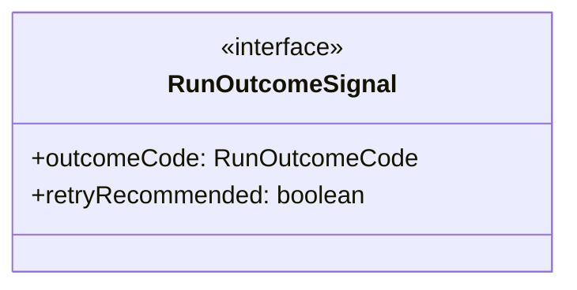

# agent-types

## 概要

`agent-types` モジュールのAPIリファレンス。

## エクスポート一覧

| 種別 | 名前 | 説明 |
|------|------|------|
| インターフェース | `RunOutcomeSignal` | Signal returned from agent/subagent/team execution |
| 型 | `ThinkingLevel` | Thinking level for model reasoning. |
| 型 | `RunOutcomeCode` | Outcome codes for agent/subagent/team execution re |

## 図解

### クラス図



## インターフェース

### RunOutcomeSignal

```typescript
interface RunOutcomeSignal {
  outcomeCode: RunOutcomeCode;
  retryRecommended: boolean;
}
```

Signal returned from agent/subagent/team execution.
Encapsulates the outcome code and whether a retry is recommended.

## 型定義

### ThinkingLevel

```typescript
type ThinkingLevel = "off" | "minimal" | "low" | "medium" | "high" | "xhigh"
```

Thinking level for model reasoning.
Controls the depth of thinking/reasoning output from the model.

### RunOutcomeCode

```typescript
type RunOutcomeCode = | "SUCCESS"
  | "PARTIAL_SUCCESS"
  | "RETRYABLE_FAILURE"
  | "NONRETRYABLE_FAILURE"
  | "CANCELLED"
  | "TIMEOUT"
```

Outcome codes for agent/subagent/team execution results.
Used to classify the result of a run for retry logic and reporting.

---
*自動生成: 2026-02-17T21:54:59.749Z*
