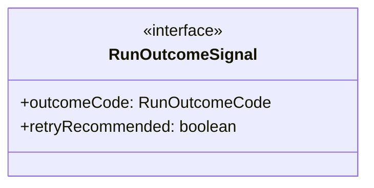

# agent-types

## 概要

`agent-types` モジュールのAPIリファレンス。

## エクスポート一覧

| 種別 | 名前 | 説明 |
|------|------|------|
| インターフェース | `RunOutcomeSignal` | 実行結果を表すシグナル |
| 型 | `ThinkingLevel` | モデルの推論レベルを表す型。 |
| 型 | `RunOutcomeCode` | エージェントの実行結果コード |

## 図解

### クラス図



## インターフェース

### RunOutcomeSignal

```typescript
interface RunOutcomeSignal {
  outcomeCode: RunOutcomeCode;
  retryRecommended: boolean;
}
```

実行結果を表すシグナル

## 型定義

### ThinkingLevel

```typescript
type ThinkingLevel = "off" | "minimal" | "low" | "medium" | "high" | "xhigh"
```

モデルの推論レベルを表す型。

### RunOutcomeCode

```typescript
type RunOutcomeCode = | "SUCCESS"
  | "PARTIAL_SUCCESS"
  | "RETRYABLE_FAILURE"
  | "NONRETRYABLE_FAILURE"
  | "CANCELLED"
  | "TIMEOUT"
```

エージェントの実行結果コード

---
*自動生成: 2026-02-18T14:31:30.951Z*
