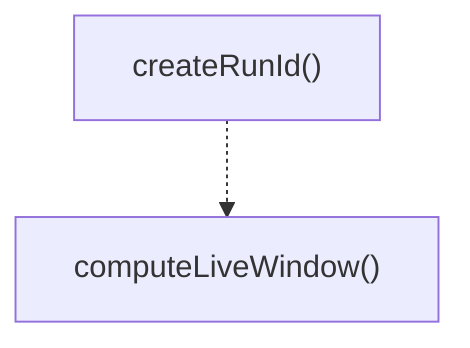

# agent-utils

## 概要

`agent-utils` モジュールのAPIリファレンス。

## インポート

```typescript
import { randomBytes } from 'node:crypto';
```

## エクスポート一覧

| 種別 | 名前 | 説明 |
|------|------|------|
| 関数 | `createRunId` | Creates a unique run ID with timestamp and random  |
| 関数 | `computeLiveWindow` | Computes a sliding window for live list display. |

## 図解

### 関数フロー



## 関数

### createRunId

```typescript
createRunId(): string
```

Creates a unique run ID with timestamp and random suffix.
Format: YYYYMMDD-HHMMSS-xxxxxx (where xxxxxx is 6 hex chars)

**戻り値**: `string`

### computeLiveWindow

```typescript
computeLiveWindow(cursor: number, total: number, maxRows: number): { start: number; end: number }
```

Computes a sliding window for live list display.
Centers the cursor when possible, adjusts when near boundaries.

**パラメータ**

| 名前 | 型 | 必須 |
|------|-----|------|
| cursor | `number` | はい |
| total | `number` | はい |
| maxRows | `number` | はい |

**戻り値**: `{ start: number; end: number }`

---
*自動生成: 2026-02-17T21:48:27.644Z*
