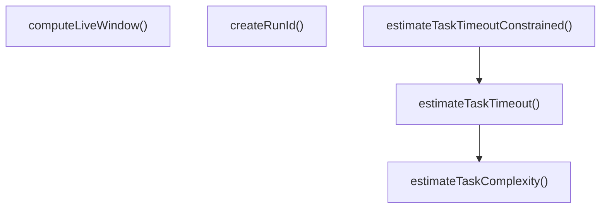
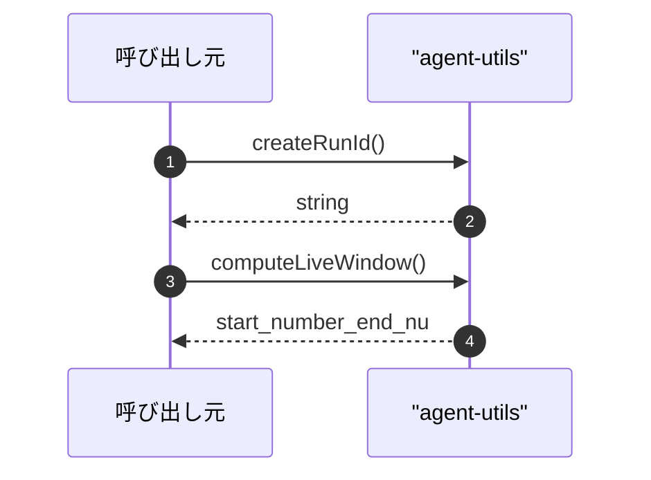

# agent-utils

## 概要

`agent-utils` モジュールのAPIリファレンス。

## インポート

```typescript
// from 'node:crypto': randomBytes
```

## エクスポート一覧

| 種別 | 名前 | 説明 |
|------|------|------|
| 関数 | `createRunId` | 一意な実行IDを生成します。 |
| 関数 | `computeLiveWindow` | - |
| 関数 | `estimateTaskComplexity` | タスク複雑度を推定する |
| 関数 | `estimateTaskTimeout` | タスク複雑度に基づいてタイムアウトを計算する |
| 関数 | `estimateTaskTimeoutConstrained` | 最小・最大タイムアウト制約付きでタイムアウトを計算する |
| 型 | `TaskComplexity` | タスク複雑度の分類 |

## 図解

### 関数フロー



### シーケンス図



## 関数

### createRunId

```typescript
createRunId(): string
```

一意な実行IDを生成します。

**戻り値**: `string`

### computeLiveWindow

```typescript
computeLiveWindow(cursor: number, total: number, maxRows: number): { start: number; end: number }
```

**パラメータ**

| 名前 | 型 | 必須 |
|------|-----|------|
| cursor | `number` | はい |
| total | `number` | はい |
| maxRows | `number` | はい |

**戻り値**: `{ start: number; end: number }`

### estimateTaskComplexity

```typescript
estimateTaskComplexity(task: string): TaskComplexity
```

タスク複雑度を推定する

**パラメータ**

| 名前 | 型 | 必須 |
|------|-----|------|
| task | `string` | はい |

**戻り値**: `TaskComplexity`

### estimateTaskTimeout

```typescript
estimateTaskTimeout(task: string, baseTimeoutMs: number): number
```

タスク複雑度に基づいてタイムアウトを計算する

**パラメータ**

| 名前 | 型 | 必須 |
|------|-----|------|
| task | `string` | はい |
| baseTimeoutMs | `number` | はい |

**戻り値**: `number`

### estimateTaskTimeoutConstrained

```typescript
estimateTaskTimeoutConstrained(task: string, options: {
    baseTimeoutMs?: number;
    minTimeoutMs?: number;
    maxTimeoutMs?: number;
  }): number
```

最小・最大タイムアウト制約付きでタイムアウトを計算する

**パラメータ**

| 名前 | 型 | 必須 |
|------|-----|------|
| task | `string` | はい |
| options | `object` | はい |
| &nbsp;&nbsp;↳ baseTimeoutMs | `number` | いいえ |
| &nbsp;&nbsp;↳ minTimeoutMs | `number` | いいえ |
| &nbsp;&nbsp;↳ maxTimeoutMs | `number` | いいえ |

**戻り値**: `number`

## 型定義

### TaskComplexity

```typescript
type TaskComplexity = "low" | "medium" | "high"
```

タスク複雑度の分類

---
*自動生成: 2026-02-24T17:08:02.599Z*
