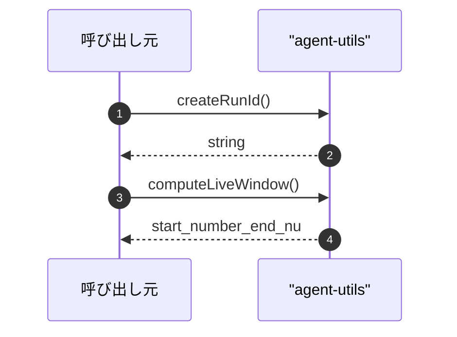

# agent-utils

## 概要

`agent-utils` モジュールのAPIリファレンス。

## インポート

```typescript
// from 'node:crypto': randomBytes
```

## エクスポート一覧

| 種別 | 名前 | 説明 |
|------|------|------|
| 関数 | `createRunId` | 一意な実行IDを生成します。 |
| 関数 | `computeLiveWindow` | - |

## 図解

### シーケンス図



## 関数

### createRunId

```typescript
createRunId(): string
```

一意な実行IDを生成します。

**戻り値**: `string`

### computeLiveWindow

```typescript
computeLiveWindow(cursor: number, total: number, maxRows: number): { start: number; end: number }
```

**パラメータ**

| 名前 | 型 | 必須 |
|------|-----|------|
| cursor | `number` | はい |
| total | `number` | はい |
| maxRows | `number` | はい |

**戻り値**: `{ start: number; end: number }`

---
*自動生成: 2026-02-23T06:29:42.257Z*
