# aporetic-reasoning

## 概要

`aporetic-reasoning` モジュールのAPIリファレンス。

## インポート

```typescript
// from './aporia-handler.js': AporiaDetection, AporiaResolution
// from './belief-updater.js': Distribution, Evidence
// from './belief-updater.js': createPrior, normalizeDistribution, calculateEntropy, ...
```

## エクスポート一覧

| 種別 | 名前 | 説明 |
|------|------|------|
| 関数 | `createAporeticEngine` | - |
| 関数 | `createInitialBeliefState` | - |
| 関数 | `updateBeliefState` | - |
| 関数 | `performAporeticInference` | - |
| 関数 | `integrateResolution` | - |
| 関数 | `paretoFrontToVisualization` | - |
| 関数 | `generateEngineReport` | - |
| インターフェース | `AporiaPole` | アポリアの極 |
| インターフェース | `AporeticBeliefState` | アポリア信念状態 |
| インターフェース | `BalanceUpdate` | バランス更新記録 |
| インターフェース | `ParetoOptimalSolution` | パレート最適解 |
| インターフェース | `AporeticInferenceResult` | アポリア推論結果 |
| インターフェース | `AporeticReasoningEngine` | アポリア推論エンジン |
| インターフェース | `AporeticEngineConfig` | エンジン設定 |

## 図解

### クラス図

```mermaid
classDiagram
  class AporiaPole {
    <<interface>>
    +name: string
    +valueDescription: string
    +beliefDistribution: Distribution
    +supportingEvidence: Evidence
    +beliefStrength: number
  }
  class AporeticBeliefState {
    <<interface>>
    +aporia: AporiaDetection
    +pole1: AporiaPole
    +pole2: AporiaPole
    +tensionIntensity: number
    +balancePoint: number
  }
  class BalanceUpdate {
    <<interface>>
    +timestamp: Date
    +previousBalance: number
    +newBalance: number
    +evidence: Evidence
    +rationale: string
  }
  class ParetoOptimalSolution {
    <<interface>>
    +description: string
    +pole1Achievement: number
    +pole2Achievement: number
    +risk: number
    +tradeoffDescription: string
  }
  class AporeticInferenceResult {
    <<interface>>
    +beliefState: AporeticBeliefState
    +paretoFront: ParetoOptimalSolutio
    +recommendedDecision: solution_ParetoOpti
    +temptationsToAvoid: string
    +inferenceConfidence: number
  }
  class AporeticReasoningEngine {
    <<interface>>
    +beliefStates: Map_string_AporeticB
    +config: AporeticEngineConfig
    +statistics: totalInferences_num
  }
  class AporeticEngineConfig {
    <<interface>>
    +tensionThreshold: number
    +decisionThreshold: number
    +smoothingFactor: number
    +maxHistorySize: number
    +paretoSearchDepth: number
  }
```



### 依存関係図


### 関数フロー


### シーケンス図


## 関数

### createAporeticEngine

```typescript
createAporeticEngine(config: Partial<AporeticEngineConfig>): AporeticReasoningEngine
```

**パラメータ**

| 名前 | 型 | 必須 |
|------|-----|------|
| config | `Partial<AporeticEngineConfig>` | はい |

**戻り値**: `AporeticReasoningEngine`

### createInitialBeliefState

```typescript
createInitialBeliefState(aporia: AporiaDetection): AporeticBeliefState
```

**パラメータ**

| 名前 | 型 | 必須 |
|------|-----|------|
| aporia | `AporiaDetection` | はい |

**戻り値**: `AporeticBeliefState`

### updateBeliefState

```typescript
updateBeliefState(state: AporeticBeliefState, evidence: Evidence, targetPole: 'pole1' | 'pole2' | 'both'): AporeticBeliefState
```

**パラメータ**

| 名前 | 型 | 必須 |
|------|-----|------|
| state | `AporeticBeliefState` | はい |
| evidence | `Evidence` | はい |
| targetPole | `'pole1' | 'pole2' | 'both'` | はい |

**戻り値**: `AporeticBeliefState`

### performAporeticInference

```typescript
performAporeticInference(engine: AporeticReasoningEngine, aporia: AporiaDetection, evidenceList: Evidence[], context: {
    urgencyLevel?: number;
    stakeholderImportance?: number;
    reversibility?: boolean;
  }): AporeticInferenceResult
```

**パラメータ**

| 名前 | 型 | 必須 |
|------|-----|------|
| engine | `AporeticReasoningEngine` | はい |
| aporia | `AporiaDetection` | はい |
| evidenceList | `Evidence[]` | はい |
| context | `object` | はい |
| &nbsp;&nbsp;↳ urgencyLevel | `number` | いいえ |
| &nbsp;&nbsp;↳ stakeholderImportance | `number` | いいえ |
| &nbsp;&nbsp;↳ reversibility | `boolean` | いいえ |

**戻り値**: `AporeticInferenceResult`

### integrateResolution

```typescript
integrateResolution(engine: AporeticReasoningEngine, resolution: AporiaResolution): AporeticReasoningEngine
```

**パラメータ**

| 名前 | 型 | 必須 |
|------|-----|------|
| engine | `AporeticReasoningEngine` | はい |
| resolution | `AporiaResolution` | はい |

**戻り値**: `AporeticReasoningEngine`

### paretoFrontToVisualization

```typescript
paretoFrontToVisualization(paretoFront: ParetoOptimalSolution[]): {
  points: Array<{ x: number; y: number; label: string }>;
  dominatedRegion: string;
}
```

**パラメータ**

| 名前 | 型 | 必須 |
|------|-----|------|
| paretoFront | `ParetoOptimalSolution[]` | はい |

**戻り値**: `{
  points: Array<{ x: number; y: number; label: string }>;
  dominatedRegion: string;
}`

### updatePoleBelief

```typescript
updatePoleBelief(distribution: Distribution, evidence: Evidence): Distribution
```

極の信念分布を更新

**パラメータ**

| 名前 | 型 | 必須 |
|------|-----|------|
| distribution | `Distribution` | はい |
| evidence | `Evidence` | はい |

**戻り値**: `Distribution`

### calculatePoleStrength

```typescript
calculatePoleStrength(distribution: Distribution): number
```

極の信念強度を計算

**パラメータ**

| 名前 | 型 | 必須 |
|------|-----|------|
| distribution | `Distribution` | はい |

**戻り値**: `number`

### calculateBalancePoint

```typescript
calculateBalancePoint(pole1Strength: number, pole2Strength: number): number
```

バランス点を計算

**パラメータ**

| 名前 | 型 | 必須 |
|------|-----|------|
| pole1Strength | `number` | はい |
| pole2Strength | `number` | はい |

**戻り値**: `number`

### calculateBalanceUncertainty

```typescript
calculateBalanceUncertainty(dist1: Distribution, dist2: Distribution): number
```

バランスの不確実性を計算

**パラメータ**

| 名前 | 型 | 必須 |
|------|-----|------|
| dist1 | `Distribution` | はい |
| dist2 | `Distribution` | はい |

**戻り値**: `number`

### determineEvidenceTarget

```typescript
determineEvidenceTarget(evidence: Evidence, aporia: AporiaDetection): 'pole1' | 'pole2' | 'both'
```

証拠がどちらの極に関連するかを判定

**パラメータ**

| 名前 | 型 | 必須 |
|------|-----|------|
| evidence | `Evidence` | はい |
| aporia | `AporiaDetection` | はい |

**戻り値**: `'pole1' | 'pole2' | 'both'`

### calculateParetoFront

```typescript
calculateParetoFront(state: AporeticBeliefState, depth: number): ParetoOptimalSolution[]
```

パレートフロントを計算

**パラメータ**

| 名前 | 型 | 必須 |
|------|-----|------|
| state | `AporeticBeliefState` | はい |
| depth | `number` | はい |

**戻り値**: `ParetoOptimalSolution[]`

### calculateRisk

```typescript
calculateRisk(pole1Achievement: number, pole2Achievement: number, state: AporeticBeliefState): number
```

解のリスクを計算

**パラメータ**

| 名前 | 型 | 必須 |
|------|-----|------|
| pole1Achievement | `number` | はい |
| pole2Achievement | `number` | はい |
| state | `AporeticBeliefState` | はい |

**戻り値**: `number`

### filterParetoOptimal

```typescript
filterParetoOptimal(solutions: ParetoOptimalSolution[]): ParetoOptimalSolution[]
```

パレート最適解のみを抽出

**パラメータ**

| 名前 | 型 | 必須 |
|------|-----|------|
| solutions | `ParetoOptimalSolution[]` | はい |

**戻り値**: `ParetoOptimalSolution[]`

### determineRecommendedDecision

```typescript
determineRecommendedDecision(state: AporeticBeliefState, paretoFront: ParetoOptimalSolution[], context: {
    urgencyLevel?: number;
    stakeholderImportance?: number;
    reversibility?: boolean;
  }, config: AporeticEngineConfig): AporeticInferenceResult['recommendedDecision']
```

推奨決断を決定

**パラメータ**

| 名前 | 型 | 必須 |
|------|-----|------|
| state | `AporeticBeliefState` | はい |
| paretoFront | `ParetoOptimalSolution[]` | はい |
| context | `object` | はい |
| &nbsp;&nbsp;↳ urgencyLevel | `number` | いいえ |
| &nbsp;&nbsp;↳ stakeholderImportance | `number` | いいえ |
| &nbsp;&nbsp;↳ reversibility | `boolean` | いいえ |
| config | `AporeticEngineConfig` | はい |

**戻り値**: `AporeticInferenceResult['recommendedDecision']`

### calculateContextScore

```typescript
calculateContextScore(solution: ParetoOptimalSolution, urgency: number, stakeholderImportance: number, state: AporeticBeliefState): number
```

文脈スコアを計算

**パラメータ**

| 名前 | 型 | 必須 |
|------|-----|------|
| solution | `ParetoOptimalSolution` | はい |
| urgency | `number` | はい |
| stakeholderImportance | `number` | はい |
| state | `AporeticBeliefState` | はい |

**戻り値**: `number`

### identifyTemptationsToAvoid

```typescript
identifyTemptationsToAvoid(state: AporeticBeliefState, paretoFront: ParetoOptimalSolution[]): string[]
```

避けるべき誘惑を特定

**パラメータ**

| 名前 | 型 | 必須 |
|------|-----|------|
| state | `AporeticBeliefState` | はい |
| paretoFront | `ParetoOptimalSolution[]` | はい |

**戻り値**: `string[]`

### calculateInferenceConfidence

```typescript
calculateInferenceConfidence(state: AporeticBeliefState, evidenceList: Evidence[]): number
```

推論の信頼度を計算

**パラメータ**

| 名前 | 型 | 必須 |
|------|-----|------|
| state | `AporeticBeliefState` | はい |
| evidenceList | `Evidence[]` | はい |

**戻り値**: `number`

### generateEngineReport

```typescript
generateEngineReport(engine: AporeticReasoningEngine): string
```

**パラメータ**

| 名前 | 型 | 必須 |
|------|-----|------|
| engine | `AporeticReasoningEngine` | はい |

**戻り値**: `string`

## インターフェース

### AporiaPole

```typescript
interface AporiaPole {
  name: string;
  valueDescription: string;
  beliefDistribution: Distribution;
  supportingEvidence: Evidence[];
  beliefStrength: number;
}
```

アポリアの極

### AporeticBeliefState

```typescript
interface AporeticBeliefState {
  aporia: AporiaDetection;
  pole1: AporiaPole;
  pole2: AporiaPole;
  tensionIntensity: number;
  balancePoint: number;
  balanceUncertainty: number;
  explosionGuards: string[];
  updateHistory: BalanceUpdate[];
}
```

アポリア信念状態

### BalanceUpdate

```typescript
interface BalanceUpdate {
  timestamp: Date;
  previousBalance: number;
  newBalance: number;
  evidence: Evidence;
  rationale: string;
}
```

バランス更新記録

### ParetoOptimalSolution

```typescript
interface ParetoOptimalSolution {
  description: string;
  pole1Achievement: number;
  pole2Achievement: number;
  risk: number;
  tradeoffDescription: string;
  contextDependentRecommendation: number;
}
```

パレート最適解

### AporeticInferenceResult

```typescript
interface AporeticInferenceResult {
  beliefState: AporeticBeliefState;
  paretoFront: ParetoOptimalSolution[];
  recommendedDecision?: {
    solution: ParetoOptimalSolution;
    rationale: string;
    confidence: number;
    warnings: string[];
  };
  temptationsToAvoid: string[];
  inferenceConfidence: number;
}
```

アポリア推論結果

### AporeticReasoningEngine

```typescript
interface AporeticReasoningEngine {
  beliefStates: Map<string, AporeticBeliefState>;
  config: AporeticEngineConfig;
  statistics: {
    totalInferences: number;
    successfulCoexistences: number;
    avoidedTemptations: number;
    responsibleDecisions: number;
  };
}
```

アポリア推論エンジン

### AporeticEngineConfig

```typescript
interface AporeticEngineConfig {
  tensionThreshold: number;
  decisionThreshold: number;
  smoothingFactor: number;
  maxHistorySize: number;
  paretoSearchDepth: number;
}
```

エンジン設定

---
*自動生成: 2026-02-23T06:29:42.260Z*
