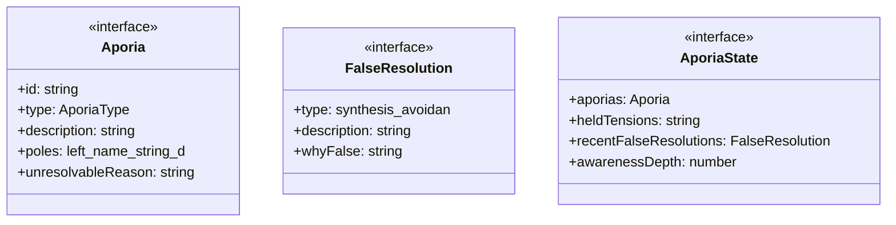
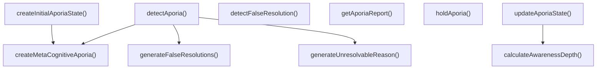

# aporia-awareness

## 概要

`aporia-awareness` モジュールのAPIリファレンス。

## エクスポート一覧

| 種別 | 名前 | 説明 |
|------|------|------|
| 関数 | `detectAporia` | アポリアを検出 |
| 関数 | `holdAporia` | アポリアを「保持」する（解決しない） |
| 関数 | `updateAporiaState` | アポリア状態を更新 |
| 関数 | `detectFalseResolution` | 偽の解決を検出 |
| 関数 | `getAporiaReport` | アポリアレポートを生成 |
| 関数 | `createInitialAporiaState` | 初期アポリア状態を作成 |
| インターフェース | `Aporia` | アポリア（解決不能な矛盾） |
| インターフェース | `FalseResolution` | 偽の解決（避けるべきパターン） |
| インターフェース | `AporiaState` | アポリア状態の管理 |
| 型 | `AporiaType` | アポリアの種類 |

## 図解

### クラス図



### 関数フロー



## 関数

### detectAporia

```typescript
detectAporia(text: string): Aporia[]
```

アポリアを検出

**パラメータ**

| 名前 | 型 | 必須 |
|------|-----|------|
| text | `string` | はい |

**戻り値**: `Aporia[]`

### createMetaCognitiveAporia

```typescript
createMetaCognitiveAporia(): Aporia
```

メタ認知的アポリア（評価のパラドックス）を作成

**戻り値**: `Aporia`

### generateUnresolvableReason

```typescript
generateUnresolvableReason(type: AporiaType): string
```

アポリアの種類に応じた解決不能理由を生成

**パラメータ**

| 名前 | 型 | 必須 |
|------|-----|------|
| type | `AporiaType` | はい |

**戻り値**: `string`

### generateFalseResolutions

```typescript
generateFalseResolutions(type: AporiaType): FalseResolution[]
```

アポリアの種類に応じた偽の解決を生成

**パラメータ**

| 名前 | 型 | 必須 |
|------|-----|------|
| type | `AporiaType` | はい |

**戻り値**: `FalseResolution[]`

### holdAporia

```typescript
holdAporia(aporia: Aporia): Aporia
```

アポリアを「保持」する（解決しない）

**パラメータ**

| 名前 | 型 | 必須 |
|------|-----|------|
| aporia | `Aporia` | はい |

**戻り値**: `Aporia`

### updateAporiaState

```typescript
updateAporiaState(state: AporiaState, newAporias: Aporia[]): AporiaState
```

アポリア状態を更新

**パラメータ**

| 名前 | 型 | 必須 |
|------|-----|------|
| state | `AporiaState` | はい |
| newAporias | `Aporia[]` | はい |

**戻り値**: `AporiaState`

### calculateAwarenessDepth

```typescript
calculateAwarenessDepth(state: AporiaState, newAporias: Aporia[]): number
```

アポリア認識深度を計算

**パラメータ**

| 名前 | 型 | 必須 |
|------|-----|------|
| state | `AporiaState` | はい |
| newAporias | `Aporia[]` | はい |

**戻り値**: `number`

### detectFalseResolution

```typescript
detectFalseResolution(text: string, aporias: Aporia[]): FalseResolution[]
```

偽の解決を検出

**パラメータ**

| 名前 | 型 | 必須 |
|------|-----|------|
| text | `string` | はい |
| aporias | `Aporia[]` | はい |

**戻り値**: `FalseResolution[]`

### getAporiaReport

```typescript
getAporiaReport(state: AporiaState): string
```

アポリアレポートを生成

**パラメータ**

| 名前 | 型 | 必須 |
|------|-----|------|
| state | `AporiaState` | はい |

**戻り値**: `string`

### createInitialAporiaState

```typescript
createInitialAporiaState(): AporiaState
```

初期アポリア状態を作成

**戻り値**: `AporiaState`

## インターフェース

### Aporia

```typescript
interface Aporia {
  id: string;
  type: AporiaType;
  description: string;
  poles: {
    left: { name: string; description: string };
    right: { name: string; description: string };
  };
  unresolvableReason: string;
  falseResolutions: FalseResolution[];
  tensionToHold: string;
  recognizedAt: string;
  state: 'recognized' | 'held' | 'forgotten' | 'falsely_resolved';
}
```

アポリア（解決不能な矛盾）

### FalseResolution

```typescript
interface FalseResolution {
  type: 'synthesis' | 'avoidance' | 'dominance' | 'denial';
  description: string;
  whyFalse: string;
}
```

偽の解決（避けるべきパターン）

### AporiaState

```typescript
interface AporiaState {
  aporias: Aporia[];
  heldTensions: string[];
  recentFalseResolutions: FalseResolution[];
  awarenessDepth: number;
}
```

アポリア状態の管理

## 型定義

### AporiaType

```typescript
type AporiaType = | 'ethical'       // 倫理的アポリア: 相反する価値の対立
  | 'epistemological' // 認識論的アポリア: 知識の限界
  | 'ontological'   // 存在論的アポリア: 存在の二義性
  | 'practical'     // 実践的アポリア: 行動の決定困難
  | 'meta_cognitive'
```

アポリアの種類

---
*自動生成: 2026-02-22T19:27:00.558Z*
