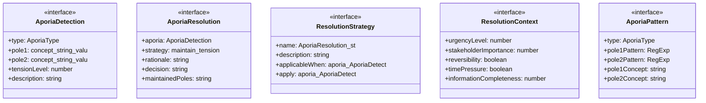

# aporia-handler

## 概要

`aporia-handler` モジュールのAPIリファレンス。

## エクスポート一覧

| 種別 | 名前 | 説明 |
|------|------|------|
| 関数 | `detectAporia` | - |
| 関数 | `handleAporia` | - |
| 関数 | `handleMultipleAporias` | - |
| 関数 | `detectAvoidanceTemptation` | - |
| 関数 | `generateAporiaGuidance` | - |
| 関数 | `generateAporiaReport` | - |
| 関数 | `getAllAporiaTypes` | - |
| 関数 | `getAllResolutionStrategies` | - |
| 関数 | `evaluateAporiaState` | - |
| インターフェース | `AporiaDetection` | アポリア検出結果 |
| インターフェース | `AporiaResolution` | アポリア対処結果 |
| インターフェース | `ResolutionStrategy` | 対処戦略定義 |
| インターフェース | `ResolutionContext` | 対処コンテキスト |
| 型 | `AporiaType` | アポリアタイプ |

## 図解

### クラス図



### 関数フロー


## 関数

### detectAporia

```typescript
detectAporia(text: string, context: string): AporiaDetection[]
```

**パラメータ**

| 名前 | 型 | 必須 |
|------|-----|------|
| text | `string` | はい |
| context | `string` | はい |

**戻り値**: `AporiaDetection[]`

### handleAporia

```typescript
handleAporia(aporia: AporiaDetection, context: ResolutionContext): AporiaResolution
```

**パラメータ**

| 名前 | 型 | 必須 |
|------|-----|------|
| aporia | `AporiaDetection` | はい |
| context | `ResolutionContext` | はい |

**戻り値**: `AporiaResolution`

### handleMultipleAporias

```typescript
handleMultipleAporias(aporias: AporiaDetection[], context: ResolutionContext): AporiaResolution[]
```

**パラメータ**

| 名前 | 型 | 必須 |
|------|-----|------|
| aporias | `AporiaDetection[]` | はい |
| context | `ResolutionContext` | はい |

**戻り値**: `AporiaResolution[]`

### detectAvoidanceTemptation

```typescript
detectAvoidanceTemptation(resolution: AporiaResolution, output: string): string[]
```

**パラメータ**

| 名前 | 型 | 必須 |
|------|-----|------|
| resolution | `AporiaResolution` | はい |
| output | `string` | はい |

**戻り値**: `string[]`

### generateAporiaGuidance

```typescript
generateAporiaGuidance(aporia: AporiaDetection, context: ResolutionContext): string
```

**パラメータ**

| 名前 | 型 | 必須 |
|------|-----|------|
| aporia | `AporiaDetection` | はい |
| context | `ResolutionContext` | はい |

**戻り値**: `string`

### generateAporiaReport

```typescript
generateAporiaReport(aporias: AporiaDetection[], resolutions: AporiaResolution[]): string
```

**パラメータ**

| 名前 | 型 | 必須 |
|------|-----|------|
| aporias | `AporiaDetection[]` | はい |
| resolutions | `AporiaResolution[]` | はい |

**戻り値**: `string`

### calculateTensionLevel

```typescript
calculateTensionLevel(pole1Matches: RegExpMatchArray, pole2Matches: RegExpMatchArray, text: string): number
```

緊張レベルを計算

**パラメータ**

| 名前 | 型 | 必須 |
|------|-----|------|
| pole1Matches | `RegExpMatchArray` | はい |
| pole2Matches | `RegExpMatchArray` | はい |
| text | `string` | はい |

**戻り値**: `number`

### extractArguments

```typescript
extractArguments(text: string, pattern: RegExp): string[]
```

テキストから議論を抽出

**パラメータ**

| 名前 | 型 | 必須 |
|------|-----|------|
| text | `string` | はい |
| pattern | `RegExp` | はい |

**戻り値**: `string[]`

### determineDefaultResolution

```typescript
determineDefaultResolution(tensionLevel: number): AporiaDetection['resolution']
```

デフォルトの解決方法を決定

**パラメータ**

| 名前 | 型 | 必須 |
|------|-----|------|
| tensionLevel | `number` | はい |

**戻り値**: `AporiaDetection['resolution']`

### getStrategyDisplayName

```typescript
getStrategyDisplayName(strategy: AporiaResolution['strategy']): string
```

戦略名の表示名を取得

**パラメータ**

| 名前 | 型 | 必須 |
|------|-----|------|
| strategy | `AporiaResolution['strategy']` | はい |

**戻り値**: `string`

### getAporiaTypeDisplayName

```typescript
getAporiaTypeDisplayName(type: AporiaType): string
```

アポリアタイプの表示名を取得

**パラメータ**

| 名前 | 型 | 必須 |
|------|-----|------|
| type | `AporiaType` | はい |

**戻り値**: `string`

### getAllAporiaTypes

```typescript
getAllAporiaTypes(): Array<{
  type: AporiaType;
  displayName: string;
  description: string;
}>
```

**戻り値**: `Array<{
  type: AporiaType;
  displayName: string;
  description: string;
}>`

### getAllResolutionStrategies

```typescript
getAllResolutionStrategies(): Array<{
  name: AporiaResolution['strategy'];
  displayName: string;
  description: string;
}>
```

**戻り値**: `Array<{
  name: AporiaResolution['strategy'];
  displayName: string;
  description: string;
}>`

### evaluateAporiaState

```typescript
evaluateAporiaState(resolution: AporiaResolution): {
  isHealthy: boolean;
  issues: string[];
  recommendations: string[];
}
```

**パラメータ**

| 名前 | 型 | 必須 |
|------|-----|------|
| resolution | `AporiaResolution` | はい |

**戻り値**: `{
  isHealthy: boolean;
  issues: string[];
  recommendations: string[];
}`

## インターフェース

### AporiaDetection

```typescript
interface AporiaDetection {
  type: AporiaType;
  pole1: {
    concept: string;
    value: string;
    arguments: string[];
  };
  pole2: {
    concept: string;
    value: string;
    arguments: string[];
  };
  tensionLevel: number;
  description: string;
  context: string;
  resolution: 'maintain-tension' | 'acknowledge' | 'decide-with-uncertainty';
}
```

アポリア検出結果

### AporiaResolution

```typescript
interface AporiaResolution {
  aporia: AporiaDetection;
  strategy: 'maintain-tension' | 'acknowledge-undecidable' | 'responsible-decision' | 'contextual-negotiation';
  rationale: string;
  decision?: string;
  maintainedPoles: string[];
  warnings: string[];
}
```

アポリア対処結果

### ResolutionStrategy

```typescript
interface ResolutionStrategy {
  name: AporiaResolution['strategy'];
  description: string;
  applicableWhen: (aporia: AporiaDetection, context: ResolutionContext) => boolean;
  apply: (aporia: AporiaDetection, context: ResolutionContext) => AporiaResolution;
}
```

対処戦略定義

### ResolutionContext

```typescript
interface ResolutionContext {
  urgencyLevel?: number;
  stakeholderImportance?: number;
  reversibility?: boolean;
  timePressure?: boolean;
  informationCompleteness?: number;
}
```

対処コンテキスト

### AporiaPattern

```typescript
interface AporiaPattern {
  type: AporiaType;
  pole1Pattern: RegExp;
  pole2Pattern: RegExp;
  pole1Concept: string;
  pole2Concept: string;
  pole1Description: string;
  pole2Description: string;
}
```

アポリアパターン定義

## 型定義

### AporiaType

```typescript
type AporiaType = | 'completeness-vs-speed'      // 完全性 vs 速度
  | 'safety-vs-utility'          // 安全性 vs 有用性
  | 'autonomy-vs-obedience'      // 自律性 vs 従順さ
  | 'consistency-vs-context'
```

アポリアタイプ

---
*自動生成: 2026-02-22T18:55:28.826Z*
