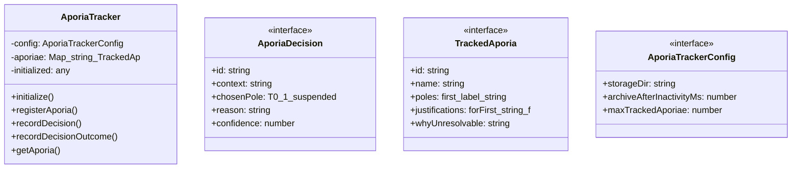
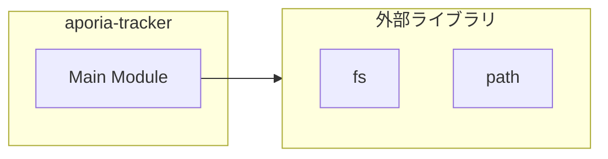

# aporia-tracker

## 概要

`aporia-tracker` モジュールのAPIリファレンス。

## インポート

```typescript
// from 'fs': fs
// from 'path': path
```

## エクスポート一覧

| 種別 | 名前 | 説明 |
|------|------|------|
| 関数 | `getAporiaTracker` | - |
| クラス | `AporiaTracker` | アポリア追跡システム |
| インターフェース | `AporiaDecision` | - |
| インターフェース | `TrackedAporia` | - |
| インターフェース | `AporiaTrackerConfig` | - |
| 型 | `AporiaStatus` | - |

## 図解

### クラス図



### 依存関係図



## 関数

### getAporiaTracker

```typescript
getAporiaTracker(): AporiaTracker
```

**戻り値**: `AporiaTracker`

## クラス

### AporiaTracker

アポリア追跡システム

解決不能な緊張関係（アポリア）を記録・追跡し、
「解決」ではなく「生きる」ための支援を行う。

**重要**: このシステムはアポリアを「解決」しようとしない。
ヘーゲル的弁証法（統合）への退行を防ぐ。

**プロパティ**

| 名前 | 型 | 可視性 |
|------|-----|--------|
| config | `AporiaTrackerConfig` | private |
| aporiae | `Map<string, TrackedAporia>` | private |
| initialized | `any` | private |

**メソッド**

| 名前 | シグネチャ |
|------|------------|
| initialize | `initialize(): Promise<void>` |
| registerAporia | `registerAporia(params): Promise<TrackedAporia>` |
| recordDecision | `recordDecision(aporiaId, decision): Promise<AporiaDecision>` |
| recordDecisionOutcome | `recordDecisionOutcome(aporiaId, decisionId, outcome): Promise<void>` |
| getAporia | `getAporia(id): TrackedAporia | undefined` |
| getActiveAporiae | `getActiveAporiae(): TrackedAporia[]` |
| getAporiaeByTag | `getAporiaeByTag(tag): TrackedAporia[]` |
| findSimilarAporiae | `findSimilarAporiae(poleLabels): TrackedAporia[]` |
| getStatistics | `getStatistics(): {
		totalAporiae: number;
		activeAporiae: number;
		totalDecisions: number;
		averageDecisionsPerAporia: number;
		mostFrequentTags: { tag: string; count: number }[];
	}` |
| suggestHowToLive | `suggestHowToLive(aporiaId): {
		guidelines: string[];
		warnings: string[];
		pastDecisions: string[];
	}` |
| archiveInactiveAporiae | `archiveInactiveAporiae(): Promise<number>` |
| ensureInitialized | `ensureInitialized(): Promise<void>` |
| save | `save(): Promise<void>` |
| generateId | `generateId(): string` |
| generateDecisionId | `generateDecisionId(): string` |

## インターフェース

### AporiaDecision

```typescript
interface AporiaDecision {
  id: string;
  context: string;
  chosenPole: 0 | 1 | "suspended";
  reason: string;
  confidence: number;
  acknowledgedAsTentative: boolean;
  anticipatedRisks: string[];
  timestamp: string;
  actualOutcome?: {
		description: string;
		unintendedConsequences: string[];
		wouldChooseDifferently: boolean;
		recordedAt: string;
	};
}
```

### TrackedAporia

```typescript
interface TrackedAporia {
  id: string;
  name: string;
  poles: {
		first: { label: string; description: string };
		second: { label: string; description: string };
	};
  justifications: {
		forFirst: string[];
		forSecond: string[];
	};
  whyUnresolvable: string;
  decisionHistory: AporiaDecision[];
  status: AporiaStatus;
  discoveryContext: string;
  tags: string[];
  createdAt: string;
  updatedAt: string;
}
```

### AporiaTrackerConfig

```typescript
interface AporiaTrackerConfig {
  storageDir: string;
  archiveAfterInactivityMs: number;
  maxTrackedAporiae: number;
}
```

## 型定義

### AporiaStatus

```typescript
type AporiaStatus = | "active" // 現在有効な緊張関係
	| "suspended" // 一時的に判断を保留中
	| "contextually_resolved" // 特定文脈で一時的に解決（ただし普遍ではない）
	| "archived"
```

---
*自動生成: 2026-02-23T06:29:42.266Z*
