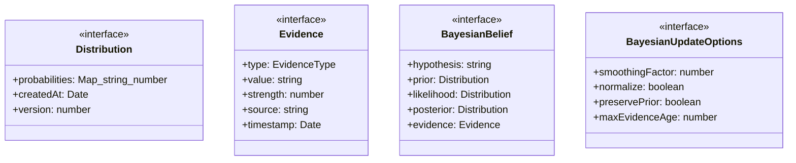
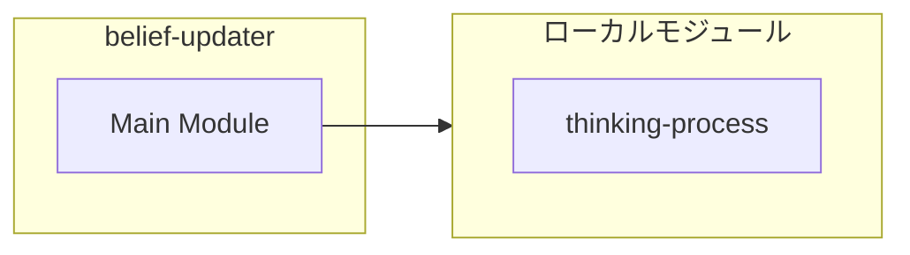
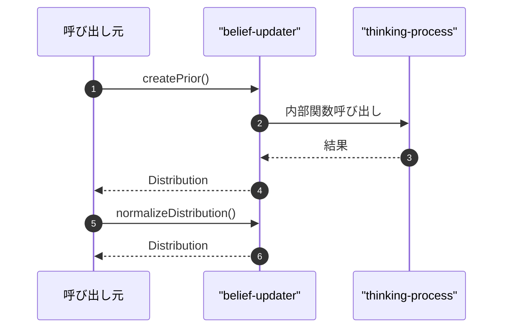

# belief-updater

## 概要

`belief-updater` モジュールのAPIリファレンス。

## インポート

```typescript
// from './thinking-process': ThinkingMode, ThinkingPhase
```

## エクスポート一覧

| 種別 | 名前 | 説明 |
|------|------|------|
| 関数 | `createPrior` | - |
| 関数 | `normalizeDistribution` | - |
| 関数 | `updateBelief` | - |
| 関数 | `updateWithMultipleEvidence` | - |
| 関数 | `createBayesianBelief` | - |
| 関数 | `updateBayesianBelief` | - |
| 関数 | `getMostProbable` | - |
| 関数 | `calculateEntropy` | - |
| 関数 | `getMaxEntropy` | - |
| 関数 | `evaluateBeliefStrength` | - |
| 関数 | `createThinkingModeBelief` | - |
| 関数 | `createThinkingPhaseBelief` | - |
| 関数 | `createEvidence` | - |
| 関数 | `distributionToJSON` | - |
| 関数 | `distributionFromJSON` | - |
| 関数 | `klDivergence` | - |
| 関数 | `summarizeDistribution` | - |
| インターフェース | `Distribution` | 確率分布 |
| インターフェース | `Evidence` | 証拠 |
| インターフェース | `BayesianBelief` | ベイズ信念 |
| インターフェース | `BayesianUpdateOptions` | ベイズ更新オプション |
| 型 | `EvidenceType` | 証拠タイプ |

## 図解

### クラス図



### 依存関係図



### 関数フロー

```mermaid
flowchart TD
  calculateEntropy["calculateEntropy()"]
  createBayesianBelief["createBayesianBelief()"]
  createEvidence["createEvidence()"]
  createPrior["createPrior()"]
  createThinkingModeBelief["createThinkingModeBelief()"]
  createThinkingPhaseBelief["createThinkingPhaseBelief()"]
  distributionFromJSON["distributionFromJSON()"]
  distributionToJSON["distributionToJSON()"]
  evaluateBeliefStrength["evaluateBeliefStrength()"]
  getMaxEntropy["getMaxEntropy()"]
  getMostProbable["getMostProbable()"]
  klDivergence["klDivergence()"]
  normalizeDistribution["normalizeDistribution()"]
  summarizeDistribution["summarizeDistribution()"]
  updateBayesianBelief["updateBayesianBelief()"]
  updateBelief["updateBelief()"]
  updateWithMultipleEvidence["updateWithMultipleEvidence()"]
  createBayesianBelief --> createPrior
  createThinkingModeBelief --> createBayesianBelief
  createThinkingPhaseBelief --> createBayesianBelief
  evaluateBeliefStrength --> calculateEntropy
  evaluateBeliefStrength --> getMaxEntropy
  summarizeDistribution --> calculateEntropy
  summarizeDistribution --> getMaxEntropy
  updateBayesianBelief --> updateBelief
  updateBelief --> normalizeDistribution
  updateWithMultipleEvidence --> updateBelief
```



### シーケンス図



## 関数

### createPrior

```typescript
createPrior(hypotheses: string[], initialProbabilities?: Map<string, number>): Distribution
```

**パラメータ**

| 名前 | 型 | 必須 |
|------|-----|------|
| hypotheses | `string[]` | はい |
| initialProbabilities | `Map<string, number>` | いいえ |

**戻り値**: `Distribution`

### normalizeDistribution

```typescript
normalizeDistribution(distribution: Distribution): Distribution
```

**パラメータ**

| 名前 | 型 | 必須 |
|------|-----|------|
| distribution | `Distribution` | はい |

**戻り値**: `Distribution`

### updateBelief

```typescript
updateBelief(prior: Distribution, evidence: Evidence, options: Partial<BayesianUpdateOptions>): Distribution
```

**パラメータ**

| 名前 | 型 | 必須 |
|------|-----|------|
| prior | `Distribution` | はい |
| evidence | `Evidence` | はい |
| options | `Partial<BayesianUpdateOptions>` | はい |

**戻り値**: `Distribution`

### updateWithMultipleEvidence

```typescript
updateWithMultipleEvidence(prior: Distribution, evidenceList: Evidence[], options: Partial<BayesianUpdateOptions>): {
  finalPosterior: Distribution;
  updateHistory: Distribution[];
  appliedEvidence: Evidence[];
}
```

**パラメータ**

| 名前 | 型 | 必須 |
|------|-----|------|
| prior | `Distribution` | はい |
| evidenceList | `Evidence[]` | はい |
| options | `Partial<BayesianUpdateOptions>` | はい |

**戻り値**: `{
  finalPosterior: Distribution;
  updateHistory: Distribution[];
  appliedEvidence: Evidence[];
}`

### createBayesianBelief

```typescript
createBayesianBelief(hypothesis: string, alternativeHypotheses: string[], initialPrior?: Map<string, number>): BayesianBelief
```

**パラメータ**

| 名前 | 型 | 必須 |
|------|-----|------|
| hypothesis | `string` | はい |
| alternativeHypotheses | `string[]` | はい |
| initialPrior | `Map<string, number>` | いいえ |

**戻り値**: `BayesianBelief`

### updateBayesianBelief

```typescript
updateBayesianBelief(belief: BayesianBelief, evidence: Evidence, options: Partial<BayesianUpdateOptions>): BayesianBelief
```

**パラメータ**

| 名前 | 型 | 必須 |
|------|-----|------|
| belief | `BayesianBelief` | はい |
| evidence | `Evidence` | はい |
| options | `Partial<BayesianUpdateOptions>` | はい |

**戻り値**: `BayesianBelief`

### getMostProbable

```typescript
getMostProbable(distribution: Distribution): {
  hypothesis: string;
  probability: number;
}
```

**パラメータ**

| 名前 | 型 | 必須 |
|------|-----|------|
| distribution | `Distribution` | はい |

**戻り値**: `{
  hypothesis: string;
  probability: number;
}`

### calculateEntropy

```typescript
calculateEntropy(distribution: Distribution): number
```

**パラメータ**

| 名前 | 型 | 必須 |
|------|-----|------|
| distribution | `Distribution` | はい |

**戻り値**: `number`

### getMaxEntropy

```typescript
getMaxEntropy(numHypotheses: number): number
```

**パラメータ**

| 名前 | 型 | 必須 |
|------|-----|------|
| numHypotheses | `number` | はい |

**戻り値**: `number`

### evaluateBeliefStrength

```typescript
evaluateBeliefStrength(belief: BayesianBelief): {
  confidence: number;
  uncertainty: number;
  evidenceCount: number;
  mainHypothesisProbability: number;
}
```

**パラメータ**

| 名前 | 型 | 必須 |
|------|-----|------|
| belief | `BayesianBelief` | はい |

**戻り値**: `{
  confidence: number;
  uncertainty: number;
  evidenceCount: number;
  mainHypothesisProbability: number;
}`

### createThinkingModeBelief

```typescript
createThinkingModeBelief(initialPriors?: Map<ThinkingMode, number>): BayesianBelief
```

**パラメータ**

| 名前 | 型 | 必須 |
|------|-----|------|
| initialPriors | `Map<ThinkingMode, number>` | いいえ |

**戻り値**: `BayesianBelief`

### createThinkingPhaseBelief

```typescript
createThinkingPhaseBelief(initialPriors?: Map<ThinkingPhase, number>): BayesianBelief
```

**パラメータ**

| 名前 | 型 | 必須 |
|------|-----|------|
| initialPriors | `Map<ThinkingPhase, number>` | いいえ |

**戻り値**: `BayesianBelief`

### createEvidence

```typescript
createEvidence(type: EvidenceType, value: string, likelihoods: Map<string, number>, strength: number): Evidence
```

**パラメータ**

| 名前 | 型 | 必須 |
|------|-----|------|
| type | `EvidenceType` | はい |
| value | `string` | はい |
| likelihoods | `Map<string, number>` | はい |
| strength | `number` | はい |

**戻り値**: `Evidence`

### distributionToJSON

```typescript
distributionToJSON(distribution: Distribution): {
  probabilities: Record<string, number>;
  createdAt: string;
  version: number;
}
```

**パラメータ**

| 名前 | 型 | 必須 |
|------|-----|------|
| distribution | `Distribution` | はい |

**戻り値**: `{
  probabilities: Record<string, number>;
  createdAt: string;
  version: number;
}`

### distributionFromJSON

```typescript
distributionFromJSON(json: {
  probabilities: Record<string, number>;
  createdAt: string;
  version: number;
}): Distribution
```

**パラメータ**

| 名前 | 型 | 必須 |
|------|-----|------|
| json | `object` | はい |
| &nbsp;&nbsp;↳ probabilities | `Record<string, number>` | はい |
| &nbsp;&nbsp;↳ createdAt | `string` | はい |
| &nbsp;&nbsp;↳ version | `number` | はい |

**戻り値**: `Distribution`

### klDivergence

```typescript
klDivergence(p: Distribution, q: Distribution): number
```

**パラメータ**

| 名前 | 型 | 必須 |
|------|-----|------|
| p | `Distribution` | はい |
| q | `Distribution` | はい |

**戻り値**: `number`

### summarizeDistribution

```typescript
summarizeDistribution(distribution: Distribution): string
```

**パラメータ**

| 名前 | 型 | 必須 |
|------|-----|------|
| distribution | `Distribution` | はい |

**戻り値**: `string`

## インターフェース

### Distribution

```typescript
interface Distribution {
  probabilities: Map<string, number>;
  createdAt: Date;
  version: number;
}
```

確率分布

### Evidence

```typescript
interface Evidence {
  type: EvidenceType;
  value: string;
  strength: number;
  source: string;
  timestamp: Date;
  likelihoods?: Map<string, number>;
}
```

証拠

### BayesianBelief

```typescript
interface BayesianBelief {
  hypothesis: string;
  prior: Distribution;
  likelihood: Distribution;
  posterior: Distribution;
  evidence: Evidence[];
  lastUpdated: Date;
}
```

ベイズ信念

### BayesianUpdateOptions

```typescript
interface BayesianUpdateOptions {
  smoothingFactor: number;
  normalize: boolean;
  preservePrior: boolean;
  maxEvidenceAge: number;
}
```

ベイズ更新オプション

## 型定義

### EvidenceType

```typescript
type EvidenceType = | 'observation'      // 直接観測
  | 'inference'        // 推論による
  | 'user-feedback'    // ユーザーからのフィードバック
  | 'test-result'      // テスト結果
  | 'system-log'
```

証拠タイプ

---
*自動生成: 2026-02-22T18:55:28.829Z*
