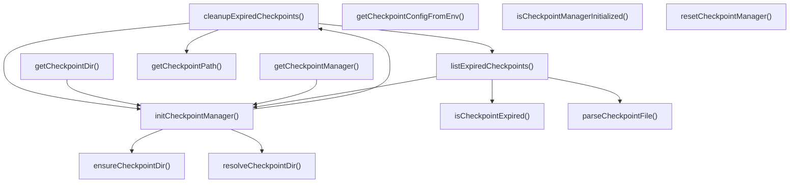

# checkpoint-manager

## 概要

`checkpoint-manager` モジュールのAPIリファレンス。

## インポート

```typescript
// from 'node:fs': existsSync, mkdirSync, readdirSync, ...
// from 'node:os': homedir
// from 'node:path': join
```

## エクスポート一覧

| 種別 | 名前 | 説明 |
|------|------|------|
| 関数 | `initCheckpointManager` | チェックポイントマネージャーを初期化 |
| 関数 | `getCheckpointManager` | チェックポイントマネージャーのインスタンスを取得 |
| 関数 | `resetCheckpointManager` | チェックポイントマネージャーをリセット |
| 関数 | `isCheckpointManagerInitialized` | 初期化状態を確認 |
| 関数 | `getCheckpointDir` | チェックポイントディレクトリを取得 |
| 関数 | `getCheckpointConfigFromEnv` | 環境変数から設定を取得 |
| インターフェース | `Checkpoint` | チェックポイントエンティティ |
| インターフェース | `CheckpointSaveResult` | チェックポイント保存結果 |
| インターフェース | `PreemptionResult` | 割り込み処理の結果 |
| インターフェース | `CheckpointManagerConfig` | チェックポイント管理設定 |
| インターフェース | `CheckpointStats` | チェックポイント統計情報 |
| 型 | `CheckpointSource` | チェックポイントのソース種別 |
| 型 | `CheckpointPriority` | チェックポイント優先度定義 |

## 図解

### クラス図


### 関数フロー



### シーケンス図


## 関数

### resolveCheckpointDir

```typescript
resolveCheckpointDir(baseDir: string): string
```

Resolve checkpoint directory path.
Supports both relative and absolute paths.

**パラメータ**

| 名前 | 型 | 必須 |
|------|-----|------|
| baseDir | `string` | はい |

**戻り値**: `string`

### ensureCheckpointDir

```typescript
ensureCheckpointDir(dir: string): void
```

Ensure checkpoint directory exists.

**パラメータ**

| 名前 | 型 | 必須 |
|------|-----|------|
| dir | `string` | はい |

**戻り値**: `void`

### generateCheckpointId

```typescript
generateCheckpointId(taskId: string): string
```

Generate a unique checkpoint ID.

**パラメータ**

| 名前 | 型 | 必須 |
|------|-----|------|
| taskId | `string` | はい |

**戻り値**: `string`

### getCheckpointPath

```typescript
getCheckpointPath(dir: string, checkpointId: string): string
```

Get checkpoint file path from checkpoint ID.

**パラメータ**

| 名前 | 型 | 必須 |
|------|-----|------|
| dir | `string` | はい |
| checkpointId | `string` | はい |

**戻り値**: `string`

### parseCheckpointFile

```typescript
parseCheckpointFile(filePath: string): Checkpoint | null
```

Parse checkpoint file.

**パラメータ**

| 名前 | 型 | 必須 |
|------|-----|------|
| filePath | `string` | はい |

**戻り値**: `Checkpoint | null`

### isCheckpointExpired

```typescript
isCheckpointExpired(checkpoint: Checkpoint, nowMs: number): boolean
```

Check if checkpoint is expired.

**パラメータ**

| 名前 | 型 | 必須 |
|------|-----|------|
| checkpoint | `Checkpoint` | はい |
| nowMs | `number` | はい |

**戻り値**: `boolean`

### getFileSizeBytes

```typescript
getFileSizeBytes(filePath: string): number
```

Get checkpoint file size in bytes.

**パラメータ**

| 名前 | 型 | 必須 |
|------|-----|------|
| filePath | `string` | はい |

**戻り値**: `number`

### initCheckpointManager

```typescript
initCheckpointManager(configOverrides?: Partial<CheckpointManagerConfig>): void
```

チェックポイントマネージャーを初期化

**パラメータ**

| 名前 | 型 | 必須 |
|------|-----|------|
| configOverrides | `Partial<CheckpointManagerConfig>` | いいえ |

**戻り値**: `void`

### getCheckpointManager

```typescript
getCheckpointManager(): {
  save: (checkpoint: Omit<Checkpoint, "id" | "createdAt"> & { id?: string }) => Promise<CheckpointSaveResult>;
  load: (taskId: string) => Promise<Checkpoint | null>;
  delete: (taskId: string) => Promise<boolean>;
  listExpired: () => Promise<Checkpoint[]>;
  cleanup: () => Promise<number>;
  getStats: () => CheckpointStats;
}
```

チェックポイントマネージャーのインスタンスを取得

**戻り値**: `{
  save: (checkpoint: Omit<Checkpoint, "id" | "createdAt"> & { id?: string }) => Promise<CheckpointSaveResult>;
  load: (taskId: string) => Promise<Checkpoint | null>;
  delete: (taskId: string) => Promise<boolean>;
  listExpired: () => Promise<Checkpoint[]>;
  cleanup: () => Promise<number>;
  getStats: () => CheckpointStats;
}`

### saveCheckpoint

```typescript
async saveCheckpoint(checkpoint: Omit<Checkpoint, "id" | "createdAt"> & { id?: string }): Promise<CheckpointSaveResult>
```

Save a checkpoint to disk.
Operation is idempotent - saving the same taskId overwrites the previous checkpoint.

**パラメータ**

| 名前 | 型 | 必須 |
|------|-----|------|
| checkpoint | `Omit<Checkpoint, "id" | "createdAt"> & { id?: s...` | はい |

**戻り値**: `Promise<CheckpointSaveResult>`

### loadCheckpoint

```typescript
async loadCheckpoint(taskId: string): Promise<Checkpoint | null>
```

Load a checkpoint by task ID.
Returns the most recent checkpoint for the given task.

**パラメータ**

| 名前 | 型 | 必須 |
|------|-----|------|
| taskId | `string` | はい |

**戻り値**: `Promise<Checkpoint | null>`

### deleteCheckpoint

```typescript
async deleteCheckpoint(taskId: string): Promise<boolean>
```

Delete a checkpoint by task ID.
Removes all checkpoints associated with the task.

**パラメータ**

| 名前 | 型 | 必須 |
|------|-----|------|
| taskId | `string` | はい |

**戻り値**: `Promise<boolean>`

### listExpiredCheckpoints

```typescript
async listExpiredCheckpoints(): Promise<Checkpoint[]>
```

List all expired checkpoints.

**戻り値**: `Promise<Checkpoint[]>`

### cleanupExpiredCheckpoints

```typescript
async cleanupExpiredCheckpoints(): Promise<number>
```

Clean up expired checkpoints.
Returns the number of checkpoints deleted.

**戻り値**: `Promise<number>`

### enforceMaxCheckpoints

```typescript
async enforceMaxCheckpoints(): Promise<void>
```

Enforce maximum checkpoint limit.
Removes oldest checkpoints if limit is exceeded.

**戻り値**: `Promise<void>`

### getCheckpointStats

```typescript
getCheckpointStats(): CheckpointStats
```

Get checkpoint statistics.

**戻り値**: `CheckpointStats`

### resetCheckpointManager

```typescript
resetCheckpointManager(): void
```

チェックポイントマネージャーをリセット

**戻り値**: `void`

### isCheckpointManagerInitialized

```typescript
isCheckpointManagerInitialized(): boolean
```

初期化状態を確認

**戻り値**: `boolean`

### getCheckpointDir

```typescript
getCheckpointDir(): string
```

チェックポイントディレクトリを取得

**戻り値**: `string`

### getCheckpointConfigFromEnv

```typescript
getCheckpointConfigFromEnv(): Partial<CheckpointManagerConfig>
```

環境変数から設定を取得

**戻り値**: `Partial<CheckpointManagerConfig>`

## インターフェース

### Checkpoint

```typescript
interface Checkpoint {
  id: string;
  taskId: string;
  source: CheckpointSource;
  provider: string;
  model: string;
  priority: CheckpointPriority;
  state: unknown;
  progress: number;
  createdAt: number;
  ttlMs: number;
  metadata?: Record<string, unknown>;
}
```

チェックポイントエンティティ

### CheckpointSaveResult

```typescript
interface CheckpointSaveResult {
  success: boolean;
  checkpointId: string;
  path: string;
  error?: string;
}
```

チェックポイント保存結果

### PreemptionResult

```typescript
interface PreemptionResult {
  success: boolean;
  checkpointId?: string;
  error?: string;
  resumedFromCheckpoint?: boolean;
}
```

割り込み処理の結果

### CheckpointManagerConfig

```typescript
interface CheckpointManagerConfig {
  checkpointDir: string;
  defaultTtlMs: number;
  maxCheckpoints: number;
  cleanupIntervalMs: number;
}
```

チェックポイント管理設定

### CheckpointStats

```typescript
interface CheckpointStats {
  totalCount: number;
  totalSizeBytes: number;
  oldestCreatedAt: number | null;
  newestCreatedAt: number | null;
  bySource: Record<CheckpointSource, number>;
  byPriority: Record<CheckpointPriority, number>;
  expiredCount: number;
}
```

チェックポイント統計情報

## 型定義

### CheckpointSource

```typescript
type CheckpointSource = | "subagent_run"
  | "subagent_run_parallel"
  | "agent_team_run"
  | "agent_team_run_parallel"
```

チェックポイントのソース種別

### CheckpointPriority

```typescript
type CheckpointPriority = "critical" | "high" | "normal" | "low" | "background"
```

チェックポイント優先度定義

---
*自動生成: 2026-02-18T15:54:41.440Z*
