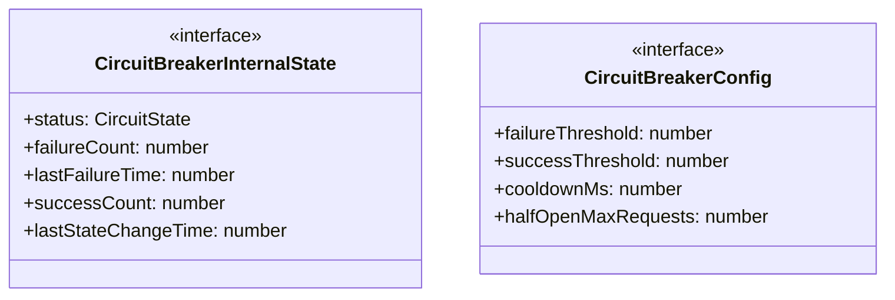

# circuit-breaker

## 概要

`circuit-breaker` モジュールのAPIリファレンス。

## エクスポート一覧

| 種別 | 名前 | 説明 |
|------|------|------|
| 関数 | `checkCircuitBreaker` | サーキットブレーカーをチェックする |
| 関数 | `recordCircuitBreakerSuccess` | サーキットブレーカーに成功を記録する |
| 関数 | `recordCircuitBreakerFailure` | サーキットブレーカーに失敗を記録する |
| 関数 | `getCircuitBreakerState` | サーキットブレーカーの状態を取得する |
| 関数 | `resetAllCircuitBreakers` | すべてのサーキットブレーカーをリセットする |
| 関数 | `resetCircuitBreaker` | 特定のサーキットブレーカーをリセットする |
| 関数 | `getCircuitBreakerStats` | サーキットブレーカーの統計情報を取得する（デバッグ用） |
| インターフェース | `CircuitBreakerConfig` | サーキットブレーカーの設定 |
| 型 | `CircuitState` | サーキットブレーカーの状態 |

## 図解

### クラス図



## 関数

### checkCircuitBreaker

```typescript
checkCircuitBreaker(key: string, config: Partial<CircuitBreakerConfig>): { allowed: boolean; retryAfterMs?: number; state: CircuitState }
```

サーキットブレーカーをチェックする

**パラメータ**

| 名前 | 型 | 必須 |
|------|-----|------|
| key | `string` | はい |
| config | `Partial<CircuitBreakerConfig>` | はい |

**戻り値**: `{ allowed: boolean; retryAfterMs?: number; state: CircuitState }`

### recordCircuitBreakerSuccess

```typescript
recordCircuitBreakerSuccess(key: string, config: Partial<CircuitBreakerConfig>): void
```

サーキットブレーカーに成功を記録する

**パラメータ**

| 名前 | 型 | 必須 |
|------|-----|------|
| key | `string` | はい |
| config | `Partial<CircuitBreakerConfig>` | はい |

**戻り値**: `void`

### recordCircuitBreakerFailure

```typescript
recordCircuitBreakerFailure(key: string, config: Partial<CircuitBreakerConfig>): void
```

サーキットブレーカーに失敗を記録する

**パラメータ**

| 名前 | 型 | 必須 |
|------|-----|------|
| key | `string` | はい |
| config | `Partial<CircuitBreakerConfig>` | はい |

**戻り値**: `void`

### getCircuitBreakerState

```typescript
getCircuitBreakerState(key: string): CircuitState | undefined
```

サーキットブレーカーの状態を取得する

**パラメータ**

| 名前 | 型 | 必須 |
|------|-----|------|
| key | `string` | はい |

**戻り値**: `CircuitState | undefined`

### resetAllCircuitBreakers

```typescript
resetAllCircuitBreakers(): void
```

すべてのサーキットブレーカーをリセットする

**戻り値**: `void`

### resetCircuitBreaker

```typescript
resetCircuitBreaker(key: string): void
```

特定のサーキットブレーカーをリセットする

**パラメータ**

| 名前 | 型 | 必須 |
|------|-----|------|
| key | `string` | はい |

**戻り値**: `void`

### getCircuitBreakerStats

```typescript
getCircuitBreakerStats(): Record<string, { state: CircuitState; failureCount: number; successCount: number }>
```

サーキットブレーカーの統計情報を取得する（デバッグ用）

**戻り値**: `Record<string, { state: CircuitState; failureCount: number; successCount: number }>`

## インターフェース

### CircuitBreakerInternalState

```typescript
interface CircuitBreakerInternalState {
  status: CircuitState;
  failureCount: number;
  lastFailureTime: number;
  successCount: number;
  lastStateChangeTime: number;
}
```

サーキットブレーカーの内部状態

### CircuitBreakerConfig

```typescript
interface CircuitBreakerConfig {
  failureThreshold: number;
  successThreshold: number;
  cooldownMs: number;
  halfOpenMaxRequests: number;
}
```

サーキットブレーカーの設定

## 型定義

### CircuitState

```typescript
type CircuitState = "closed" | "open" | "half-open"
```

サーキットブレーカーの状態

---
*自動生成: 2026-02-24T17:08:02.617Z*
