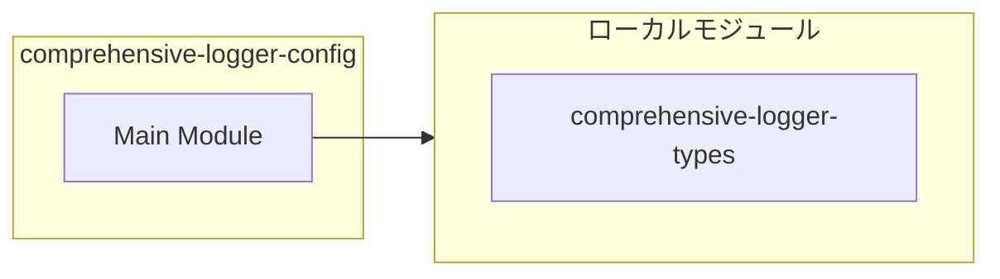
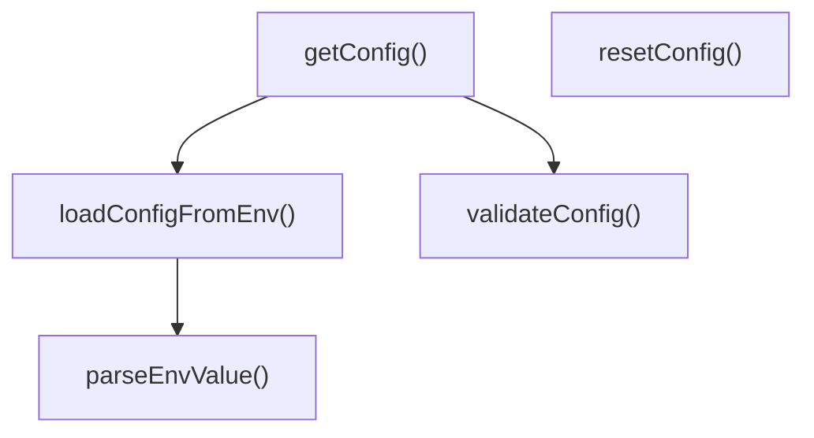
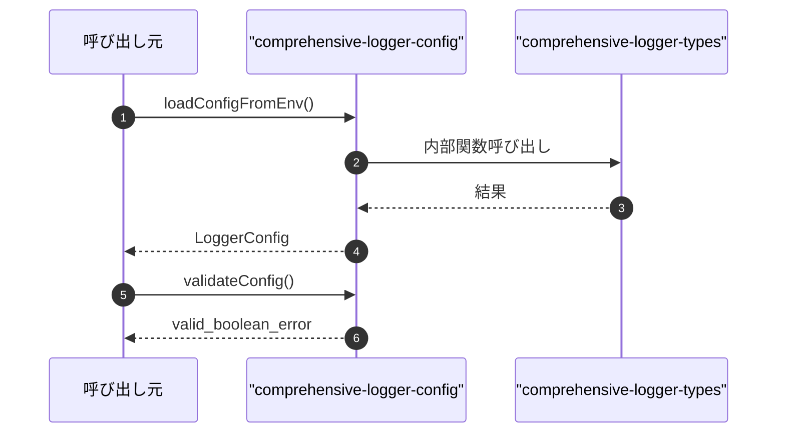

# comprehensive-logger-config

## 概要

`comprehensive-logger-config` モジュールのAPIリファレンス。

## インポート

```typescript
// from './comprehensive-logger-types': LoggerConfig
```

## エクスポート一覧

| 種別 | 名前 | 説明 |
|------|------|------|
| 関数 | `loadConfigFromEnv` | 環境変数から設定を読込 |
| 関数 | `validateConfig` | ロガー設定を検証する |
| 関数 | `getConfig` | - |
| 関数 | `resetConfig` | 設定をリセットする |

## 図解

### 依存関係図



### 関数フロー



### シーケンス図



## 関数

### parseEnvValue

```typescript
parseEnvValue(value: string, type: string): unknown
```

**パラメータ**

| 名前 | 型 | 必須 |
|------|-----|------|
| value | `string` | はい |
| type | `string` | はい |

**戻り値**: `unknown`

### loadConfigFromEnv

```typescript
loadConfigFromEnv(baseConfig: LoggerConfig): LoggerConfig
```

環境変数から設定を読込

**パラメータ**

| 名前 | 型 | 必須 |
|------|-----|------|
| baseConfig | `LoggerConfig` | はい |

**戻り値**: `LoggerConfig`

### validateConfig

```typescript
validateConfig(config: LoggerConfig): { valid: boolean; errors: string[] }
```

ロガー設定を検証する

**パラメータ**

| 名前 | 型 | 必須 |
|------|-----|------|
| config | `LoggerConfig` | はい |

**戻り値**: `{ valid: boolean; errors: string[] }`

### getConfig

```typescript
getConfig(): LoggerConfig
```

**戻り値**: `LoggerConfig`

### resetConfig

```typescript
resetConfig(): void
```

設定をリセットする

**戻り値**: `void`

---
*自動生成: 2026-02-18T18:06:17.488Z*
