# comprehensive-logger-types

## 概要

`comprehensive-logger-types` モジュールのAPIリファレンス。

## エクスポート一覧

| 種別 | 名前 | 説明 |
|------|------|------|
| インターフェース | `BaseEvent` | 全てのイベントの基本構造を定義するインターフェース |
| インターフェース | `SessionStartEvent` | セッション開始イベントのデータ構造。 |
| インターフェース | `SessionEndEvent` | セッション終了イベント |
| インターフェース | `TaskStartEvent` | タスク開始イベント |
| インターフェース | `TaskEndEvent` | タスク終了イベント |
| インターフェース | `OperationStartEvent` | 操作開始イベント |
| インターフェース | `OperationEndEvent` | オペレーション終了イベント |
| インターフェース | `ToolCallEvent` | ツール呼び出しイベント |
| インターフェース | `ToolResultEvent` | ツール実行結果を表すイベント |
| インターフェース | `ToolErrorEvent` | ツール実行時のエラーイベントを表します。 |
| インターフェース | `LLMRequestEvent` | LLMリクエストイベント |
| インターフェース | `LLMResponseEvent` | LLMの応答イベント |
| インターフェース | `LLMErrorEvent` | LLMエラー発生時のイベント情報 |
| インターフェース | `UserInputEvent` | ユーザー入力イベント |
| インターフェース | `UserFeedbackEvent` | ユーザーフィードバックイベント |
| インターフェース | `ConfigLoadEvent` | 設定読み込みイベント |
| インターフェース | `StateChangeEvent` | 状態変化イベントを表すインターフェース |
| インターフェース | `MetricsSnapshotEvent` | メトリクススナップショットイベントを表します |
| インターフェース | `LoggerConfig` | ロガーの動作設定を定義します |
| 型 | `EventType` | 包括的ログ収集システムで発生するイベントの種類 |
| 型 | `ComponentType` | コンポーネントの種類を表す型定義 |
| 型 | `ToolType` | ツールの種類を表す型定義 |
| 型 | `Status` | ステータスの種類を表すユニオン型 |
| 型 | `OperationType` | 操作の種類を表す文字列リテラル型 |
| 型 | `LogEvent` | すべてのログイベントの共用体型 |

## 図解

### クラス図

```mermaid
classDiagram
  class BaseEvent {
    <<interface>>
    +eventId: string
    +eventType: EventType
    +sessionId: string
    +taskId: string
    +operationId: string
  }
  class SessionStartEvent {
    <<interface>>
    +eventType: session_start
    +data: piVersion_string_no
  }
  class SessionEndEvent {
    <<interface>>
    +eventType: session_end
    +data: durationMs_number_t
  }
  class TaskStartEvent {
    <<interface>>
    +eventType: task_start
    +data: userInput_string_in
  }
  class TaskEndEvent {
    <<interface>>
    +eventType: task_end
    +data: durationMs_number_s
  }
  class OperationStartEvent {
    <<interface>>
    +eventType: operation_start
    +data: operationType_Opera
  }
  class OperationEndEvent {
    <<interface>>
    +eventType: operation_end
    +data: durationMs_number_s
  }
  class ToolCallEvent {
    <<interface>>
    +eventType: tool_call
    +data: toolName_string_too
  }
  class ToolResultEvent {
    <<interface>>
    +eventType: tool_result
    +data: toolName_string_sta
  }
  class ToolErrorEvent {
    <<interface>>
    +eventType: tool_error
    +data: toolName_string_err
  }
  class LLMRequestEvent {
    <<interface>>
    +eventType: llm_request
    +data: provider_string_mod
  }
  class LLMResponseEvent {
    <<interface>>
    +eventType: llm_response
    +data: provider_string_mod
  }
  class LLMErrorEvent {
    <<interface>>
    +eventType: llm_error
    +data: provider_string_mod
  }
  class UserInputEvent {
    <<interface>>
    +eventType: user_input
    +data: input_string_inputT
  }
  class UserFeedbackEvent {
    <<interface>>
    +eventType: user_feedback
    +data: feedbackType_appro
  }
  class ConfigLoadEvent {
    <<interface>>
    +eventType: config_load
    +data: configType_system
  }
  class StateChangeEvent {
    <<interface>>
    +eventType: state_change
    +data: entityType_file
  }
  class MetricsSnapshotEvent {
    <<interface>>
    +eventType: metrics_snapshot
    +data: memoryUsageMB_numbe
  }
  class LoggerConfig {
    <<interface>>
    +logDir: string
    +enabled: boolean
    +bufferSize: number
    +flushIntervalMs: number
    +maxFileSizeMB: number
  }
```



## インターフェース

### BaseEvent

```typescript
interface BaseEvent {
  eventId: string;
  eventType: EventType;
  sessionId: string;
  taskId: string;
  operationId: string;
  parentEventId?: string;
  timestamp: string;
  component: {
    type: ComponentType;
    name: string;
    version?: string;
    filePath?: string;
  };
}
```

全てのイベントの基本構造を定義するインターフェース

### SessionStartEvent

```typescript
interface SessionStartEvent {
  eventType: 'session_start';
  data: {
    piVersion: string;
    nodeVersion: string;
    platform: string;
    cwd: string;
    envKeys: string[];
    configHash: string;
    startupTimeMs: number;
  };
}
```

セッション開始イベントのデータ構造。

### SessionEndEvent

```typescript
interface SessionEndEvent {
  eventType: 'session_end';
  data: {
    durationMs: number;
    taskCount: number;
    errorCount: number;
    totalTokensUsed: number;
    exitReason: 'normal' | 'error' | 'user_interrupt' | 'timeout';
  };
}
```

セッション終了イベント

### TaskStartEvent

```typescript
interface TaskStartEvent {
  eventType: 'task_start';
  data: {
    userInput: string;
    inputType: 'text' | 'voice' | 'file';
    context: {
      filesReferenced: string[];
      skillsLoaded: string[];
      teamsAvailable: string[];
    };
    intent?: string;
  };
}
```

タスク開始イベント

### TaskEndEvent

```typescript
interface TaskEndEvent {
  eventType: 'task_end';
  data: {
    durationMs: number;
    status: Status;
    operationsCount: number;
    toolsCount: number;
/**
     * 操作の種類を表す型
     *
     * エージェントの実行モードを区別するための文字列リテラル型。
     * サブエージェント実行、チーム実行、ループ実行、直接実行のいずれかを指定する。
     *
     * @example
     * const operationType: OperationType = 'subagent_run';
     */
    tokensUsed: number;
    filesCreated: string[];
    filesModified: string[];
    filesDeleted: string[];
    commandsExecuted: string[];
    summary: string;
    errors: Array<{
      eventId: string;
      message: string;
      type: string;
/**
     * /**
     * * 操作終
     */
    }>;
  };
}
```

タスク終了イベント

### OperationStartEvent

```typescript
interface OperationStartEvent {
  eventType: 'operation_start';
  data: {
    operationType: OperationType;
    target: string;
    input: {
      task: string;
      params: Record<string, unknown>;
/**
     * /**
     * * ツール呼び出しイベントを表すインターフェース
     * *
     * * ツールの実行に関する詳細情報を含むイベントデータ。
     * * ツール名、タイプ、パラメータ、呼び出し元情報、環境情報を保持する。
     * *
     */
    };
    strategy?: string;
    retryConfig?: {
      maxRetries: number;
      backoffMs: number;
    };
  };
}
```

操作開始イベント

### OperationEndEvent

```typescript
interface OperationEndEvent {
  eventType: 'operation_end';
  data: {
    durationMs: number;
    status: Status;
    tokensUsed: number;
/**
     * /**
     * * LLMリクエストイベントの構造を定義するインターフェース
     * *
     * * LLMへのリクエストに関する情報を記録するイベント型。
     * * プロバイダ、モデル、プロンプト情報、トークン設定などを含む。
     * *
     * * @property eventType - イベント種別（'llm_request'で固定）
     * * @property data.provider - LLMプロバイダー名
     * * @property data.model - 使用するモデル名
     * * @property data.systemPromptLength - システムプロンプトの文字数
     * * @property data.systemPromptHash - システムプロンプトのハッシュ値
     * * @property data.userMessageCount - ユーザーメッセージの数
     * * @property data.userMessageLength - ユーザーメッセージの総文字数
     * * @property data.temperature - 生成の温度パラメータ（オプション）
     * * @property data.maxTokens - 最大トークン数（オプション）
     * * @property data.contextWindowUsed - 使用したコンテキストウィンドウサイズ
     * * @property data
     */
    outputLength: number;
    outputFile?: string;
    childOperations: number;
    toolCalls: number;
    error?: {
      type: string;
      message: string;
      stack: string;
    };
  };
}
```

オペレーション終了イベント

### ToolCallEvent

```typescript
interface ToolCallEvent {
  eventType: 'tool_call';
  data: {
    toolName: string;
    toolType: ToolType;
    params: Record<string, unknown>;
    caller: {
      file: string;
      line: number;
      function: string;
    };
    environment: {
      cwd: string;
      shell?: string;
    };
  };
}
```

ツール呼び出しイベント

### ToolResultEvent

```typescript
interface ToolResultEvent {
  eventType: 'tool_result';
  data: {
    toolName: string;
    status: 'success' | 'error' | 'partial';
    durationMs: number;
    outputType: 'inline' | 'file' | 'truncated';
    output: string;
    outputHash?: string;
    outputSize: number;
    exitCode?: number;
    mimeType?: string;
  };
}
```

ツール実行結果を表すイベント

### ToolErrorEvent

```typescript
interface ToolErrorEvent {
  eventType: 'tool_error';
  data: {
    toolName: string;
    errorType: 'validation' | 'execution' | 'timeout' | 'permission' | 'unknown';
    errorMessage: string;
    errorStack?: string;
    recoveryAttempted: boolean;
    recoveryMethod?: string;
    recoverySuccessful?: boolean;
/**
     * /**
     * * ロガーの動作設定を定義するインターフェース
     * *
     * * ログ出力先、バッファリング、ローテーション、保持期間などの設定を管理します。
     * *
     * * @property logDir - ログファイルを保存するディレクトリパス
     * * @property enabled - ログ出力の有効/無効フラグ
     * * @property bufferSize - バッファサイズ（バイト単位）
     * * @property flushIntervalMs - バッファフラッシュ間隔（ミリ秒）
     * * @property maxFileSizeMB - ログファイルの最大サイズ（メガバイト）
     * * @property retentionDays - ログファイルの保持期間（日数）
     * * @property environment - 実行環境（development/production/test）
     * * @property minLogLevel - 出力する最小ログレベル（
     */
    params: Record<string, unknown>;
    partialOutput?: string;
  };
}
```

ツール実行時のエラーイベントを表します。

### LLMRequestEvent

```typescript
interface LLMRequestEvent {
  eventType: 'llm_request';
  data: {
    provider: string;
    model: string;
    systemPromptLength: number;
    systemPromptHash: string;
    userMessageCount: number;
    userMessageLength: number;
    temperature?: number;
    maxTokens?: number;
    contextWindowUsed: number;
    toolsAvailable: string[];
  };
}
```

LLMリクエストイベント

### LLMResponseEvent

```typescript
interface LLMResponseEvent {
  eventType: 'llm_response';
  data: {
    provider: string;
    model: string;
    inputTokens: number;
    outputTokens: number;
    totalTokens: number;
    durationMs: number;
    responseLength: number;
    stopReason: 'end_turn' | 'max_tokens' | 'tool_use' | 'error';
    toolsCalled: Array<{
      name: string;
      paramsSize: number;
    }>;
  };
}
```

LLMの応答イベント

### LLMErrorEvent

```typescript
interface LLMErrorEvent {
  eventType: 'llm_error';
  data: {
    provider: string;
    model: string;
    errorType: 'rate_limit' | 'timeout' | 'context_too_long' | 'api_error' | 'unknown';
    errorMessage: string;
    retryAttempt?: number;
    retryAfterMs?: number;
  };
}
```

LLMエラー発生時のイベント情報

### UserInputEvent

```typescript
interface UserInputEvent {
  eventType: 'user_input';
  data: {
    input: string;
    inputType: 'text' | 'voice' | 'file';
    metadata?: {
      source?: string;
      timestamp?: string;
    };
  };
}
```

ユーザー入力イベント

### UserFeedbackEvent

```typescript
interface UserFeedbackEvent {
  eventType: 'user_feedback';
  data: {
    feedbackType: 'approval' | 'rejection' | 'correction' | 'clarification';
    targetEventId: string;
    content: string;
  };
}
```

ユーザーフィードバックイベント

### ConfigLoadEvent

```typescript
interface ConfigLoadEvent {
  eventType: 'config_load';
  data: {
    configType: 'system' | 'project' | 'user';
    configPath: string;
    configHash: string;
    keysLoaded: string[];
    overrides: Record<string, boolean>;
  };
}
```

設定読み込みイベント

### StateChangeEvent

```typescript
interface StateChangeEvent {
  eventType: 'state_change';
  data: {
    entityType: 'file' | 'storage' | 'memory' | 'config';
    entityPath: string;
    changeType: 'create' | 'update' | 'delete';
    diff?: {
      additions: number;
      deletions: number;
      hunks: number;
    };
    beforeHash?: string;
    afterHash?: string;
  };
}
```

状態変化イベントを表すインターフェース

### MetricsSnapshotEvent

```typescript
interface MetricsSnapshotEvent {
  eventType: 'metrics_snapshot';
  data: {
    memoryUsageMB: number;
    cpuPercent: number;
    eventsTotal: number;
    tasksCompleted: number;
    operationsCompleted: number;
    toolCallsTotal: number;
    tokensTotal: number;
    errorRate: number;
    avgResponseTimeMs: number;
    p95ResponseTimeMs: number;
  };
}
```

メトリクススナップショットイベントを表します

### LoggerConfig

```typescript
interface LoggerConfig {
  logDir: string;
  enabled: boolean;
  bufferSize: number;
  flushIntervalMs: number;
  maxFileSizeMB: number;
  retentionDays: number;
  environment: 'development' | 'production' | 'test';
  minLogLevel: 'debug' | 'info' | 'warn' | 'error';
}
```

ロガーの動作設定を定義します

## 型定義

### EventType

```typescript
type EventType = | 'session_start'
  | 'session_end'
  | 'task_start'
  | 'task_end'
  | 'operation_start'
  | 'operation_end'
  // ツール
  | 'tool_call'
  | 'tool_result'
  | 'tool_error'
  // LLM
  | 'llm_request'
  | 'llm_response'
  | 'llm_error'
  // ユーザー
  | 'user_input'
  | 'user_feedback'
  // システム
  | 'config_load'
  | 'state_change'
  | 'metrics_snapshot'
```

包括的ログ収集システムで発生するイベントの種類

### ComponentType

```typescript
type ComponentType = 'extension' | 'subagent' | 'team' | 'skill' | 'tool'
```

コンポーネントの種類を表す型定義

### ToolType

```typescript
type ToolType = 'builtin' | 'extension' | 'dynamic'
```

ツールの種類を表す型定義

### Status

```typescript
type Status = 'pending' | 'running' | 'success' | 'failure' | 'timeout' | 'partial' | 'cancelled'
```

ステータスの種類を表すユニオン型

### OperationType

```typescript
type OperationType = 'subagent_run' | 'team_run' | 'loop_run' | 'direct'
```

操作の種類を表す文字列リテラル型

### LogEvent

```typescript
type LogEvent = | SessionStartEvent
  | SessionEndEvent
  | TaskStartEvent
  | TaskEndEvent
  | OperationStartEvent
  | OperationEndEvent
  | ToolCallEvent
  | ToolResultEvent
  | ToolErrorEvent
  | LLMRequestEvent
  | LLMResponseEvent
  | LLMErrorEvent
  | UserInputEvent
  | UserFeedbackEvent
  | ConfigLoadEvent
  | StateChangeEvent
  | MetricsSnapshotEvent
```

すべてのログイベントの共用体型

---
*自動生成: 2026-02-18T07:17:30.394Z*
