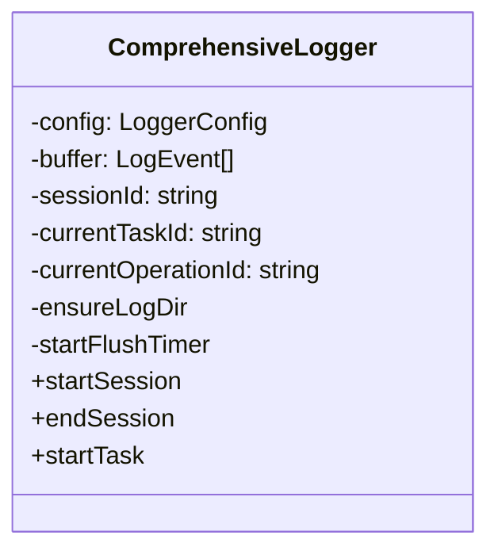
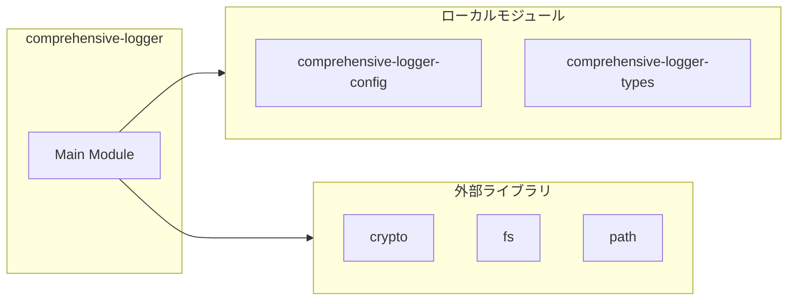
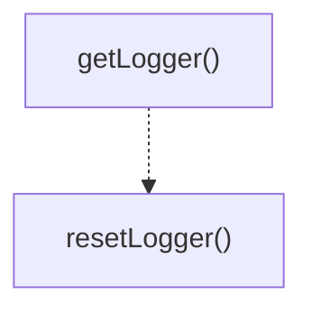

# comprehensive-logger

## 概要

`comprehensive-logger` モジュールのAPIリファレンス。

## インポート

```typescript
import { randomUUID } from 'crypto';
import { createHash } from 'crypto';
import { existsSync, statSync } from 'fs';
import { appendFile, mkdir } from 'fs/promises';
import { join, dirname } from 'path';
// ... and 3 more imports
```

## エクスポート一覧

| 種別 | 名前 | 説明 |
|------|------|------|
| 関数 | `getLogger` | - |
| 関数 | `resetLogger` | - |
| クラス | `ComprehensiveLogger` | - |

## 図解

### クラス図



### 依存関係図



### 関数フロー



## 関数

### getTimestamp

```typescript
getTimestamp(): string
```

**戻り値**: `string`

### getDateStr

```typescript
getDateStr(): string
```

**戻り値**: `string`

### hashString

```typescript
hashString(str: string): string
```

**パラメータ**

| 名前 | 型 | 必須 |
|------|-----|------|
| str | `string` | はい |

**戻り値**: `string`

### getLogger

```typescript
getLogger(): ComprehensiveLogger
```

**戻り値**: `ComprehensiveLogger`

### resetLogger

```typescript
resetLogger(): void
```

**戻り値**: `void`

## クラス

### ComprehensiveLogger

**プロパティ**

| 名前 | 型 | 可視性 |
|------|-----|--------|
| config | `LoggerConfig` | private |
| buffer | `LogEvent[]` | private |
| sessionId | `string` | private |
| currentTaskId | `string` | private |
| currentOperationId | `string` | private |
| parentEventId | `string` | private |
| flushTimer | `ReturnType<typeof setInterval> | null` | private |
| eventCounter | `number` | private |
| errorCount | `number` | private |
| totalTokens | `number` | private |
| sessionStartTime | `number` | private |
| taskStartTime | `number` | private |
| operationStartTime | `number` | private |
| activeOperations | `Map<string, { startTime: number; target: string }>` | private |
| activeTasks | `Map<string, { startTime: number; userInput: string }>` | private |

**メソッド**

| 名前 | シグネチャ |
|------|------------|
| ensureLogDir | `ensureLogDir(): Promise<void>` |
| startFlushTimer | `startFlushTimer(): void` |
| startSession | `startSession(data): string` |
| endSession | `endSession(exitReason): void` |
| startTask | `startTask(userInput, context): string` |
| endTask | `endTask(data): void` |
| startOperation | `startOperation(operationType, target, input, options): string` |
| endOperation | `endOperation(data): void` |
| logToolCall | `logToolCall(toolName, params, caller): string` |
| logToolResult | `logToolResult(toolName, result): void` |
| logToolError | `logToolError(toolName, error): void` |
| logLLMRequest | `logLLMRequest(data): string` |
| logLLMResponse | `logLLMResponse(data): void` |
| logStateChange | `logStateChange(data): void` |
| logMetricsSnapshot | `logMetricsSnapshot(data): void` |
| emit | `emit(event): void` |
| flush | `flush(): Promise<void>` |
| stopFlushTimer | `stopFlushTimer(): void` |
| getToolType | `getToolType(toolName): ToolType` |
| getSessionId | `getSessionId(): string` |
| getCurrentTaskId | `getCurrentTaskId(): string` |
| getCurrentOperationId | `getCurrentOperationId(): string` |
| getEventCount | `getEventCount(): number` |
| getErrorCount | `getErrorCount(): number` |
| getTotalTokens | `getTotalTokens(): number` |

---
*自動生成: 2026-02-17T21:48:27.655Z*
