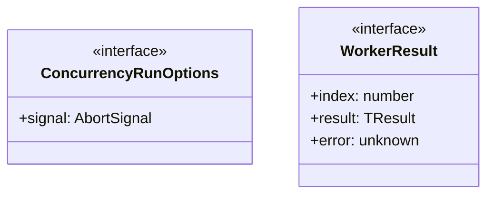
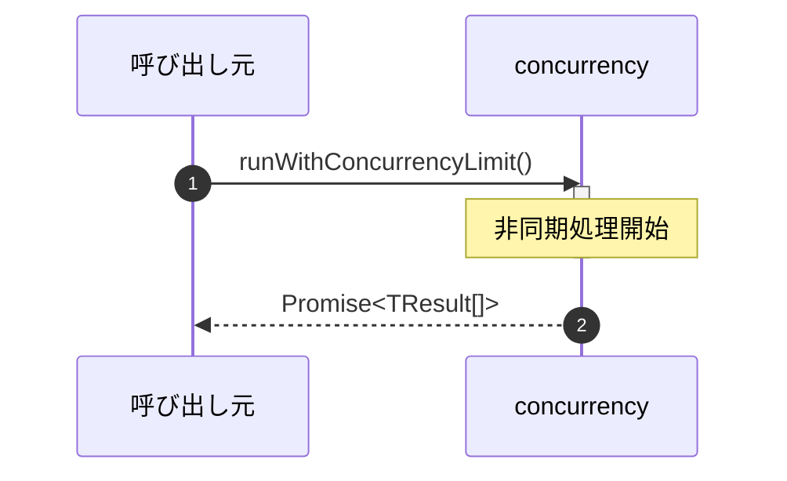

# concurrency

## 概要

`concurrency` モジュールのAPIリファレンス。

## エクスポート一覧

| 種別 | 名前 | 説明 |
|------|------|------|
| 関数 | `runWithConcurrencyLimit` | - |
| インターフェース | `ConcurrencyRunOptions` | - |

## 図解

### クラス図



### シーケンス図



## 関数

### toPositiveLimit

```typescript
toPositiveLimit(limit: number, itemCount: number): number
```

**パラメータ**

| 名前 | 型 | 必須 |
|------|-----|------|
| limit | `number` | はい |
| itemCount | `number` | はい |

**戻り値**: `number`

### ensureNotAborted

```typescript
ensureNotAborted(signal?: AbortSignal): void
```

**パラメータ**

| 名前 | 型 | 必須 |
|------|-----|------|
| signal | `AbortSignal` | いいえ |

**戻り値**: `void`

### runWithConcurrencyLimit

```typescript
async runWithConcurrencyLimit(items: TInput[], limit: number, worker: (item: TInput, index: number) => Promise<TResult>, options: ConcurrencyRunOptions): Promise<TResult[]>
```

**パラメータ**

| 名前 | 型 | 必須 |
|------|-----|------|
| items | `TInput[]` | はい |
| limit | `number` | はい |
| worker | `(item: TInput, index: number) => Promise<TResult>` | はい |
| options | `ConcurrencyRunOptions` | はい |

**戻り値**: `Promise<TResult[]>`

### runWorker

```typescript
async runWorker(): Promise<void>
```

**戻り値**: `Promise<void>`

## インターフェース

### ConcurrencyRunOptions

```typescript
interface ConcurrencyRunOptions {
  signal?: AbortSignal;
}
```

### WorkerResult

```typescript
interface WorkerResult {
  index: number;
  result?: TResult;
  error?: unknown;
}
```

Result wrapper for tracking success/failure of individual workers.
Used internally to ensure all workers complete before throwing errors.

---
*自動生成: 2026-02-17T21:54:59.757Z*
